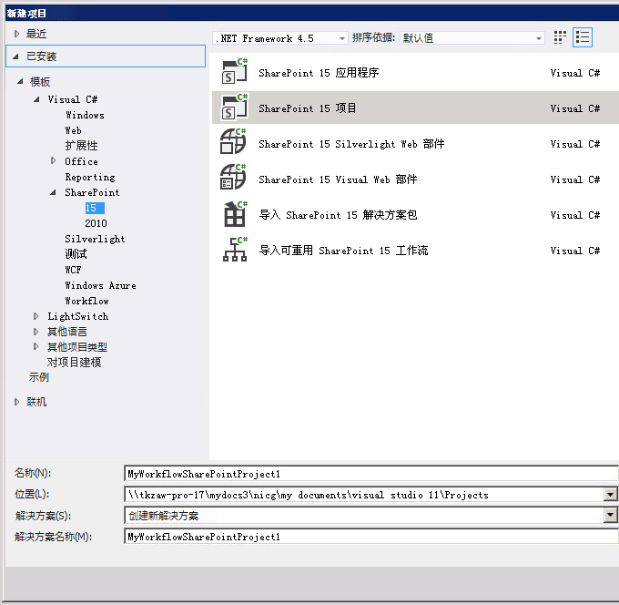
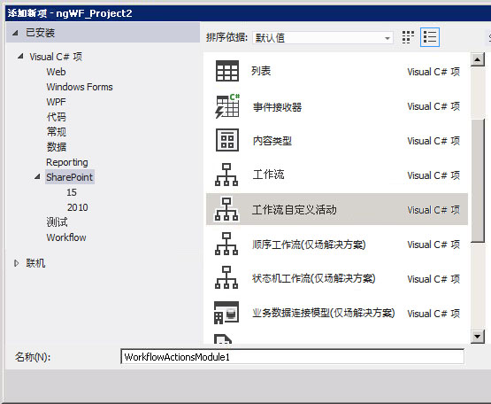
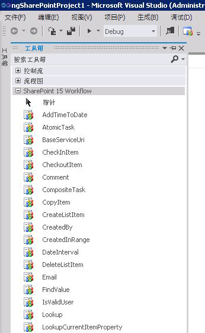
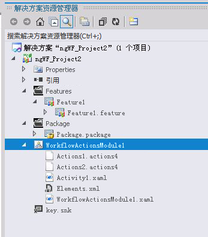

# 如何：生成和部署工作流自定义操作
了解如何通过在 SharePoint 2013 中创建自定义工作流操作来建模这样一个业务流程，即 SharePoint Designer 中的现有工作流操作库不满足该流程的要求。
SharePoint Designer 提供通过Workflow Designer用户界面 (UI) 可用的工作流操作集合。尽管包括在 SharePoint Designer 中的工作流操作的范围十分广泛，但是它是有限的。某些情况下，您可能需要建模这样一个业务流程，即 SharePoint Designer 中可用的现有工作流操作库不满足该流程的要求。
  
    
    

认识到业务流程通常具有专门的要求，SharePoint 2013 可让您创建自定义工作流操作。您可以通过使用 Visual Studio 开发这些自定义操作，然后将其封装并部署到 SharePoint。到时，自定义操作就可以为 SharePoint Designer 中的工作流作者可用。此功能可让您在您的工作流创作环境中自定义功能，以匹配您的任何专门业务流程。
> **注释**
> 提供的示例说明了如何创建自定义操作。示例及自述文件见以下网址： [SharePoint 2013 工作流：创建自定义操作](http://code.msdn.microsoft.com/SharePoint-2013-workflow-41e5c0f9) (http://code.msdn.microsoft.com/SharePoint-2013-workflow-41e5c0f9)。
  
    
    

## 针对自定义工作流操作的核心方案

以下叙述行中讲述了针对自定义工作流操作的核心方案：
  
    
    

1. 业务分析师或其他非技术信息工作者使用 SharePoint Designer 创作一个工作流，以建模外部业务流程（如，文档审批流程）。但是，在此公司中，流程的最后步骤是（亟待审批）将文档自动发送到打印并绑定指定数量的文档副本的外部打印机。 
    
  
2. SharePoint Designer 2013 中包含的工作流操作都不支持将文档发送到外部打印机。因此，公司经理决定对公司信息工作者进行投资，以便提供此自定义操作（他们称其为"Send Files to Printer"操作）。
    
  
3. 供应商公开打印 Web 服务。为了获取资金，开发人员创建自定义 **Send Files to Printer** 操作，亦称 **SendFilesToPrinter**。开发人员所创建的操作是一个声明性工作流活动。然后，开发人员还会创建工作流操作，以在 SharePoint Designer 中为该操作提供拖放 UI。
    
  
4. 开发人员将 **SendFilesToPrinter** 活动和 **Send Files to Printer** 操作封装到 SharePoint 解决方案包 (.wsp) 文件，并将其作为网站集功能部署到 SharePoint 服务器场。
    
  
5. 部署并激活该功能后，信息工作者可以在 SharePoint Designer UI 中看到新的自定义操作 **Send Files to Printer** 以及通常包括的所有操作，并且可以像其他人一样使用该操作。
    
  

## 自定义操作概览

操作是抽象化 SharePoint Designer 中其基础活动的功能的包装。运行时，基础活动（而不是操作本身）会在 Windows Server AppFabric 中执行。在这种意义上，操作只是 SharePoint Designer 工作流创作环境中的基础功能的设计时的抽象（除了是 SharePoint Designer 使用界面的元素外）。
  
    
    
和所有操作一样，自定义操作是以 Web 为作用域的，即这些操作是在 SharePoint 网站集或 **SharePoint.SPWeb** 实例级别激活的。
  
    
    
操作是在具有 .actions 文件名扩展名的 XML 定义文件中定义的。而基础活动（或活动）是在 XAML 文件中定义的。
  
    
    

## 在 Visual Studio 2008 中编写自定义活动

Visual Studio 2008 现在在 SharePoint 项目中提供"工作流自定义活动"项类型。您可以使用该项类型创建自定义活动，然后在 SharePoint Designer 2013 中作为自定义操作导入。
  
    
    

## 示例：创建、封装和部署自定义活动

### 若要创建工作流自定义活动

1. 首先打开 Visual Studio 2008 并新建一个类型为"SharePoint 2013 项目"的 Visual C# 项目，如图 1 所示。
    
   **图 1. 新建项目对话框**

  

  

  

  
2. 在"解决方案资源管理器"中，右键单击项目名称节点，然后选择"添加"、"新项"。"添加新项"对话框随即打开。如图 2 所示。
    
   **图 2. 添加新项对话框**

  

  

    
    
  
3. 在"添加新项"对话框中，选择"工作流自定义活动"项类型，并给其取个有意义的名称。图中，其名为"WorkflowActionsModule1"。然后选择"添加"。新项已创建，并且将向您显示活动设计表面。
    
  
4. 如果尚未显示"工具箱"选项卡，单击以展开工具箱节点。单击"SharePoint 2013 工作流"节点以显示工作流开发对象。图 3 为工作流工具箱中对象的局部视图。
    
   **图 3. SharePoint 工作流工具箱的局部视图**

  

  

    
    
  
5. 按需将新操作 (.actions4) 和活动 (.xaml) 文件添加到您的工作流模块。若要添加这些文件，在"解决方案资源管理器"中，右键单击操作模块图标，选择"添加"，然后选择"添加操作"（以添加新的 action4 文件）或"新活动"（以添加新活动）。
    
  
创建了操作模块并添加了操作和活动文件之后，您的项目应如图 5 所示。您将看到一个针对您添加的每个操作的 .actions4 文件，以及一个针对每个活动的 .xaml 文件。此外，您还有一个 Elements.xml 文件和模块的 .xaml 文件。
  
    
    

**图 5. 解决方案资源管理器中的工作流操作模块**

  
    
    

  
    
    

  
    
    
创建自定义工作流活动后，您可以封装并部署该活动。部署后，该自定义活动可被 SharePoint Designer 2013 用作自定义操作。
  
    
    
自定义操作作为"SharePoint 功能"封装并部署在 SharePoint 解决方案包 (.wsp) 文件中。该解决方案包包含一个自定义操作模块，该模块是一组部署在 SharePoint 中的文件。此模块可包含若干工作流活动定义，每个定义都是一个 .xaml 文件。该模块还包含操作 (.actions4) 文件。每个操作文件包含多个引用该模块中的活动或安装的默认 SharePoint 上可用的本地活动的操作。
  
    
    
解决方案包 (.wsp) 文件上载到目标网站（即 SharePoint 网站集）并激活后，便安装了该包中所包含的功能，并且可对其进行激活。激活自定义操作后，便可在工作流中使用这些功能。 
  
    
    

## 升级并删除自定义操作

部署了自定义操作后，您可以非常轻松地升级或删除该操作。您要做的就是打开 Visual Studio 中的活动项目，进行一些您想要的更改，然后按照前面所述的过程进行封装和重新部署。若要删除自定义操作，您只需卸载目标网站集上的功能。
  
    
    

### 功能激活

仅当正确配置了Azure/Workflow Manager Client 1.0（多组织工作流引擎），激活网站集上（即 **SPWeb** 实例上）的自定义操作功能才会成功。可能会帮助确保配置正确的两个疑难解答包括：
  
    
    

- 转到"网站功能'页，确保包含自定义操作的功能已激活。
    
  
- 查询Workflow Manager Client 1.0数据库确保已成功部署该活动。
    
  

## 其他资源

-  [SharePoint 2013 工作流基础](sharepoint-2013-workflow-fundamentals.md)
    
  
-  [SharePoint 2013 的工作流操作和活动引用](workflow-actions-and-activities-reference-for-sharepoint-2013.md)
    
  
-  [使用 Visual Studio 开发 SharePoint 2013 工作流](develop-sharepoint-2013-workflows-using-visual-studio.md)
    
  

