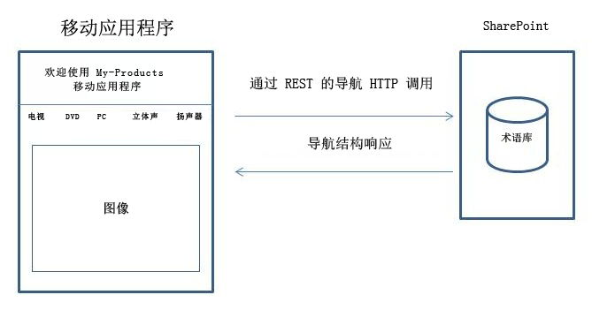
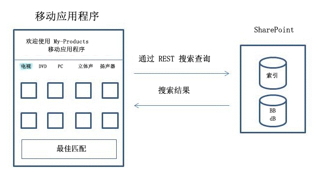
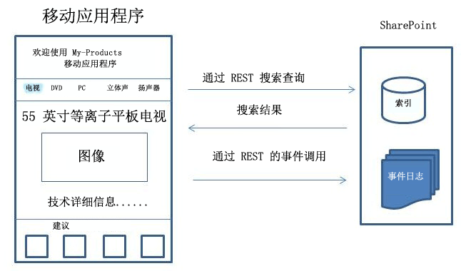

# 如何：使用导航和事件日志记录 REST 界面构建搜索驱动移动应用程序
SharePoint Server 2013 引入了导航和事件日志 REST 接口，使您能够为在 Windows 以外的操作系统（例如，Android 和 iOS）上运行的移动设备（例如，电话和 tablet）创建搜索驱动移动应用程序。
## 应用程序如何使用产品目录
<a name="mobile_app_and_product_catalog"> </a>

产品目录可在移动设备上以不同方式显示。通常，您可在 SharePoint 内为产品目录配置移动信道。创建移动信道使您能够自定义与移动设备上任何屏幕大小匹配的外观。在移动设备上使用 Web 浏览器以 .ASPX 格式查看得到的页面。该页面的结构及其相应的逻辑由运行 SharePoint 的服务器处理。相比之下，使用导航与事件日志 REST 接口创建的应用程序是搜索驱动应用程序，充当导航产品目录结构的前端。
  
    
    
应用程序不是独立的程序，而是与现有 SharePoint 安装中设置的产品目录配合使用。如果该特定 SharePoint 安装内的产品目录已更改，则该应用程序将动态更新导航结构。此外，用户执行的单击事件将发送回运行 SharePoint 的服务器，已改进产品目录做出的建议的总体质量。
  
    
    
应用程序构造用户不使用 Web 浏览器查看产品目录所需的页面。用于构造查看产品目录的页面的母版页、页面布局和逻辑作为应用程序下载到设备上；只要用户运行该应用程序，就将重复使用这些页面。用户导航产品目录时，该应用程序同时构造导航结构和设置页面。若要使用项目内容填充相关页面，请向 SharePoint 中的产品目录发送搜索查询。然后，使用相应的搜索结果填充页面。
  
    
    

## 示例：创建包含主页、类别页面和项目详细信息页面的搜索驱动移动应用程序
<a name="example_search_driven_mobile_app"> </a>

假设您具有的移动应用程序包含三种类型的页面：主页、类别页面和项目详细信息页面。以下各节介绍如何使用导航、事件日志和搜索 REST 接口创建页面。
  
    
    

### 搜索驱动移动应用程序的主页

通常在应用程序启动时显示"主页"。"主页"包含产品目录菜单、一些文本和静态图像，如图 1 所示。
  
    
    

**图 1. 搜索驱动移动应用程序的主页**

  
    
    

  
    
    

  
    
    
为了构造此页面，应用程序向运行 SharePoint 的服务器发送导航 REST 调用，请求产品目录的导航结构。然后，该应用程序使用响应数据设置正确的分类或菜单结构，并为产品目录显示正确的术语名称。页面布局、标题文本和静态图像存储在应用程序本身中。如果以后修改分类，则可在应用程序运行时通过导航 REST 调用更新应用程序。
  
    
    
下面是典型的导航 REST 调用的示例。
  
    
    


```

GET http://server/_api/navigation/menustate?mapprovidername='GlobalNavigationSwitchableProvider'

```

 [移动应用程序的导航 REST 调用的响应示例](how-to-build-search-driven-mobile-apps-with-the-navigation-and-event-logging-res.md#response_navigation_rest)中显示了匹配的响应。
  
    
    

### 搜索驱动移动应用程序的种类页面

"类别"页面显示所选类别的多个项目。某个类别中列出的每个项目通常可由某些相关数据（如标题、图像和价格）表示。通过 SharePoint 搜索 REST 服务使用搜索查询，从产品目录收集这些数据，如图 2 所示。
  
    
    

**图 2. 搜索驱动移动应用程序 类别页面**

  
    
    

  
    
    

  
    
    
如果您在上图中选择一个类别（例如，"TV"），则将显示"类别"页面。 
  
    
    
下面是执行典型搜索 REST 查询以获取特定类别的内容的示例。
  
    
    


```

GET http://server/_api/search/query?querytext='owstaxidProductCatalogItemCategory:#0<TermGuid>'

```

 [移动应用程序的搜索 REST 查询的响应示例](how-to-build-search-driven-mobile-apps-with-the-navigation-and-event-logging-res.md#response_search_rest)中显示了匹配的响应。
  
    
    
SharePoint Server 2013 中的查询处理组件返回包含特定类别的数据的搜索结果，应用程序在"类别"页面中呈现这些数据。如果有与所选类别关联的最佳匹配，则查询处理组件检测此关联并从最佳匹配数据库（在图中标记为"BB"） 提取最佳匹配数据。然后，搜索结果与来自最佳匹配数据库的结果混合，通过结果表发送回应用程序。应用程序负责从表中提取结果的不同部分，并在专用位置显示最佳匹配。
  
    
    

### 搜索驱动移动应用程序的项目详细信息页面

如果在类别中选择一个项目，则显示"项目详细信息" 页面。在此页面上，通过标题、产品图像、技术说明、价格和运送说明等信息详细介绍项目。此外，还显示更多建议或评级（如果可用）。若要构造"项目详细信息"页面，应用程序发送两个查询：一个查询用于检索项目数据，另一个查询用于接收与该项目相关的建议，如图 3 所示。 
  
    
    

**图 3. 搜索驱动移动应用程序的项目详细信息页面**

  
    
    

  
    
    

  
    
    
下面是执行典型搜索 REST 查询以获取特定项目的内容的示例。
  
    
    


```

GET http://server/_api/search/query?querytext='ProductCatalogItemNumberOWSTEXT:1234567'
```

建议是在 SharePoint 中而不是应用程序本身中计算的。为了基于用户事件（不仅是在此特定应用程序中，而且是产品目录收集的所有用户事件）创建建议，应用程序在用户事件发生时通过事件调用不断将其发送回 SharePoint 中的产品目录。这些用户事件存储在时间日志中，并且仅如同与该特定项目关联的其他用户事件一样处理。未从产品目录向应用程序发送任何回调。计算的建议可通过 SharePoint 搜索 REST 服务用于应用程序。
  
    
    
下面的示例演示事件日志的典型 **POST** 调用。
  
    
    


```
POST http://server/_api/events/logevent
{
      "usageEntry": {
            "__metadata": {
                  "type": "Microsoft.SharePoint.Administration.UsageEntry"
            },
            "EventTypeId": 1,
            "ItemId": "an item fb7c-4196-8123-e54eee5f4787",
            "ScopeId": "61141c0e-fb7c ",
            "Site": "61141c0e- 
-4196-8123-e54eee5f4787",
            "User": "johndoe"
      }
}
```

该服务在标准 HTTP 返回代码之后：HTTP 200 响应指示成功的请求。产品目录对事件日志 REST 接口没有响应。
  
    
    

## 移动应用程序的导航 REST 调用的响应示例
<a name="response_navigation_rest"> </a>


```

<?xml version="1.0" encoding="utf-8"?>
<d:MenuState xmlns:d="http://schemas.microsoft.com/ado/2007/08/dataservices" xmlns:m="http://schemas.microsoft.com/ado/2007/08/dataservices/metadata" xmlns:georss="http://www.georss.org/georss" xmlns:gml="http://www.opengis.net/gml" m:type="SP.MenuState">

  <d:FriendlyUrlPrefix>/sites/contoso/</d:FriendlyUrlPrefix>
  <d:Nodes>
    <d:element m:type="SP.MenuNode">
      <d:CustomProperties m:null="true" />
      <d:FriendlyUrlSegment>electronics</d:FriendlyUrlSegment>
      <d:Hidden m:type="Edm.Boolean">false</d:Hidden>
      <d:Key>16c4c3c8-0309-47f7-9d9b-17e699febce8</d:Key>
      <d:Nodes>
        <d:element m:type="SP.MenuNode">
          <d:CustomProperties m:null="true" />
          <d:FriendlyUrlSegment>audio</d:FriendlyUrlSegment>
          <d:Hidden m:type="Edm.Boolean">false</d:Hidden>
          <d:Key>3e2d5c67-3fad-4cfa-8e1c-8c74fdf3a34b</d:Key>
          <d:Nodes>
            <d:element m:type="SP.MenuNode">
              <d:CustomProperties m:null="true" />
              <d:FriendlyUrlSegment>car-audio</d:FriendlyUrlSegment>
              <d:Hidden m:type="Edm.Boolean">false</d:Hidden>
              <d:Key>e3d271a4-dcbf-464d-a557-23848ccaa54f</d:Key>
              <d:Nodes />
              <d:NodeType m:type="Edm.Int32">1</d:NodeType>
              <d:SimpleUrl></d:SimpleUrl>
              <d:Title>Car audio</d:Title>
            </d:element>
            <d:element m:type="SP.MenuNode">
              <d:CustomProperties m:null="true" />
              <d:FriendlyUrlSegment>headphones</d:FriendlyUrlSegment>
              <d:Hidden m:type="Edm.Boolean">false</d:Hidden>
              <d:Key>7ad146d0-61b5-4b55-9da0-db7eaaa20f4a</d:Key>
              <d:Nodes />
              <d:NodeType m:type="Edm.Int32">1</d:NodeType>
              <d:SimpleUrl></d:SimpleUrl>
              <d:Title>Headphones</d:Title>
            </d:element>
            <d:element m:type="SP.MenuNode">
              <d:CustomProperties m:null="true" />
              <d:FriendlyUrlSegment>mp3</d:FriendlyUrlSegment>
              <d:Hidden m:type="Edm.Boolean">false</d:Hidden>
              <d:Key>7387fe97-52fa-464b-878a-b05d04e7032e</d:Key>
              <d:Nodes />
              <d:NodeType m:type="Edm.Int32">1</d:NodeType>
              <d:SimpleUrl></d:SimpleUrl>
              <d:Title>MP3</d:Title>
            </d:element>
            <d:element m:type="SP.MenuNode">
              <d:CustomProperties m:null="true" />
              <d:FriendlyUrlSegment>speakers</d:FriendlyUrlSegment>
              <d:Hidden m:type="Edm.Boolean">false</d:Hidden>
              <d:Key>65da907c-9565-45f6-a278-cbce7f74ab3d</d:Key>
              <d:Nodes />
              <d:NodeType m:type="Edm.Int32">1</d:NodeType>
              <d:SimpleUrl></d:SimpleUrl>
              <d:Title>Speakers</d:Title>
            </d:element>
          </d:Nodes>
          <d:NodeType m:type="Edm.Int32">1</d:NodeType>
          <d:SimpleUrl></d:SimpleUrl>
          <d:Title>Audio</d:Title>
        </d:element>
      </d:Nodes>
      <d:NodeType m:type="Edm.Int32">1</d:NodeType>
      <d:SimpleUrl></d:SimpleUrl>
      <d:Title>Electronics</d:Title>
    </d:element>
  </d:Nodes>
  <d:SimpleUrl m:null="true" />
  <d:SPSitePrefix>/sites/contoso/</d:SPSitePrefix>
  <d:SPWebPrefix>/sites/contoso/</d:SPWebPrefix>
  <d:StartingNodeKey>2168423f-3fea-4324-a5cb-90be8f079750</d:StartingNodeKey>
  <d:StartingNodeTitle>contoso</d:StartingNodeTitle>
  <d:Version>2012-05-29T12:00:04.4747484Z</d:Version>
</d:MenuState>

```


## 移动应用程序的搜索 REST 查询的响应示例
<a name="response_search_rest"> </a>


```

<d:query xmlns:d="http://schemas.microsoft.com/ado/2007/08/dataservices" xmlns:m="http://schemas.microsoft.com/ado/2007/08/dataservices/metadata" xmlns:georss="http://www.georss.org/georss" xmlns:gml="http://www.opengis.net/gml" m:type="Microsoft.Office.Server.Search.REST.SearchResult">
  <d:ElapsedTime m:type="Edm.Int32">4640</d:ElapsedTime>
  <d:PrimaryQueryResult m:type="Microsoft.Office.Server.Search.REST.QueryResult">
    <d:CustomResults m:null="true"/>
    <d:QueryId>7fea4ced-5789-4067-beab-8f807410b29e</d:QueryId>
    <d:QueryRuleId m:type="Edm.Guid">00000000-0000-0000-0000-000000000000</d:QueryRuleId>
    <d:RefinementResults m:null="true"/>
    <d:RelevantResults m:type="Microsoft.Office.Server.Search.REST.RelevantResults">
      <d:GroupTemplateId m:null="true"/>
      <d:ItemTemplateId m:null="true"/>
      <d:Properties>
        ...
      </d:Properties>
      <d:ResultTitle m:null="true"/>
      <d:ResultTitleUrl m:null="true"/>
      <d:RowCount m:type="Edm.Int32">10</d:RowCount>
      <d:Table m:type="SP.SimpleDataTable">
        <d:Rows>
          ...
        </d:Rows>
      </d:Table>
      <d:TotalRows m:type="Edm.Int32">2048964</d:TotalRows>
      <d:TotalRowsIncludingDuplicates m:type="Edm.Int32">2048964</d:TotalRowsIncludingDuplicates>
    </d:RelevantResults>
    <d:SpecialTermResults m:null="true"/>
  </d:PrimaryQueryResult>
  <d:Properties>
    ...
  </d:Properties>
  <d:SecondaryQueryResults m:null="true"/>
  <d:SpellingSuggestion/>
  <d:TriggeredRules>
  </d:TriggeredRules>
</d:query>
```


## 其他资源
<a name="bk_addresources"> </a>


-  [构建访问 SharePoint 2013 的 Windows Phone 应用程序](build-windows-phone-apps-that-access-sharepoint-2013.md)
    
  
-  [使用 SharePoint 2013 REST 服务进行编程](use-odata-query-operations-in-sharepoint-rest-requests.md)
    
  

