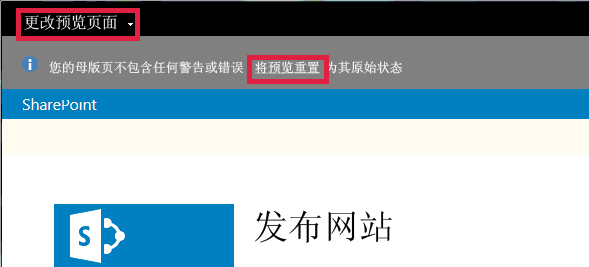

# 如何：在 SharePoint 2013 设计管理器中更改预览页面
了解如何在 SharePoint 2013 中的设计管理器中设置、创建和更改预览页面。
预览页面 是用于查看设计外观的网站页面。您可以将预览页面设置为网站中的特定页面或常规预览。如果您选择常规预览，则您将看到仅有内容占位符的母版页。您还将在横幅中看到指示您当前正在预览没有任何内容的母版页的消息。如果您选择特定页面，则您将看到使用母版页和相应页面布局呈现的页面内容。
  
    
    

在您与页面交互时，您可能执行导致 SharePoint 从预览中移出的某操作。例如，如果您选择功能区上的"保存"，则 SharePoint 会保存页面，然后显示页面的实时版本。（页面的实时版本使用实时母版页，而非您设计的母版页。）您可以通过选择"重置预览"来返回到预览页面。
  
    
    

  
    
    

  
    
    

  
    
    

## 在设计管理器中设置预览页面

使用此过程来设置预览页面。
  
    
    

### 设置预览页面

1. 在 Web 浏览器顶部的横幅中，选择"更改预览页面"。
    
  
2. 选择"选择现有"。
    
  
3. 若要使用常规预览页面，请选择"常规预览"。
    
  
4. 若要使用特定页面作为预览页面，请选择"URL"并输入页面的 URL。
    
  
5. 选择"确定"。
    
  

## 在设计管理器中创建新的预览页面

使用此过程来创建页面并将它设置为预览页面。
  
    
    

### 创建新的预览页面

1. 在 Web 浏览器顶部的横幅中，选择"更改预览页面"。
    
  
2. 选择"新建"。
    
  
3. 为页面键入名称，然后选择"创建"。
    
    将创建页面，并且您将转到可从其将内容添加到新页面中的视图。
    
  

## 在设计管理器中返回到预览页面

使用此过程来返回到预览页面。
  
    
    

### 返回到预览页面

- 在 Web 浏览器顶部的信息消息中，选择"重置预览"。
    
  

## 其他资源

-  [SharePoint 2013 中的母版页、母版页样式库和页面布局](master-pages-the-master-page-gallery-and-page-layouts-in-sharepoint-2013.md)
    
  
-  [在 SharePoint 2013 中开发网站设计](develop-the-site-design-in-sharepoint-2013.md)
    
  
-  [如何：将网络驱动器映射到 SharePoint 2013 母版页样式库](how-to-map-a-network-drive-to-the-sharepoint-2013-master-page-gallery.md)
    
  
-  [SharePoint 2013 设计管理器设备通道](sharepoint-2013-design-manager-device-channels.md)
    
  
-  [SharePoint 2013 设计管理器图像呈现形式](sharepoint-2013-design-manager-image-renditions.md)
    
  

