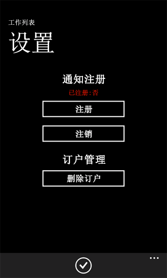
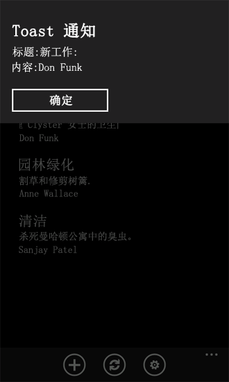
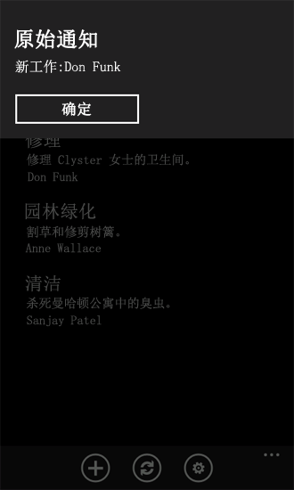
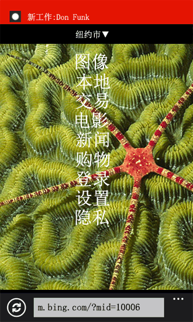

# 如何：在针对 Windows Phone 的 SharePoint 2013 应用程序中配置和使用推送通知
在 SharePoint Server 中创建一个用于推送通知解决方案，开发一个用于接收通知的 Windows Phone 应用程序。
使用 Microsoft 推送通知服务 (MPNS)，Windows Phone 应用程序可以通过 Internet 接收在 Microsoft SharePoint Server 上触发的事件的通知。手机应用程序不必轮询服务器来发现更改，例如，对手机应用程序所基于的列表中的项目的更改。可以注册该应用程序以接收来自服务器的通知，并且事件接收器可以启动一个通知并将其发送至接收应用程序进行处理。推送通知由 MPNS 转发到 Windows Phone 设备。
  
    
    

Windows Phone 7 不支持同时运行多个应用程序。除 Windows Phone 操作系统 (OS) 本身的组件外，只允许同时运行一个应用程序。当应用程序未在手机前台运行时（即当应用程序是逻辑删除或关闭时），可能发生与给定手机应用程序相关的事件（例如，向列表添加列表项）。您可以在手机上开发一个后台服务以定期检查对服务器上列表的更改，但这种方法会消耗手机上的资源（例如占用带宽和耗费电池电量）。通过 MPNS 与支持通知的 Windows Phone 7 操作系统内置组件，手机本身即可接受与给定应用程序上下文相关的通知（即使未运行该应用程序），用户可以启动相关的应用程序以对该通知做出响应。（有关推送通知的更多信息，请参阅 MSDN 库中的  [Windows Phone 的推送通知概述](http://msdn.microsoft.com/zh-cn/library/ff402558%28vs.92%29.aspx)）。
在本主题中，您创建一个服务器端解决方案以基于列表中的更改将推送通知发送到基于该列表创建的手机应用程序。
  
    
    


## 创建服务器端解决方案以基于列表项事件发送推送通知
<a name="BKMK_ServerSideSolution"> </a>

服务器端解决方案可以是部署在一个独立的 **SPWeb** 对象中的 SharePoint 应用程序，或是打包为 SharePoint 解决方案包（即一个 .wsp文件，其中包含一个 Web 范围功能）的 SharePoint 场解决方案。在此部分的过程中，您将开发一个简单的 SharePoint 解决方案，该方案将创建 Windows Phone 应用程序要使用的目标列表并激活服务器上的推送通知机制。在后面的部分，您将开发用于从服务器端解决方案接收通知的 Windows Phone 应用程序。
  
    
    

### 创建服务器端项目


1. 通过使用"以管理员身份运行"选项启动 Visual Studio 2008。
    
  
2. 依次选择"文件"、"新建"、"项目"。
    
    出现"新建项目"对话框。
    
  
3. 在"新建项目"对话框中，依次展开"Visual C#"下的"SharePoint"节点，然后选择"15"节点。
    
  
4. 在"模板"窗格中，选择"SharePoint 2013 项目"并指定项目名称，如 PushNotificationsList。
    
  
5. 选择"确定"按钮。将出现 SharePoint 自定义向导。您可以通过此向导选择用于开发和调试项目的目标网站以及解决方案的信任级别。
    
  
6. 指定 SharePoint Server 网站的 URL。选择一个网站，您将能够稍后在 Windows Phone 的 SharePoint 列表应用程序开发中使用它。
    
  
7. 选择"部署为场解决方案"，然后单击"完成"以创建项目。
    
  
接下来，在项目中添加一个类文件，并创建几个类来封装和管理推送通知。
  
    
    

### 创建用于管理推送通知的类


1. 在"解决方案资源管理器"中，选择表示项目的节点（如果您遵守这些过程中使用的命名约定，则名为 PushNotificationsList）。
    
  
2. 在"项目"菜单中，选择"添加类"。将出现"添加新项"对话框，其中已选中 C#"类"模板。
    
  
3. 指定 PushNotification.cs 作为该文件的名称，并单击"添加"。类文件将添加到解决方案中并打开以供编辑。
    
  
4. 用以下代码替换文件的内容。
    
  ```cs
  
using System;
using System.Collections.Generic;
using System.IO;
using System.Linq;
using System.Net;
using System.Text;
using Microsoft.SharePoint;

namespace PushNotificationsList
{
    internal static class WP7Constants
    {
        internal static readonly string[] WP_RESPONSE_HEADERS = 
            {
                "X-MessageID",
                "X-DeviceConnectionStatus",
                "X-SubscriptionStatus",
                "X-NotificationStatus"
            };
    }

    public enum TileIntervalValuesEnum
    {
        ImmediateTile = 1,
        Delay450SecondsTile = 11,
        Delay900SecondsTile = 21,
    }

    public enum ToastIntervalValuesEnum
    {
        ImmediateToast = 2,
        Delay450SecondsToast = 12,
        Delay900SecondsToast = 22,
    }

    public enum RawIntervalValuesEnum
    {
        ImmediateRaw = 3,
        Delay450SecondsRaw = 13,
        Delay900SecondsRaw = 23
    }

    public enum NotificationTypeEnum
    {
        Tile = 1,
        Toast = 2,
        Raw = 3
    }

    class PushNotification
    {
        public PushNotificationResponse PushToast(SPPushNotificationSubscriber subscriber, string toastTitle, string toastMessage, string toastParam, ToastIntervalValuesEnum intervalValue)
        {
            // Construct toast notification message from parameter values.
            string toastNotification = "<?xml version=\\"1.0\\" encoding=\\"utf-8\\"?>" +
            "<wp:Notification xmlns:wp=\\"WPNotification\\">" +
               "<wp:Toast>" +
                    "<wp:Text1>" + toastTitle + "</wp:Text1>" +
                    "<wp:Text2>" + toastMessage + "</wp:Text2>" +
                    "<wp:Param>" + toastParam + "</wp:Param>" +
               "</wp:Toast> " +
            "</wp:Notification>";

            return SendPushNotification(NotificationTypeEnum.Toast, subscriber, toastNotification, (int)intervalValue);
        }

        public PushNotificationResponse PushRaw(SPPushNotificationSubscriber subscriber, string rawMessage, RawIntervalValuesEnum intervalValue)
        {
            return SendPushNotification(NotificationTypeEnum.Raw, subscriber, rawMessage, (int)intervalValue);
        }

        private PushNotificationResponse SendPushNotification(NotificationTypeEnum notificationType, SPPushNotificationSubscriber subscriber, string message, int intervalValue)
        {
            // Create HTTP Web Request object.
            string subscriptionUri = subscriber.ServiceToken;
            HttpWebRequest sendNotificationRequest = (HttpWebRequest)WebRequest.Create(subscriptionUri);

            // MPNS expects a byte array, so convert message accordingly.
            byte[] notificationMessage = Encoding.Default.GetBytes(message);
            
            // Set the notification request properties.
            sendNotificationRequest.Method = WebRequestMethods.Http.Post;
            sendNotificationRequest.ContentLength = notificationMessage.Length;
            sendNotificationRequest.ContentType = "text/xml";
            sendNotificationRequest.Headers.Add("X-MessageID", Guid.NewGuid().ToString());

            switch (notificationType)
            {
                case NotificationTypeEnum.Tile:
                    sendNotificationRequest.Headers.Add("X-WindowsPhone-Target", "token");
                    break;
                case NotificationTypeEnum.Toast:
                    sendNotificationRequest.Headers.Add("X-WindowsPhone-Target", "toast");
                    break;
                case NotificationTypeEnum.Raw:
                    // A value for the X-WindowsPhone-Target header is not specified for raw notifications.
                    break;
            }            

            sendNotificationRequest.Headers.Add("X-NotificationClass", intervalValue.ToString());

            // Merge byte array payload with headers.
            using (Stream requestStream = sendNotificationRequest.GetRequestStream())
            {
                requestStream.Write(notificationMessage, 0, notificationMessage.Length);
            }

            string statCode = string.Empty;
            PushNotificationResponse notificationResponse;

            try
            {
                // Send the notification and get the response.
                HttpWebResponse response = (HttpWebResponse)sendNotificationRequest.GetResponse();
                statCode = Enum.GetName(typeof(HttpStatusCode), response.StatusCode);

                // Create PushNotificationResponse object.
                notificationResponse = new PushNotificationResponse((int)intervalValue, subscriber.ServiceToken);
                notificationResponse.StatusCode = statCode;
                foreach (string header in WP7Constants.WP_RESPONSE_HEADERS)
                {
                    notificationResponse.Properties[header] = response.Headers[header];
                }                
            }
            catch (Exception ex)
            {
                statCode = ex.Message;
                notificationResponse = new PushNotificationResponse((int)intervalValue, subscriber.ServiceToken);
                notificationResponse.StatusCode = statCode;
            }

            return notificationResponse;
        }
    }     

    /// <summary>
    /// Object used for returning notification request results.
    /// </summary>
    class PushNotificationResponse
    {
        private DateTime timestamp;
        private int notificationIntervalValue;
        private string statusCode = string.Empty;
        private string serviceToken;
        private Dictionary<string, string> properties;

        public PushNotificationResponse(int numericalIntervalValue, string srvcToken)
        {
            timestamp = DateTime.UtcNow;
            notificationIntervalValue = numericalIntervalValue;
            serviceToken = srvcToken;
            properties = new Dictionary<string, string>();
        }

        public DateTime TimeStamp
        {
            get { return timestamp; }
        }

        public int NotificationIntervalValue
        {
            get { return notificationIntervalValue; }
        }

        public string StatusCode
        {
            get { return statusCode; }
            set { statusCode = value; }
        }

        public string ServiceToken
        {
            get { return serviceToken; }
        }

        public Dictionary<string, string> Properties
        {
            get { return properties; }
        }
    }
}
  ```

5. 保存该文件。
    
  
在此代码中， **PushToast** 和 **PushRaw** 方法将调用并处理要发送的给定类型通知的形参实参，然后调用 **SendPushNotification** 方法，该方法使用 Microsoft 推送通知服务发送通知。（该示例代码未实现用于发送图块通知的方法。） **PushNotificationResponse** 类只是一种用于封装从通知请求接收的结果的机制。在这里，该类向 **HttpWebRequest** 对象的 **GetResponse** 方法返回的对象（即 **HttpWebResponse** 对象）添加一些信息。您在以下过程中创建的事件接收器使用此 **PushNotificationResponse** 类更新服务器上的通知结果列表。
  
    
    
现在创建一个事件接收器类，该类将向已注册接收通知的设备发送推送通知。（将来，您会将此事件接收器绑定到在后面的过程中创建的"作业"列表。）
  
    
    

### 为项目创建事件接收器类


1. 在"解决方案资源管理器"中，选择表示该项目的节点。
    
  
2. 在"项目"菜单上，单击"添加类"。显示"添加新项"对话框，其中已选中 C#"类"模板。
    
  
3. 指定 ListItemEventReceiver.cs 作为该文件的名称，并单击"添加"。类文件将添加到解决方案中并打开以供编辑。
    
  
4. 用以下代码替换文件的内容。
    
  ```cs
  
using System;
using System.Security.Permissions;
using System.Text;
using Microsoft.SharePoint;
using Microsoft.SharePoint.Utilities;

namespace PushNotificationsList
{
    /// <summary>
    /// List Item Events
    /// </summary>
    public class ListItemEventReceiver : SPItemEventReceiver
    {
        internal static string ResultsList = "Push Notification Results";

        /// <summary>
        /// An item was added.
        /// </summary>
        public override void ItemAdded(SPItemEventProperties properties)
        {
            SPWeb spWeb = properties.Web;
            SPPushNotificationSubscriberCollection pushSubscribers = spWeb.PushNotificationSubscribers;
            PushNotification pushNotification = new PushNotification();

            SPListItem listItem = properties.ListItem;

            string jobAssignment = "[Unassigned]";

            // This event receiver is intended to be associated with a specific list,
            // but the list may not have an "AssignedTo" field, so using try/catch here.
            try
            {
                jobAssignment = listItem["AssignedTo"].ToString();
            }
            catch { }

            PushNotificationResponse pushResponse = null;

            foreach (SPPushNotificationSubscriber ps in pushSubscribers)
            {
                // Send a toast notification to be displayed on subscribed phones on which the app is not running.
                pushResponse = pushNotification.PushToast(ps, "New job for:", jobAssignment, string.Empty, ToastIntervalValuesEnum.ImmediateToast);
                UpdateNotificationResultsList(spWeb, ps.User.Name, pushResponse);

                // Also send a raw notification to be displayed on subscribed phones on which the app is running when the item is added.
                pushResponse = pushNotification.PushRaw(ps, string.Format("New job for: {0}", jobAssignment), RawIntervalValuesEnum.ImmediateRaw);
                UpdateNotificationResultsList(spWeb, ps.User.Name, pushResponse);
            }

            base.ItemAdded(properties);
        }

        private void UpdateNotificationResultsList(SPWeb spWeb, string subscriberName, PushNotificationResponse pushResponse)
        {
            SPList resultsList = spWeb.Lists.TryGetList(ResultsList);

            if (resultsList == null)
                return;

            try
            {
                SPListItem resultItem = resultsList.Items.Add();
                resultItem["Title"] = subscriberName;
                resultItem["Notification Time"] = pushResponse.TimeStamp;
                resultItem["Status Code"] = pushResponse.StatusCode;
                resultItem["Service Token"] = pushResponse.ServiceToken;

                StringBuilder builder = new StringBuilder();
                foreach (string key in pushResponse.Properties.Keys)
                {
                    builder.AppendFormat("{0}: {1}; ", key, pushResponse.Properties[key]);
                }
                resultItem["Headers"] = builder.ToString();

                resultItem["Interval Value"] = pushResponse.NotificationIntervalValue;
                resultItem.Update();
            }
            catch
            {
                // Could log to ULS here if adding list item fails.
            }
        }
    }
}
  ```

5. 保存该文件。
    
  
在此代码中，将项添加至已绑定事件接收器的列表后，推送通知便发送至已注册接收该通知的订阅者。发送给订阅者的通知包含所添加的列表项中的 AssignedTo 字段的值。对于定制通知，已设置 **toastTitle** 参数（用于在前面的过程中定义的 **PushToast** 方法）和 **toastMessage** 参数。这些值对应于用于定义定制通知的 XML 架构中的 **Text1** 和 **Text2** 属性。
  
    
    
空字符串仅作为 **toastParam** 参数的值传递，该参数对应于定制通知的 XML 架构中的 **Param** 属性。例如，您可以使用该参数指定当用户在手机上单击通知即可打开手机应用程序页面。在本主题下文中关于从服务器接收这些通知的手机应用程序开发示例中没有使用 **Param** 参数。当用户单击通知时，会直接打开应用程序中的"列表"窗体 (List.xaml)。
  
    
    

> **注释**
> 仅在 Windows Phone OS 7.1 或更高版本中支持定制通知的 **Param** 属性。
  
    
    

对于此示例中的原始通知，会传递一个字符串，其中包含已添加的列表项中的 AssignedTo 字段的值。
  
    
    
请注意，定制通知将显示在订阅手机上（如果针对通知的手机应用程序未运行），如果消息超过大约 41 个字符，显示的消息将被截断。MPNS 中的图块通知限制为不超过 1024 个字节 (1 KB)。（可以发送的具体字符数取决于采用的编码，如 UTF-8）。图块通知也有大小限制。任何类型的通知都无法发送大量数据。最好不要将这些通知用作一种数据传输机制，而是作为短消息发送给订阅手机，然后在手机上可以执行某些操作。这些操作（例如使用来自服务器的数据刷新手机上的列表）可能涉及大量数据，具体取决于 Windows Phone 应用程序的设计。
  
    
    
从通知请求返回的 **PushNotificationResponse** 对象会传递给 **UpdateNotificationResultsList** 方法。此方法将有关请求的信息添加到名为"推送通知结果"的 SharePoint 列表（如果该列表存在）。这仅演示了使用返回对象的一种方式。在生产解决方案中，您可以将返回对象应用到更复杂的用途。例如，当通知发送到给定用户（例如，为 AssignedTo 字段中的分配指定的用户）时，您可能会检查返回对象的特定状态代码，并执行适当的操作。在生产应用程序中，您可能不会将所有这些信息都存储在服务器上的列表中。此处存储的信息可以帮助您理解与 MPNS 通知相关联的属性。
  
    
    
下一步，您创建一个简单的 SharePoint 列表并命名为"工作"，其中包含工作类别、工作描述及向其分配此工作的人员。此外，您创建一个辅助列表，命名为"推送通知结果"，用于存储与发送到订阅手机的通知请求相关的信息。
  
    
    
在以下过程中，您会创建一个类 **ListCreator**，其中包括 **CreateJobsList** 方法，该方法用于在服务器上激活该解决方案时创建和配置"工作"列表。此类还会将 **ItemAdded** 事件接收器（在前面的 **ListItemEventReceiver** 类中创建）添加到与列表相关联的 **EventReceivers** 集合。 **ListCreator** 类还包括用于创建推送通知结果 SharePoint 列表的方法。
  
    
    

### 创建用于添加和配置列表的类


1. 在"解决方案资源管理器"中，选择表示项目的节点（同样，如果您按照这些过程中使用的命名约定，名为 PushNotificationsList）。
    
  
2. 在"项目"菜单上，单击"添加类"。显示"添加新项"对话框，其中已选中 C#"类"模板。
    
  
3. 指定 ListCreator.cs 作为该文件的名称，并单击"添加"。类文件将添加到解决方案中并打开以供编辑。
    
  
4. 用以下代码替换文件的内容。
    
  ```cs
  
using System;
using System.Collections.Generic;
using System.Linq;
using System.Text;
using System.Xml;
using Microsoft.SharePoint;

namespace PushNotificationsList
{
    class ListCreator
    {
        internal void CreateJobsList(SPWeb spWeb)
        {
            string listTitle = "Jobs";
            string listDescription = "List of jobs and assignments.";
            Dictionary<string, SPFieldType> columns = new Dictionary<string, SPFieldType>();

            // The "Title" column will be added based on the GenericList template. That field
            // will be used as the category name for the job (e.g., Shopping), so only need to add
            // the remaining fields.
            columns.Add("Description", SPFieldType.Text);
            columns.Add("AssignedTo", SPFieldType.Text);

            // Creating list (or retrieving GUID for list if it already exists).
            Guid listId = CreateCustomList(spWeb, listTitle, listDescription, columns, false);
            if (listId.Equals(Guid.Empty))
                return;

            SPList list = spWeb.Lists[listId];

            // Add event receiver (if the current Jobs list is not already associated with the receiver).
            bool ReceiverExists = false;
            string receiverClassName = "PushNotificationsList.ListItemEventReceiver";

            for (int i = 0; i < list.EventReceivers.Count; i++)
            {
                SPEventReceiverDefinition rd = list.EventReceivers[i];
                if (rd.Class == receiverClassName &amp;&amp; rd.Type == SPEventReceiverType.ItemAdded)
                {
                    ReceiverExists = true;
                    break;
                }
            }

            if (ReceiverExists == false)
            {
                SPEventReceiverDefinition eventReceiver = list.EventReceivers.Add();
                // Must specify information here for this specific assembly.
                eventReceiver.Assembly = "PushNotificationsList,
                    Version=1.0.0.0, Culture=Neutral,
                    PublicKeyToken=[YOUR TOKEN VALUE HERE]";
                eventReceiver.Class = receiverClassName;
                eventReceiver.Name = "ItemAdded Event";
                eventReceiver.Type = SPEventReceiverType.ItemAdded;
                eventReceiver.SequenceNumber = 10000;
                eventReceiver.Synchronization = SPEventReceiverSynchronization.Synchronous;
                eventReceiver.Update();
            }
        }

        internal void CreateNotificationResultsList(SPWeb spWeb)
        {
            string listTitle = "Push Notification Results";
            string listDescription = "List for results from push notification operations.";

            Dictionary<string, SPFieldType> columns = new Dictionary<string, SPFieldType>();
            columns.Add("Notification Time", SPFieldType.Text);
            columns.Add("Status Code", SPFieldType.Text);
            columns.Add("Service Token", SPFieldType.Text);
            columns.Add("Headers", SPFieldType.Text);
            columns.Add("Interval Value", SPFieldType.Integer);

            // Creating the list for storing notification results.
            CreateCustomList(spWeb, listTitle, listDescription, columns, true);
        }

        /// <summary>
        /// Creates a SharePoint list (based on the Generic List template).
        /// </summary>
        /// <param name="spWeb">The target Web site for the list.</param>
        /// <param name="listTitle">The title of the list.</param>
        /// <param name="listDescription">A description for the list.</param>
        /// <param name="columns">A Dictionary object containing field names and types.</param>
        /// <param name="replaceExistingList">Indicates whether to overwrite an existing list of the same name on the site.</param>
        /// <returns>A GUID for the created (or existing) list.</returns>
        internal Guid CreateCustomList(SPWeb spWeb, string listTitle, string listDescription, Dictionary<string, SPFieldType> columns, bool replaceExistingList)
        {
            SPList list = spWeb.Lists.TryGetList(listTitle);

            if (list != null)
            {
                if (replaceExistingList == true)
                {
                    try
                    {
                        list.Delete();
                    }
                    catch
                    {
                        return Guid.Empty;
                    }
                }
                else
                {
                    return list.ID;
                }
            }

            try
            {
                Guid listId = spWeb.Lists.Add(listTitle, listDescription, SPListTemplateType.GenericList);
                list = spWeb.Lists[listId];
                SPView view = list.DefaultView;

                foreach (string key in columns.Keys)
                {
                    list.Fields.Add(key, columns[key], false);
                    view.ViewFields.Add(key);
                }
                
                list.Update();
                view.Update();

                return listId;
            }
            catch
            {
                return Guid.Empty;
            }
        }
    }
}
  ```


    一定要为您的特定程序集指定一个适当的公钥令牌值。若要将工具添加到 Visual Studio 以获取您的程序集的公钥令牌值，请参阅 MSDN 库中的 [如何：创建用以获取程序集公钥的工具](http://msdn.microsoft.com/zh-cn/library/ee539398.aspx)。请注意必须至少编译一次项目，才能获取您的输出程序集的公钥令牌值。
    
  
5. 保存该文件。
    
  
在此代码中，"ListCreator"类的"CreateJobsList"方法创建列表（如果列表已存在于服务器上，则获取列表），并将在上面过程中创建的事件接收器绑定到该列表（通过将其添加到与列表相关联的"EventReceivers"类。 **CreateNotificationResultsList** 方法创建"推送通知结果"列表。
  
    
    
下一步，您将一项功能添加到您的项目，以便在部署并激活您的解决方案时在服务器上执行初始化操作。您将一个事件接收器类添加到该功能来处理 **FeatureActivated** 和 **FeatureDeactivating** 事件。
  
    
    

### 将功能添加到项目


1. 在 Visual Studio 2008 中，在"视图"菜单中，指向"其他窗口"，然后单击"打包资源管理器"。
    
  
2. 在"打包资源管理器"中，右键单击代表您项目的节点，然后单击"添加功能"。一项新功能（默认情况下名为"Feature1"）将添加到您的项目的"功能"节点（在"解决方案资源管理器"中）下。
    
  
3. 现在，在"解决方案资源管理器"中的"功能"节点下，右键单击新添加的功能（即，"Feature1"），然后单击"添加事件接收器"。一个事件接收器类文件 (Feature1.EventReceiver.cs) 将添加到该功能并打开以供编辑。
    
  
4. 在 **Feature1EventReceiver** 类的实现（由成对的括号限定）内，添加以下代码。
    
  ```cs
  
internal const string PushNotificationFeatureId = "41E1D4BF-B1A2-47F7-AB80-D5D6CBBA3092";
  ```


    此字符串变量在服务器上存储"推送通知功能"的标识符。
    
    > **提示**
      > 您可以通过执行以下 Windows PowerShell cmdlet 获取 SharePoint Server 上功能的唯一标识符的列表： >  `Get-SPFeature | Sort -Property DisplayName`> 推送通知功能在此 cmdlet 返回的结果中显示为"PhonePNSubscriber"。 
5. 将使用用于处理功能事件的某些默认方法声明创建事件接收器类文件。该文件中的方法声明最初被注释掉。用以下代码替换 **FeatureActivated** 文件中的方法。
    
  ```cs
  public override void FeatureActivated(SPFeatureReceiverProperties properties)
{
    base.FeatureActivated(properties);
    SPWeb spWeb = (SPWeb)properties.Feature.Parent;

    ListCreator listCreator = new ListCreator();
    listCreator.CreateJobsList(spWeb);
    listCreator.CreateNotificationResultsList(spWeb);

    // Then activate the Push Notification Feature on the server.
    // The Push Notification Feature is not activated by default in a SharePoint Server installation.
    spWeb.Features.Add(new Guid(PushNotificationFeatureId), false);
}
  ```

6. 用以下代码替换文件中的 **FeatureDeactivating** 方法。
    
  ```cs
  
public override void FeatureDeactivating(SPFeatureReceiverProperties properties)
{
    base.FeatureDeactivating(properties);
    SPWeb spWeb = (SPWeb)properties.Feature.Parent;

    // Deactivate the Push Notification Feature on the server
    // when the PushNotificationsList Feature is deactivated.
    spWeb.Features.Remove(new Guid(PushNotificationFeatureId), false);
}
  ```

7. 保存该文件。
    
  
在此处 **FeatureActivated** 事件处理程序的实现中，会使用 **SPWeb**（在其中创建列表的位置部署和激活该功能）来实例化 **ListCreator** 类的实例并调用其 **CreateJobsList** 和 **CreateNotificationResultsList** 方法。此外，由于默认情况下在 SharePoint Server 的标准安装中未启用推送通知功能，事件处理程序会激活服务器上的推送通知功能。在 **FeatureDeactivating** 事件处理程序中，当应用程序被停用时，推送通知功能也会停用。不必处理此事件。在停用应用程序时，您是否要停用服务器上的推送通知，取决于您的安装环境和目标站点上的其他应用程序是否使用推送通知。
  
    
    

## 创建 Windows Phone SharePoint 列表应用程序以接收推送通知
<a name="BKMK_NotificationPhoneApp"> </a>

在本部分中，您使用 Windows Phone SharePoint 列表应用程序模板创建一个 Windows Phone 应用程序，将在前一部分中创建的 SharePoint 列表指定为应用程序的目标列表。然后，您开发一个 **Notifications** 来订阅推送通知、实现通知事件的处理程序并在手机上存储与通知相关的信息。您还将一个 XAML 页添加到您的带有控件的应用程序，以允许用户注册或注销推送通知。
  
    
    
要按照本部分中的过程执行操作，请首先执行 [如何：创建 Windows Phone SharePoint 2013 列表应用程序](how-to-create-a-windows-phone-sharepoint-2013-list-app.md)中描述的过程中的步骤，创建一个基于 Windows Phone SharePoint 列表应用程序模板的 Visual Studio 项目，并使用在前一部分中创建的"工作"列表作为项目的目标 SharePoint 列表。对于本部分中的过程，假定为该项目指定的名称是 SPListAppForNotifications。
  
    
    

### 创建用于管理订阅和接收的通知的类


1. 在"解决方案资源管理器"中，选择代表项目的节点（名为 SPListAppForNotifications）。
    
  
2. 在"项目"菜单上，单击"添加类"。显示"添加新项"对话框，其中已选中 C#"类"模板。
    
  
3. 指定"Notifications.cs"作为该文件的名称，并单击"添加"。类文件将添加到解决方案中并打开以供编辑。
    
  
4. 用以下代码替换文件的内容。
    
  ```cs
  
using System;
using System.Linq;
using System.Net;
using System.Windows;
using Microsoft.Phone.Notification;
using Microsoft.SharePoint.Client;
using System.Diagnostics;
using System.Collections.Generic;
using Microsoft.Phone.Shell;
using System.IO;
using System.IO.IsolatedStorage;

namespace SPListAppForNotifications
{
    public class Notifications
    {
        static HttpNotificationChannel httpChannel;
        private const string RegStatusKey = "RegistrationStatus";
        public static string DeviceAppIdKey = "DeviceAppInstanceId";
        public static string ChannelName = "JobsListNotificationChannel";
        public static ClientContext Context { get; set; }

        public static void OpenNotificationChannel(bool isInitialRegistration)
        {
            try
            {
                // Get channel if it was created in a previous session of the app.
                httpChannel = HttpNotificationChannel.Find(ChannelName);

                // If channel is not found, create one.
                if (httpChannel == null)
                {
                    httpChannel = new HttpNotificationChannel(ChannelName);

                    // Add event handlers. When the Open method is called, the ChannelUriUpdated event will fire.
                    // A call is made to the SubscribeToService method in the ChannelUriUpdated event handler.                    
                    AddChannelEventHandlers();
                    httpChannel.Open();
                }
                else
                {
                    // The channel exists and is already open. Add handlers for channel events.
                    // The ChannelUriUpdated event won't fire in this case.
                    AddChannelEventHandlers();

                    // If app instance is registering for first time
                    // (instead of just starting up again), then call SubscribeToService.
                    if (isInitialRegistration)
                    {
                        SubscribeToService();
                    }
                }
            }
            catch (Exception ex)
            {                
                ShowMessage(ex.Message, "Error Opening Channel");
                CloseChannel();
            }
        }

        private static void AddChannelEventHandlers()
        {
            httpChannel.ChannelUriUpdated += new EventHandler<NotificationChannelUriEventArgs>(httpChannel_ChannelUriUpdated);
            httpChannel.ErrorOccurred += new EventHandler<NotificationChannelErrorEventArgs>(httpChannel_ExceptionOccurred);
            httpChannel.ShellToastNotificationReceived += new EventHandler<NotificationEventArgs>(httpChannel_ShellToastNotificationReceived);
            httpChannel.HttpNotificationReceived += new EventHandler<HttpNotificationEventArgs>(httpChannel_HttpNotificationReceived);
        }

        private static void httpChannel_ChannelUriUpdated(object sender, NotificationChannelUriEventArgs e)
        {
            UpdateChannelUriOnServer();
            SubscribeToService();
        }

        private static void httpChannel_ExceptionOccurred(object sender, NotificationChannelErrorEventArgs e)
        {
            // Simply showing the exception error.
            ShowMessage(e.Message, "Channel Event Error");
        }

        static void httpChannel_ShellToastNotificationReceived(object sender, NotificationEventArgs e)
        {
            if (e.Collection != null)
            {
                Dictionary<string, string> collection = (Dictionary<string, string>)e.Collection;
                ShellToast toast = new ShellToast();
                toast.Title = collection["wp:Text1"];
                toast.Content = collection["wp:Text2"];

                // Note that the Show method for a toast notification won't
                // display the notification in the UI of the phone when the app
                // that calls the method is running (as the foreground app on the phone).
                // toast.Show();
               //Toast and Raw notification will be displayed if user is running the app. Be default only Toast notification
               // will be displayed when the app is tombstoned                                               

                // Showing the toast notification with the ShowMessage method.
                ShowMessage(string.Format("Title: {0}\\r\\nContent: {1}", toast.Title, toast.Content), "Toast Notification");
            }
        }

        static void httpChannel_HttpNotificationReceived(object sender, HttpNotificationEventArgs e)
        {
            Stream messageStream = e.Notification.Body;
            string message = string.Empty;

            // Replacing NULL characters in stream.
            using (var reader = new StreamReader(messageStream))
            {
                message = reader.ReadToEnd().Replace('\\0', ' ');
            }

            // Simply displaying the raw notification.
            ShowMessage(message, "Raw Notification");
        }

        private static void SubscribeToService()
        {
            Guid deviceAppInstanceId = GetSettingValue<Guid>(DeviceAppIdKey, false);

            Context.Load(Context.Web, w => w.Title, w => w.Description);

            PushNotificationSubscriber pushSubscriber = Context.Web.RegisterPushNotificationSubscriber(deviceAppInstanceId, httpChannel.ChannelUri.AbsoluteUri);

            Context.Load(pushSubscriber);

            Context.ExecuteQueryAsync
                (
                    (object sender, ClientRequestSucceededEventArgs args) =>
                        {
                            SetRegistrationStatus(true);

                            // Indicate that tile and toast notifications can be
                            // received by phone shell when phone app is not running.
                            if (!httpChannel.IsShellTileBound)
                                httpChannel.BindToShellTile();

                            if (!httpChannel.IsShellToastBound)
                                httpChannel.BindToShellToast();

                            ShowMessage(
                                string.Format("Subscriber successfully registered: {0}", pushSubscriber.User.LoginName),
                                "Success");
                        },
                    (object sender, ClientRequestFailedEventArgs args) =>
                        {
                            ShowMessage(args.Exception.Message, "Error Subscribing");
                        });
        }

        private static void UpdateChannelUriOnServer()
        {
            Guid deviceAppInstanceId = GetSettingValue<Guid>(DeviceAppIdKey, false);

            Context.Load(Context.Web, w => w.Title, w => w.Description);            

            PushNotificationSubscriber subscriber = Context.Web.GetPushNotificationSubscriber(deviceAppInstanceId);

            Context.Load(subscriber);

            Context.ExecuteQueryAsync(
                    (object sender1, ClientRequestSucceededEventArgs args1) =>
                    {
                        subscriber.ServiceToken = httpChannel.ChannelUri.AbsolutePath;
                        subscriber.Update();
                        Context.ExecuteQueryAsync(
                            (object sender2, ClientRequestSucceededEventArgs args2) =>
                                {
                                    ShowMessage("Channel URI updated on server.", "Success");
                                },
                            (object sender2, ClientRequestFailedEventArgs args2) =>
                                {
                                    ShowMessage(args2.Exception.Message, "Error Upating Channel URI");
                                });
                    },
                   (object sender1, ClientRequestFailedEventArgs args1) =>
                   {
                       // This condition can be ignored. Getting to this point means the subscriber
                       // doesn't yet exist on the server, so updating the Channel URI is unnecessary.
                       //ShowMessage("Subscriber doesn't exist on server.", "DEBUG");
                   });
        }

        public static void UnSubscribe()
        {
            Context.Load(Context.Web, w => w.Title, w => w.Description);
            Guid deviceAppInstanceId = GetSettingValue<Guid>(DeviceAppIdKey, false);

            Context.Web.UnregisterPushNotificationSubscriber(deviceAppInstanceId);

            Context.ExecuteQueryAsync
                (
                    (object sender, ClientRequestSucceededEventArgs args) =>
                    {
                        CloseChannel();
                        SetRegistrationStatus(false);
                        //SetInitializationStatus(false);
                        ShowMessage("Subscriber successfully unregistered.", "Success");
                    },
                    (object sender, ClientRequestFailedEventArgs args) =>
                    {
                        ShowMessage(args.Exception.Message, "Error Unsubscribing");
                    });
        }

        public static void ClearSubscriptionStore()
        {
            Context.Load(Context.Web, w => w.Title, w => w.Description);
            List subscriptionStore = Context.Web.Lists.GetByTitle("Push Notification Subscription Store");
            Context.Load(subscriptionStore);
            ListItemCollection listItems = subscriptionStore.GetItems(new CamlQuery());
            Context.Load(listItems);

            Context.ExecuteQueryAsync
                (
                    (object sender1, ClientRequestSucceededEventArgs args1) =>
                    {
                        foreach (ListItem listItem in listItems.ToList())
                        {
                            listItem.DeleteObject();                            
                        }                        
                        Context.ExecuteQueryAsync(
                                (object sender2, ClientRequestSucceededEventArgs args2) =>
                                {
                                    // Close channel if open and set registration status for current app instance.
                                    CloseChannel();
                                    SetRegistrationStatus(false);

                                    ShowMessage("Subscriber store cleared.", "Success");
                                },
                                (object sender2, ClientRequestFailedEventArgs args2) =>
                                {
                                    ShowMessage(args2.Exception.Message, "Error Deleting Subscribers");
                                });
                    },
                    (object sender1, ClientRequestFailedEventArgs args1) =>
                    {
                        ShowMessage(args1.Exception.Message, "Error Loading Subscribers List");
                    });
        }

        private static void CloseChannel()
        {
            if (httpChannel == null) return;
            try
            {
                httpChannel.UnbindToShellTile();
                httpChannel.UnbindToShellToast();
                httpChannel.Close();
            }
            catch (Exception ex)
            {
                ShowMessage(ex.Message, "Error Closing Channel");
            }
        }

        public static void SaveDeviceAppIdToStorage()
        {
            if (!IsolatedStorageSettings.ApplicationSettings.Contains(DeviceAppIdKey))
            {
                Guid DeviceAppId = Guid.NewGuid();
                SetSettingValue<Guid>(DeviceAppIdKey, DeviceAppId, false);
            }
        }

        public static bool GetRegistrationStatus()
        {
            bool status = GetSettingValue<bool>(RegStatusKey, false);
            return status;
        }

        private static void SetRegistrationStatus(bool isRegistered)
        {
            SetSettingValue<bool>(RegStatusKey, isRegistered, false);
        }

        private static T GetSettingValue<T>(string key, bool fromTransientStorage)
        {
            if (fromTransientStorage == false)
            {
                if (IsolatedStorageSettings.ApplicationSettings.Contains(key))
                    return (T)IsolatedStorageSettings.ApplicationSettings[key];
                return default(T);
            }

            if (PhoneApplicationService.Current.State.ContainsKey(key))
                return (T)PhoneApplicationService.Current.State[key];
            return default(T);
        }

        private static void SetSettingValue<T>(string key, T value, bool toTransientStorage)
        {
            if (toTransientStorage == false)
            {
                if (IsolatedStorageSettings.ApplicationSettings.Contains(key))
                    IsolatedStorageSettings.ApplicationSettings[key] = value;
                else
                    IsolatedStorageSettings.ApplicationSettings.Add(key, value);

                IsolatedStorageSettings.ApplicationSettings.Save();
            }
            else
            {
                if (PhoneApplicationService.Current.State.ContainsKey(key))
                    PhoneApplicationService.Current.State[key] = value;
                else
                    PhoneApplicationService.Current.State.Add(key, value);
            }
        }

        // Method for showing messages on UI thread coming from a different originating thread.
        private static void ShowMessage(string message, string caption)
        {
            Deployment.Current.Dispatcher.BeginInvoke(() =>
            {
                MessageBox.Show(message, caption, MessageBoxButton.OK);
            });
        }
    }
}
  ```

5. 保存该文件。
    
  
在此代码中， **OpenNotificationChannel** 创建用于从 MPNS 接收通知的通知通道。事件处理程序附加到用于处理通知事件的通道，然后打开通道。在此示例中，实现了 **HttpNotificationReceived** 事件（用于接收原始通知）。仅当手机应用程序正在运行时，才能接收原始通知。此处也实现了 **ShellToastNotificationReceived** 事件的处理程序（用于接收定制通知）以演示其用法。仅当订阅手机应用程序未运行时才能接收图块通知，所以不需要在应用程序中实现用于接收图块通知的事件处理程序。
  
    
    
 **SubscribeToService** 方法异步执行 **SPWeb** 对象的 **RegisterPushNotificationSubscriber** 方法（传递一个值以确定手机应用程序和一个与通知通道相关联的 URI 值），向 SharePoint Server 注册以接收推送通知。如果注册成功，则当手机应用程序本身未运行时，Windows Phone shell 会设置为在注册到 SharePoint Server 的特定通知通道上接收（和显示）定制通知和图块通知。
  
    
    
此代码中的 **UnSubscribe** 方法调用 SPWeb 对象的 **UnregisterPushNotificationSubscriber** 方法。Windows Phone 应用程序的开发指南建议允许用户选择是否订阅或推送通知。在稍后的过程中，您将添加一个用户注册或注销通知的机制，并且在应用程序的各会话之间保留注册状态，从而不必在每次启动应用程序时注册。可以使用 **GetRegistrationStatus** 方法，因此手机应用程序可以确定该用户是否已注册（在较早的会话中）以接收推送通知并且随后打开通知通道。 **SaveDeviceAppIdToStorage** 将给定 Windows Phone 上的应用程序实例的标识符（表示为 GUID）保存到独立存储。
  
    
    
此处包含 **ClearSubscriptionStore** 方法以演示如何从 SharePoint Server 上的订阅商店清除订阅服务器。推送通知的订阅者存储在名为"推送通知订阅商店"的 SharePoint 列表中。用于调用 **Notifications** 类的此方法的一个按钮将添加到通知设置页（在以后的过程中该也会添加到应用程序）。
  
    
    
请注意，涉及访问 SharePoint Server 来配置设置或准备通知（如 **RegisterPushNotificationSubscriber** 方法）的操作可能需要一些时间才会完成，具体取决于网络条件和服务器的可访问性。因此，这些操作是异步执行的（具体而言，是通过使用 **ClientContext** 对象的 **ExecuteQueryAsync** 方法）以允许继续应用程序继续其他进程并保持 UI 响应用户。
  
    
    
下一步，将页面添加到有控件的应用程序，以允许用户注册或注销来自服务器的推送通知。
  
    
    

### 将通知设置页添加到应用程序


1. 在"解决方案资源管理器"中，选择表示项目的节点（如果您遵守这些过程中使用的命名约定，则名为 SPListAppForNotifications）。
    
  
2. 在"项目"菜单上，单击"添加新项"。将显示"添加新项"对话框。
    
  
3. 在"模板"窗格中，选择"Windows Phone 纵向页面"模板。指定 Settings.xaml 作为页面文件的名称，然后单击"添加"。该页面会添加到项目中并打开以供编辑。
    
  
4. 在页面的 XAML 视图中，将用于定义 **PhoneApplicationPage** 元素的 XML 标记的结束括号和该元素的结束标记之间的内容 ( `</phone:PhoneApplicationPage>`) 替换为以下标记。
    
  ```
  
<Grid x:Name="LayoutRoot" Background="Transparent">
    <Grid.RowDefinitions>
        <RowDefinition Height="Auto"/>
        <RowDefinition Height="*"/>
    </Grid.RowDefinitions>

    <!--TitlePanel contains the name of the application and page title-->
    <StackPanel x:Name="TitlePanel" Grid.Row="0" Margin="12,17,0,28">
        <TextBlock x:Name="ApplicationTitle" Text="JOBS LIST" Style="{StaticResource PhoneTextNormalStyle}"/>
        <TextBlock x:Name="PageTitle" Text="Settings" Margin="9,-7,0,0" Style="{StaticResource PhoneTextTitle1Style}"/>
    </StackPanel>

    <!--ContentPanel - place additional content here-->
    <Grid x:Name="ContentPanel" Grid.Row="1" Margin="12,0,12,0">
        <StackPanel Margin="0,5,0,5">
            <StackPanel Orientation="Vertical" Margin="0,5,0,5">
                <TextBlock TextWrapping="Wrap" HorizontalAlignment="Center" Style="{StaticResource PhoneTextTitle2Style}">Notification Registration</TextBlock>
                <StackPanel Orientation="Vertical" Margin="0,5,0,5">
                    <TextBlock x:Name="txtRegistrationStatus" TextWrapping="Wrap" HorizontalAlignment="Center" Text="Registered: No" Style="{StaticResource PhoneTextAccentStyle}" Foreground="{StaticResource PhoneAccentBrush}" />
                    <Button x:Name="btnRegister" Content="Register" Height="71" Width="260" Click="OnRegisterButtonClick" />
                    <Button x:Name="btnUnregister" Content="Unregister" Height="71" Width="260" Click="OnUnregisterButtonClick" />
                </StackPanel>
            </StackPanel>
            <StackPanel Orientation="Vertical" Margin="0,5,0,5">
                <TextBlock TextWrapping="Wrap" HorizontalAlignment="Center" Style="{StaticResource PhoneTextTitle2Style}">Subscriber Management</TextBlock>
                <Button x:Name="btnDeleteSubscribers" Content="Delete Subscribers" Height="71" Width="260" Click="OnDeleteSubscribersButtonClick" />
            </StackPanel>
        </StackPanel>
    </Grid>
</Grid>
 
<!--Sample code showing usage of ApplicationBar-->
<phone:PhoneApplicationPage.ApplicationBar>
    <shell:ApplicationBar IsVisible="True" IsMenuEnabled="False">
        <shell:ApplicationBarIconButton x:Name="btnOK" IconUri="/Images/appbar.check.rest.png" Text="OK" Click="OnOKButtonClick" />
    </shell:ApplicationBar>
</phone:PhoneApplicationPage.ApplicationBar>
  ```

5. 在"解决方案资源管理器"中选中 Settings.xaml 文件后，按F7打开与之相关联的代码隐藏文件 Settings.xaml.cs 以供编辑。
    
  
6. 用以下代码替换代码隐藏文件的内容。
    
  ```cs
  
using System;
using System.Collections.Generic;
using System.Linq;
using System.Net;
using System.Windows;
using Microsoft.Phone.Controls;
using Microsoft.SharePoint.Client;

namespace SPListAppForNotifications
{
    public partial class Settings : PhoneApplicationPage
    {
        private const string RegisteredYesText = "Registered: Yes";
        private const string RegisteredNoText = "Registered: No";

        public Settings()
        {
            InitializeComponent();
        }

        protected override void OnNavigatedTo(System.Windows.Navigation.NavigationEventArgs e)
        {
            this.txtRegistrationStatus.Text = (Notifications.GetRegistrationStatus()) ? RegisteredYesText : RegisteredNoText;
        }

        private void OnOKButtonClick(object sender, EventArgs e)
        {
            NavigationService.Navigate(new Uri("/Views/List.xaml", UriKind.Relative));
        }

        private void OnRegisterButtonClick(object sender, RoutedEventArgs e)
        {
            Notifications.OpenNotificationChannel(true);
            // Navigating back to List form. User will be notified when process is complete.
            NavigationService.Navigate(new Uri("/Views/List.xaml", UriKind.Relative));
        }

        private void OnUnregisterButtonClick(object sender, RoutedEventArgs e)
        {
            Notifications.UnSubscribe();
            // Navigating back to List form. User will be notified when process is complete.
            NavigationService.Navigate(new Uri("/Views/List.xaml", UriKind.Relative));
        }

        private void OnDeleteSubscribersButtonClick(object sender, RoutedEventArgs e)
        {            
            Notifications.ClearSubscriptionStore();
            // Navigating back to List form. User will be notified when process is complete.
            NavigationService.Navigate(new Uri("/Views/List.xaml", UriKind.Relative));
        }
    }
}
  ```

7. 保存该文件。
    
  
8. 要将在 Settings.xaml 文件中声明的 **ApplicationBar** 按钮 (btnOK) 的图像文件 (appbar.check.rest.png) 添加到您的项目，请选择"解决方案资源管理器"中的"图像"文件夹节点。
    
  
9. 在"项目"菜单上，单击"添加现有项"，会打开一个"文件浏览器"窗口。
    
  
10. 导航到 Windows Phone SDK 7.1 安装的标准 Windows Phone 图标图像所在的文件夹。
    
    > **注释**
      > 前景为浅色且背景为深色的图像位于 SDK 标准安装的 %PROGRAMFILES%(x86)\\Microsoft SDKs\\Windows Phone\\v7.1\\Icons\\dark 中。 
11. 选择名为 appbar.check.rest.png 的图像文件，然后单击"添加"。图像则添加到该项目中的"图像"节点下。
    
  
12. 在"解决方案资源管理器"中，选择您刚添加的图像文件，并在该文件的"属性窗口"中，将图像文件的"生成操作"属性设置为"内容"，并将"复制到输出目录"属性设置为"如果较新则复制"。
    
  
下一步，将一个按钮添加到项目中的"列表"窗体 (List.xaml)，并实现该按钮的 **Click** 事件处理程序以导航到在前面的步骤中创建的"设置"页。还要修改 **OnViewModelInitialization** 事件处理程序以打开一个通知通道（如果用户已选择订阅推送通知）。
  
    
    

### 修改"列表"窗体


1. 在"解决方案资源管理器"中的"视图"节点下，双击 List.xaml 文件。该文件将打开以供编辑。
    
  
2. 添加标记以在文件的 **ApplicationBar** 元素中声明另一个按钮，如以下示例所示。
    
  ```
  
...
    <phone:PhoneApplicationPage.ApplicationBar>
        <shell:ApplicationBar IsVisible="True" IsMenuEnabled="True">
            <shell:ApplicationBarIconButton x:Name="btnNew" 
                   IconUri="/Images/appbar.new.rest.png" Text="New" 
                    Click="OnNewButtonClick" />
            <shell:ApplicationBarIconButton x:Name="btnRefresh" 
                    IconUri="/Images/appbar.refresh.rest.png" Text="Refresh" IsEnabled="True" 
                    Click="OnRefreshButtonClick" />
            <shell:ApplicationBarIconButton x:Name="btnSettings" IconUri="/Images/appbar.feature.settings.rest.png" Text="Settings" IsEnabled="True" Click="OnSettingsButtonClick" />
        </shell:ApplicationBar>
    </phone:PhoneApplicationPage.ApplicationBar>
...
  ```

3. 对于"解决方案资源管理器"中选定的 List.xaml 的文件，请按F7打开与其相关联的代码隐藏文件 List.xaml.cs 以供编辑。
    
  
4. 在用于实现 **ListForm** 分部类的代码块（由成对的括号限定）内，将以下事件处理程序添加到文件。
    
  ```cs
  
private void OnSettingsButtonClick(object sender, EventArgs e)
{
    NavigationService.Navigate(new Uri("/Settings.xaml", UriKind.Relative));
}
  ```

5. 在 List.xaml.cs 文件中找到 **OnViewModelInitialization**，并添加对前面创建的 **Notifications** 类的 **OpenNotificationChannel** 方法的调用。处理程序的修改后的实现应类似于以下代码。
    
  ```cs
  
private void OnViewModelInitialization(object sender, InitializationCompletedEventArgs e)
{
    this.Dispatcher.BeginInvoke(() =>
    {
        //If initialization has failed, show error message and return
        if (e.Error != null)
        {
            MessageBox.Show(e.Error.Message, e.Error.GetType().Name, MessageBoxButton.OK);
            return;
        }

        App.MainViewModel.LoadData(((PivotItem)Views.SelectedItem).Name);
        this.DataContext = (sender as ListViewModel);
    });

    // Open notification channel here if user has chosen to subscribe to notifications.
    if (Notifications.GetRegistrationStatus() == true)
        Notifications.OpenNotificationChannel(false);
}
  ```

6. 保存该文件。
    
  
7. 要将在 List.xaml 文件中声明的 **ApplicationBar** 按钮 (btnSettings) 的图像文件 (appbar.feature.settings.rest.png) 添加到您的项目，请选择"解决方案资源管理器"中的"图像"文件夹节点。
    
  
8. 在"项目"菜单上，单击"添加现有项"，会打开一个"文件浏览器"窗口。
    
  
9. 导航到 Windows Phone SDK 7.1 安装的标准 Windows Phone 图标图像所在的文件夹。（请参阅前面过程中的说明，了解 SDK 标准安装中图像文件的位置。）
    
  
10. 选择名为 appbar.feature.settings.rest.png 的图像文件，然后单击"添加"。图像将添加到项目中的"图像"节点下。
    
  
11. 在"解决方案资源管理器"中，选择您刚添加的图像文件，并在该文件的"属性窗口"中，将图像文件的"生成操作"属性设置为"内容"，并将"复制到输出目录"属性设置为"如果较新则复制"。
    
  
最后，使用先前创建的 **Notifications** 类的属性和方法，将代码添加到 App.xaml.cs 文件中的 **Application_Launching** 事件处理程序，使应用程序准备接收推送通知。
  
    
    

### 将代码添加到 App.xaml.cs 文件


1. 在"解决方案资源管理器"中，在表示项目的节点下选择 App.xaml 文件。
    
  
2. 按F7打开与其相关联的代码隐藏文件 App.xaml.cs 以供编辑。
    
  
3. 在文件中找到 **Application_Launching** 事件处理程序。（对于使用 Windows Phone SharePoint 列表应用程序模板创建的新项目，已包含用于处理 **Application_Launching** 事件的方法的签名，但方法中未实现逻辑。）
    
  
4. 用以下代码替换 **Application_Launching** 事件处理程序。
    
  ```cs
  
private void Application_Launching(object sender, LaunchingEventArgs e)
{
    // Get set up for notifications.
    Notifications.Context = App.DataProvider.Context;
    Notifications.SaveDeviceAppIdToStorage();
}
  ```

5. 保存该文件。
    
  
如果您编译项目并将其部署到 Windows Phone Emulator 来运行它，可以单击"应用程序栏"上的"设置"按钮以显示一个页面，在其中您可以注册推送通知（图 1）。
  
    
    

**图 1. 通知注册的设置页面**

  
    
    

  
    
    

  
    
    
如果您已在目标 SharePoint Server 上部署并激活了 PushNotificationsList 解决方案（在本主题上文中的 [创建服务器端解决方案以基于列表项事件发送推送通知](#BKMK_ServerSideSolution)部分中开发），并且已成功为手机注册通知，则您可以将一个项添加到服务器上的"工作"列表，而且应当收到一条定制通知（如图 2 所示）；如果添加项时手机正在运行该应用程序，则还会收到一条原始通知（如图 3 所示）。
  
    
    

**图 2. 定制通知（应用程序运行时）**

  
    
    

  
    
    

  
    
    
当应用程序运行并收到定制通知时显示的消息取决于您在应用程序中如何实现 **ShellToastNotificationReceived** 事件处理程序。在本示例的 **Notifications** 类中，直接向用户显示消息的标题和内容。
  
    
    

**图 3. 原始通知**

  
    
    

  
    
    

  
    
    
如果在向列表中添加项目时应用程序未运行，手机仍应显示定制通知（图 4）。
  
    
    

**图 4. 定制通知（应用程序未运行）**

  
    
    

  
    
    

  
    
    
当您在 SharePoint 的"工作"列表中添加项时，与列表相关联的事件接收器中的代码尝试使用 MPNS 向已订阅手机发送通知，但是，受网络环境和其他因素影响，手机可能无法收到已发送的通知。您可以在服务器上查看"推送通知结果"列表，尤其是"状态代码"和"标题"列中的值，以确定与各通知相关的状态和结果。
  
    
    

## 其他资源
<a name="SP15Configurepushnot_addlresources"> </a>


-  [构建访问 SharePoint 2013 的 Windows Phone 应用程序](build-windows-phone-apps-that-access-sharepoint-2013.md)
    
  
-  [Windows Phone 的推送通知概述](http://msdn.microsoft.com/zh-cn/library/ff402558%28vs.92%29.aspx)
    
  
-  [如何：设置用于为 SharePoint 开发移动应用程序的环境](how-to-set-up-an-environment-for-developing-mobile-apps-for-sharepoint.md)
    
  
-  [Windows Phone SDK 8.0](http://www.microsoft.com/zh-cn/download/details.aspx?id=35471)
    
  
-  [适用于 Windows Phone 8 的 Microsoft SharePoint SDK](http://www.microsoft.com/zh-cn/download/details.aspx?id=36818)
    
  
-  [Windows Phone 软件开发工具包 (SDK) 7.1](http://www.microsoft.com/zh-cn/download/details.aspx?id=27570)
    
  
-  [Microsoft SharePoint SDK for Windows Phone 7.1](http://www.microsoft.com/en-us/download/details.aspx?id=30476)
    
  

