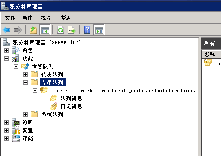

# 如何：为 SharePoint 2013 工作流配置 MSMQ
了解如何在 SharePoint 中配置 Microsoft 消息队列 (MSMQ) 以在 SharePoint 工作流中支持异步事件消息传送。 
## 启用 MSMQ

MSMQ 是一种 Windows Server 功能，您可以在 SharePoint Server 计算机上启用该功能，以允许在 SharePoint 工作流中进行异步事件消息传送。若要支持异步事件消息传送，您必须在 SharePoint Server 计算机上启用 MSMQ。
  
    
    
MSMQ 在 Windows Server 中作为"功能"提供。若要启用 MSMQ，请执行以下操作：
  
    
    

> **重要信息**
> 此处包含的屏幕截图来自 Windows Server 2008 R2。为了在 Windows Server 2012 中启用此功能，UI 可能会有更改。 
  
    
    


1. 在您的 SharePoint Server 计算机上，打开"服务器管理器"。
    
  
2. 选择左窗格中的"功能"图标，然后选择"添加功能"，如图 1 所示。
    
   **图 1. 添加消息队列功能。**

  


  

  

  
3. 在显示的"添加功能向导"中，选择"消息队列"。接受默认选择，然后依次单击"下一步"和"安装"。
    
  
4. 现在，必须重新启动计算机。
    
  
5. 重新启动后，打开"服务器管理器"，然后打开左窗格中的"消息队列"图标。请注意，现在包含"消息队列"文件夹和子目录，如图 2 所示。
    
    > **注释**
      > 在 Windows Server 2012 中，将无法在"服务器管理器"中找到队列。而是，转到"计算机管理"，然后选择"服务和应用程序"。 
6. 选择名为"专用队列"的子目录。该子目录是存储工作流事件消息的目录。
    
   **图 2. 消息队列功能添加到服务器管理器。**

  


  

    
    
    
    > **注释**
      > 当您第一次添加"消息队列"功能时，"专用队列"文件夹是空的。但是，触发事件的工作流运行（或 SharePoint 内容更改事件触发的工作流运行）后，"专用队列"文件夹将按图 2 所示填充。 
7. 要完成安装，必须使用 Windows PowerShell 脚本将 **SPWorkflowServiceApplicationProxy.AllowQueue** 属性设置为 **true**。在"SharePoint 管理 Shell"中运行以下内容：
    
  ```
  
$proxy = Get-SPWorkflowServiceApplicationProxy
$proxy.AllowQueue = $true;
$proxy.Update();

  ```


## MSMQ 疑难解答

Windows 开发人员中心提供了关于 MSMQ 的丰富文档。下面是一些有用的资源：
  
    
    

-  [关于消息队列](http://msdn.microsoft.com/zh-cn/library/windows/desktop/ms706032%28v=vs.85%29.aspx)
    
  
-  [消息队列参考](http://msdn.microsoft.com/zh-cn/library/windows/desktop/ms700112%28v=vs.85%29.aspx)
    
  
-  [消息队列错误和信息代码](http://msdn.microsoft.com/zh-cn/library/windows/desktop/ms700106%28v=vs.85%29.aspx)
    
  

## 其他资源
<a name="bk_addresources"> </a>


-  [消息队列 (MSMQ)](http://msdn.microsoft.com/zh-cn/library/windows/desktop/ms711472%28v=vs.85%29.aspx)
    
  

  
    
    

