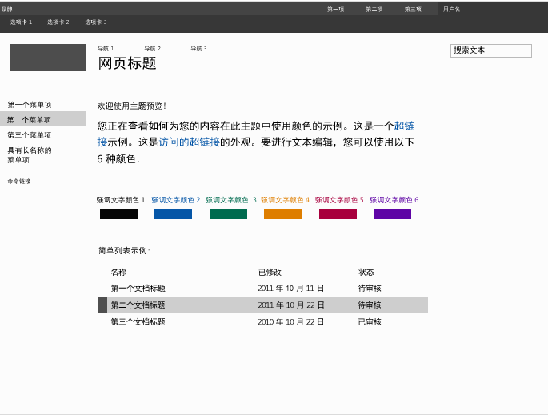

# 如何：在 SharePoint 2013 中创建母版页预览文件
了解如何创建母版页预览文件，此类文件用于 SharePoint 主题设置体验，以显示选定主题组件的预览。
"更改外观"向导是 SharePoint 主题设置体验的入口点。设计库是"更改外观"向导中的第一页，显示可用设计的缩略图。用户为其网站选择一种设计，然后继续前往下一页面并可以在此进行自定义设计。之后，用户可以预览网站，然后将设计应用到网站。母版页预览文件用于生成缩略图像和预览图像。如果母版页没有相应的预览文件，则无法用于主题设置体验。
  
    
    

有关详细信息，请参阅 [SharePoint 2013 主题概述](themes-overview-for-sharepoint-2013.md)。
## 使用母版页预览文件要了解的核心概念
<a name="Introduction"> </a>

表 1 列出的文章有助于您理解使用母版页预览文件要了解的核心概念。
  
    
    

**表 1. 使用母版页预览文件要了解的核心概念**


|**文章标题**|**说明**|
|:-----|:-----|
| [SharePoint 2013 主题概述](themes-overview-for-sharepoint-2013.md) <br/> |了解 SharePoint 2013 中的主题设置体验。  <br/> |
| [为发布网站选择主题](http://office.microsoft.com/zh-cn/office365-sharepoint-online-enterprise-help/choose-a-theme-for-your-publishing-site-HA102891580.aspx) <br/> |了解如何使用"更改外观"向导更改 SharePoint 网站的外观。  <br/> |
   

## 什么是母版页预览文件？
<a name="section1"> </a>

母版页预览文件（.preview 文件）是经过特殊格式化的文件，具有针对默认调色板、默认字体方案、已标记化的 CSS 和已标记化的 HTML 的部分。母版页预览文件必须使用与相应母版页相同的名称（不包括扩展名）。例如，如果您的一个母版页名称为 article.master，则相应的母版页预览文件名称为 article.preview。母版页和母版页预览存储在母版页样式库中。
  
    
    
母版页预览文件具有以下结构：
  
    
    


```HTML
Default color palette
[SECTION]
Default font scheme
[SECTION]
CSS
[SECTION]
HTML
```

在母版页预览文件中：
  
    
    

-  _默认调色板_是主题库 (http:// _SiteColltionName_/_catalogs/theme/15/) 中默认要使用的 .spcolor 文件。默认调色板对应于母版页默认状态下使用的颜色。即，在用户于"更改外观"向导中选择调色板之前使用的颜色。
    
  
-  _默认字体方案_是主题库 (http:// _SiteCollectionName_/_catalogs/theme/15/) 中默认要使用的 .spfont 文件。默认字体方案对应于母版页默认状态下使用的字体。即，在用户于"更改外观"向导中选择字体方案之前使用的字体。
    
  
-  _CSS_ 是包含级联样式表 (CSS) 的部分。所有 CSS 类必须具有[ID] 前缀。以下示例显示了母版页预览文件中 CSS 部分的一段。
    
  ```
  
[ID] #dgp-pageContainer
{
    background-color: [T_THEME_COLOR_PAGEBACKGROUND];
    color: [T_THEME_COLOR_BODYTEXT];
    width: 100%;
    height:100%;     
    background-image: url('[T_IMAGE]');       
    background-size: cover;
    font-family: [T_BODY_FONT];   
}
  ```

-  _HTML_ 是定义预览的 HTML 结构的 HTML 部分。
    
  

> **注释**
> 在母版页预览文件中，所有维度值都应指定为相对单位。例如，维度值可以指定为百分比或 em 测量。有关 em 测量的详细信息，请参阅"W3C CSS 值和单位模块级别 3 工作草案"中的  [5.1.1. 字体相对差长度："em"、"ex"、"ch"、"rem"单位](http://www.w3.org/TR/2012/WD-css3-values-20120308/#font-relative-lengths)一节。 
  
    
    

令牌在母版页预览文件中广泛使用。令牌是字符串值，将替换为生成的预览中的文本、颜色值或字体值。以下部分描述了可用的令牌，及其使用方法。
  
    
    

### 杂项令牌

杂项令牌将替换为预览中指定的高度和宽度值。
  
    
    

**表 2. 杂项令牌**


|**令牌名称**|**说明**|
|:-----|:-----|
|[T_HEIGHT]  <br/> |预览的高度。  <br/> |
|[T_WIDTH]  <br/> |预览的宽度。  <br/> |
|[T_IMAGE]  <br/> |可选背景图像的 URL。  <br/> |
|[T_IMGHEIGHT]  <br/> |图像的高度（如果需要）。  <br/> |
|[T_IMGWIDTH]  <br/> |图像的宽度（如果需要）。  <br/> |
   

### 颜色令牌

颜色令牌将替换为预览图像中的颜色值。表 3 描述了两种格式的颜色令牌。将  _ColorSlot_ 替换为颜色插槽的注释名称。颜色令牌必须采用大写（例如，[T_THEME_COLOR_PAGEBACKGROUND]）。若要查看可用颜色令牌的列表，请参阅 [SharePoint 2013 中的调色板和字体](color-palettes-and-fonts-in-sharepoint-2013.md)中的 [颜色插槽映射](color-palettes-and-fonts-in-sharepoint-2013.md#colorSlots)部分。
  
    
    

**表 3. 颜色令牌**


|**令牌名称**|**说明**|
|:-----|:-----|
|[T_THEME_COLOR_ _ColorSlot_]  <br/> |如果您想要颜色插槽的颜色值，则使用此格式。  <br/> |
|[T_THEME_COLOR_ _ColorSlot__AA]  <br/> |如果您想要颜色插槽的 8 位数十六进制值，则使用此格式。此格式对筛选值在 Internet Explorer 中实现不透明度和渐变很有用。  <br/> |
   

### 字体令牌

字体令牌将替换为预览图像中的字体值。
  
    
    

- [T_ _SlotName__FONT]
    
  
将  _SlotName_ 替换为字体插槽的名称。字体令牌必须采用大写（例如，[T_BODY_FONT]）。要查看字体插槽的列表及用于页面中的位置，请参阅 [SharePoint 2013 中的调色板和字体](color-palettes-and-fonts-in-sharepoint-2013.md)中的 [字体插槽](color-palettes-and-fonts-in-sharepoint-2013.md#fontSlot)部分。
  
    
    

### 文本内容令牌

表 4 中列出的令牌用于母版页预览文件中的 HTML 部分。令牌将替换为设计库预览图像中的示例文本。示例文本显示的语言与网站其余部分相同。
  
    
    

**表 4. 文本内容令牌**


|**令牌名称**|**说明**|
|:-----|:-----|
|[BRANDSTRING]  <br/> |显示在页面上的品牌文本。在预安装的主题中，该文本显示在左上角"品牌"中。  <br/> |
|[SUITELINK1]  <br/> [SUITELINK2]  <br/> [SUITELINK3]  <br/> |显示在套件栏中的套件链接。请参阅图 1 中的"第一项"、"第二项"和"第三项"。  <br/> |
|[WELCOME]  <br/> |用户名文本。请参阅图 1 中的"用户名"。  <br/> |
|[RIBBONTAB1]  <br/> [RIBBONTAB2]  <br/> [RIBBONTAB3]  <br/> |功能区选项卡的名称。请参阅图 1 中的"选项卡 1"、"选项卡 2"和"选项卡 3"。  <br/> |
|[SEARCHBOX]  <br/> |搜索框中的文本。请参阅图 1 中的"搜索文本"。  <br/> |
|[TN1]  <br/> [TN2]  <br/> [TN3]  <br/> |水平导航项。"导航 1"、"导航 2"、"导航 3"。  <br/> |
|[TITLE]  <br/> |页标题。"页标题"。  <br/> |
|[QL1]  <br/> [QL2]  <br/> [QL3]  <br/> [QL4]  <br/> |垂直导航项。"第一个菜单项"、"第二个菜单项"、"第三个菜单项"。  <br/> |
|[QLADD]  <br/> |垂直导航项下方的链接。请参阅图 1 中的"命令链接"。  <br/> |
|[CA TABLE HEADER]  <br/> |页面文本上方的标题。图 1 中为"欢迎使用主题预览!"。  <br/> |
|[CA TABLE DESCRIPTION]  <br/> |说明文本。图 1 中为"您正在查看如何为您的内容在此主题中使用颜色的示例。这是一个示例…"。  <br/> |
|[CA ACCENT COLORS]  <br/> |强调文字颜色和颜色块列表。  <br/> |
|[CA LIST TITLE]  <br/> |列表标题。图 1 中为"列表示例"。  <br/> |
|[CA TABLE]  <br/> |示例列表。  <br/> |
|[SITETITLE]  <br/> |网站的标题。请参阅图 1 中的"网站标题"。  <br/> |
   

**图 1. 具有示例文本的预安装主题**

  
    
    

  
    
    

  
    
    

  
    
    

  
    
    

## 创建母版页预览文件
<a name="section2"> </a>

若要创建母版页预览文件，请使用现有母版页预览作为出发点。
  
    
    

### 创建母版页预览文件


1. 复制母版页预览。SharePoint 2013 包含 oslo.preview 和 seattle.preview。
    
  
2. 重命名母版页预览的副本，使其与相应的母版页匹配。例如，如果母版页名称为 article.master，则将母版页预览重命名为 article.preview。
    
  
3. 使用 HTML 编辑器编辑母版页预览文件。更新文件以反映母版页的布局和外观。
    
    > **提示**
      > 在母版页预览文件中，维度值指定为百分比。以下示例显示了将绝对测量（像素）转化为相对测量（百分比）的一种方法。假设浏览器尺寸为 1024x768。如果母版页元素高度为 32 像素且父元素是页面的主体，则可以通过用元素高度除以浏览器高度来计算百分比。相对测量值为 4%(32/768)。 
4. 将母版页预览文件上载到母版页样式库。
    
  
5. 使用"更改外观"向导测试母版页预览的网站内容。
    
    > **注释**
      > 您还可以通过向"组合外观"列表添加一项，创建使用新母版页的设计。该设计将在设计库（"更改外观"向导的第一页）中提供。有关详细信息，请参阅 [如何：在 SharePoint 2013 中部署自定义主题](how-to-deploy-a-custom-theme-in-sharepoint-2013.md)中的 [使用用户界面部署主题](how-to-deploy-a-custom-theme-in-sharepoint-2013.md#section2)过程。 
6. 必要时，可重复第 3 至 5 步。
    
  

## 其他资源
<a name="bk_addresources"> </a>


-  [在 SharePoint 2013 中开发网站设计](develop-the-site-design-in-sharepoint-2013.md)
    
  
-  [如何：在 SharePoint 2013 中部署自定义主题](how-to-deploy-a-custom-theme-in-sharepoint-2013.md)
    
  
-  [SharePoint 2013 中的调色板和字体](color-palettes-and-fonts-in-sharepoint-2013.md)
    
  
-  [SharePoint 团队博客：通过 SharePoint 主题设置秀出自己的风格](http://blogs.office.com/b/sharepoint/archive/2012/10/29/show-off-your-style-with-sharepoint-theming.aspx)
    
  

