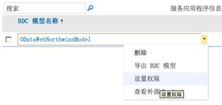
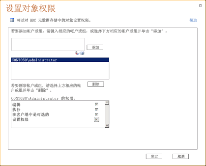
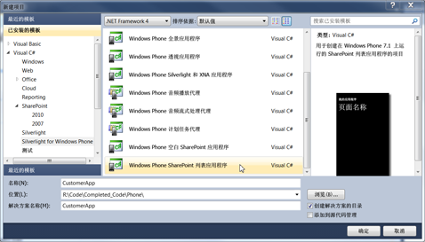
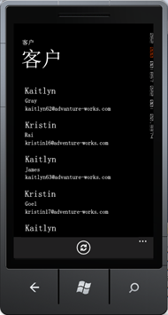

# 如何：在 SharePoint 2013 中创建包含外部数据源中的数据的移动应用程序
了解如何通过使用 Business Connectivity Services 并连接到外部列表来在 SharePoint 2013 中创建一个包含来自外部数据源的数据的简单移动应用程序。
SharePoint 2013 使您能够使用 Business Connectivity Services 生成可以访问来自数据库、企业应用程序和 Web 2.0 服务的外部数据的移动应用程序。您还可以提供与外部数据的完整交互，包括从您的移动设备写回的功能。您可以通过创建连接到外部列表的应用程序来完成此操作，这些外部列表是 SharePoint 中基于外部内容类型且包含来自外部系统的数据的特殊类型的列表。Visual Studio 2010 Express 中的新 Windows Phone SharePoint 列表模板使您能够快速且轻松地为连接到外部列表的 Windows Phone 创建应用程序。例如，您可以生成将 SharePoint 中的库存清单的产品目录带到销售人员的电话中的 Windows Phone 应用程序。本主题演示了如何通过连接到 SharePoint 中的外部列表来创建显示来自罗斯文示例数据库的外部数据的 Windows Phone 应用程序。请注意，在此示例中，使用自定义 OData 服务将外部列表连接到了罗斯文数据库；不过，可以直接连接到数据库，还可以使用外部列表连接到 Business Connectivity Services 支持的任何外部系统。使用 Visual Studio 中的新 SharePoint 列表模板，您可以创建可以访问 SharePoint 网站上的外部列表的移动应用程序。本文提供了分步过程，开始于上载外部 Business Data Connectivity (BDC) 服务 模型，结束于测试您的新移动应用程序。
  
    
    

> **重要信息**
> 如果您正在开发适用于 Windows Phone 8 的应用程序，则必须使用 Visual Studio Express 2012（而非 Visual Studio 2010 Express）。除开发环境以外，本文中的所有信息均适用于 Windows Phone 8 和 Windows Phone 7。 > 有关详细信息，请参阅 [如何：设置用于为 SharePoint 开发移动应用程序的环境](how-to-set-up-an-environment-for-developing-mobile-apps-for-sharepoint.md)。 
  
    
    

## 创建包含外部数据的移动设备应用程序的先决条件

- 含用来为罗斯文数据库上载 BDC 模型的管理权限和在其中创建外部列表的 SharePoint 站点的 SharePoint 2013 安装
    
  
- 具有  [Microsoft SharePoint SDK for Windows Phone 7.1](http://www.microsoft.com/en-us/download/details.aspx?id=30476) 中的新 SharePoint 2013 电话模板的 Microsoft Visual Studio Express
    
  
- exampleNorthwind_oData.bdmc 的 BDC 模型（可从  [SharePoint 2013：创建一个简单的基于外部列表的电话应用程序](http://code.msdn.microsoft.com/zh-cn/sharepoint/sharepoint-2013-create-a-88800202)中下载）
    
  
- 含用来为罗斯文数据库上载 BDC 模型的管理权限和在其中创建外部列表的 SharePoint 站点的 SharePoint 2013 安装
    
  

## 步骤 1：上载 BDC 元数据模型

BDC 模型是 Business Connectivity Services 的核心。它是使用 **实体**（外部内容类型）和 **方法**等数据结构来提取有关外部系统的复杂详细信息的 XML 文件。当您使用 SharePoint Designer 创建外部内容类型时会自动生成它，并且对于 .NET 和 OData 源等一些数据源类型，您需要手动创建 BDC 模型或使用 Visual Studio 创建 BDC 模型。当您使用 SharePoint 管理中心将 BDC 模型上载到 BDC 元数据存储时，该模型中定义的外部内容类型可用于在 SharePoint 中创建外部列表，它们是显示来自基础外部系统的数据的列表。在此步骤中，您将使用 SharePoint 管理中心将罗斯文示例 BDC 模型上载到元数据存储。
  
    
    

1. 导航到"管理中心"。
    
  
2. 选择"应用程序管理"，然后选择"管理服务应用程序"。
    
  
3. 在"服务应用程序页"，选择" Business Data Connectivity Service"。
    
  
4. 在 BDC 服务应用程序的功能区，选择"导入"。
    
  
5. 在"导入 BDC 模型"页，选择 "Business Data Connectivity Service"。
    
  
6. 在 BDC 服务应用程序的功能区，选择"导入"。
    
  
7. 在"导入 BDC 模型"页，选择"浏览"。
    
  
8. 在"选择要上载的文件"对话框中，浏览 Northwind_oData.bdcm 文件，然后选择"打开"。
    
  
9. 导入文件后，选择"确定"按钮。
    
  

## 步骤 2：授予权限

接着，您需要设置 BDC 模型上的权限以指定谁能执行该模型中描述的方法。这是一个必须执行的步骤。建议您给需要它们的每个用户或用户组特定的权限，通过这种方式，凭据提供了需要用于执行所需任务的最少的特权。有关设置权限的详细信息，请参阅  [Business Connectivity Service 安全概览 (SharePoint Server 2010)](http://technet.microsoft.com/zh-cn/library/ee661740.aspx) 中的 Business Connectivity Service 权限概览。在此步骤中，您给了自己执行罗斯文示例 BDC 模型中介绍的方法的权限。
  
    
    

1. 导航到"管理中心"。
    
  
2. 选择"应用程序管理"，然后选择"管理服务应用程序"。
    
  
3. 在"服务应用程序页"，选择" Business Data Connectivity Service"。
    
  
4. 在功能区，从"视图"组的下拉列表中选择"BDC 模型"。
    
  
5. 在 BDC 模型的列表中，将光标悬停在 Northwind_oData.bdcm 上，然后选择"设置权限"（如图 1 所示）。
    
   **图 1. 选择 BDC 模型的权限**

  

  

  

  
6. 在"设置对象权限"对话框中，选择"浏览"按钮。
    
  
7. 在"选择人和组"对话框中，搜索您的账户，然后选择"确定"按钮。
    
  
8. 为"编辑"、"执行"、"在客户端中可选"和"设置权限"选择权限（如图 2 所示）。
    
   **图 2. 设置对象权限**

  

  

  

  
9. 选择"确定"按钮。
    
  
10. 在功能区，从"视图"组的下拉列表中选择"外部内容类型"。
    
  
11. 在外部内容类型的列表中，将光标悬停在"客户"上，然后选择"设置权限"。
    
  
12. 在"设置对象权限"对话框中，选择"浏览"按钮，并搜索您的账户。
    
  
13. 在"设置对象权限"对话框，选择"添加"并为"编辑"、"执行"、"在客户端中可选"和"设置权限"选择权限
    
  
14. 确保选择了"宣传权限"。
    
  
15. 选择"确定"按钮。
    
  

## 步骤 3：创建外部列表

既然您已经上载了 BDC 模型并设置了权限，那么您便可以基于 BDC 模型中定义的外部内容类型创建外部列表。在此步骤中，您将基于在 [步骤 1：上载 BDC 元数据模型](how-to-create-a-mobile-app-in-sharepoint-2013-that-contains-data-from-an-externa.md#HowToCreateSimpleExternalListBasedPhoneApp_Step1)中上载的罗斯文 BDC 模型中定义的"客户"外部内容类型创建一个外部列表。
  
    
    

1. 导航到需要新列表的 SharePoint 网站。
    
  
2. 在该网站的主页上，选择"更多"。
    
  
3. 在应用程序页上，选择"添加应用程序"。
    
  
4. 在"添加应用程序"页，将光标悬停在"外部列表"上，然后选择"添加它"。
    
  
5. 在"添加外部列表"对话框中，在"名称"字段中输入"客户"等名称。
    
  
6. 在"外部内容类型"框中，指定您在步骤 1 添加的外部数据源。
    
  
7. 选择"确定"按钮。
    
  
8. 在应用程序页，选择"客户列表"以查看该列表。
    
  

## 步骤 4.使用 Windows Phone SharePoint 列表应用程序模板创建移动设备应用程序

外部列表已准备好，现在，您可以创建连接到 [步骤 3：创建外部列表](how-to-create-a-mobile-app-in-sharepoint-2013-that-contains-data-from-an-externa.md#HowToCreateSimpleExternalListBasedPhoneApp_Step3)中创建的外部列表的 Windows Phone 7，还可以显示罗斯文数据库中的"客户"数据。
  
    
    

1. 启动 Visual Studio 2010 Express.
    
  
2. 在菜单栏，选择"文件"和"新项目"。将打开"新项目"对话框。
    
  
3. 在"新项目"对话框，选择"Visual C#"和"Windows Phone 的 Silverlight "，然后选择"Windows Phone SharePoint 列表应用程序"。
    
  
4. 为该项目指定名称。在此示例中，我们使用"CustomerApp"（如图 3 所示）。
    
   **图 3. 在 Visual Studio 中选择 Windows Phone SharePoint 列表应用程序**

  

  

  

  
5. 选择"确定"按钮。
    
  
6. 在"SharePoint Phone 应用程序向导"中，输入您在其中创建了外部列表的 SharePoint 网站的 URL。
    
  
7. 选择"客户"列表，然后选择"下一个"。
    
  
8. 在"选择视图"屏幕上，选择"客户读取列表"，然后选择"下一个"。
    
  
9. 在"选择操作"屏幕上，选择"显示"，然后选择"下一个"。
    
  
10. 在"选择字段"屏幕上，选择您要使用或显示在移动应用程序中的字段，然后选择"下一个"。
    
  
11. 在"订单字段"屏幕上，再订购所需的字段，然后选择"完成"。
    
  
12. 现在，您已成功地创建了连接到外部列表的应用程序。
    
  

## 运行并测试应用程序

既然该应用程序已为运行做好准备，那么您便可以使用电话仿真程序测试它。
  
    
    

1. 在 Visual Studio 中，选择"调试"，然后选择"启动调试"或按 F5。
    
  
2. 系统出现提示时，使用与您用于登录到 SharePoint 网站相同的用户名和密码登录。确保您具有管理员权限。
    
  
3. 在结果"客户"列表中滚动（如图 4 所示）。
    
   **图 4.显示 SharePoint 外部列表的移动设备应用程序**

  

  

  

  

> **注释**
> 在使用 SharePoint 列表模板向导为具有只读字段的外部列表创建移动应用程序时，该向导生成的代码不允许用户创建或编辑项目。 
  
    
    

## 其他资源

  
    
    

-  [构建访问 SharePoint 2013 的 Windows Phone 应用程序](build-windows-phone-apps-that-access-sharepoint-2013.md)
    
  
-  [Visual Studio 中的 Windows Phone SharePoint 2013 应用程序模板概述](overview-of-windows-phone-sharepoint-2013-application-templates-in-visual-studio.md)
    
  
-  [如何：在 SharePoint 中创建外部列表](http://msdn.microsoft.com/zh-cn/library/ee558778.aspx)
    
  
-  [如何：创建 Windows Phone SharePoint 2013 列表应用程序](how-to-create-a-windows-phone-sharepoint-2013-list-app.md)
    
  
-  [如何：设置用于为 SharePoint 开发移动应用程序的环境](how-to-set-up-an-environment-for-developing-mobile-apps-for-sharepoint.md)
    
  
-  [Windows Phone SDK 7.1](http://www.microsoft.com/zh-cn/download/details.aspx?id=27570)
    
  
-  [Microsoft SharePoint SDK for Windows Phone 7.1](http://www.microsoft.com/en-us/download/details.aspx?id=30476)
    
  

