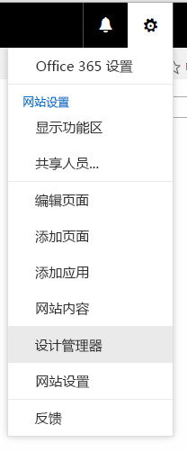

# 如何：在 SharePoint 2013 中创建页面布局
使用设计管理器创建页面布局时，会创建两个文件：一个是 SharePoint 使用的 .aspx 文件，另一个是该页面布局的一个 HTML 版本（您可以在 HTML 编辑器中编辑它）。该 HTML 文件和页面布局是关联的，这样在您编辑和保存 HTML 文件时，会将更改同步到关联的页面布局。
## 页面布局简介
<a name="Introduction"> </a>

使用设计管理器创建页面布局时，会创建两个文件：一个是 SharePoint 使用的 .aspx 文件，另一个是该页面布局的一个 HTML 版本（您可以在 HTML 编辑器中编辑它）。该 HTML 文件和页面布局是关联的，这样在您编辑和保存 HTML 文件时，会将更改同步到关联的页面布局。
  
    
    
创建母版页时，会上载一个 HTML 文件并将其直接转换为母版页。但与母版页不同的是，您不会将 HTML 文件直接转换为页面布局。这是因为页面布局的主要目的是包含页字段，在设计管理器中创建页面布局时，必须添加这些页字段。
  
    
    
创建页面布局时：
  
    
    

- 会在母版页样式库中创建一个 .aspx 文件和一个同名的 HTML 文件。
    
  
- 会将 SharePoint 所需的所有标记添加到 .aspx 文件，以便页面布局能够正确呈现。
    
  
- 其他标记（如注释、 **<div>** 标记、代码段和内容占位符）会添加到 HTML 文件。
    
  
- 内容类型特有的页字段会自动添加到页面布局。其他页字段可用于从代码段库中的功能区中添加。
    
  
- HTML 文件和 .aspx 文件是关联的，这样稍后对 HTML 文件进行编辑后，每当保存 HTML 文件时，所进行的编辑会同步到 .aspx 文件。其他标记（如注释、 **<div>** 标记、代码段和内容占位符）将添加到 HTML 文件。
    
  

> **注释**
> 该同步只会单向进行。对 HTML 页面布局所做的更改会同步到关联的 .aspx 文件，但如果您选择直接编辑 .aspx 文件，则这些更改不会同步到 HTML 文件。每个 HTML 页面布局（和每个 HTML 母版页）都有一个名为"关联文件"的属性，该属性默认情况下设置为 **True**，即在文件之间创建关联和同步。 
  
    
    

例如，如果您有一对关联文件（HTML 和 .aspx），而您在未破坏关联的情况下编辑了 .aspx 文件，则会保存这些 .aspx 文件更改，但无法签入或发布该 .aspx 文件，所以这些更改并未真正保存。对 HTML 文件所做的所有更改会覆盖 .aspx 文件。如果您签入或发布 HTML 文件，则 HTML 文件更改会覆盖对 .aspx 文件所做的任何更改。.aspx 文件更改会丢失。
  
    
    
如果您是一名熟悉 ASP.NET 的开发人员，则可选择仅使用 .aspx 文件，方法是破坏文件之间的关联。若要破坏 HTML 文件和 .aspx 文件之间的关联，请在设计管理器中对 HTML 文件选择"编辑属性"，然后清除"关联文件"复选框。您可稍后重新关联这些文件，方法是编辑这些属性并选中此复选框，这样在 HTML 文件中保存的更改会再次覆盖 .aspx 文件。
  
    
    

## 了解页字段和内容类型之间的关系
<a name="UnderstandingPageFields"> </a>

每个页面布局都与一个内容类型（通常是页面布局组中的内容类型之一）关联。例如与"文章页面"页面布局关联的"文章页面"内容类型，它们都包含在发布网站中。
  
    
    
内容类型由网站栏（共同定义允许的数据类型的架构）组成。由于源栏是空的，您可以断定，网站栏对当前内容类型是唯一的—这意味着这些网站栏是由当前内容类型定义的，而不是从父内容类型继承的。
  
    
    
对于任何给定页面布局，组成内容类型的网站栏直接与可用于该页面布局的页字段相对应。功能区上的第一组页字段是在您创建页面布局时自动添加到其上的页字段。SharePoint 之所以会自动添加这些字段是因为它们对于此内容类型是唯一的，所以这些字段可能专门创建用于供该页面布局使用（与作为常规 SharePoint 元数据相对而言）。
  
    
    
在设计管理器中创建页面布局之前，可能必须先为该页面布局创建定义所需的页字段的内容类型
  
    
    

## 了解页面布局上的内容占位符和母版页之间的关系
<a name="UnderstandingContentPlaceholders"> </a>

为使页面布局正确呈现，页面布局和母版页必须具有相同数量的内容占位符组。如果您使用设计管理器来创建母版页和页面布局，则这不成问题，因为在您创建页面布局时，会为每个文件添加正确数量的内容占位符组。这可确保每个页面布局在使用不同母版页的每个通道上都正常工作。您不必了解或使用其中多数内容占位符。它们之所以存在是因为 SharePoint 需要它们才能正确呈现页面。
  
    
    
但如果您编辑 HTML 页面布局并手动添加一个内容占位符，则应将该内容占位符添加到需要使用该页面布局的每个母版页。这种情况并不常见。
  
    
    
使用设计管理器来创建页面布局和母版页时，最常见的情况是仅使用以下内容占位符：
  
    
    

- **PlaceHolderMain** 母版页包含一个 `ID="PlaceholderMain"` 的内容占位符，其中包含 **DefaultContentBlock** **<div>** 标记，它具有显示"此区域将由您在页面布局创建的内容填充" 的黄框。不应在母版页上的此占位符中放入任何内容。页面布局包含一个具有相同 ID 的内容占位符。只应在页面布局中的此占位符中放入标记，而不要在此占位符外放入标记。这两个占位符 ( **PlaceholderMain**) 的 ID 应匹配。
    
  
- **PlaceHolderAdditionalPageHead** 您使用页面布局时，通常不会在页面布局的 **<head>** 标记中插入元素。相反，会在具有 `id="PlaceHolderAdditionalPageHead"` 的内容占位符中添加元素。在浏览器中呈现内容页时，此附加页标题会与母版页标题的末尾合并。
    
  

## 创建页面布局
<a name="CreatePageLayout"> </a>

开始之前，需要了解页面布局将与之关联的内容类型和母版页。
  
    
    

### 创建页面布局


1. 浏览到您的发布网站。
    
  
2. 在页面的右上角，选择齿轮图标，然后选择"设计管理器"。
    
   **齿轮图标菜单**

  


  

  

  
3. 在设计管理器中的左侧导航窗格中，选择"编辑页面布局"。
    
  
4. 选择"创建页面布局"。
    
  
5. 在"创建页面布局"对话框中，为您的页面布局输入名称。
    
  
6. 选择母版页。
    
    在此选择的母版页将显示在此页面布局的预览中。此母版页还确定添加到页面布局的内容占位符。
    
    > **注释**
      > 选择此母版页后，便无法预览母版页不同的页面布局，即使您为活动网站应用了不同的母版页也不行。 
7. 选择内容类型。此页面布局的内容类型确定代码段库中将可用于此页面布局的页字段。
    
  
8. 选择"确定"。
    
    此时，SharePoint 会创建一个 HTML 文件和一个同名的 .aspx 文件。
    
    现在在设计管理器中会显示您的 HTML 文件，其中具有一个"状态"栏，显示以下两个可能的状态之一：
    
  - **警告和错误**
    
  
  - **转换成功**
    
  
9. 单击"状态"栏中的链接可预览文件和查看有关母版页的任何错误或警告。
    
    预览页是您的页面布局的实时服务器端预览。预览的顶部显示可能必须通过在 HTML 编辑器中编辑 HTML 文件来解决的任何警告或错误。必须修复错误预览才能正确显示页面布局。
    
    有关解决错误和警告的详细信息，请参阅 [如何：在 SharePoint 2013 中预览页面时解决错误和警告](how-to-resolve-errors-and-warnings-when-previewing-a-page-in-sharepoint-2013.md)。
    
    有关预览页面布局的详细信息，请参阅 [如何：在 SharePoint 2013 设计管理器中更改预览页面](how-to-change-the-preview-page-in-sharepoint-2013-design-manager.md)。
    
    预览页面的右上角还包含一个"代码段"链接。此链接可打开代码段库，您可在其中将设计中的模型控件替换为动态 SharePoint 控件。有关详细信息，请参阅  [SharePoint 2013 设计管理器代码段](sharepoint-2013-design-manager-snippets.md)。
    
  
10. 若要修复错误，请编辑直接位于服务器上的 HTML 文件，方法是使用 HTML 编辑器打开和编辑映射驱动器中的 HTML 文件。每次保存 HTML 文件时，所做更改都会同步到关联的 .aspx 文件。
    
  
11. 页面布局的预览显示自动添加到页面布局的页字段。这些页字段是当前内容类型唯一的网站栏。现在，您可根据原始 HTML 模型设置页面布局的样式。
    
  

## 确定页面布局的样式的位置
<a name="WhereStyles"> </a>

您为网站创建 HTML 模型时，可能具有一些 HTML 文件，它们表示不同类别的页面，如文章页或项目详细信息页（其中包含一个显示某个目录的单个项目的详细信息的 Web 部件）。创建表示该类别的页面的页面布局后，便可以将样式从您的 HTML 模型转移到您的页面布局的 HTML 版本。
  
    
    
您只需将一个或多个页面布局的样式放入母版页链接到的同一样式表。但如果您希望尽可能减小每个页面负载的 CSS 的量，还可为不同的页面布局使用不同的样式表。此时应了解指向样式表的链接无法转入页面布局的 **<head>** 标记，这一点十分重要。相反，该链接必须转入名为 **PlaceHolderAdditionalPageHead** 的内容占位符。
  
    
    

> **注释**
> 在此标记中， `ms-design-css-conversion="no"` 属性会阻止该样式表成为主题。此外，指向该样式表的链接应在包含 **<!--SPM** 注释的行之后显示。
  
    
    


```HTML

<!--MS:<asp:ContentPlaceHolder id="PlaceHolderAdditionalPageHead" runat="server">-->
            <!--SPM:<%@Register Tagprefix="SharePoint" Namespace="Microsoft.SharePoint.WebControls" Assembly="Microsoft.SharePoint, Version=15.0.0.0, Culture=neutral, PublicKeyToken=71e9bce111e9429c"%>-->
            <!--SPM:<%@Register Tagprefix="Publishing" Namespace="Microsoft.SharePoint.Publishing.WebControls" Assembly="Microsoft.SharePoint.Publishing, Version=15.0.0.0, Culture=neutral, PublicKeyToken=71e9bce111e9429c"%>-->
<link href="MyPageLayout.css" rel="stylesheet" type="text/css" ms-design-css-conversion="no" />
        <!--ME:</asp:ContentPlaceHolder>-->

```

网站访问者浏览使用此页面布局的页面时，此附加页标题会合并到母版页标题的末尾，所以在应用母版页的样式之后，才会应用页面布局的样式。
  
    
    
这样，每个页面布局都可以有自己的样式表。例如，您可以让带  `id="xyz"` 的 **<div>** 在一个页面布局中显示在左侧，而在另一个页面布局中显示在右侧。
  
    
    
每个页面布局还可具有一个或多个设备通道特定的样式表。例如，您可能希望某个页面布局具有针对电话的布局，该布局与桌面布局不同。为此，可在 **PlaceHolderAdditionalPageHead** 中包含一个或多个设备通道面板，其中每个通道面板包含一个指向具有通道特定的样式的样式表的链接。这样，例如， `id="abc"` 的 **<div>** 可在一个通道中显示大文本，而在其他通道中显示小文本。
  
    
    
以下是放入页面布局的样式表链接的位置的一些常见情形。
  
    
    

### 指向母版页中的样式的链接

最简单的情形是在母版页链接到的同一样式表中包含一个或多个页面布局的样式。在母版页中，将指向 .css 文件的链接放在 **</head>** 结束标记的前面，以便它能够覆盖默认 SharePoint 样式表，如 corev15.css。
  
    
    

```HTML

<head>
…
<link rel="stylesheet" type="text/css" href="MyStyleSheet.css" />
</head>

```


### 指向页面布局中的样式的链接

如果希望尽量减少每个页面加载的 CSS 的量，则可为每个页面布局使用单独的 CSS 文件。在这种情形下，页面布局的样式转入名为 **PlaceHolderAdditionalPageHead** 的内容占位符。
  
    
    

```HTML

<!--MS:<asp:ContentPlaceHolder id="PlaceHolderAdditionalPageHead" runat="server">-->
            <!--SPM:<%@Register Tagprefix="SharePoint" Namespace="Microsoft.SharePoint.WebControls" Assembly="Microsoft.SharePoint, Version=15.0.0.0, Culture=neutral, PublicKeyToken=71e9bce111e9429c"%>-->
            <!--SPM:<%@Register Tagprefix="Publishing" Namespace="Microsoft.SharePoint.Publishing.WebControls" Assembly="Microsoft.SharePoint.Publishing, Version=15.0.0.0, Culture=neutral, PublicKeyToken=71e9bce111e9429c"%>-->
<link href="MyPageLayout.css" rel="stylesheet" type="text/css" ms-design-css-conversion="no" />
        <!--ME:</asp:ContentPlaceHolder>-->

```


### 指向每设备通道的页面布局中的样式的链接

如果您有不同的设备通道，则可能希望页面布局对不同的通道呈现不同的内容。在此情形下，可在 **PlaceHolderAdditionalPageHead** 中包含一个或多个设备通道面板，然后在每个通道面板中包含一个指向通道特定的 CSS 文件的链接。
  
    
    

```HTML

<!--MS:<asp:ContentPlaceHolder id="PlaceHolderAdditionalPageHead" runat="server">-->
<div data-name="DeviceChannelPanel">
    <!--CS: Start Device Channel Panel Snippet-->
    <!--SPM:<%@Register Tagprefix="Publishing" Namespace="Microsoft.SharePoint.Publishing.WebControls" Assembly="Microsoft.SharePoint.Publishing, Version=15.0.0.0, Culture=neutral, PublicKeyToken=71e9bce111e9429c"%>-->
    <!--MS:<Publishing:DeviceChannelPanel runat="server" IncludedChannels="Channel1">-->
…..
<link rel="stylesheet" type="text/css" href="MyStyleSheet.css" ms-design-css-conversion="no" />
    <!--ME:</Publishing:DeviceChannelPanel>-->
    <!--CE: End Device Channel Panel Snippet-->
</div><div data-name="DeviceChannelPanel">
    <!--CS: Start Device Channel Panel Snippet-->
    <!--SPM:<%@Register Tagprefix="Publishing" Namespace="Microsoft.SharePoint.Publishing.WebControls" Assembly="Microsoft.SharePoint.Publishing, Version=15.0.0.0, Culture=neutral, PublicKeyToken=71e9bce111e9429c"%>-->
    <!--MS:<Publishing:DeviceChannelPanel runat="server" IncludedChannels="Channel2">-->
…..
<link rel="stylesheet" type="text/css" href="CSS5.css" />
    <!--ME:</Publishing:DeviceChannelPanel>-->
    <!--CE: End Device Channel Panel Snippet-->
</div>

```


## 了解 HTML 页面布局中的标记
<a name="UnderstandMarkup"> </a>

创建页面布局时，会创建一个 SharePoint 使用的 .aspx 文件，并且会向该页面布局的 HTML 版本添加一些 HTML 标记。在 HTML 编辑器中编辑 HTML 页面布局时，了解此标记的某些方面的用途可能很有用。这些标记大多与添加到 HTML 母版页的标记相似。有关详细信息，请参阅 [如何：在 SharePoint 2013 中将 HTML 文件转换为母版页](how-to-convert-an-html-file-into-a-master-page-in-sharepoint-2013.md)。
  
    
    
页面布局特有的标记是根据页面布局关联的内容类型添加到页面布局的页字段。页字段显示在具有  `id="PlaceHolderMain"` 的内容占位符中。例如， **PlaceHolderMain** 的以下标记包含表示关联的内容类型中的 **Title** 和 **Page Image** 字段的两个页字段。
  
    
    


```HTML

<!--MS:<asp:ContentPlaceHolder ID="PlaceHolderMain" runat="server">-->
            <div>
                <!--CS: Start Page Field: Title Snippet-->
                <!--SPM:<%@Register Tagprefix="PageFieldTextField" Namespace="Microsoft.SharePoint.WebControls" Assembly="Microsoft.SharePoint, Version=15.0.0.0, Culture=neutral, PublicKeyToken=71e9bce111e9429c"%>-->
                <!--SPM:<%@Register Tagprefix="Publishing" Namespace="Microsoft.SharePoint.Publishing.WebControls" Assembly="Microsoft.SharePoint.Publishing, Version=15.0.0.0, Culture=neutral, PublicKeyToken=71e9bce111e9429c"%>-->
                <!--MS:<Publishing:EditModePanel runat="server" CssClass="edit-mode-panel">-->
                    <!--MS:<PageFieldTextField:TextField FieldName="fa564e0f-0c70-4ab9-b863-0177e6ddd247" runat="server">-->
                    <!--ME:</PageFieldTextField:TextField>-->
                <!--ME:</Publishing:EditModePanel>-->
                <!--CE: End Page Field: Title Snippet-->
            </div>
            <div>
                <!--CS: Start Page Field: Page Image Snippet-->
                <!--SPM:<%@Register Tagprefix="PageFieldRichImageField" Namespace="Microsoft.SharePoint.Publishing.WebControls" Assembly="Microsoft.SharePoint.Publishing, Version=15.0.0.0, Culture=neutral, PublicKeyToken=71e9bce111e9429c"%>-->
                <!--MS:<PageFieldRichImageField:RichImageField FieldName="3de94b06-4120-41a5-b907-88773e493458" runat="server">-->
                    <!--PS: Start of READ-ONLY PREVIEW (do not modify)--><div id="ctl02_label" style="display:none">Page Image</div><div id="ctl02__ControlWrapper_RichImageField" class="ms-rtestate-field" style="display:inline" aria-labelledby="ctl02_label"><div align="left" class="ms-formfieldcontainer"><div class="ms-formfieldlabelcontainer" nowrap="nowrap"><span class="ms-formfieldlabel" nowrap="nowrap">Page Image</span></div><div class="ms-formfieldvaluecontainer"><div class="ms-rtestate-field"></div></div></div></div><!--PE: End of READ-ONLY PREVIEW-->
                <!--ME:</PageFieldRichImageField:RichImageField>-->
                <!--CE: End Page Field: Page Image Snippet-->
            </div>
        <!--ME:</asp:ContentPlaceHolder>-->

```


## 其他资源
<a name="AdditionalResources"> </a>


-  [SharePoint 2013 中的设计管理器概述](overview-of-design-manager-in-sharepoint-2013.md)
    
  
-  [如何：在 SharePoint 2013 中将 HTML 文件转换为母版页](how-to-convert-an-html-file-into-a-master-page-in-sharepoint-2013.md)
    
  
-  [SharePoint 2013 设计管理器代码段](sharepoint-2013-design-manager-snippets.md)
    
  

