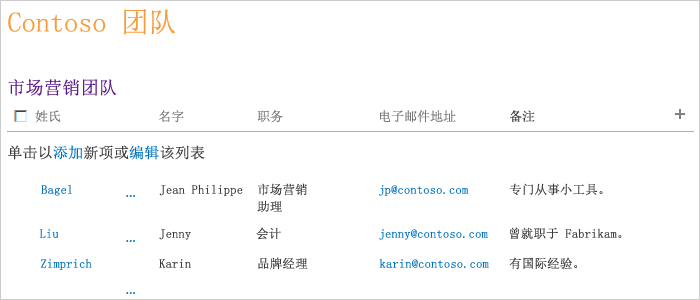
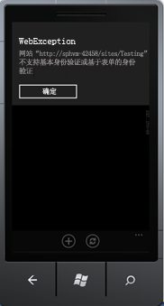
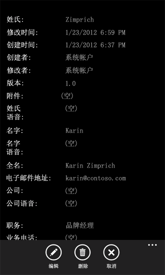

# 如何：创建 Windows Phone SharePoint 2013 列表应用程序
在基于 Windows Phone SharePoint 列表应用程序模板的 Visual Studio 中创建一个 Windows Phone 应用程序。
安装 Windows Phone SharePoint SDK 使您可以在 Visual Studio 2010 或 Visual Studio 2010 Express for Windows Phone 中使用两个 Windows Phone SharePoint 应用程序模板。（请参阅 [如何：设置用于为 SharePoint 开发移动应用程序的环境](how-to-set-up-an-environment-for-developing-mobile-apps-for-sharepoint.md)。）使用 Windows Phone SharePoint 列表应用程序模板，您可以遵循向导步骤来创建一个可以访问和操作 SharePoint 列表中的数据的功能性 Windows Phone 应用程序。
  
    
    

> **重要信息**
> 如果您正在开发适用于 Windows Phone 8 的应用程序，则必须使用 Visual Studio Express 2012（而非 Visual Studio 2010 Express）。除开发环境以外，本文中的所有信息均适用于 Windows Phone 8 和 Windows Phone 7。 > 有关详细信息，请参阅 [如何：设置用于为 SharePoint 开发移动应用程序的环境](how-to-set-up-an-environment-for-developing-mobile-apps-for-sharepoint.md)。 
  
    
    

如果您希望在阅读此帮助文章之前观看创建移动应用程序的演示，请观看以下视频。
  
    
    

**使用 SharePoint 2013 创建移动应用程序演示**

  
    
    

  
    
    

  
    
    

  
    
    

  
    
    

## 创建 Windows Phone SharePoint 列表应用程序

在 Windows Phone SharePoint 列表应用程序中，您可以访问在 SharePoint 外接程序中可用的大部分列表。对于此示例 Windows Phone 应用程序，我们使用的 SharePoint 列表包含来自名为 Contoso, Ltd 的虚构公司的示例数据。为了说明创建此 SharePoint 列表应用程序的首次迭代的步骤，我们使用的 SharePoint 联系人列表包含关于 Contoso 的营销团队成员的信息，如图 1 所示。
  
    
    

**图 1. Contoso 营销团队的联系人列表**

  
    
    

  
    
    

  
    
    

### 创建 Windows Phone SharePoint 列表应用程序

1. 使用"以管理员身份运行"选项启动 Visual Studio 2010。
    
  
2. 依次选择"文件"、"新建"、"项目"。 
    
    出现"新建项目"对话框。
    
  
3. 在"新建项目"对话框中，展开"Visual C#"节点，然后选择"Silverlight for Window Phone"节点。（确保目标 .NET Framework 版本设置为 4。）
    
    > **注释**
      > 由 Windows Phone SharePoint SDK 安装的模板仅在 C# 项目中工作。这些模板在 Visual Basic 项目中不可用。 
4. 在"模板"窗格中，选择"Windows Phone SharePoint 列表应用程序"模板并指定项目名称，例如 ContosoSPListApp。
    
  
5. 在运行"SharePoint Phone 应用程序向导"时，可能发生图 2 中所示的错误。发生此错误的原因是开发人员在运行"SharePoint Phone 应用程序向导"时使用的帐户权限不足。
    
   **图 2. SPList 向导错误消息**

  

  

    通过给开发人员运行 SPList 向导所使用的帐户提供足够的权限，您可以解决此错误。在拥有足够的权限后，重新运行"Splist 向导"。
    
  
6. 选择"确定"按钮。将出现"SharePoint Phone 应用程序向导"。使用此向导选择一个 SharePoint 列表并配置该列表的属性以确定它在 Windows Phone 应用程序中的显示方式。
    
  
7. 指定您的网络上的目标 SharePoint 网站的 URL（即 SharePoint Server 的一个本地安装）。
    
  
8. 选择"查找列表"。如果您运行 Visual Studio 所用的帐户具有访问指定的目标网站的权限，"SharePoint Phone 应用程序向导"显示该网站上可用的列表。
    
  
9. 选择一个可用的列表，如联系人列表（图 1 显示了自定义视图中的示例数据）。
    
  
10. 选择"下一步"。向导显示与所选的列表相关联的可用视图。
    
    向导显示的视图是由用户创建（或由 SharePoint Server 提供）并与服务器上的给定列表相关联的视图。默认情况下，一些 SharePoint 列表只有一个与之相关联的视图。默认情况下，一个"联系人"列表与一个"所有联系人"视图相关联，一个"通知"列表与一个恶"所有项目"视图相关联，一个"任务"列表与六个视图相关联，其中包括一个"所有任务"视图和一个"活动任务"视图。对于您在向导中的此阶段选择的每个视图，都会创建一个 **PivotItem** 控件并将其添加到 XAML 中用来定义 Windows Phone 应用程序用户界面的 **Pivot** 控件。
    
  
11. 选中要在 Windows Phone 应用程序中包含的每个视图旁边的复选框。
    
  
12. 选择"下一步"。向导显示对您的 Windows Phone 应用程序中的所选列表可用的操作。
    
    选项有"新建"、"显示"、"编辑"及"删除"。如果希望能够编辑或删除应用程序中的列表项，您必须在向导的此阶段选择"显示"操作。（"编辑"和"删除"操作的复选框处于禁用状态，除非选择了"显示"操作。）
    
  
13. 选中要对您的 Windows Phone 应用程序中的所选列表可用的每个操作旁边的复选框。
    
  
14. 选择"下一步"。向导显示与 SharePoint 网站上的所选列表相关联的字段。
    
    > **注释**
      > 从移动设备的 SharePoint 列表向导中无法选择自定义字段。然而，您可以编写自定义代码来访问任何自定义字段。字段不能与其内容类型相关联。但是，如果为列表启用了多个内容类型，所有字段均可供开发人员在移动应用程序中使用。 
15. 选中您的 Windows Phone 应用程序中出现的列表要包含的每个字段旁边的复选框。
    
    > **注释**
      > 在 SharePoint Server 中作为必需信息指定的列表字段已处于选中状态；无法在向导中清除它们。 
16. 选择"下一步"。向导允许您对在上一步中选择的字段进行排序。
    
  
17. 根据需要通过以下方式对字段排序：选择各字段，并使用向上或向下箭头向上或向下移动它们来调整顺序。
    
  
18. 选择"完成"。Visual Studio 为项目创建必需的文件并打开 List.xaml 文件以供编辑。
    
  

## 运行由 SharePoint Phone 应用程序向导生成的 Windows Phone 应用程序

可以直接构建由"SharePoint Phone 应用程序向导"生成的项目以创建一个简单但功能齐全的 Windows Phone SharePoint 列表应用程序。我们可以进一步修改和开发该应用程序，但是，现在用户可以点击（在 Windows Phone Emulator 中则为单击）给定的列表项，应用程序会显示与该项目相关联的所有字段（您在向导中选择包括进来的那些字段）。用户还可以添加新的列表项、删除列表项和编辑列表项的字段值。不支持在单个应用程序中进行多用户登录。但是，开发人员可以编写代码，实现在另一个用户尝试登录到同一移动应用程序时注销当前用户。
  
    
    
默认情况下，解决方案的部署目标设置为 Windows Phone Emulator。您可以直接在 Visual Studio 中运行项目（在调试器环境中按 F5 键来启动项目，按 CTRL + F5 则启动项目不进行调试）。启动 Windows Phone Emulator 并加载 Windows Phone 操作系统后，您的应用程序会部署到模拟器并启动。如果您直接启动向导生成的代码，则当 SharePoint 列表应用程序在模拟器中运行时，会要求您提供目标网站上指定的 SharePoint 列表的凭据。对具有足够的权限来访问该列表的帐户提供凭据，并在模拟器中选择"登录"。Windows Phone 应用程序的主页（由项目中的 List.xaml 文件定义）显示在模拟器中。依据在上述步骤中选择的字段和为其指定的顺序，您会看到指定列表中的项。基于图 1 中呈现的列表中的数据，您会看到模拟器中的项目列，如图 3 所示。
  
    
    

**图 3. Windows Phone 应用程序中的 SharePoint 列表项**

  
    
    

  
    
    

  
    
    
当运行 Windows Phone 应用程序时，可能发生图 4 所示的身份验证错误。这是因为 SharePoint 移动应用程序要求"基本窗体身份验证"；默认情况下它未启用。
  
    
    

**图 4. Windows Phone 应用程序身份验证错误**

  
    
    

  
    
    

  
    
    
通过从管理中心选择"基本窗体身份验证"，您可以解决此错误。 
  
    
    

### 启用基本窗体身份验证

1. 导航到"管理中心"；确保您在服务器上具有管理员权限。
    
  
2. 选择"应用程序管理"下的"管理 Web 应用程序"。
    
  
3. 选择您的 Web 应用程序（您正在从移动应用程序访问其上的 SharePoint 网站）。
    
  
4. 从功能区中选择"验证提供程序"。
    
  
5. 从功能区中选择"验证提供程序"。
    
  
6. 在"身份验证提供程序"对话框中，选择"默认值"为编辑身份验证。
    
  
7. 在"编辑验证"模型窗口中，选择"声明身份验证"类型下的"基本身份验证"。
    
  
如果您的 Windows Phone 应用程序基于来自联系人列表的数据，如图 1 所示，您可以选择一个特定列表项，应用程序会显示一个页面，其中显示应用程序中对该项目可用的所有字段（由项目中的 DisplayForm.xaml 定义），如图 5 所示。（此示例中，与一个 SharePoint 联系人列表相关联的所有字段在 SharePoint Phone 应用程序向导中都已选中，并保留这些字段的默认顺序）。
  
    
    

**图 5. 联系人列表项的 DisplayForm 视图**

  
    
    

  
    
    

  
    
    
注意此应用程序页中的应用程序栏上的"编辑"和"删除"按钮。这些操作是由 Microsoft.SharePoint.Phone.Application.dll（由 Windows Phone SharePoint SDK 安装的一个库）中的方法为您实现的。如果您选择"编辑"按钮，将显示一个 Windows Phone **Page** 控制（即，从 **Microsoft.Phone.Controls.PhoneApplicationPage** 类继承来的一个类实例化的一个对象）。如果您编辑任一字段并在应用程序中的该页上选择"提交"按钮，会执行 **EditItemViewModelBase** 类的基本 **UpdateItem** 方法（最后会从 SharePoint Silverlight 客户端对象模型执行 **ListItem** 对象的 **Update** 方法）以保存您对 SharePoint 列表的更改。
  
    
    

## 其他资源

-  [构建访问 SharePoint 2013 的 Windows Phone 应用程序](build-windows-phone-apps-that-access-sharepoint-2013.md)
    
  
-  [如何：设置用于为 SharePoint 开发移动应用程序的环境](how-to-set-up-an-environment-for-developing-mobile-apps-for-sharepoint.md)
    
  
-  [Windows Phone SDK 2.0](http://www.microsoft.com/zh-cn/download/details.aspx?id=35471)
    
  
-  [适用于 Windows Phone 8 的 Microsoft SharePoint SDK](http://www.microsoft.com/zh-cn/download/details.aspx?id=36818)
    
  
-  [Windows Phone 软件开发工具包 (SDK) 7.1](http://www.microsoft.com/zh-cn/download/details.aspx?id=27570)
    
  
-  [Microsoft SharePoint SDK for Windows Phone 7.1](http://www.microsoft.com/en-us/download/details.aspx?id=30476)（http://www.microsoft.com/en-us/download/details.aspx?id=30476）
    
  

