# 如何：使用 Visual Studio 2012 创建自定义 SharePoint Server 2013 工作流表单
SharePoint Server 2013 中显示了工作流表单。本文使用应用了 2013 年 3 月公开更新的 SharePoint Server 2013 和 Visual Studio 2008 的 Office 开发人员工具。本文中的所有内容均适用于 SharePoint Server 2013 本地部署和 Office 365。
 **提供者：** [Andrew Connell](http://social.msdn.microsoft.com/profile/andrew%20connell%20%5bmvp%5d/)， [www.AndrewConnell.com](http://www.andrewconnell.com)
  
    
    

自从 Microsoft SharePoint 2007 发布以来，SharePoint 平台一直支持使用工作流自动化业务流程。SharePoint 工作流平台建立在 Windows Workflow Foundation 这个作为 .NET Framework 的一部分的基础上。Workflow Foundation 提供了很多用于创作自定义工作流程和管理自动化业务流程的功能，而 SharePoint 也添加了最终用户的集成。这种集成分两部分执行： 
- **任务** ，分配给由工作流创建和监视的用户和组。
    
  
- **表单** ，在工作流与内容类型（例如，网站、列表或库）关联时或工作流启动时，搜集用户信息。
    
  

## SharePoint 2007 和 SharePoint 2010 中的工作流表单
<a name="sec1"> </a>

在 SharePoint 2007 和 SharePoint 2010 中执行工作流提供了从一个版本到另一个版本的稳定进步。特别是，Microsoft 在 SharePoint 2010 中添加了新功能，如将工作流与网站相关联的功能。同时也改进了工作流创作工具，使 SharePoint Designer 2010 和 Visual Studio 2010 在功能上超过之前版本。但是，在 SharePoint 2013 中，工作流任务和工作流表单的执行方式基本保持不变。
  
    
    
在 SharePoint Server 2013 之前，为开发人员提供了两个创建工作流表单的选择方案。在 SharePoint 2007 中，同时平等地推荐 InfoPath 表单和 ASP.NET Web 窗体。它们各有优点和缺点。在 SharePoint 2010 中，鼓励开发人员使用 ASP.NET Web 窗体，因为这是 SharePoint 开发工具在 Visual Studio 2010 中使用关联和初始工作流表单项目项模板所创建的，但执行上和在 SharePoint 2007 中非常相似。
  
    
    

## 对 SharePoint 2013 中工作流表单的更改
<a name="sec2"> </a>

SharePoint Server 2013 引入了新的工作流架构和平台，反映了在思考 SharePoint 方式上的一些根本性变化。主要的变化是，SharePoint Server 2013 中的工作流不再由 SharePoint 运行时引擎进行管理和执行。相反，SharePoint Server 2013 使用了一个称为"工作流管理器"的新组件来托管 Windows Workflow Foundation 运行时和 Workflow Foundation 所需的必要服务。重要的一点是，工作流管理器不在 SharePoint 中运行。当发布工作流或启动已发布工作流的新实例时，SharePoint 会通知工作流管理器，反过来又处理工作流场景。当工作流需要在 SharePoint 中访问信息（如列表项属性或用户属性）时，它使用 OAuth 身份验证模型对用户进行身份验证，并通过在 SharePoint Server 2013 版本中引入的 REST API 进行通信。
  
    
    
SharePoint 平台上执行自定义的整体方向在 SharePoint Server 2013 版本中也发生了变化，尽管这种变化实际上以 SharePoint 2010 和沙盒解决方案作为开始。在 SharePoint Server 2013 中，Microsoft 引入的功能将自定义项移出 SharePoint 服务器并将它们移入客户端浏览器或其他外部资源。这些功能包括新的 SharePoint 应用模型，支持为应用程序分配一个标识，使用 OAuth 身份验证模型进行身份验证，并支持对客户端对象模型 (CSOM) 和 REST API 的改进。
  
    
    
这会对工作流表单有哪些影响呢？回想一下，在 SharePoint 2010 开始部分，Microsoft 就开始鼓励开发人员在使用 Visual Studio 创建的工作流中创建表单时，使用 ASP.NET Web 窗体。当然，这种方法需要服务器端代码来处理表单和在表单与工作流引擎之间已处理的通信。然而，在 SharePoint Server 2013 中，这是唯一可能的解决方案式开发（即，部署 *.WSP 包）。在 SharePoint Server 2013 中引入的新 SharePoint 应用模型不允许服务器端代码在 SharePoint 进程中运行。
  
    
    
若要解决此限制，Microsoft 扩展 CSOM 来包括 API 用于与工作流引擎进行交互。若要将 SharePoint Server 2013 场连接到工作流管理器场，您必须将工作流管理器客户端安装在 SharePoint 服务器上。这个组件作为一个代理，可由 SharePoint 用来与工作流管理器场进行通信。 工作流服务 CSOM API 实际上是您用来与新的工作流引擎进行交互的客户端组件。有关 SharePoint Server 2013 工作流服务 CSOM 的详细信息，请参阅 [使用 SharePoint 2013 工作流服务客户端对象模型](working-with-the-sharepoint-2013-workflow-services-client-side-object-model.md)。
  
    
    
那么，这如何使 SharePoint 工作流表单受益呢？当使用 Visual Studio 2008 创作 SharePoint Server 2013 工作流时，您使用 ASP.NET Web 窗体创建工作流表单。您可以将这些表单部署为 SharePoint 解决方案或（这是最重要的部分）部署在 中。这使您可以访问所有已部署到服务器上的服务器控件，如 ASP.NET Web 控件和其他有用的（有时需要）SharePoint 控件。您还可以使用新的工作流服务 CSOM 执行来自关联和初始表单的所有必要任务，包括但不限于以下内容：
  
    
    

- 创建工作流任务列表和历史记录列表
    
  
- 在网站、列表或文档库中创建新的工作流关联
    
  
- 启动现有工作流关联的新实例
    
  
工作流服务 CSOM 功能非常强大，在创新工作流上为您提供了很大的空间 - 全部通过浏览器或远程计算机。
  
    
    

## SharePoint Sever 2013 中可用的工作流表单
<a name="sec3"> </a>

在 SharePoint Server 2013 版本之前，您可以创建三种类型的自定义工作流表单： **初始** 表单、 **关联** 表单和 **任务编辑** 表单。以下三种类型的表单中，任务编辑表单不再被强调是自定义表单解决方案。不再强调的任务编辑表单以 SharePoint 2010 为开始，因为 Visual Studio 2010 SharePoint 开发工具缺乏任务表单的项目项，依靠标准的列表显示和编辑表单来呈现任务。
  
    
    
SharePoint Server 2013 改善了您使用工作流任务的方式，您可以在该工作流任务中创建针对特定方案的自定义结果按钮。您还可以在使用 SharePoint Server 2013 中引入的新客户端呈现 (CSR) 的任务项中自定义特定列的呈现和行为。请注意 CSR 使用在客户端中执行的 JavaScript。这些主题在文章" [使用 Visual Studio 2012 处理 SharePoint 2013 工作流中的任务](working-with-tasks-in-sharepoint-2013-workflows-using-visual-studio-2012.md)"中有相关介绍。您还可以在文章" [使用客户端呈现在 SharePoint 外接程序中自定义列表视图](http://msdn.microsoft.com/library/8d5cabb2-70d0-46a0-bfe0-9e21f8d67d86%28Office.15%29.aspx)"中获取详细信息。
  
    
    

### 了解工作流初始表单

当用户手动启动工作流时，会打开初始表单，该工作流的定义与该表单相关联。启动工作流之后，呈现在用户眼前的是初始表单，并提示用户输入该工作流所需的信息。例如，用户可以输入工作流启动新业务支出审批的理由。
  
    
    
有关初始表单，重要的一点是，它们只有在手动启动工作流时才会出现。在启动时，配置为自动启动的工作流将无法启动"初始表单"。 这种情况可以创建工作流的并发因素，让数据可以从表单中进行传递。您应该牢记，如果您的工作流配置为自动启动，并且工作流要求用户输入，您应该使用关联表单，而不是初始表单。
  
    
    

### 了解工作流关联表单

当管理员第一次决定要将工作流添加（或关联）到特定列表或文档库时，关联表单就显示在管理员面前。使用关联表单，让管理员在工作流应用于列表或库项目时指定它的参数、默认值以及其他信息。
  
    
    
这种默认的关联表单让管理员可以选择工作流定义，提供该关联的显示名称，指定将成为关联中选定工作流所创建的所有任务和历史记录列表项目的容器的列表，并在创建或更新列表或库项目时，指定在何种条件下工作流可以启动（例如手动或自动）。
  
    
    
您还可以创建自定义关联表单。如果您有一个关于工作流定义的自定义关联表单，当默认表单完成之后，SharePoint 会将该用户重定向到自定义表单。使用自定义表单来收集工作流可能需要的配置信息，如调用需要调用者用来进行身份验证或传递用于访问的独特 API 密钥的外部 Web 服务。开发人员不希望将这种信息硬编码到工作流中。如果通过 SharePoint 商店出售的应用程序中包含工作流，您就会看到这种方案。在此情况下，每个客户都需要使用自己的帐户访问远程服务。当用户创建工作流关联时，您就可以从该用户那里收集到这种信息。
  
    
    
另一种常见的方案发生在您需要收集信息的时候，这些信息是工作流的启动者通常会为自动启动的工作流提交的信息。如先前所述，只有在手动启动工作流时，才显示初始表单。另一方面，当工作流配置为自动启动时，如果工作流是表单某些字段中的期望数据，优选的解决方案是使用一个自定义关联表单。 
  
    
    
然后，在初始表单中，这些默认值会在手动启动工作流时出现。当自动启动时，工作流可以检测到初始表单中没有传来任何数据，而是恢复到在关联表单中指定的值。
  
    
    

## 演练：创建和部署自定义关联表单
<a name="sec4"> </a>

在此演练中，我们演示如何创建自定义关联表单，并用它来收集将传递到工作流的信息。在开始之前，请确保您可以访问 SharePoint Server 2013 开发人员网站。
  
    
    

### 创建自定义关联表单


1. 使用 Visual Studio 2008 创建自定义工作流。 
    
  
2. 在 Visual Studio 中，创建新的 SharePoint Server 2013 应用程序项目，并将其配置为 SharePoint 托管的应用程序。
    
  
3. 将新的"通知"列表添加到该项目。此列表将与工作流相关联，并且此列表上的事件将触发工作流。
    
  
4. 右键单击"解决方案资源管理器"中的项目并依次选择"添加"和"新建项目"，以向该项目添加工作流项。在"添加新项目"对话框中，从"Office/SharePoint"类别中选择"工作流"项目项。输入"SampleWorkflow"作为名称，然后单击"下一步"。当 SharePoint 自定义向导提示时，将新项目设置为"列表工作流"。
    
  
5. "SharePoint 自定义向导"的下一页（如图 1 中所示），可使您自动创建一个工作流关联。但是，创建自定义关联表单时， **不** 要试图执行此选项。而是要取消选中此复选框，并单击"完成"。
    
   **图 1. 取消选择自动关联工作流的选项。**

  

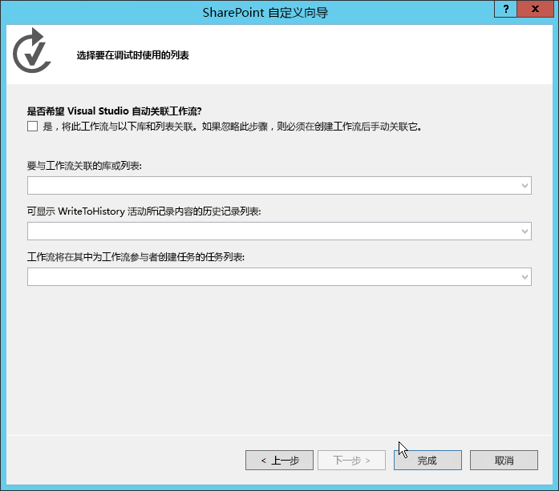
  

  

  
6. 接下来，右键单击"解决方案资源管理器"中的工作流项目，将此表单添加到 Visual Studio 项中，然后选择"添加"、"新项目"。 
    
    最后这一步非常重要，因为它会告知"添加新项目"对话框：该上下文是一个工作流项目。之后将使"添加新项目"对话框显示两个表单项目项模板（初始表单和关联表单）作为选项，如图 2 所示。
    

   **图 2. 选择关联表单模板。**

  

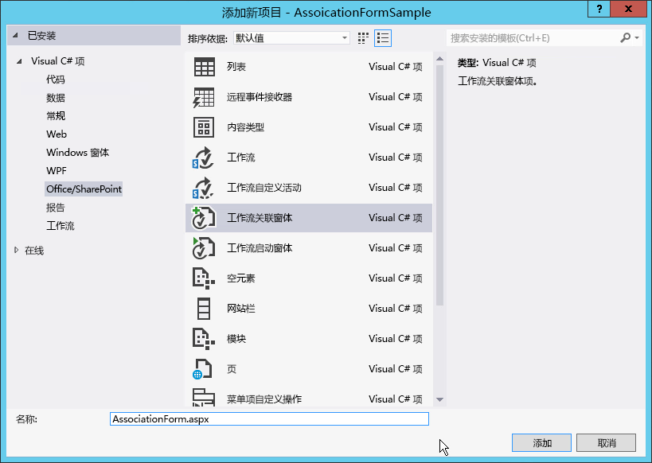
  

  

  
7. 选择"工作流关联表单"项，然后删除字段名称中的"1"。单击"添加"以完成此过程。
    
  

### 更新默认关联表单中的 HTML 和 JavaScript

一旦新表单添加到项目中，Visual Studio 会自动将其打开。在这种情况下，您只需要对该表单做两件事以使其符合您的工作流：
  
    
    

- 更新 HTML 表单，以反映您需要从用户那里收集的数据元素，以及确定如何呈现该表单。
    
  
- 更新默认的 JavaScript 以从更新表单中提取值，并将属性名称与您在工作流中创建的参数名称进行匹配。
    
  

1. 打开表单查看代码。
    
  
2. 找到下面代码段所示的服务器控件：
    
  ```
  
<WorkflowServices:WorkflowAssociationFormContextControl ID="WorkflowAssociationFormContextControl1" runat="server" />
  ```


    此服务器控件执行两项重要任务。首先，它添加了关联表单所需的 JavaScript 库。其次，它采用了之前表单提交的表单值，并将这些值写入页面中作为隐藏的 HTML 输入控件。之前的页面是默认的 SharePoint 关联表单，在此表单中，用户可以指定工作流定义、关联名称、工作流任务和历史记录列表，以及开始选项。此表单使用 HTTP POST 来移动到已添加到工作流的自定义关联表单。因为它是 HTTP POST，该值不会在表单中提供，因为所有自定义逻辑必须在不使用服务器端代码的情况下才能执行。因此 SharePoint 提供这种服务器控件，将那些值从 HTTP 请求管道中提取出来，并将它们添加到此页面。
    
  
3. 在源文件中向下滚动直至找到示例 HTML 表并将其替换为以下：
    
  ```XML
  <table>
    <tr>
      <td colspan="2">
        String:<br /><textarea id="strInput" rows="1" columns="50"/>
      </td>
    </tr>
    <tr>
        <td><button id="Save" onclick="return runAssocWFTask()">Save</button></td>
        <td><button id="Cancel" onclick="location.href = cancelRedirectUrl; return false;">Cancel</button></td>
    </tr>
</table>

  ```


    此表显示了一个用来将信息传递到工作流关联的简单 HTML 文本框。请注意，该表单有两个按钮，这些按钮可用来保存或取消工作流。当您单击"保存"按钮，工作流会调用 JavaScript 函数 **runAssocWfTask()**，此函数位于源文件靠下的几行里。接下来我们需要对其进行修改。
    
  

### 更新工作流服务 JSOM，以创建工作流关联

紧跟在源文件中的 HTML 表单部分有一个长约 200 行的  _ecmascriptshort_ 代码块。此代码块说明了 SharePoint Server 2013 中新的工作流服务 JavaScript 客户端对象模型 (JSOM) API 实现。在大多数新情况下，此 JavaScript 代码应保持不变，因为它执行某些重要工作：
  
    
    

- 确定是否应创建一个新的关联工作流任务列表，如果需要，则创建它。
    
  
- 确定是否应创建一个新的关联工作流历史记录列表，如果是这样，则创建它。
    
  
- 创建具有指定名称、工作流定义、启动选项和相关联列表的新工作流关联。
    
  
您需要考虑何时创建自定义关联表单的重要环节就是从表单的何处收集值并将其传递到新的关联中。我们在下面的步骤中介绍此过程。
  
    
    

1. 在工作流关联 JSOM 脚本块中，找到 JavaScript 函数 **associateWF()**。
    
  
2. 在此函数的脚本块中，找到定义名为 **metadata** 的新数组的行：
  
    
    
 `var metadata = new Object();`
    
  
3. 接下来，添加一个表示您希望传递到 SharePoint 的表单字段的名称-值对的集合。对于此演练中的自定义表单，您只需要以下 JavaScript，因此更新设置 **metadata** 变量的块，如下所示：
    
  ```XML
  
var strInputValue = document.getElementById("strInput").value;
if (strInputValue) {
  metadata['AssociationFormValue'] = strInputValue;
}
  ```

4. 此时，自定义关联表单已完成。
    
  

### 使用工作流中的关联表单值

表单完成后，下一步是配置工作流，以使用从关联表单中传来的值。当从关联表单传来值时，该值将作为配置值进行传递。为了获得这个值，请使用特定的活动从工作流的关联元数据中提取出该配置值，并将其存储在变量中以备将来使用。
  
    
    

1. 打开 Visual Studio 中的工作流，转到"变量"选项卡，然后创建名为 **AssociationFormValue** 的新字符串变量，如图 3 所示。
    
   **图 3. 创建 AssociationFormValue 变量。**

  

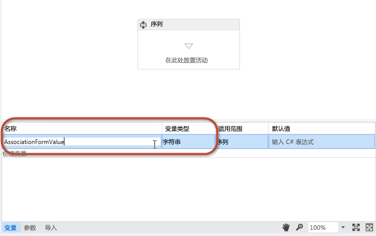
  

  

  
2. 拖放工作流设计器图面上的"GetConfigurationValue"活动，将 **Name** 属性设置为表单中使用的元数据属性的名称，如图 4 所示。
    
   **图 4.**

  

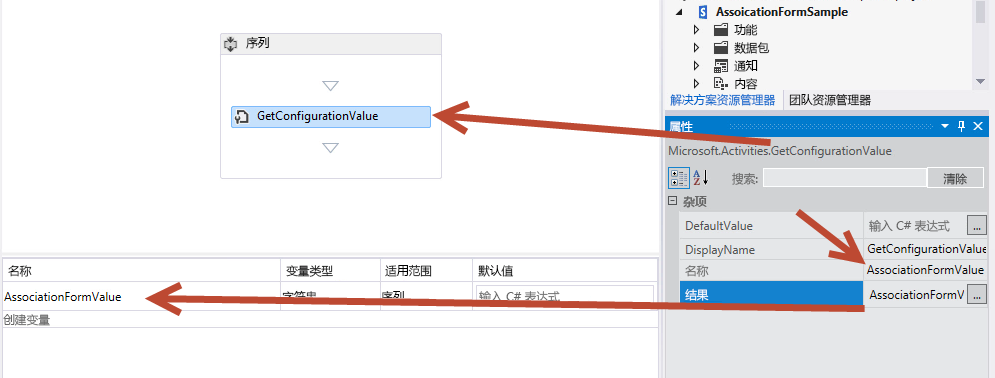
  

  

  
3. 将 **Result** 属性设置为变量的名称，如图 4 所示。
    
    此活动将 **AssociationFormValue** 属性值从工作流的元数据中提取出来，并将其存储在本地变量中。若要查看变量内容，请将"WriteToHistory"活动添加到工作流，并将它的 **Message** 属性设置为将变量值写入历史记录列表中。
    
  
4. 您已完成将表单值与工作流相关联所必需的步骤。保存您的工作，并测试该表单。
    
  

### 测试自定义关联表单


1. 若要测试工作流，请按下"F5"，或在 Visual Studio 中单击"开始"按钮。本演练假定在本地安装 SharePoint Server 2013，所以 Visual Studio 启动工作流管理员测试服务主机实用工具，并将工作流部署到开发人员网站。
    
  
2. 通过导航到"公告"列表创建关联，然后在功能区选择"列表"选项卡，并单击"工作流设置"（"工作流设置"按钮），然后单击"添加工作流"链接。此时，您会看到 SharePoint 关联表单。
    
  
3. 在关联表单中，选择您想要测试的工作流，并为它指定一个名称。
    
  
4. 选择创建新的任务和历史记录列表，将工作流设置为手动启动，然后单击"下一步"。
    
  
5. 因为您已经在工作流定义中指定了自定义关联表单，所以就会打开图 5 中所示的自定义关联表单。
    
   **图 5. 自定义工作流关联表单。**

  

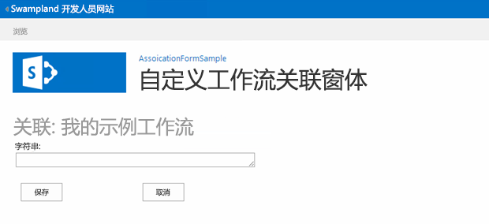
  

  

  
6. 在表单域中输入一个值并单击"保存"。这将创建关联，并将自定义值存储在该工作流关联的元数据中。
    
  
7. 若要验证该工作流是否可以从配置设置中提取值，请导航回"公告"列表，并创建新项目。创建了新项目之后，手动启动自定义工作流。在启动工作流之后，导航到项目的工作流实例状态页面，并确定该值已写入到历史记录列表中，如图 6 所述。
    
   **图 6. 工作流状态页。**

  

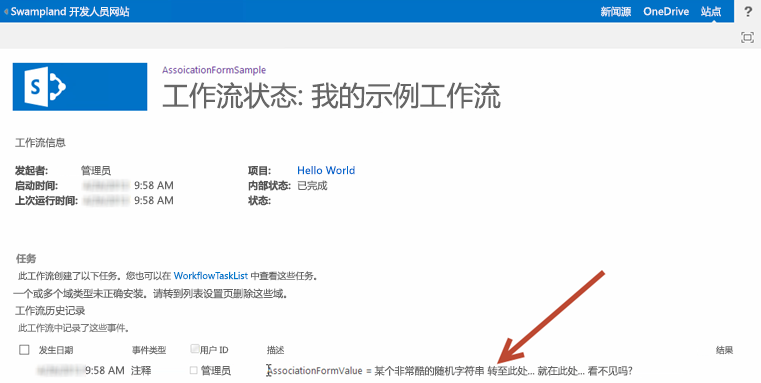
  

  

  

## 演练：创建自定义初始表单
<a name="sec4"> </a>

本演练演示如何创建自定义关联表单，当手动启动工作流时，用该表单来收集用户的信息。
  
    
    

### 创建新的工作流项目


1. 通过使用 Visual Studio 2008 开始创建自定义工作流，确保您有访问 SharePoint Server 2013 开发人员网站的权限。
    
  
2. 创建一个配置为 SharePoint 托管应用程序的新 SharePoint 项目。
    
  
3. 将新的"通知"列表添加到项目。我们将使用此列表作为用来触发工作流的项目容器。
    
  
4. 接下来，右键单击"解决方案资源管理器"中的项目图标，选择"添加"、"新项目"，然后在"添加新项目"对话框中选择"工作流"项目项，将工作流项目添加到该项目。 
    
  
5. 将新的工作流命名为"SampleInitFormWorkflow"，然后单击"下一步"。
    
  
6. 出现提示时，将新的工作流项目设置为与"公告"列表相关联的"列表工作流"；将该工作流设置为手动启动。（注意，如果工作流是自动启动的，就不会显示初始表单。）
    
  
7. 在这种情况下，该项目将出现在"解决方案资源管理器"中，如图 7 所示。需要注意的是，在创建了关联之后，会自动添加一些元素，如 **WorkflowHistoryList** 和 **WorkflowTaskList**。
    
   **图 7. 解决方案资源管理器中的项目外观。**

  

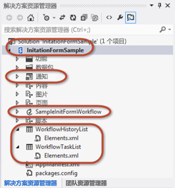
  

  

  

### 添加参数收集初始表单值

工作流初始表单提示用户提供启动工作流所需的两项信息：一项是随机字符串，另一项是使用人员选取器控件选择的用户。为了符合这一要求，您需要配置两个参数，它们的值会在提交表单时，由工作流服务 CSOM API 从该表单中提取出来。
  
    
    

1. 在工作流设计器中，单击屏幕底部的"参数"选项卡，创建两个参数，如图 8 所示。将它们命名为 **UserLoginName** 和 **SomeRandomString**。 
    
   **图 8. 配置初始表单参数。**

  


  

  

  
2. 将二者的"参数类型"都设置为 **String**；将二者的"方向"设置为 **In**，如图 8 所示。
    
    您可以将 **Direction** 属性视为 .NET 类上的一个属性。当将方向设置为 **In** 时，该属性将有一个公共的 **Set** 方法，而不是一个私有的 **Get** 方法。当将方向设置为 **Out** 时，属性将有公共的 **Get** 而不是私有的 **Set**。最后，当设置为 **In/Out** 时， **Get** 和 **Set** 方法都是公共的。
    
  
3. 若要查看这两个参数的内容，请将一对"WriteToHistory"活动添加到工作流并将每一个都配置为将参数内容写入历史记录列表中。
    
    您可以按照使用变量的方式来使用这些参数，但是，请记住，当设置"方向"时，您是在规定它们的读/写功能。图 9 显示了配置时这些活动之一可能的样子：
    

   **图 9. 配置 WriteToHistory 活动来测试参数**

  

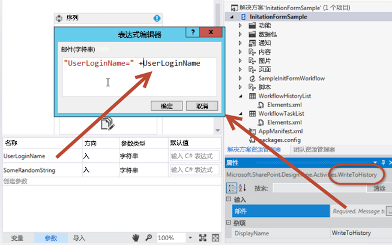
  

  

  

### 添加初始表单的项目项

已经将工作流配置为接受来自表单的两个输入参数，下一个步骤是将该表单添加到该项目。
  
    
    

1. 右键单击"解决方案资源管理器"中的该工作流项目，然后选择"添加"，再选择"新项目"。
    
  
2. 选择"工作流初始表单"项目项，并删除名称中的数字"1"，所以该表单称作"InitForm.aspx"，然后单击"添加"。这使得 Visual Studio 将新的 ASPX 页面添加到目前已存在于项目树中的"页面"模块。这确保该表单将被配置为应用程序中的"页面"子文件夹。Visual Studio 还修改了工作流项目上的属性。
    
  
3. 选择"解决方案资源管理器"中的工作流项目"SimpleInitFormWorkflow"，在"属性"网格中，要注意初始表单上的哪些属性已设置。实际上，其中之一指向刚被添加到"页面"模块中的表单的相对网站路径。
    
  

### 检查和更新默认初始表单

当将新的初始表单添加到项目时，Visual Studio 2008 自动开始执行。和关联表单的情况相类似，这个新的初始表单需要执行两个任务：
  
    
    

- 更新 HTML 表单来指定应该从用户那里收集的数据元素，以及指定表单的呈现方式。
    
  
- 更新默认的 JavaScript 块，从表单中提取用户输入值，并将属性名称与我们在工作流中创建的参数名称进行匹配。
    
  

> **注释**
> 在源文件中，注意第一个 ASP.NET 内容占位符 **PlaceHolderAdditionalPageHead**，它包含对工作流服务 CSOM 库 ( **sp.workflowservices.js** ) 和核心 SharePoint Server 2013 CSOM 库（ **sp.js** 和 **sp.runtime.js** ）的引用。紧接本部分中的代码，有一个包含评论注释的服务器端注释。请记住，如图 10 中显示的这个注释是无关紧要的，应当将其忽略。
  
    
    


**图 10. 忽略的代码注释。**

  
    
    

  
    
    
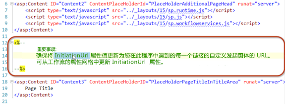
  
    
    

### 更新 HTML 表单


1. 在表单代码文件中向下滚动，直至找到名为  `PlaceHolderMain` 的 ASP.NET 内容占位符。请注意，本节的第一部分包含 HTML 表，其中包含三个表单域。我们只需要其中的两个。
    
  
2. 通过将其替换为以下代码来更新此 HTML 表：
    
  ```
  
<table>
  <tr>
    <td>
      String:<br />
      <input type="text" id="strInput" />
    </td>
  </tr>
  <tr>
    <td>
      User Picker:<br />
      <SharePoint:PeopleEditor AllowEmpty="false" ValidatorEnabled="true" MultiSelect="false" ID="peoplePicker" runat="server" />
    </td>
  </tr>
  <tr>
    <td>
      <input type="button" name="startWorkflowButton" value="Start" onclick="StartWorkflow()" />
      <input type="button" name="cancelButton" value="Cancel" onclick="RedirFromInitForm()" />
      <br />
    </td>
  </tr>
</table>

  ```

现在，该表包含两个输入控件。第一个是标准的 HTML 文本框，它的 ID 是 **strInput**。第二个是 SharePoint 人员选取器控件，它的 ID 是 **peoplePicker**。后者是一个服务器端控件；然而，它允许出现在网页上，因为它已部署到每台 SharePoint Server 2013 计算机上。此外，在初始表单的顶部引用此控件。
  
    
    
现在请注意表单上的两个按钮："启动"("startWorkflowButton") 和"取消"("cancelButton")。单击"启动"按钮调用 **StartWorkflow()**JavaScript 函数。该函数位于表单文件靠下的脚本块中，它属于我们需要做的下一个更改主题。
  
    
    

### 更新 JSOM 代码块来启动工作流


1. 找到紧跟在我们刚刚修改的 HTML 表单后面的 JavaScript 代码块。我们将把这个代码留在此脚本块中，几乎保持不变。
    
    此代码演示已在 SharePoint Server 2013 中实施的工作流服务 JavaScript 客户端对象模型 (JSOM) API 中提供的强大功能和灵活性。从高层次上看，该代码将执行以下步骤。
    
  
2. 找到以下代码行： `var wfParams = new Object();`
    
  
3. 紧跟在这行的后面，使用您自己的代码替换现有的代码，从我们前不久创建的以下两个 HTML 表单域中提取出值： **strInput** 和 **peoplePicker**。为此，将以下对 jQuery 库的引用添加到 HTML 标记中的 **PlaceHolderAdditionalPageHead** 元素。这使得从表单中获取值变得更容易。
    
  ```
  
<script type="text/javascript" src="../Scripts/jquery-1.8.2.min.js"></script>
  ```

4. 现在，返回到 JSOM 脚本块的部分，其中的参数是从表单中收集而来的。使用以下代码替换现有的 JavaScript：
    
  ```
  var wfParams = new Object();
// get people picker value
var html = $("ctl00_PlaceHolderMain_peoplePicker_upLevelDiv");
wfParams['UserLoginName'] = $("#divEntityData", html).attr("key");

// get string input
var strInputValue = $("strInput").value;
wfParams['SomeRandomString'] = strInputValue

  ```

5. 保存所做的更改。
    
  
我们在前面过程中已修改的代码执行了大量的工作：
  
    
    

- 从 URL 中的查询字符串获取以下三个参数：
    
  - 新的工作流实例将与之相关联的项目 ID 保存在 JavaScript 变量 **[itemId]** 中。
    
  
  - 当前网站、列表或文档库的工作流关联 ID 保存在 JavaScript 变量 **[subscriptionId]** 中。
    
  
  - 用户所来自的 URL 保存在 JavaScript **[redirectUrl]** 变量中。这是用户填完表单之后且已启动工作流时将转到的地方。
    
  
- 创建将发送到工作流并保存在 JavaScript 变量 **[wfParams]** 中的属性数组。这些是您需要从表单中收集的值，两个次要步骤中的第二个要求编辑自定义初始表单。
    
  
- 获取对 SharePoint CSOM 客户端上下文的引用，以及对所需工作流服务的引用。
    
  
- 一旦将脚本连接至工作流服务订阅服务（在 **[subscriptionService]** 变量中引用）之后，将执行以下的一个任务：
    
  
- 
  - 如果脚本从第一步骤中的查询字符串中获取了项目 ID，则其通过从工作流服务实例服务调用函数 **[startWorkflowOnListItem()]** 来启动指定列表项上的新工作流实例。
    
  
  - 如果未找到 ID，将通过从工作流服务实例服务调用函数 **[startWorkflow()]** 来启动当前网站上的新工作流实例。
    
  

### 测试自定义的初始表单

通过在 Visual Studio 2008 中按 F5 或单击"启动"按钮来测试工作流。如果您正在测试 SharePoint Server 2013 的本地安装，Visual Studio 2008 将启动工作流管理员测试服务主机实用工具，并将该工作流部署到开发人员网站。片刻之后，就会打开开发人员网站。 
  
    
    
导航到"公告"列表并创建新项目。创建完项目之后，启动自定义工作流。
  
    
    
由于工作流定义包含对初始表单的引用，用户首先会被带到这个表单。填写请求值，然后单击"启动"按钮。这会触发页面上启动工作流实例的 JavaScript，如图 11 所示。
  
    
    

**图 11. 触发工作流。**

  
    
    

  
    
    
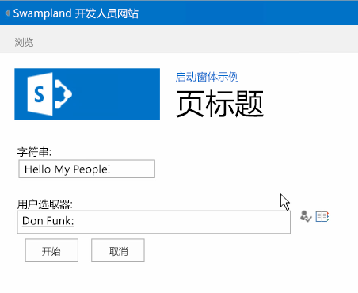
  
    
    
启动工作流后，页面将用户重定向到最初的页面。等待工作流启动会花一些时间，然后返回到该项目并查看工作流实例的状态页面。请注意，历史记录列表包含的值已提交到表单中，然后在使用工作流服务 JSOM 创建工作流实例后又被发送到 SharePoint。
  
    
    

**图 12. 完成该工作流。**

  
    
    

  
    
    
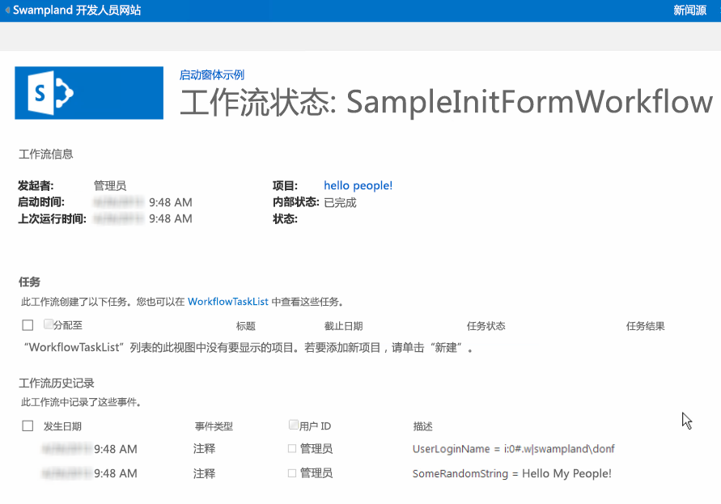
  
    
    

  
    
    

  
    
    

## 结论
<a name="sec6"> </a>

SharePoint 2013 引入了一些对工作流的改进。本文详细介绍了与工作流表单相关的更改，这些更改由 SharePoint Server 2013 中的工作流架构更改引起。本文还演示了如何使用 Visual Studio 2008 创建自定义关联表单和初始表单，来满足当今自动化业务流程的严苛要求。
  
    
    

## 其他资源
<a name="sec7"> </a>


-  [工作流关联和初始表单 (SharePoint Foundation)](http://msdn.microsoft.com/zh-cn/library/office/ms481192%28v=office.14%29.aspx)
    
  
-  [使用 SharePoint 2013 工作流服务客户端对象模型](working-with-the-sharepoint-2013-workflow-services-client-side-object-model.md)
    
  
-  [使用客户端呈现在 SharePoint 外接程序中自定义列表视图](http://msdn.microsoft.com/library/8d5cabb2-70d0-46a0-bfe0-9e21f8d67d86%28Office.15%29.aspx)
    
  

