# 如何：使用 Visual Studio 创建 SharePoint 2013 工作流
了解在新的 SharePoint 2013 工作流平台中创建 SharePoint 工作流的基础知识。
 **提供者：** [Andrew Connell](http://social.msdn.microsoft.com/profile/andrew%20connell%20%5bmvp%5d/)， [AndrewConnell.com](http://www.andrewconnell.com)
  
    
    

  
    
    

> **注释**
> 本文随附端到端代码示例，您可以用来理解文章，或用作您自己的 SharePoint 工作流项目的起点。您可以在此处找到可下载的代码：LINK。 
  
    
    

  
    
    

  
    
    
Microsoft 在 SharePoint 2013 中对工作流采取的方法与之前版本大不相同。SharePoint 工作流现在基于 Windows Workflow Foundation 4，其执行由一个称为 工作流管理器 的新组件（在 SharePoint 外部运行）推动。工作流管理器 以一种高度可用和可伸缩的方式，充当 Windows Workflow Foundation 运行时和所有必要服务的主机。它利用服务总线实现性能和可伸缩性，部署后，它在内部部署中的运行方式与在部署到基于云的服务（例如 Office 365）时完全相同，因为它配置为将所有工作流运行任务及相关任务移交给 工作流管理器 服务器场。工作流体系结构中的重大改变要求对用于创建自定义工作流的两个主要工作流创作工具 - Visual Studio 和 SharePoint Designer - 进行一些更改。在本文中，我们将使用 Visual Studio 2008 作为您的工作流创作工具，以创建用于"sp15allshort"部署的自定义工作流 - 包括内部部署或 Office 365 部署。
## Visual Studio 2012 中的工作流类型

SharePoint Designer 2013 只能创建由阶段组成的工作流，Visual Studio 则支持另一种功能强大的工作流：状态机工作流。因此，实际上 Visual Studio 2008（和 Visual Studio 2013）工作流开发环境支持三种工作流创作：顺序、流程图和状态机。
  
    
    

### 顺序

顺序工作流是一种遵循特定路径的工作流。其中可能包含决策分支和循环，并且工作流可能没有终结点，但在设计过程中遵循可预测的路径很容易。实际上，就是您在 Visual Studio 中使用"工作流"项目模板时所有工作流的开始方式。 
  
    
    
顺序工作流包含单个"Sequence"活动和任意数量的活动。其中某些活动可能是您用于将一系列小步骤分组在一起的其他"Sequence"活动。
  
    
    

### 流程图

在流程图工作流中，根据您指定的条件，执行路径可以转变为工作流的不同部分，如图 1 中所示。流程图活动以及相关的 FlowDescision 和 FlowSwitch 活动通常放在 Sequence 活动内，并且像传统 **if** 语句一样运行，或者像使用常规编程语言的 **switch** 语句一样运行。
  
    
    
在基于工作流的 SharePoint Designer 2013 中构建的阶段基于流程图的原理。不同于顺序工作流，这些类型的工作流没有可遵循的规定路径，而是由工作流中发生的事件决定工作流遵循的路径。
  
    
    

**图 1. Visual Studio 2012 中的流程图工作流**

  
    
    

  
    
    
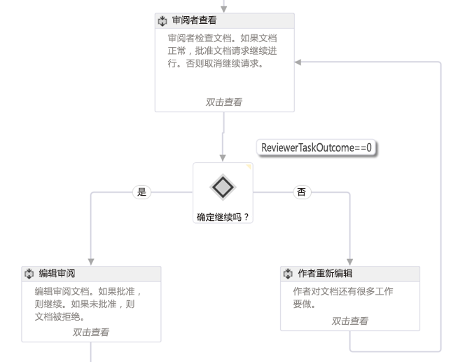
  
    
    

    
> **注释**
> 您可以在 MSDN 上找到图 1 中描述的工作流，作为工作流示例： [SharePoint 2013：使用自定义启动表单的审批工作流](http://code.msdn.microsoft.com/officeapps/SharePoint-2013-Approval-f5ac5eb2)。 
  
    
    

### 状态机

状态机工作流与流程图工作流一样，通常不会遵循特定的执行路径，而是由图 2 中所示的两个或多个状态组成。 
  
    
    

**图 2. Visual Studio 2012 中的状态机工作流**

  
    
    

  
    
    
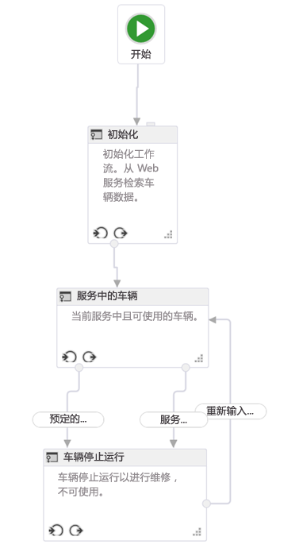
  
    
    

    
> **注释**
> 您可以在 MSDN 上找到图 1 中描述的工作流，作为工作流示例： [SharePoint 2013：根据操作和事件将工作流路由到状态](http://code.msdn.microsoft.com/officeapps/SharePoint-2013-Route-25a25d87)。 
  
    
    

将每个状态看作是一个包含多个工作流活动的小工作流。您可以设置当工作流进入或退出指定状态时要开始的活动。真正使状态机有趣的是您可以定义的转换。每个状态具有一个或多个转换，告诉工作流引擎如何从一个状态切换到另一个状态。 
  
    
    
工作流始终进入状态机工作流中的某个状态。转换将规定工作流从一个状态切换到另一个状态的触发器。相对于其他类型的工作流，很多人都倾向于状态机工作流，因为状态机工作流可以更贴近地反映真实的业务流程。但是，状态机工作流很快就会变得很复杂。
  
    
    

## Visual Studio 2012 工作流开发接口

将新工作流添加到 SharePoint 项目时，模板将添加一个 Sequence 活动作为主容器。如果您想创建一个流程图或状态机工作流，只需删除此默认活动，然后将 StateMachine 或 Flowchart 活动拖放到设计界面上。
  
    
    
在构建自定义工作流之前，开发人员应该对 Visual Studio 2012 提供的工具窗口和设计界面有充分的了解。很多元素都是通用的，如图 3 中所示：
  
    
    

**图 3. Visual Studio 2012 工作流创作界面**

  
    
    

  
    
    
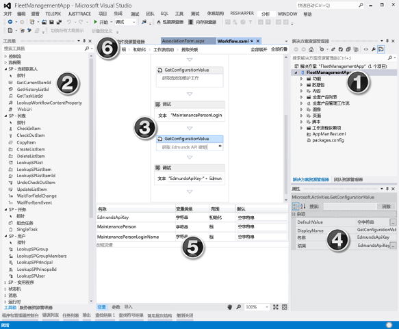
  
    
    
工作流开发界面 - 即工作流设计器 - 具有以下关键元素：
  
    
    

  
    
    

1. "解决方案资源管理器"将您的项目显示为一个文件树。
    
  
2. "工作流工具箱"包含可用于构建工作流的所有活动。您可从工具箱拖放到设计器界面上。
    
  
3. "工作流设计器界面"使您构建和链接工作流元素的位置。
    
  
4. "属性网格"显示"解决方案资源管理器"中所选活动或项目的属性。请使用它来设置或更改属性值。
    
  
5. "输出窗格"显示有关变量、参数和导入等工作流活动元素的信息。
    
  
6. "痕迹导航选项卡"允许您将开发中的工作流的各个部分放大或缩小。
    
  
"输出窗格"（图 3 中的 #5）非常重要，因为它使您可以查看当前范围中工作流的所有变量。范围设置的工作方式与在标准编程对象导向的设计中相同：所有较低范围（例如类中的方法）都可以访问根级别的变量，但较低范围（例如类中的方法）中的变量仅在该范围及其子范围内可访问，在并列范围或父范围中不可访问。 
  
    
    
单击"参数"选项卡查看用于将值传递到工作流的参数列表，例如从初始表单传递的参数。
  
    
    

## 如何创建自定义工作流

要使用 Visual Studio 2008 或更高版本创建自定义工作流，请确保您可以访问 SharePoint 2013 开发人员网站。对于本演示，建议您使用本地 SharePoint 2013 安装。这是因为在本地测试的工作流可以使用 **WriteLine** 活动将调试信息写入到测试服务主机控制台实用程序中。该实用程序包含在 Visual Studio 2013 Office 开发人员工具 中，后者是 Professional、Premium 和 Ultimate 版中 Visual Studio 2008 及更高版本的默认安装的一部分。
  
    
    

### 创建新的应用程序项目

1. 在 Visual Studio 中，创建一个新的 SharePoint 外接程序 项目并将其配置为 SharePoint 承载的应用程序。
    
  
2. 在该项目中，添加一个新的"通知"列表实例。我们将使用此列表作为容器，用于我们要用于测试工作流的项目。
    
  
3. 右键单击"解决方案资源管理器"中的项目图标并依次选择"添加"和"新项"，以向该项目添加工作流项。
    
  
4. 在"添加新项"对话框中，从"Office/SharePoint"类别中选择"工作流"项目项，并将其命名为"My First Workflow"；然后单击"下一步"。
    
  
5. "SharePoint 自定义向导"提示您输入名称时，保留默认名称，然后将其设置为"列表工作流"。单击"下一步"。
    
  
6. 在向导的下一页上，选中复选框以创建关联，然后选择我们刚刚创建的"通知"列表；为所需的工作流历史记录和任务列表选择"<新建>"，然后单击"下一步"。
    
  
7. 在向导的最后一页上，选中该框以手动启动工作流，将两个自动启动选项保留未选中状态，然后单击"完成"。Visual Studio 会将所需的元素自动添加到项目中，然后将 Workflow.xaml 文件加载到设计器中，如图 4 中所示。
    
   **图 4. 添加工作流项目后的默认设计器界面**

  

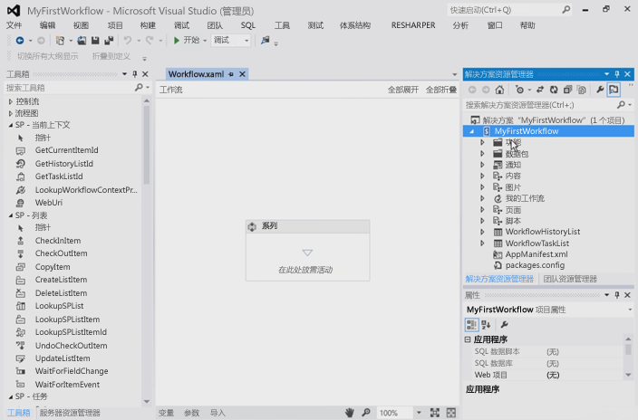
  

  

  

### 组织工作流步骤

要使某个指定业务流程自动化，工作流可以包含您分组到一个步骤中的任意数量的活动，或任意数量的"Sequence"活动。但是，如果您将太多活动分组到单个"Sequence"中，工作流将变得混乱且难以遵守和调试。这与在常规编程语言中，创建超长且复杂的方法的不明智做法类似。相反，您应将活动分组为协同工作，以在常规序列中执行特定任务。
  
    
    
此工作流示例将说明对工作流进行分段的这一做法。在您的新项目中，在现有默认 Sequence 活动的设计器界面上，添加两个新的 Sequence 活动，并将其分别重命名为"Child Sequence 1"和"Child Sequence 2"，如图 5 中所示。另外（图 5 中未显示），将原始 Sequence 活动的名称更改为"Root"。
  
    
    

**图 5. 将子序列添加到默认序列或 root 序列**

  
    
    

  
    
    
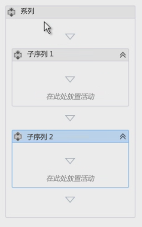
  
    
    

  
    
    

  
    
    

### 使用注释标注工作流

使用常规编程语言（如 C#、VB.NET 或 C++）时，您可以使用合适的注释符号对代码进行标注。标注代码对测试和维护代码库至关重要。Visual Studio 还提供了一种称为 **annotations** 的功能，使您还能对工作流开发进行标注。
  
    
    
您可以对指定工作流活动进行标注，方法是选择活动，然后依次选择"注释和"添加注释"。活动标题栏右侧一个小的倒 V 形图标表示它具有注释。悬停在该图标上方或者单击该图标以查看消息（如图 6 中所示）。您可以选择将注释固定到活动上，使其始终可见，如图 6 中所示。 
  
    
    

**图 6. 活动中的注释**

  
    
    

  
    
    
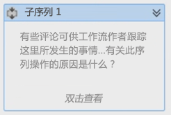
  
    
    

  
    
    

  
    
    

### 从列表项中获取值

创建工作流时将遇到的一个常规任务是获取列表项的属性。要完成此任务，请使用 **LookupSPListItem** 活动。此活动的作用是使用 SharePoint 2013 REST API 发出一个 Web 服务调用，以查看列表项上的信息。以下过程将说明如何执行此任务：
  
    
    
首先，将 **LookupSPListItem** 活动从工具箱拖放到"Child Sequence 1"活动中。
  
    
    
将活动添加到设计器之后，必须设置下面两个属性： **ListId** 和 **ItemId**。这两个属性可以设置为查找任何列表中的信息，但需使用"当前列表"和"当前项目"的快捷方式通知 工作流管理器 自动计算出这些值。
  
    
    
因为我们发出的是 Web 服务调用，此活动的返回值（通过 **Result** 属性反映）为 **DynamicValue** 类型。因此，我们需要一个该数据类型的变量，以存储 Web 服务调用的输出。这实际上是非常简单，因为只需单击 **LookupSPListItem** 活动中的"获取属性"链接，以下操作将大部分都自动执行：
  
    
    

- 首先，它创建一个 **DynamicValue** 类型的新变量。
    
  
- 接下来，它将此新变量设置为 **LookupSPListItem** 活动上 **Result** 属性的源。
    
  
- 然后它将 **GetDynamicValueProperties** 活动添加到工作流，以便我们可以从变量中检索值。
    
  
- 最后，它将该变量绑定到 **GetDynamicValueProperties** 活动上的 **Source** 属性。
    
  
当然，您可以手动完成这些操作，但使用工具可简化此过程。您可以根据需要更改变量的名称。
  
    
    
当然，重点是从触发工作流的列表项中获取某些值：现在"分配至"列是这些属性绑定到之前创建的变量的位置，或者使用将自动创建变量的"填充变量"链接的位置。
  
    
    

1. 在 **GetDynamicValueProperties** 活动的 **Properties** 属性上，单击省略号图标 [ **…**] 打开"属性"对话框，如图 7 中所示。
    
   **图 7. 使用"属性"对话框提取值**

  

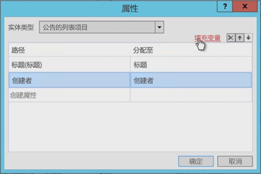
  

  

  
2. 接下来，将"实体类型"更改为与项目类型相匹配；在本示例中为"通知的列表项"。
    
  
3. 选择要检索的两个属性： **Title** 和 **Created By** 字段。
    
  
4. "分配至"列是您将这些属性绑定到所创建变量的位置。或者，您也可以使用"填充变量"链接自动分配属性。
    
  
请注意图 7 中工具是如何创建变量并正确匹配数据类型的。另外还需注意"创建者"字段为何是一个整数。向用户显示作者所代表的数字是否并无帮助？工作流稍后将解决此问题。
  
    
    

### 获取用户属性

自定义工作流开发中的另一个常规任务是查找用户。例如，我们的工作流当前知道是谁创建了通知项目，但仅知道 ID。此 ID 是已添加到网站的"用户信息列表"中的用户的 ID，这是其配置文件信息的缓存副本。真正需要的是其名称或登录名。
  
    
    
要获取用户信息，请执行以下操作：
  
    
    

1. 将我们的第一个序列（"Child Sequence 1"）重命名为"Get Item Properties"，将第二个序列命名为"Get Author Properties"。
    
    > **注释**
      > 确保包含用户 ID 的变量的作用域是整个工作流，而不仅仅是我们此前处理的序列。现在让我们来更改变量的作用域，如图 8 中所示。 

   **图 8. 更改变量的作用域**

  

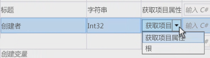
  

  

  
2. 现在，要获取用户信息，请将 **LookupSpUser** 活动拖放到工作流中，将其重命名为"Get Announcement Author"。此活动将调用 SharePoint REST API，并传递特定的 ID。使用浏览器并导航到 `http://../_api/web/SiteUsers`，确认 REST 服务看起来怎么样了。请记下返回的属性，稍后我们将会用到。
    
  
3. 请注意，每个用户都有一个特定的 URL，其中包含用于获取用户信息的 ID。另外还需注意，活动类似于致电 **GetUserById** 服务运营商，并提供要查找的用户的 ID。您可通过将 **LookupSPUser** 活动的 **PrincipalId** 属性指定为 **CreatedBy** 变量（表示通知项目的作者的整数）来提供 ID。
    
  
4. 与 **LookupSPListItem** 活动一样， **LookupSPUser** 活动返回 **DynamicValue** 类型的值，因此请创建一个该类型的变量，以便与我们的响应关联，然后将此变量绑定到 **LookupSPUser** 活动的 **Result** 属性，如图 9 中所示。
    
   **图 9. 更新 LookupSPUser 活动的输出**

  

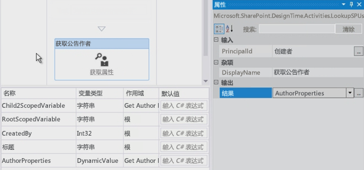
  

  

  
5. 如前所述，使用 **GetDynamicValueProperties** 活动从 **AuthorProperties** 值中获取结果。但是，此时请注意， **Entity Type** 没有我们可以设置的选项。这不是问题，因为实际的 Web 服务响应 **LookupSPUser** 可以在浏览器中查看。要查看响应，请输入您要查找的属性的路径，本示例中为 `d/results/(0)/LoginName`，然后输入另一个路径获取作者的显示名称，如图 10 中所示。
    
   **图 10. 从 LookupSPUser 活动检索值**

  

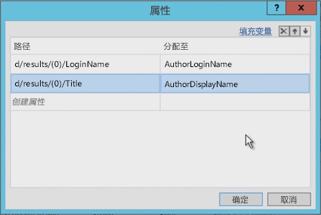
  

  

  

### 测试工作流

最后，让我们来测试该工作流。首先添加两个 **WriteLine** 活动。这两个活动使我们可以显示两个变量的内容。测试工作流时，测试服务主机控制台实用程序将输出这两个值，如图 11 中所示。
  
    
    

**图 11. 使用测试服务主机控制台进行测试**

  
    
    

  
    
    
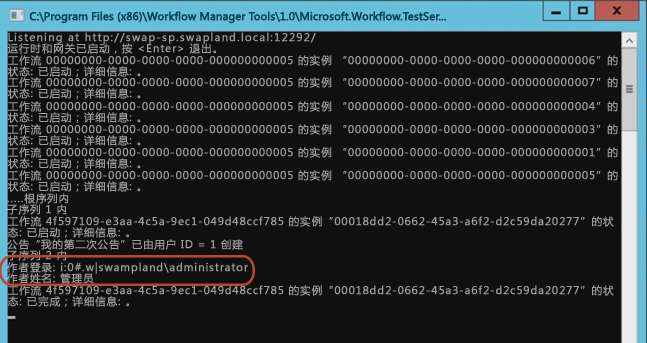
  
    
    

  
    
    

  
    
    

## 结论

本文首先介绍了当 SharePoint 2013 已经连接到工作流管理器服务器场时，可以使用 Visual Studio 2008 及更高版本为其创建的不同类型的工作流。接下来本文演示了如何创建一个工作流，不仅从触发工作流的列表项中收集值，还演示了如何执行常规任务，例如使用 **LookupSPUser** 活动获取用户的登录名和显示名称。此外，本文还探讨了使工作流保持条理以及使用注释添加评论的一些良好做法。
  
    
    

## 其他资源

-  [SharePoint 2013 中的工作流](workflows-in-sharepoint-2013.md)
    
  
-  [SharePoint 工作流开发最佳实践](sharepoint-workflow-development-best-practices.md)
    
  
-  [SharePoint 2013 工作流模板](sharepoint-2013-workflow-samples.md)
    
  

  
    
    

