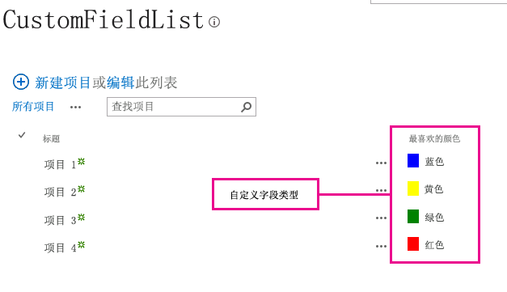
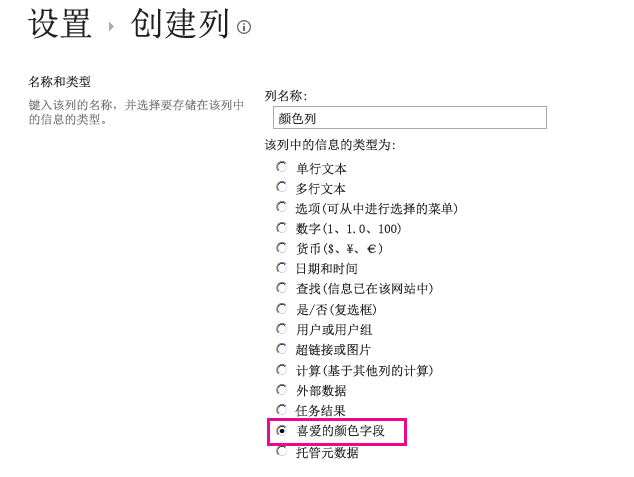

# 如何：使用客户端呈现自定义字段类型
了解如何使用 SharePoint 2013 中的客户端呈现技术来自定义域类型。
客户端呈现提供了一种机制，可用于为 SharePoint 页中承载的控件集生成您自己的输出。利用此机制，您可以使用已知的技术（如 HTML 和 JavaScript）定义自定义域类型的呈现逻辑。在客户端呈现中，您可以指定自己的 JavaScript 资源并在服务器场解决方案可用的数据存储选项（如 _layouts 文件夹）中承载这些资源。
  
    
    


## 使用本文中的示例的先决条件
<a name="SP15CustomizeafieldtypeusingCSR_Prereq"> </a>

若要按照此示例中的步骤操作，您需要：
  
    
    

- Microsoft Visual Studio 2012
    
  
- Visual Studio 2012 Office 开发人员工具
    
  
- SharePoint 2013 开发环境
    
  
有关设置您的 SharePoint 开发环境的信息，请参阅 [设置 SharePoint 2013 的常规开发环境](set-up-a-general-development-environment-for-sharepoint-2013.md)。
  
    
    

### 可帮助您了解域类型的客户端呈现的核心概念

下表列出了一些有价值的文章，这些文章可帮助您了解自定义操作方案中涉及的概念和步骤。
  
    
    

**表 1. 域类型的客户端呈现的核心概念**


|**文章标题**|**说明**|
|:-----|:-----|
| [在 SharePoint 2013 中生成场解决方案](build-farm-solutions-in-sharepoint-2013.md) <br/> |了解如何使用SharePoint 2013开发、打包和部署针对 服务器场解决方案 的管理扩展。  <br/> |
| [自定义域类型](http://msdn.microsoft.com/zh-cn/library/ms446361.aspx) <br/> |了解如何创建自定义域类型。由于您在 SharePoint 2013 中存储业务信息，因此，有时您的数据与 SharePoint Foundation 中可用的域类型不一致，或者您可能只是需要自定义这些域类型。自定义域可包含自定义数据验证和自定义域呈现。  <br/> |
   

## 代码示例：自定义视图窗体中的自定义域类型的呈现过程
<a name="SP15CustomizeafieldtypeusingCSR_Codeexample"> </a>

按照以下步骤操作可自定义自定义域类型的呈现过程：
  
    
    

1. 创建服务器场解决方案项目。
    
  
2. 为自定义域类型添加类。
    
  
3. 为自定义域类型添加 XML 定义。
    
  
4. 为自定义域类型的呈现逻辑添加 JavaScript 文件。
    
  
图 1 显示了带自定义呈现的域类型的视图窗体。
  
    
    

**图 1. 视图窗体中的自定义客户端呈现域**

  
    
    

  
    
    

  
    
    

### 创建服务器场解决方案项目


1. 以管理员身份打开 Visual Studio 2008（右键单击"开始"菜单中的 Visual Studio 2008 图标，然后选择"以管理员身份运行"。）
    
  
2. 使用"SharePoint 2013 项目"模板创建新的项目
    
    图 2 显示"SharePoint 2013 项目"模板在 Visual Studio 2008 中的位置，位于"模板"、"Visual C#"、"Office SharePoint"、"SharePoint 解决方案"的下方。
    

   **图 2. SharePoint 2013 项目 Visual Studio 模板**

  


  

  

  
3. 提供要用于调试的 SharePoint 网站的 URL。
    
  
4. 选择"部署为场解决方案"选项。
    
  

### 为自定义域类型添加类


1. 右键单击服务器场解决方案项目并添加新类。将类文件命名为 FavoriteColorFieldType.cs。
    
  
2. 复制以下代码并将其粘贴到 FavoriteColorFieldType.cs 文件中。该代码执行以下任务：
    
  - 声明从 **SPFieldText** 继承的 **FavoriteColorField** 类。
    
  
  - 为 **FavoriteColorField** 类提供两个构造函数。
    
  
  - 替代 **JSLink** 属性。
    
    > **注释**
      > 调查列表或事件列表不支持 JSLink 属性。SharePoint 日历是事件列表。 

  ```cs
  
using System;
using System.Collections.Generic;
using System.Linq;
using System.Text;
using System.Threading.Tasks;

// Additional references for this sample.
using Microsoft.SharePoint;
using Microsoft.SharePoint.WebControls;

namespace Microsoft.SDK.SharePoint.Samples.WebControls
{
    /// <summary>
    /// The FavoriteColorField custom field type 
    /// inherits from SPFieldText.
    /// Users can input the color in the field 
    /// just like in any other text field.
    /// But the field will provide additional 
    /// rendering logic when displaying 
    /// the field in a view form.
    /// </summary>
    public class FavoriteColorField : SPFieldText
    {
        // The solution deploys the JavaScript 
        // file to the CSRAssets folder 
        // in the WFE's layouts folder.
        private const string JSLinkUrl = 
            "~site/_layouts/15/CSRAssets/CSRFieldType.js";

        // You have to provide constructors for SPFieldText.
        public FavoriteColorField(
            SPFieldCollection fields, 
            string name) :
            base(fields, name)
        {

        }
        public FavoriteColorField(
            SPFieldCollection fields, 
            string typename, 
            string name) :
            base(fields, typename, name)
        {

        }

        /// <summary>
        /// Override the JSLink property to return the 
        /// value of our custom JavaScript file.
        /// </summary>
        public override string JSLink
        {
            get
            {
                return JSLinkUrl;
            }
            set
            {
                base.JSLink = value;
            }
        }
    }
}            

  ```


### 为自定义域类型添加 XML 定义


1. 右键单击服务器场解决方案项目，并添加 SharePoint 映射文件夹。在对话框中，选择 **{SharePointRoot}\\Template\\XML** 文件夹。
    
  
2. 右键单击在上一步中创建的 XML 文件夹，并添加一个新的 XML 文件。将该 XML 文件命名为 fldtypes_FavoriteColorFieldType.xml。
    
  
3. 复制以下标记并将其粘贴到该 XML 文件中。此标记执行以下任务：
    
  - 为域类型提供类型名称。
    
  
  - 指定域类型的完整类名称。这是您在上一过程中创建的类。
    
  
  - 为域类型提供其他属性。
    
  

  ```XML
  
<?xml version="1.0" encoding="utf-8" ?>
<FieldTypes>
  <FieldType>
    <Field Name="TypeName">FavoriteColorField</Field>
    <Field Name="TypeDisplayName">Favorite color field</Field>
    <Field Name="TypeShortDescription">Favorite color field</Field>
    <Field Name="FieldTypeClass">Microsoft.SDK.SharePoint.Samples.WebControls.FavoriteColorField, $SharePoint.Project.AssemblyFullName$</Field>
    <Field Name="ParentType">Text</Field>
    <Field Name="Sortable">TRUE</Field>
    <Field Name="Filterable">TRUE</Field>
    <Field Name="UserCreatable">TRUE</Field>
    <Field Name="ShowOnListCreate">TRUE</Field>
    <Field Name="ShowOnSurveyCreate">TRUE</Field>
    <Field Name="ShowOnDocumentLibrary">TRUE</Field>
    <Field Name="ShowOnColumnTemplateCreate">TRUE</Field>
  </FieldType>
</FieldTypes>
  ```


### 为自定义域类型的呈现逻辑添加 JavaScript 文件


1. 右键单击服务器场解决方案项目，并添加 SharePoint Layouts 映射文件夹。将一个新的 CSRAssets 文件夹添加到最近添加的 Layouts 文件夹中。
    
  
2. 右键单击您在上一步中创建的 CSRAssets 文件夹，并添加一个新的 JavaScript 文件。将该 JavaScript 文件命名为 CSRFieldType.js。
    
  
3. 复制以下代码并将其粘贴到 JavaScript 文件中。该代码执行以下任务：
    
  - 在视图窗体中显示域时，为域创建一个模板。
    
  
  - 注册该模板。
    
  
  - 在视图窗体中显示域类型时为其提供呈现逻辑。
    
  

  ```
  
(function () {
    var favoriteColorContext = {};

    // You can provide templates for:
    // View, DisplayForm, EditForm and NewForm
    favoriteColorContext.Templates = {};
    favoriteColorContext.Templates.Fields = {
        "FavoriteColorField": {
            "View": favoriteColorViewTemplate
        }
    };

    SPClientTemplates.TemplateManager.RegisterTemplateOverrides(
        favoriteColorContext
        );
})();

// The favoriteColorViewTemplate provides the rendering logic
// the custom field type when it is displayed in the view form.
function favoriteColorViewTemplate(ctx) {
    var color = ctx.CurrentItem[ctx.CurrentFieldSchema.Name];
    return "<span style='background-color : " + color +
        "' >&amp;nbsp;&amp;nbsp;&amp;nbsp;&amp;nbsp;</span>&amp;nbsp;" + color;
}
  ```


### 生成并运行解决方案


1. 按 F5 键。
    
    > **注释**
      > 在按 F5 时，Visual Studio 会生成解决方案，部署解决方案并打开在其中部署解决方案的 SharePoint 网站。 
2. 创建自定义列表并添加新的 Favorite Color Field 列。
    
  
3. 向列表添加一个项，并为 Favorite Color 列提供值。
    
  
4. 图 3 显示了带新的自定义域类型的创建列页。
    
   **图 3. 创建新的自定义域类型列**

  


  

  

  

****


|**问题**|**解决方案**|
|:-----|:-----|
|域类型 **FavoriteColorField** 未正确安装。请转到列表设置页以删除此域。 <br/> |从提升的命令提示符处执行以下命令： **iisreset /noforce** 。 <br/> > **警告**> 如果您将解决方案部署到生产环境，请等到合适的时间使用 **iisreset /noforce** 重置 Web 服务器。          |
   

## 后续步骤
<a name="SP15CustomizeafieldtypeusingCSR_Nextsteps"> </a>

本文说明了如何自定义自定义域类型的呈现过程。接下来，您可以了解有关自定义域类型的更多详细信息。若要了解更多信息，请参阅：
  
    
    

-  [如何：创建自定义字段类型](http://msdn.microsoft.com/zh-cn/library/bb862248.aspx)
    
  
-  [演练：创建自定义域类型](http://msdn.microsoft.com/zh-cn/library/bb861799.aspx)
    
  
-  [使用客户端呈现在 SharePoint 外接程序中自定义列表视图](http://msdn.microsoft.com/library/8d5cabb2-70d0-46a0-bfe0-9e21f8d67d86%28Office.15%29.aspx)
    
  

## 其他资源
<a name="SP15CustomizeafieldtypeusingCSR_AddResources"> </a>


-  [设置 SharePoint 2013 的常规开发环境](set-up-a-general-development-environment-for-sharepoint-2013.md)
    
  
-  [为 SharePoint 构建网站](build-sites-for-sharepoint.md)
    
  
-  [SharePoint 2013 中面向开发人员的新增功能](what’s-new-for-developers-in-sharepoint-2013.md)
    
  
-  [添加 SharePoint 2013 功能](add-sharepoint-2013-capabilities.md)
    
  
-  [在 SharePoint 2013 中生成场解决方案](build-farm-solutions-in-sharepoint-2013.md)
    
  
