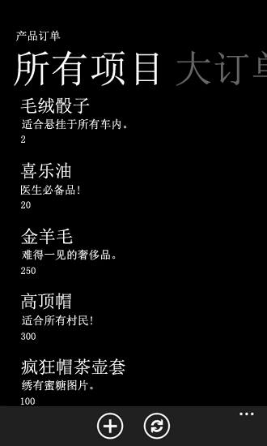
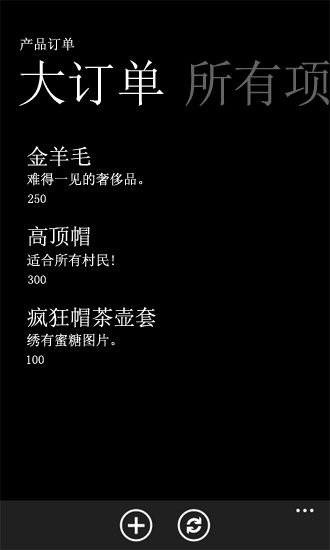

# 如何：为 Windows Phone 应用程序自定义列表项查询和筛选数据
自定义 Windows Phone 应用程序视图所基于的数据查询。
在使用 Windows Phone SharePoint 列表应用程序模板创建项目后，开发人员可以利用模板中实现的设计模式自定义 Windows Phone 应用程序的数据层部分。Windows Phone 应用程序中 SharePoint 列表的视图可以在 Microsoft SharePoint Server 中配置并直接包含在手机上的应用程序中，也可以为应用程序创建一个自定义视图。
  
    
    


> **重要信息**
> 如果您正在开发适用于 Windows Phone 8 的应用程序，则必须使用 Visual Studio Express 2012（而非 Visual Studio 2010 Express）。除开发环境以外，本文中的所有信息均适用于 Windows Phone 8 和 Windows Phone 7。 > 有关详细信息，请参阅 [如何：设置用于为 SharePoint 开发移动应用程序的环境](how-to-set-up-an-environment-for-developing-mobile-apps-for-sharepoint.md)。 
  
    
    


## 在服务器上配置列表视图以在 Windows Phone 应用程序中使用。
<a name="BKMK_ConfiguringLists"> </a>

当使用 Windows Phone SharePoint 列表应用程序模板为 Windows Phone 创建一个 SharePoint 列表应用程序时，您可以选择在您的应用程序中包含与目标 SharePoint 列表相关联的任何现有视图。筛选在手机上显示的 SharePoint 列表中项目的一种方法是：在服务器上配置列表的一个筛选视图，然后选择要包含在您的 Windows Phone 应用程序中的视图。对于包含为服务器上的视图配置的筛选条件的选定视图，Windows Phone SharePoint 列表应用程序模板向导会生成一个协作应用程序标记语言 (CAML) 查询。例如，您的服务器上可能有一个基于任务列表模板的列表。您可以为名为"假日聚会"的列表创建一个视图，其中只包含与计划公司假期聚会有关的项目（例如，通过添加一个筛选条件，使仅当"说明"字段包含"假期"或"聚会"文字时显示列表项）。在 Windows Phone 应用程序中，为该视图生成的 CAML 标记类似于以下所示（具体取决于您的应用程序中选择包含的字段）。
  
    
    

```XML

<View>
    <Query>
        <Where>
            <Or>
                <Contains>
                    <FieldRef Name='Body' />
                    <Value Type='Note'>holiday</Value>
                </Contains>
                <Contains>
                    <FieldRef Name='Body' />
                    <Value Type='Note'>party</Value>
                </Contains>
            </Or>
        </Where>
    </Query>
    <RowLimit>30</RowLimit>
    <ViewFields>
        <FieldRef Name='Title'/>
        <FieldRef Name='Body'/>
        <FieldRef Name='AssignedTo'/>
        <FieldRef Name='Status'/>
        <FieldRef Name='PercentComplete'/>
        <FieldRef Name='StartDate'/>
        <FieldRef Name='DueDate'/>
        <FieldRef Name='Checkmark'/>
    </ViewFields>
</View>
```

与您创建项目时选择包含在 Windows Phone 应用程序中的任务列表的其他现有视图一样，对应于所选视图的 **PivotItem** 控件会添加到构成应用程序的主用户界面 (UI) 元素的 **Pivot** 控件。
  
    
    

## 自定义 Windows Phone 应用程序中的列表视图查询
<a name="BKMK_CustomizingLists"> </a>

无论出于何种原因，对服务器上的给定列表配置满足您的所有设计需要的视图都是不大可能或不合理的。在使用 Windows Phone SharePoint 列表应用程序模板创建的一个 Microsoft Visual Studio 项目中，可被称为数据层 的各方面主要通过项目中的 ListDataProvider.cs 文件供开发人员使用。您可以修改为现有视图定义的 CAML，或者为 ListDataProvider.cs 文件中的新视图添加 CAML 查询。
  
    
    

### ListDataProvider.cs 文件

在基于 Windows Phone SharePoint 列表应用程序模板的项目中，ListDataProvider.cs 文件定义为访问和配置 SharePoint 列表作为 Windows Phone 应用程序中的视图的数据源提供的对象。在 List.xaml 文件中，它定义应用程序的应用程序主页，并使用分配给它的 **LoadedPivotItem** 事件的事件处理程序声明一个 **Pivot** 控件（它本身包含子 **PivotItem** 控件）。当在应用程序的主应用程序页面上加载 **PivotItem** 控件（用作 Windows Phone 应用程序中的列表项的呈现容器）时，最终会调用 ListDataProvider.cs 文件中的 **LoadDataFromServer** 方法。
  
    
    

1. 与给定列表视图相关联的 **PivotItem** 加载到 UI 中。
    
  
2. 在 List.xaml.cs 文件中， **LoadedPivotItem** 事件的处理程序调用在 ListViewModel.cs 文件中实现的 **LoadData** 方法，从而传递已完成加载的 **PivotItem** 控件的名称。（在基于 Windows Phone SharePoint 列表应用程序模板的项目设计中，给定 **PivotItem** 控件的名称被设置为与在 ListViewModel.cs 的 **CamlQueryBuilder** 类中定义的 **ViewXmls** **Dictionary** 类型控件相关联的视图的 CAML 查询字符串的密钥值相同。）
    
  
3. ListViewModel.cs 中的 **LoadData** 方法 调用在 ListDataProvider.cs 文件中实现的 **LoadData** 方法。
    
  
4. ListDataProvider.cs 中的 **LoadData** 方法调用在同一文件中实现的 **LoadDataFromServer** 方法。然后， **LoadDataFromServer** 方法执行下列操作：
    
1. 获取与给定视图相关联的 CAML 查询字符串。
    
  ```cs
  
CamlQuery query = CamlQueryBuilder.GetCamlQuery(ViewName);
  ```

2. 注册到要检索列表的客户端对象模型。
    
  ```cs
  ListItemCollection items = Context.Web.Lists.GetByTitle(ListTitle).GetItems(query);
  ```

3. 指示客户端对象模型应返回列表项和这些列表项的字段（作为文本值）。
    
  ```cs
  Context.Load(items);
Context.Load(items, listItems => listItems.Include(item => item.FieldValuesAsText));
  ```

4. 调用 **ExecuteQueryAsync** 向 SharePoint Server 发送请求并检索数据（异步）。
    
  

  
    
    

## 添加自定义列表视图查询和相应的 UI 元素
<a name="BKMK_AddingCustomizations"> </a>

在您自己的项目中，您可以利用数据层的设计方式来添加自己的自定义 CAML 查询字符串和列表视图。
  
    
    
在以下代码示例中，再次假定 SharePoint Server 的目标安装具有使用"自定义列表"模板创建的"产品订单数"列表，并按照主题 [如何：在针对 Windows Phone 的 SharePoint 2013 应用程序中实现业务逻辑和数据验证](how-to-implement-business-logic-and-data-validation-in-a-windows-phone-app-for-s.md)的 表 1 中的字段和类型对该列表进行配置。创建一个基于 Windows Phone SharePoint 列表应用程序模板的项目，其中使用与"产品订单书"列表类似的列表作为源（如 [如何：创建 Windows Phone SharePoint 2013 列表应用程序](how-to-create-a-windows-phone-sharepoint-2013-list-app.md)中所述）。对于此示例，我们将一个自定义视图添加到 Windows Phone 应用程序（而不是添加到服务器上的列表中），并进行筛选以只显示订购数量是 100 或更多的那些产品订单。
  
    
    

### 添加自定义查询和视图


1. 在"解决方案资源管理器"中，双击 ListDataProvider.cs 文件（或选择文件并按 F7）打开文件以供编辑。
    
  
2. 更新静态 **CamlQueryBuilder** 类中 **ViewXmls** **Dictionary** 类型的定义以包含一个额外的 CAML 查询，其中使用 WHERE 子句操作适当的筛选条件。
    
  ```cs
  
static Dictionary<string, string> ViewXmls = new Dictionary<string, string>()
{   
    {"View1",   @"<View><Query><OrderBy><FieldRef Name='ID'/>
        </OrderBy></Query><RowLimit>30</RowLimit><ViewFields>{0}</ViewFields></View>"},
    {"View2",   @"<View><Query><OrderBy><FieldRef Name='ID' /></OrderBy>
     <Where><Geq><FieldRef Name='Quantity' />
          <ValueType='Number'>100</Value>
                </Geq></Where>
             </Query><RowLimit>30</RowLimit>
               <ViewFields>{0}</ViewFields></View>"}
};
  ```

3. 双击打开 List.xaml 文件以供编辑。
    
  
4. 添加标记以在 **Pivot** 主控件中定义一个额外的 **PivotItem** 子控件。在其中定义应用程序主页的 UI 元素的 **Grid** 元素的声明方式应类似于以下代码。
    
  ```XML
  
<Grid x:Name="LayoutRoot" Background="Transparent"
 xmlns:x="http://schemas.microsoft.com/winfx/2006/xaml" 
 xmlns:controls="clr-namespace:Microsoft.Phone.Controls;assembly=Microsoft.Phone.Controls">
    <!--Pivot Control-->
    <ProgressBar x:Name="progressBar" Opacity="1" HorizontalAlignment="Center" 
     VerticalAlignment="Top" Height="30" Width="470" IsIndeterminate="{Binding IsBusy}" 
     Visibility="{Binding ShowIfBusy}" />
    <Grid x:Name="ContentPanel" Grid.Row="0" Width="470">
        <controls:Pivot Name="Views" Title="Product Orders" LoadedPivotItem="OnPivotItemLoaded">
            <!--Pivot item-->
            <controls:PivotItem Name="View1" Header="All Items">
                <!--Double line list with text wrapping-->
                <ListBox x:Name="lstBox1" Margin="0,0,-12,0" SelectionChanged="OnSelectionChanged" 
                 ItemsSource="{Binding [View1]}">
                    <ListBox.ItemTemplate>
                        <DataTemplate>
                            <StackPanel Orientation="Vertical" Margin="10">
                                <TextBlock Name="txtTitle" Text="{Binding [Title]}" 
                                 TextWrapping="NoWrap" Style="{StaticResource PhoneTextTitle2Style}" />
                                <TextBlock Name="txtDescription" Text="{Binding [Description]}" 
                                 TextWrapping="NoWrap" Style="{StaticResource PhoneTextNormalStyle}" />
                                <TextBlock Name="txtQuantity" Text="{Binding [Quantity]}" 
                                 TextWrapping="NoWrap" Style="{StaticResource PhoneTextNormalStyle}" />
                            </StackPanel>
                        </DataTemplate>
                    </ListBox.ItemTemplate>
                </ListBox>                    
            </controls:PivotItem>
            
            <!--Added PivotItem control for customized view--><controls:PivotItem Name="View2" Header="Big Orders"><!--Double line list with text wrapping--><ListBox x:Name="lstBox2" Margin="0,0,-12,0" 
                 SelectionChanged="OnSelectionChanged" ItemsSource="{Binding [View2]}"><ListBox.ItemTemplate><DataTemplate><StackPanel Orientation="Vertical" Margin="10"><TextBlock Name="txtTitle" Text="{Binding [Title]}" 
                                 TextWrapping="NoWrap" Style="{StaticResource PhoneTextTitle2Style}" /><TextBlock Name="txtDescription" Text="{Binding [Description]}" 
                                 TextWrapping="NoWrap" Style="{StaticResource PhoneTextNormalStyle}" /><TextBlock Name="txtQuantity" Text="{Binding [Quantity]}" 
                                 TextWrapping="NoWrap" Style="{StaticResource PhoneTextNormalStyle}" /></StackPanel></DataTemplate></ListBox.ItemTemplate></ListBox></controls:PivotItem>

        </controls:Pivot>
    </Grid>
</Grid>
  ```


    > **注释**
      >  特别是， **PivotItem** 控件的 **Name** 属性（"视图2"）的值与添加到在步骤 2 中定义的 **Dictionary** 类型的条目的键值相同。此值用于标识用来检索要在 **PivotItem** 中显示的数据的适当 CAML 查询。另请注意，此处声明的 **ListBox**（名为"lstBox2"，仅用于将其与默认视图的 **ListBox** 区别开来）也绑定到视图。

    
    
  
当您启动项目（通过按 F5）时，应用程序的 **Pivot** 控件包括两个 **PivotItem** 控件以及由与它们各自的视图相关联的 CAML 查询检索的数据。默认的"所有项目"视图显示所有订单，如图 1 中所示（带有示例数据）。
  
    
    

**图 1. 示例列表中的所有订单（列表项）**

  
    
    

  
    
    

  
    
    
前面的过程中定义的定义视图显示了经过筛选的项列表，其中只包含指定数量为 100 或以上的订单，如图 2 所示。
  
    
    

**图 2. 仅大订单**

  
    
    

  
    
    

  
    
    
对视图所基于的 CAML 查询和与视图相关联的 UI 元素，您都可以进行许多其他自定义。
  
    
    

## 其他资源
<a name="SP15Custlistitem_addlresources"> </a>


-  [构建访问 SharePoint 2013 的 Windows Phone 应用程序](build-windows-phone-apps-that-access-sharepoint-2013.md)
    
  
-  [协作应用程序标记语言 (CAML) 简介](http://msdn.microsoft.com/zh-cn/library/ms426449.aspx)
    
  
-  [如何：设置用于为 SharePoint 开发移动应用程序的环境](how-to-set-up-an-environment-for-developing-mobile-apps-for-sharepoint.md)
    
  
-  [Windows Phone SDK 2.0](http://www.microsoft.com/zh-cn/download/details.aspx?id=35471)
    
  
-  [适用于 Windows Phone 8 的 Microsoft SharePoint SDK](http://www.microsoft.com/zh-cn/download/details.aspx?id=36818)
    
  
-  [Windows Phone 软件开发工具包 (SDK) 7.1](http://www.microsoft.com/zh-cn/download/details.aspx?id=27570)
    
  
-  [Microsoft SharePoint SDK for Windows Phone 7.1](http://www.microsoft.com/en-us/download/details.aspx?id=30476)（http://www.microsoft.com/en-us/download/details.aspx?id=30476）
    
  

