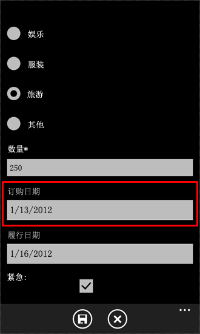
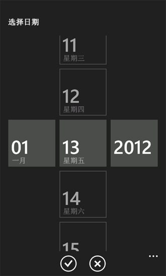

# 如何：自定义针对 Windows Phone 的 SharePoint 2013 列表应用程序的用户界面
自定义由 Windows Phone SharePoint 列表应用程序模板生成的 Windows Phone 用户界面。
使用 Windows Phone SharePoint 列表应用程序模板创建的 SharePoint 列表应用程序基于 Windows Phone 框架的 Silverlight。Windows Phone 上的 Silverlight 平台提供的所有功能都可供开发人员用来为针对 Windows Phone 设计的 SharePoint 列表应用程序自定义用户界面 (UI)。
  
    
    


> **重要信息**
> 如果您正在开发适用于 Windows Phone 8 的应用程序，则必须使用 Visual Studio Express 2012（而非 Visual Studio 2010 Express）。除开发环境以外，本文中的所有信息均适用于 Windows Phone 8 和 Windows Phone 7。 > 有关详细信息，请参阅 [如何：设置用于为 SharePoint 开发移动应用程序的环境](how-to-set-up-an-environment-for-developing-mobile-apps-for-sharepoint.md)。 
  
    
    


## 为用户界面自定义创建 SharePoint 列表应用程序
<a name="BKMK_CreatingSPListApp"> </a>

对于下列过程，假定运行 SharePoint Server 的服务器有一个使用"自定义列表"模板创建的"产品订单数"列表，该列表类似于在 [如何：在针对 Windows Phone 的 SharePoint 2013 应用程序中实现业务逻辑和数据验证](how-to-implement-business-logic-and-data-validation-in-a-windows-phone-app-for-s.md)中使用的"产品订单数"列表示例。对于本主题中使用的 Windows Phone 应用程序示例，应用程序所基于的"产品订单数"列表已修改以包含其他字段。用于本主题中示例的修改过的"产品订单数"列表已使用表 1 中所示的列和字段类型创建。
  
    
    

**表 1. 修改过的"产品订单数"列表**


|**列**|**类型**|**必需**|
|:-----|:-----|:-----|
|产品（例如标题）  <br/> |单行文本（文本）  <br/> |是  <br/> |
|说明  <br/> |单行文本（文本）  <br/> |否  <br/> |
|产品类别  <br/> |选择  <br/> |否  <br/> |
|数量  <br/> |编号  <br/> |是  <br/> |
|订单日期  <br/> |日期和时间 (Datetime)  <br/> |否  <br/> |
|完成时间  <br/> |日期和时间 (Datetime)  <br/> |否  <br/> |
|Rush  <br/> |布尔值  <br/> |否  <br/> |
|联系人号码  <br/> |单行文本（文本）  <br/> |否  <br/> |
   
按照 [如何：创建 Windows Phone SharePoint 2013 列表应用程序](how-to-create-a-windows-phone-sharepoint-2013-list-app.md)的过程来使用 Windows Phone SharePoint 列表应用程序模板生成一个 SharePoint 列表应用程序，并将此应用程序用作以下用户界面自定义的起始点。为应用程序列表指定目标 SharePoint 列表，该列表的架构与表 1 所示的架构类似。
  
    
    

## 用 DatePicker 控件替换 TextBox 控件
<a name="BKMK_ReplacingControls"> </a>

列表中的字段是基于模板生成的，并且默认情况下将这些字段指定为 **DateTime** 字段（例如示例"产品订单数"列表中的 **Order Date** 字段）绑定到应用程序中的编辑窗体 (EditForm.xaml) 和新窗体 (NewForm.xaml) 中的 **TextBox** 控件上。对用户界面的第一个改进是为了便于通过将与这些字段相关联的 **TextBox** 控件替换为 [Silverlight for Windows Phone Toolkit](http://silverlight.codeplex.com/releases/view/75888) (http://silverlight.codeplex.com/releases/view/75888) 的 **DatePicker** 控件来输入日期值。您可以从开源软件项目托管网站 [CodePlex Website](http://www.codeplex.com/)（http://www.codeplex.com/）下载 Silverlight for Windows Phone Toolkit 并安装它。
  
    
    

### 将 TextBox 控件替换为 DatePicker 控件


1. 在 Microsoft Visual Studio 2010 中，如果项目尚未打开，打开您在上一节中创建的项目，该项目基于 Windows Phone SharePoint 列表应用程序模板并使用 SharePoint 列表，其中该列表类似于表 1 中所示的"产品订单数"列表。
    
  
2. 在 Visual Studio 中的"项目"菜单中，单击"添加引用"，会出现"添加引用"对话框。
    
  
3. 在"浏览"选项卡中，导航到由 Silverlight for Windows Phone Toolkit 安装的 Microsoft.Phone.Controls.Toolkit.dll 程序集。
    
    > **注释**
      > 在工具包的标准安装下的 %PROGRAMFILES%(x86)\\Microsoft SDKs\\Windows Phone\\v7.1\\Toolkit\\< *MonthYear*  >\\Bin 中可以找到 Microsoft.Phone.Controls.Toolkit.dll 程序集，其中 < *MonthYear*  > 可能类似"Oct11"，具体取决于安装的工具包的版本。（也可以通过以下方式找到工具包在您的系统上安装的程序集：单击"开始"按钮，指向"所有程序"，展开"程序"菜单中的"Microsoft Silverlight for Windows Phone Toolkit"项目，然后单击"二进制文件"。）
4. 在"解决方案资源管理器"中，选择"视图"节点下的 EditForm.xaml 文件。
    
  
5. 按 Shift + F7 （或者双击该文件）在设计器中打开文件。
    
  
6. 在设计器的 XAML 窗格中，将用于区分工具包程序集中的控件的命名空间声明添加到  `<phone:PhoneApplicationPage>` 标记。
    
  ```
  
<phone:PhoneApplicationPage
    x:Class="ContosoSPListApp.EditForm"
    xmlns="http://schemas.microsoft.com/winfx/2006/xaml/presentation"
    xmlns:x="http://schemas.microsoft.com/winfx/2006/xaml"
    xmlns:phone="clr-namespace:Microsoft.Phone.Controls;assembly=Microsoft.Phone"
    xmlns:toolkit="clr-namespace:Microsoft.Phone.Controls;assembly=Microsoft.Phone.Controls.Toolkit"
    xmlns:shell="clr-namespace:Microsoft.Phone.Shell;assembly=Microsoft.Phone"
    xmlns:d="http://schemas.microsoft.com/expression/blend/2008"
    xmlns:mc="http://schemas.openxmlformats.org/markup-compatibility/2006"
    mc:Ignorable="d" d:DesignWidth="480" d:DesignHeight="696"
    FontFamily="{StaticResource PhoneFontFamilyNormal}"
    FontSize="{StaticResource PhoneFontSizeNormal}"
    Foreground="{StaticResource PhoneForegroundBrush}"
    SupportedOrientations="Portrait" Orientation="Portrait"
    shell:SystemTray.IsVisible="True" x:Name = "EditPage">
  ```


    对由模板生成的默认标记的唯一更改是增加"xmlns:toolkit"命名空间指定。此外，请注意此处 **Class** 的属性值取决于您的项目名称。"ContosoSPListApp"是此示例项目的名称。您的项目中此属性的值与此处由您的项目名称决定的值有所不同。
    
  
7. 在 EditForm.xaml 文件中，找到包含与 **Order Date** 字段（此字段在 XML 架构中被指定为"Order_x0020_Date"）相关联的控件的标记中的 **StackPanel** 控件。默认情况下，该模板为 **DateTime** 字段生成一个 **TextBox** 控件和两个 **TextBlock** 控件。用于 **StackPanel** 控件以及它所包含的控件的标记应类似于以下标记。
    
  ```
  
<StackPanel Orientation="Vertical" Margin="0,5,0,5">
    <TextBlock TextWrapping="Wrap" HorizontalAlignment="Left" 
             Style="{StaticResource PhoneTextNormalStyle}">Order Date</TextBlock>
    <TextBox Height="Auto" Style="{StaticResource TextValidationTemplate}" 
                FontSize="{StaticResource PhoneFontSizeNormal}" Width="470" 
                HorizontalAlignment="Left" Name="txtOrder_x0020_Date" 
                Text="{Binding [Order_x0020_Date], Mode=TwoWay, ValidatesOnNotifyDataErrors=True,
                NotifyOnValidationError=True}" TextWrapping="Wrap" />
    <TextBlock FontSize="16" TextWrapping="Wrap" HorizontalAlignment="Left" Style="{StaticResource PhoneTextSubtleStyle}" Text="{Binding DateTimeFormat}" />
</StackPanel>
  ```

8. 将 **StackPanel** 控件和它包含的控件替换为以下标记。
    
  ```
  
<StackPanel Orientation="Vertical" Margin="0,5,0,5">
    <toolkit:DatePicker Header="Order Date" Value="{Binding [Order_x0020_Date], Mode=TwoWay}">
              </toolkit:DatePicker>
</StackPanel>
  ```

9. 接下来（仍在 EditForm.xaml 中），在包含与 Fulfillment Date 字段（在此字段的架构中被指定为"Fulfillment_x0020_Date"）相关联的控件的标记中找到 **StackPanel** 控件。用于 **StackPanel** 和它包含的控件的标记应类似于以下标记。
    
  ```
  
<StackPanel Orientation="Vertical" Margin="0,5,0,5">
    <TextBlock TextWrapping="Wrap" HorizontalAlignment="Left" Style="{StaticResource PhoneTextNormalStyle}">Fulfillment Date</TextBlock>
    <TextBox Height="Auto" Style="{StaticResource TextValidationTemplate}" 
           FontSize="{StaticResource PhoneFontSizeNormal}" Width="470" HorizontalAlignment="Left"
           Name="txtFulfillment_x0020_Date" Text="{Binding [Fulfillment_x0020_Date], 
           Mode=TwoWay, ValidatesOnNotifyDataErrors=True, NotifyOnValidationError=True}" 
           TextWrapping="Wrap" />
    <TextBlock FontSize="16" TextWrapping="Wrap" HorizontalAlignment="Left" 
          Style="{StaticResource PhoneTextSubtleStyle}" Text="{Binding DateTimeFormat}" />
</StackPanel>
  ```

10. 将 **StackPanel** 控件和它包含的控件替换为以下标记。
    
  ```
  
<StackPanel Orientation="Vertical" Margin="0,5,0,5">
    <toolkit:DatePicker Header="Fulfillment Date" Value="{Binding [Fulfillment_x0020_Date], Mode=TwoWay}"></toolkit:DatePicker>
</StackPanel>
  ```

11. 最后，您可以将 Silverlight for Windows Phone Toolkit 的用户界面图标图像添加到您的项目。在"解决方案资源管理器"中，选择表示该项目的节点（例如，名为"ContosoSPListApp"的节点）。
    
  
12. 在 Visual Studio 中的"项目"菜单中，单击"新建文件夹"。在项目节点下会添加一个新文件夹。将该文件夹命名为"Toolkit.Content"。
    
  
13. 在"解决方案资源管理器"中，选择您在前面步骤中创建的文件夹。
    
  
14. 在"项目"菜单上，单击"添加现有项"，会打开一个"文件浏览器"窗口。
    
  
15. 导航到包含由 Silverlight for Windows Phone Toolkit 安装的支持图标图像、ApplicationBar.Cancel.png 和 ApplicationBar.Check.png 的文件夹。
    
    > **注释**
      > 图像位于工具包标准安装的 %PROGRAMFILES%(x86)\\Microsoft SDKs\\Windows Phone\\v7.1\\Toolkit\\< *MonthYear*  >\\Bin\\Icons 中，其中 < *MonthYear*  > 可能有点类似于"Oct11"，这取决于安装的 Toolkit 版本。
16. 选择这两个图像，然后单击"添加"。图像文件会添加到项目中的"Toolkit.Content"[###Toolkit.Content]文件夹节点下。
    
    > **重要信息**
      > 为了使 Silverlight for Windows Phone Toolkit 的组件能够使用图标图像，必须将它们放置在前面步骤中指定的您的项目中的位置。 
17. 在"解决方案资源管理器"中，选择"Toolkit.Content"[###Toolkit.Content]文件夹下的两个图像文件。
    
  
18. 在"属性窗口"中，将图像的 **生成操作** 属性设置为"Content"，将"复制到输出目录"属性设置为"如果较新则复制"。
    
    > **注释**
      > 如果"属性窗口不可见，请按 CTRL + W ，然后按 P 来显示 Visual Studio 中的窗口。 
如果您启动项目（通过按 F5）以将它部署到 Windows Phone Emulator 上，您可以导航到项目的"编辑"窗体（通过单击"列表视图"主页中的项目，然后单击应用程序中"应用程序栏"上的"编辑"按钮）。此时，窗体中的 **DateTime** 字段与 **DatePicker** 控件相关联，如图 1 所示。
  
    
    

**图 1. 具有 DatePicker 控件的编辑窗体**

  
    
    

  
    
    

  
    
    
 **DatePicker** 控件（在图 1 中为 **Order Date** 字段突出显示）的外观与使用相关联的 **TextBlock** 作为标签的 **TextBox** 控件极为相似，区别只在于当单击 **DatePicker** 控件（或在 Windows Phone 上点击它）时，该控件显示一个单独的页面，其中带有用手势选择日期的控件，如图 2 所示。
  
    
    

**图 2. 日期选取器页面**

  
    
    

  
    
    

  
    
    
单击"完成"按钮会将选择的日期传递给"编辑"窗体上的 **DatePicker** 控件。然后，如果您单击该窗体上的"保存"按钮，会更新服务器上的 SharePoint 列表中与 **DatePicker** 控件相关联的 **DateTime** 字段，因为在前面的过程中控件的 **Value** 属性已绑定到 EditForm.xaml 文件中的相应字段。如果您还想将新窗体中的 **TextBox** 控件替换为 **DatePicker** 控件，那么需要对项目中的 NewForm.xaml 文件重复步骤 4 - 10。
  
    
    

## 添加控件以支持选项字段的自定义填充选项
<a name="BKMK_AddingControlsForChoiceFields"> </a>

除了在服务器上定义时可将声明过的选择值指定给选项字段以外，还可以在 SharePoint 服务器上将使用 SharePoint 列表中的选项字段类型指定的字段配置为允许用户为字段指定自定义（或"填充"）选项值。在使用 Windows Phone SharePoint 列表应用程序模板创建的项目中，默认情况下，呈现的选项字段不包含对输入"填充"选项的 UI 支持。在本节的过程中，您要将 UI 控件和代码添加到应用程序以支持为"产品类别"字段输入自定义选项值。
  
    
    
在下列过程中，您将能够：
  
    
    

- 添加一个具有转换逻辑的类 ( **ContosoConverter**)，来处理要保存到"产品类别"字段中的数据。
    
  
- 向 **EditItemViewModel** 类添加一个属性成员 ( **OtherCategoryValue**)，其中提供了对代表选项字段的"填充"值的字符串的访问。该属性成员将用作"编辑"窗体上添加的 **TextBox** 控件的 Binding 声明的源。
    
  
- 向"编辑"窗体添加一个 **RadioButton** 控件和一个 **TextBox** 控件，以便用户能够指定"产品类别"字段的"填充"选项值。
    
  
- 修改与"编辑"窗体相关联的代码隐藏文件 EditForm.xaml.cs，以便为选项字段注册一个编辑字段值转换器 **set** 函数，并为添加到"编辑"窗体的控件实现处理程序。
    
  

> **注释**
> 有关字段值转换器的更多详细信息，请参阅  [如何：为 Windows Phone 应用程序支持和转换 SharePoint 2013 字段类型](how-to-support-and-convert-sharepoint-2013-field-types-for-windows-phone-apps.md)。 
  
    
    


  
    
    

### 添加类以支持选项字段的数据转换


1. 在"解决方案资源管理器"中，选择代表项目的节点（例如，名为 ContosoSPListApp 的节点）。
    
  
2. 在 Visual Studio（或 Visual Studio Express for Windows Phone）下的"项目"菜单中，单击"添加类"。将打开"添加新项"对话框，其中 C#"类"模板已选中。
    
  
3. 对类文件（如 ContosoConverter.cs）进行命名，然后单击"添加"。该项目将添加到类文件中，并处于打开状态以供编辑。
    
  
4. 用以下代码替换文件的内容。
    
  ```cs
  
using System;
using System.Net;
using System.Windows;
using System.Collections.ObjectModel;
using Microsoft.SharePoint.Phone.Application;
using Microsoft.SharePoint.Client;

namespace SPListAppUICustomization
{
    public class ContosoConverter
    {
        // Edit Field Value Converter SET function for Choice fields.
        public static void SetConvertedChoiceEditFieldValue(string fieldName, object fieldValue, 
                                        ListItem item, ConversionContext context, string customCategory)
        {
            ObservableCollection<ChoiceFieldViewModel> choices = fieldValue as
                                                   ObservableCollection<ChoiceFieldViewModel>;
               bool isCustomValue = true;

            string specifiedChoice = string.Empty;

            if (choices != null)
            {
                foreach (ChoiceFieldViewModel choiceItem in choices)
                {
                    if ((choiceItem.IsChecked == true) || (choiceItem.Name.Equals(customCategory, 
                                                             StringComparison.CurrentCultureIgnoreCase)))
                    {
                        specifiedChoice = choiceItem.Name;
                        isCustomValue = false;
                        break;
                    }
                }

                if (isCustomValue == true)
                {
                    specifiedChoice = customCategory;
                }
            }
            else
            {
                specifiedChoice = customCategory;
            }

            item[fieldName] = specifiedChoice;
        }
    }
}
  ```

5. 保存该文件。
    
  
此处 **SetConvertedChoiceEditFieldValue** 函数用来实现为应用程序中的选项字段注册的编辑字段值转换器 **set** 函数代理。该函数会遍历 **ChoiceFieldViewModel** 对象集，其中的对象是作为 **fieldValue** 参数进行传递的。 **ChoiceFieldViewModel** 对象用来代表项目中选项字段的单个值，其中该项目是基于 Windows Phone SharePoint 列表应用程序模板开发的。每个对象都有一个 **Name** 属性，用来表示一个给定的选项，还有一个布尔属性 ( **IsChecked**)，用以表明给定的选项值（这些值可用于定义的字段）是否为对该字段指定的值。 **SetConvertedChoiceEditFieldValue** 函数确定集合中的 **ChoiceFieldViewModel** 对象是否选中，或者对象的 **Name** 属性与"产品类别"字段的指定自定义值是否匹配。如果是，则 **ChoiceFieldViewModel** 的 **Name** 属性用于为字段赋值。否则，将一个指定的自定义值（来自于 **customCategory** 参数）设置为该字段的值。
  
    
    
接着，将一个属性成员添加到 **EditItemViewModel** 类，该类提供了对选项字段的"填充"值的访问（当选项字段的指定值是服务器上为该字段定义的可用选项之一时，该值为一个空字符串）。
  
    
    

### 向 EditItemViewModel 类添加属性成员


1. 在"解决方案资源管理器"中的"视图模板"文件夹节点下，选择 EditItemViewModel.cs 文件。
    
  
2. 按 F7 （或双击该文件）打开文件以供编辑。
    
  
3. 在文件中的默认 **using** 指令后，添加以下指令。
    
  ```cs
  
using System.Collections.ObjectModel;
  ```

4. 在实现 **EditItemViewModel** 类的代码块（由成对的括号限定）中，将属性成员（即 **OtherCategoryValue**）的以下实现添加到文件中。
    
  ```cs
  public string OtherCategoryValue
{
    get
    {
        string specifiedCategory = string.Empty;

        // See if specified Choice field value is one of the available values
        // from the List ViewModel. If it is, return an empty string.
        ObservableCollection<ChoiceFieldViewModel> choicesCollection = this["Product_x0020_Category"] as
                                               ObservableCollection<ChoiceFieldViewModel>;
        if (choicesCollection != null &amp;&amp; choicesCollection.Any(choice => choice.IsChecked))
        {
            return specifiedCategory;
        }

        // If Choice field value is not one of the values from the List ViewModel,
        // get the value from the underlying list item and return value as string.
        specifiedCategory = SharePointListItem.FieldValuesAsText["Product_x0020_Category"];
        return specifiedCategory;
    }
}
  ```

5. 保存该文件。
    
  
接着，您需要向"编辑"窗体添加并配置控件，以支持输入"产品类别"字段的自定义值。
  
    
    

### 添加和配置 UI 控件以输入自定义选项字段值


1. 在"解决方案资源管理器"中，选择"视图"文件夹节点下的 EditForm.xaml 文件。
    
  
2. 按 Shift + F7 （或者双击该文件）在设计器中打开文件。
    
  
3. 定位到 **StackPanel** 控件，该控件包含一些控件（ **TextBlock** 控件和 **ListBox** 控件）且用于呈现"产品订单数"SharePoint 列表的"产品类别"字段。将一个 **RadioButton** 控件和另一个 **TextBox** 控件添加到 **StackPanel** 容器并进行配置，如以下代码所示。
    
  ```
  
<StackPanel Orientation="Vertical" Margin="0,5,0,5">
    <TextBlock TextWrapping="Wrap" HorizontalAlignment="Left" Style="{StaticResource PhoneTextNormalStyle}">
                                                                    Product Category</TextBlock>
    <ListBox MaxHeight="400" Width="Auto" x:Name="lstBoxProduct_x0020_Category" 
                                             ItemsSource="{Binding [Product_x0020_Category]}">
        <ListBox.ItemTemplate>
            <DataTemplate>
                <RadioButton FontSize="{StaticResource PhoneFontSizeNormal}" HorizontalAlignment="Left" 
                               GroupName="Product_x0020_Category" Content="{Binding Name}" 
                                  IsChecked="{Binding IsChecked, Mode=TwoWay}" />
            </DataTemplate>
        </ListBox.ItemTemplate>
    </ListBox>
    <!-- The following two controls added to support UI Customization for Choice field. -->
    <RadioButton x:Name="rbOtherCategory" FontSize="{StaticResource PhoneFontSizeNormal}" HorizontalAlignment="Left" GroupName="Product_x0020_Category" Content="Other:" IsChecked ="True" /><TextBox x:Name="txtOtherCategory" Text="{Binding OtherCategoryValue}" FontSize="{StaticResource PhoneFontSizeNormal}" Width="470" HorizontalAlignment="Left" TextWrapping="Wrap" Visibility="Visible" />
</StackPanel>
  ```

4. 在"解决方案资源管理器"中选定 EditForm.xaml 文件后，按 F7 打开与之相关联的代码隐藏文件 EditForm.xaml.cs 以供编辑。
    
  
5. 修改文件中的构造函数以便为 **Loaded** 事件添加处理程序 **EditForm_Loaded**。修改后的构造函数应与以下代码中的构造函数匹配。
    
  ```cs
  
public EditForm()
{
    InitializeComponent();

    viewModel = App.MainViewModel.SelectedItemEditViewModelInstance;
    if (!viewModel.IsInitialized)
    {
        viewModel.InitializationCompleted += new
                       EventHandler<InitializationCompletedEventArgs>(OnViewModelInitialization);
        viewModel.Initialize();
    }
    else
    {
        this.DataContext = viewModel;
    }

    // Adding handler for Loaded event.
    this.Loaded += new RoutedEventHandler(EditForm_Loaded);
}
  ```

6. 在实现 **EditForm** 分部类的代码块（由成对的括号限定）中，将 **EditForm_Loaded** 事件处理程序的以下实现添加到文件中。
    
  ```cs
  
private void EditForm_Loaded(object sender, RoutedEventArgs e)
{
    // Register EditFieldValueConverter SET function on Choice fields.
    Converter.RegisterEditFieldValueConverter(FieldType.Choice, 
                            (string fieldName, object fieldValue, ListItem item, 
                                               ConversionContext context) =>
    {
        string otherCategoryValue = string.Empty;
        if (this.rbOtherCategory.IsChecked == true)
        {                    
            otherCategoryValue = this.txtOtherCategory.Text.Trim();
            if (string.IsNullOrWhiteSpace(OtherCategoryValue))
            {
                otherCategoryValue = "(Unspecified)";
            }
        }

        ContosoConverter.SetConvertedChoiceEditFieldValue(fieldName, 
                                         fieldValue, item, context, otherCategoryValue);
    });

    // Adding RadioButton event handlers here because the
    // txtOtherCategory TextBox will be loaded and available at this point.
    this.rbOtherCategory.Checked += new RoutedEventHandler(rbOtherCategory_Checked);
    this.rbOtherCategory.Unchecked += new RoutedEventHandler(rbOtherCategory_Unchecked);
}
  ```


    在此代码中，在调用 **RegisterEditFieldValueConverter** 类的 **Converter** 方法时所用的 lambda 语句确定 **rbOtherCategory** **RadioButton** 控件（在步骤 3 中添加的）是否已选中。若已选中，则 **Text** **txtOtherCategory** 控件的 **TextBox** 属性中的值将传递给 **SetConvertedChoiceEditFieldValue** 函数。如果 **rbOtherCategory** 未选中，则会传递一个空字符串。如果 **rbOtherCategory** 已选中，但实际上用户在 **txtOtherCategory** 的 TextBox 中并未指定值，则会传递值"(Unspecified)"。
    
  
7. 最后，为 **rbOtherCategory** **RadioButton** 的 **Checked** 和 **Unchecked** 事件添加处理程序，以显示或隐藏用于提供自定义产品类别值的 **TextBox** 控件。仍在 **EditForm** 分部类的实现代码块中，将这些处理程序的下列实现放到 EditForm.xaml.cs 文件中。
    
  ```cs
  
private void rbOtherCategory_Checked(object sender, RoutedEventArgs e)
{
    this.txtOtherCategory.Visibility = System.Windows.Visibility.Visible;
    this.txtOtherCategory.Focus();
}

private void rbOtherCategory_Unchecked(object sender, RoutedEventArgs e)
{
    this.txtOtherCategory.Visibility = System.Windows.Visibility.Collapsed;
}
  ```

8. 保存该文件。
    
  
如果生成该项目并将它部署到一个 Windows Phone Emulator 中（按 F5），您可以看到，在"编辑"窗体中，按照选项字段的默认 UI 呈现逻辑，为每个"产品类别"字段定义中指定的选项值添加了一个 **RadioButton** 控件。此外，还包含另一个 **RadioButton** 控件（在 UI 中标记为"其他："），以使用户能够指定自定义选项值。当选中其他 **RadioButton** 控件时，会显示一个 **TextBox** 控件以输入需要的值。
  
    
    
对于"产品订单数"列表中已经与自定义"产品类别"值相关联并在应用程序中编辑过的项目，呈现的"编辑"窗体具有附加的 **RadioButton** 控件且已选中，并具有显示可见的自定义值的 **TextBox** 控件。
  
    
    

## 其他资源
<a name="BKMK_AddingControlsForChoiceFields"> </a>


-  [构建访问 SharePoint 2013 的 Windows Phone 应用程序](build-windows-phone-apps-that-access-sharepoint-2013.md)
    
  
-  [如何：设置用于为 SharePoint 开发移动应用程序的环境](how-to-set-up-an-environment-for-developing-mobile-apps-for-sharepoint.md)
    
  
-  [Windows Phone SDK 2.0](http://www.microsoft.com/zh-cn/download/details.aspx?id=35471)
    
  
-  [适用于 Windows Phone 8 的 Microsoft SharePoint SDK](http://www.microsoft.com/zh-cn/download/details.aspx?id=36818)
    
  
-  [Windows Phone 软件开发工具包 (SDK) 7.1](http://www.microsoft.com/zh-cn/download/details.aspx?id=27570)
    
  
-  [Microsoft SharePoint SDK for Windows Phone 7.1](http://www.microsoft.com/en-us/download/details.aspx?id=30476)
    
  

