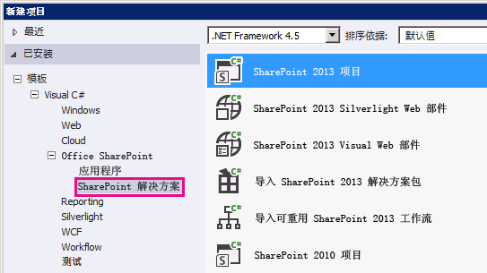
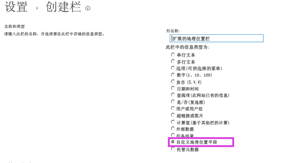

# 如何：使用客户端呈现扩展地理位置字段类型
了解如何使用客户端呈现以编程方式自定义 SharePoint 2013 地理位置字段类型。
本文内容
  
    
    
 [创建自定义地理位置字段的先决条件](#CreatingCustomGeolocation_prereq)
  
    
    
 [步骤 1：设置 Visual Studio 项目](#CreatingCustomGeolocationStep_1)
  
    
    
 [步骤 2：创建自定义字段类](#CreatingCustomGeolocationStep_2)
  
    
    
 [步骤 3：创建新自定义字段的呈现](#CreatingCustomGeolocationStep_3)
  
    
    
 [步骤 4：创建字段类型定义](#CreatingCustomGeolocationStep_4)
  
    
    
 [步骤 5：生成和测试自定义字段类型](#CreatingCustomGeolocationStep_5)
  
    
    
 [其他资源](#SP15Createcustomgeo_addlresources)
  
    
    

SharePoint 2013 引入名为 Geolocation 的新字段类型，使您能够用位置信息对 SharePoint 列表进行批注。在类型地理位置列中，可输入十进制度数的纬度和经度坐标对形式的位置信息，或从浏览器检索用户的当前位置的坐标 （如果其实现 W3C 地理位置 API）。有关地理位置字段的详细信息，请参阅 [集成 SharePoint 2013 中的位置和映射功能](integrating-location-and-map-functionality-in-sharepoint-2013.md)。 
在 SharePoint 2013 中的任何列表或文档库的默认内容类型中，地理位置字段类型不可用。SharePoint 2013 中包括地理位置字段类型，但在列表的创建列页面上不可见；必须以编程方式添加地理位置字段类型。有关详细信息，请参阅 [如何：在 SharePoint 2013 中以编程方式向列表添加 Geolocation 列](how-to-add-a-geolocation-column-to-a-list-programmatically-in-sharepoint-2013.md)。 
  
    
    

向 SharePoint 2013 中添加地理位置字段类型后，可通过 Bing 地图利用它呈现地图。内置的地理位置字段仅可通过 Bing 地图呈现。但是，可通过将地理位置字段用作父字段类型来创建自定义字段。自定义呈现可通过客户端呈现框架中的 **JSLink** 属性提供。客户端呈现框架是在 SharePoint 2013 中引入的。有关详细信息，请参阅 [如何：使用客户端呈现自定义字段类型](how-to-customize-a-field-type-using-client-side-rendering.md)。 
> **注释**
> 调查列表或事件列表不支持 JSLink 属性。SharePoint 日历是事件列表。 
  
    
    

在本节的过程中，使用客户端呈现创建派生自地理位置字段类型的自定义字段。 
## 创建自定义地理位置字段的先决条件
<a name="CreatingCustomGeolocation_prereq"> </a>

必须具备以下内容：
  
    
    

- 一台运行 SharePoint 2013 的服务器。
    
  
- Microsoft Visual Studio 2012
    
  
- Visual Studio 2012 Office 开发人员工具
    
  
- 对 SharePoint 2013 列表的访问权限，并具有可添加列的足够的权限。
    
  

### 自定义地理位置字段要知道的核心概念


  
    
    

**表 1. 扩展地理位置字段类型的核心概念**


|**文章标题**|**说明**|
|:-----|:-----|
| [集成 SharePoint 2013 中的位置和映射功能](integrating-location-and-map-functionality-in-sharepoint-2013.md) <br/> |了解如何通过使用新地理位置字段和创建您自己的基于地理位置的字段类型，集成 SharePoint 列表和基于位置的 Web 和移动应用程序中的位置信息和地图。  <br/> |
| [如何：使用客户端呈现自定义字段类型](how-to-customize-a-field-type-using-client-side-rendering.md) <br/> |了解有关 SharePoint 2013 中引入的新客户端呈现的详细内容。  <br/> |
| [如何：在 SharePoint 2013 中以编程方式向列表添加 Geolocation 列](how-to-add-a-geolocation-column-to-a-list-programmatically-in-sharepoint-2013.md) <br/> |了解如何在 SharePoint 2013 中以编程方式向列表添加地理位置列。  <br/> |
   

## 步骤 1：设置 Visual Studio 项目
<a name="CreatingCustomGeolocationStep_1"> </a>


### 设置自定义字段项目


1. 在安装 SharePoint Server 2013 的相同计算机上启动 Visual Studio 2008。
    
  
2. 在"新建项目"对话框中的"已安装的模板"下，选择"Visual C#"、"Office SharePoint"、"SharePoint 解决方案"。选择"SharePoint 2013"项目类型。图 1 显示了 Visual Studio 2008 中的"SharePoint 2013 项目"模板的位置。使它成为 **场解决方案**，而不是沙盒解决方案。
    
   **图 1. Visual Studio 中的 SharePoint 2013 项目模板**

  


  

  

  
3. 为该项目指定名称。我们在此示例中使用"CustomGeolocationField"。然后选择"确定"按钮。
    
  
4. 在"SharePoint 自定义向导"中，输入要将新自定义字段类型部署到的 SharePoint 网站的 URL。
    
  
5. 在"解决方案资源管理器"中，打开项目名称（在我们的示例中，为"CustomGeolocationField"）的快捷菜单，然后选择"添加"、"新建项"。
    
  
6. 在"添加新项"对话框中的"代码"模板下，选择"类"，并指定类的名称（在此示例中为"CustomGeolocationField.cs"）。
    
  
7. 在"解决方案资源管理器"中，打开项目名称的快捷菜单，然后选择"添加"、"SharePoint 映射文件夹"。
    
  
8. 在"添加 SharePoint 映射文件夹"对话框中，使用树控件将该文件夹映射到"模板/布局"，并选择"确定"按钮。
    
  
9. 在"解决方案资源管理器"中，打开新的 **LAYOUTS** 文件夹（而不是项目名称）的快捷菜单，然后选择"添加"、"新建项"。
    
  
10. 在"添加新项"对话框中，选择"Visual C#"、"Web" ，然后选择"模板"下的"Javascript 文件"。
    
  
11. 在"名称"框中，指定文件的名称（在我们的示例中为 CustomGeolocationField），然后选择"添加"。
    
  
12. 重复步骤 8 以创建另一个 SharePoint 映射文件夹，并将其映射到 **TEMPLATE\\XML**。然后选择"确定"按钮。
    
  
13. 在"解决方案资源管理器"中，打开新的 **XML** 文件夹（而不是项目名称）的快捷菜单，然后选择"添加"、"新建项"。
    
  
14. 在"添加新项"对话框中，选择"Visual C#"、"数据" ，然后选择"模板"下的"XML 文件"。
    
  
15. 在"名称"框中，指定文件的名称（此示例使用 fldtypes_CustomGeolocationControl.xml），然后选择"添加"按钮。
    
  

## 步骤 2：创建自定义字段类
<a name="CreatingCustomGeolocationStep_2"> </a>

 字段类是一种类，其实例可以表示基于您的自定义字段类型的特殊字段。此类必须继承自 **SPField** 或者 SharePoint Foundation 中从其派生的一个类。若要使您能够扩展或自定义地理位置字段类型，此类必须继承自 **SPFieldGeolocation**。有关创建字段类型的详细信息，请参阅 [演练：创建自定义字段类型](http://msdn.microsoft.com/library/089a1b8a-cafc-4050-b445-16650602fe4f%28Office.15%29.aspx)。 
  
    
    

> **注释**
> 在此示例中，类和解决方案名为 **CustomGeolocationField**；可在创建 Visual Studio 项目时指定您想要的类和项目的名称。 
  
    
    


### 创建自定义字段类


1. 打开 CustomGeolocationField.cs 文件，并添加 **using** 指令，如下所示。
    
  ```cs
  
using System;
using Microsoft.SharePoint;
using Microsoft.SharePoint.WebControls;
  ```

2. 确保该命名空间为 **CustomGeolocationField**。 
    
  
3. 应确保将该类命名为 **CustomGeolocationField**，并更改其声明，以指定它是从 **SPFieldGeolocation** 继承的。为该类添加以下所需构造函数。
    
  ```cs
  
public class CustomGeolocationField : SPFieldGeolocation
    {
        /// <summary>
        /// Create an instance of CustomGeolocationField object.
        /// </summary>
        /// <param name="fields">Field collection</param>
        /// <param name="fieldName">Name of the field</param>
        /// 
        public CustomGeolocationField(SPFieldCollection fields, string fieldName)
            : base(fields, fieldName)
        {
        }

        /// <summary>
        /// Create an instance of CustomGeolocationField object.
        /// </summary>
        /// <param name="fields">Field collection</param>
        /// <param name="typeName">type name of the field</param>
        /// <param name="displayName">display name of the field</param>

        public CustomGeolocationField(SPFieldCollection fields, string typeName, string displayName)
            : base(fields, typeName, displayName)
        {
        }
  ```

4. 将 **JSLink** 方法的以下重写添加到该类中。CustomGeolocationControl.js 是在后面的步骤中创建的 JavaScript 文件。通过提供您自己的 JavaScript 文件，重写 Bing 地图的默认呈现。如果您未重写此方法，则默认呈现将来自 Bing 地图。 **JSLink** 属性在 SharePoint 2013 中引入。有关 **JSLink** 属性的详细信息，请参阅 [如何：使用客户端呈现自定义字段类型](how-to-customize-a-field-type-using-client-side-rendering.md)。
    
  ```cs
  
/// <summary>
        /// Override JSLink property.
        /// </summary>

public override string JSLink
        {
            get
            {
                return "CustomGeolocationControl.js";
            }
            set
            {
                base.JSLink = value;
            }
        }
  ```

5. **GetFieldValue** 方法将指定值转换为字段类型值。有关 **GetFieldValue** 方法的详细信息，请参阅 [GetFieldValue(String)](https://msdn.microsoft.com/library/Microsoft.SharePoint.SPField.GetFieldValue.aspx) 。将 **GetFieldValue** 方法的以下重写添加到 **CustomGeolocationField** 类中。
    
  ```cs
  
/// <summary>
        /// get the field values
        /// </summary>
        /// <param name="value"></param>
        /// <returns></returns>
        
        public override object GetFieldValue(string value)
        {
            return base.GetFieldValue(value);
        }
  ```

6. 将  [GetValidatedString](https://msdn.microsoft.com/library/Microsoft.SharePoint.SPField.GetValidatedString.aspx) 方法的以下重写添加到 **CustomGeolocationField** 类中：
    
  ```cs
  
/// <summary>
        /// get validated string
        /// </summary>
        /// <param name="value"></param>
        /// <returns></returns>
        
       public override string GetValidatedString(object value)
        {
            return base.GetValidatedString(value);
        }
  ```


## 步骤 3：创建新自定义字段的呈现
<a name="CreatingCustomGeolocationStep_3"> </a>

接下来，您应创建字段类的 **JSLink** 方法指向的 JavaScript 文件。此文件应使用新客户端呈现框架定义自定义字段类型的呈现。有关详细信息，请参阅 [如何：使用客户端呈现自定义字段类型](how-to-customize-a-field-type-using-client-side-rendering.md)。
  
    
    
以下示例显示注册 SharePoint 2013 中引入的客户端呈现框架的注册逻辑。
  
    
    


```

function _registerCustomGeolocationFieldTemplate() {
          
            var geolocationFieldContext = {};
            geolocationFieldContext.Templates = {};
            geolocationFieldContext.Templates.Fields = {

                'CustomGeolocationField': {
                    'View': CustomGeolocationFieldTemplate.RenderGeolocationField,
                    'DisplayForm': CustomGeolocationFieldTemplate.SPFieldGeolocation_Display,
                    'EditForm': CustomGeolocationFieldTemplate.SPFieldGeolocation_Edit,
                    'NewForm': CustomGeolocationFieldTemplate.SPFieldGeolocation_Edit
                }
            };
            SPClientTemplates.TemplateManager.RegisterTemplateOverrides(geolocationFieldContext);
        }
```

在注册过程中，共涉及四个变量及其各自的方法。客户端呈现框架调用这些方法来呈现 **CustomGeolocationControl**。
  
    
    
以下代码示例为派生自"地理位置"的新自定义字段创建新呈现。
  
    
    

### 创建 JavaScript 文件


1. 创建文本文件并指定名称（例如 x），扩展名为 .js，并将其保存到 SharePoint 映射的 TEMPLATE\\LAYOUTS 文件夹。此示例使用名称 **CustomGeolocationControl.js**。
    
  
2. 将以下代码复制到 .js 文件中。
    
  ```
  
(function () {
        if (typeof CustomGeolocationFieldTemplate == "object") {
            return;
        }
        window.CustomGeolocationFieldTemplate = (function () {
            return {
                SPFieldGeolocation_Display: function (rCtx) {
                    if (rCtx == null || rCtx.CurrentFieldValue == null || rCtx.CurrentFieldValue == '')
                        return '';
                    var listItem = rCtx['CurrentItem'];
                    var fldvalue = CustomGeolocationFieldTemplate.ParseGeolocationValue(listItem[rCtx.CurrentFieldSchema.Name]);
                    var _myData = SPClientTemplates.Utility.GetFormContextForCurrentField(rCtx);

                    if (_myData == null || _myData.fieldSchema == null)
                        return '';
                    var _latitude = 0;
                    var _longitude = 0;

                    if (fldvalue != null) {
                        _latitude = fldvalue.latitude;
                        _longitude = fldvalue.longitude;
                    }
                  
                    var result = '<div>';
                    result += '<span>Latitude:</span><span>' + _latitude + '</span><span>Longitude:</span><span>' + _longitude + '</span>';
                    result += '</div>';
                    return result;
                },                
                ParseGeolocationValue: function (fieldValue) {

                    if (fieldValue == null || fieldValue == '')
                        return null;

                    var point = new Object();
                    point.longitude = null;
                    point.latitude = null;
                    point.altitude = null;
                    point.measure = null;

                    var matches = fieldValue.match(/POINT\\s*\\((\\d+(\\.\\d+)?)\\s+(\\d+(\\.\\d+)?)\\s+(\\d+(\\.\\d+)?)\\s+(\\d+(\\.\\d+)?)\\)/i);
                    if (matches != null) {

                        point.longitude = parseFloat(matches[1]);
                        point.latitude = parseFloat(matches[3]);
                        point.altitude = parseFloat(matches[5]);
                        point.measure = parseFloat(matches[7]);
                    }
                    else
                    {
                        matches = fieldValue.match(/POINT\\s*\\((\\d+(\\.\\d+)?)\\s+(\\d+(\\.\\d+)?)\\)/i);
                        if (matches != null) {

                            point.longitude = parseFloat(matches[1]);
                            point.latitude = parseFloat(matches[3]);
                        }
                    }
                    return point;
                },
                SPFieldGeolocation_Edit: function (rCtx) {
                    if (rCtx == null)
                        return '';
                    var _myData = SPClientTemplates.Utility.GetFormContextForCurrentField(rCtx);

                    if (_myData == null || _myData.fieldSchema == null)
                        return '';
                    var _latitude = null;
                    var _longitude = null;
                    var _inputId_Latitude = _myData.fieldName + '_' + _myData.fieldSchema.Id + '_$geolocationField_Latitude';
                    var _inputId_Longitude = _myData.fieldName + '_' + _myData.fieldSchema.Id + '_$geolocationField_Longitude';
                    var _inputId_Div = _myData.fieldName + '_' + _myData.fieldSchema.Id + '_$geolocationField_Div';
                    var _latitudeBox = null;
                    var _longitudeBox = null;

                    var _value = _myData.fieldValue != null ? _myData.fieldValue : '';
                    var listItem = rCtx['CurrentItem'];
                    var fldvalue = CustomGeolocationFieldTemplate.ParseGeolocationValue(listItem[rCtx.CurrentFieldSchema.Name]);

                    if (fldvalue != null) {
                        _latitude = fldvalue.latitude;
                        _longitude = fldvalue.longitude;
                    }

                    var validators = new SPClientForms.ClientValidation.ValidatorSet();

                    if (_myData.fieldSchema.Required)
                        validators.RegisterValidator(new SPClientForms.ClientValidation.RequiredValidator());

                    _myData.registerClientValidator(_myData.fieldName, validators);

                    // Post DOM initialization callback.
                    _myData.registerInitCallback(_myData.fieldName, function () {

                        // Initialize the input control references.
                        _latitudeBox = document.getElementById(_inputId_Latitude);
                        _longitudeBox = document.getElementById(_inputId_Longitude);

                        // Set the initial values.
                        if ((_latitudeBox != null &amp;&amp; _longitudeBox != null) &amp;&amp;
                            (_latitude != null &amp;&amp; _longitude != null)) {
                            _latitudeBox.value = _latitude;
                            _longitudeBox.value = _longitude;
                        }
                    });
                    // On focus call back.
                    _myData.registerFocusCallback(_myData.fieldName, function () {
                        if (_latitudeBox != null)
                            _latitudeBox.focus();
                    });
                    // Validation failure handler.
                    _myData.registerValidationErrorCallback(_myData.fieldName, function (errorResult) {
                        SPFormControl_AppendValidationErrorMessage(_inputId_Div, "invalid Geolocation Field");
                    });

                    // Register a callback just before submit.
                    _myData.registerGetValueCallback(_myData.fieldName, function () {
                        if (_latitudeBox == null &amp;&amp; _longitudeBox == null)
                            return '';
                        else {
                            _latitude = _latitudeBox.value;
                            _longitude = _longitudeBox.value;

                            if (_latitude != null &amp;&amp; _longitude != null)
                                return "Point(" + _longitude + " " + _latitude + ")";
                        }
                    });
                    _myData.updateControlValue(_myData.fieldName, _value);

                    var result = '<div width="100%" id=' + STSHtmlEncode(_inputId_Div) + '>';
                    result += '<div><span>Latitude:</span><input id=' + STSHtmlEncode(_inputId_Latitude) + ' type="text" name="Latitude" /></div>';
                    result += '<div><span>Longitude:</span><input id=' + STSHtmlEncode(_inputId_Longitude) + ' type="text" name="Longitude" /></div>';
                    result += '</div>';
                    return result;

                },
                RenderGeolocationField: function (inCtx, field, listItem, listSchema) {
                    var fldvalue = CustomGeolocationFieldTemplate.ParseGeolocationValue(listItem[field.Name]);
                    var result = '';

                    if (fldvalue != null) {
                        var result = '<div>';
                        result += '<span>Latitude:</span><span>' + fldvalue.latitude + '</span><span>Longitude:</span><span>' + fldvalue.longitude + '</span>';
                        result += '</div>';                            
                    }
                    return result;                    
                }                                       
            };
        })();
        function _registerCustomGeolocationFieldTemplate() {
          
            var geolocationFieldContext = {};
            geolocationFieldContext.Templates = {};
            geolocationFieldContext.Templates.Fields = {

                'CustomGeolocationField': {
                    'View': CustomGeolocationFieldTemplate.RenderGeolocationField,
                    'DisplayForm': CustomGeolocationFieldTemplate.SPFieldGeolocation_Display,
                    'EditForm': CustomGeolocationFieldTemplate.SPFieldGeolocation_Edit,
                    'NewForm': CustomGeolocationFieldTemplate.SPFieldGeolocation_Edit
                }
            };
            SPClientTemplates.TemplateManager.RegisterTemplateOverrides(geolocationFieldContext);
        }
        ExecuteOrDelayUntilScriptLoaded(_registerCustomGeolocationFieldTemplate, 'clienttemplates.js');
    })();
  ```


## 步骤 4：创建字段类型定义
<a name="CreatingCustomGeolocationStep_4"> </a>

字段类型定义是一个 XML 文件，其名称类似  _fldtypes*.xml_，并部署到 %ProgramFiles%\\Common Files\\Microsoft Shared\\web server extensions\\15\\TEMPLATE\\XML。字段定义文件包含 SharePoint Foundation 在列表视图、"显示"表单、"编辑"表单和"新建"表单上正确呈现字段所需的信息。最重要的是，定义中包含有关含有已编译字段类型的程序集的信息。有关字段类型定义的详细信息，请参阅 [如何：创建自定义字段类型定义](http://msdn.microsoft.com/library/b3315997-671f-4c29-9518-48cc4592f205%28Office.15%29.aspx)。
  
    
    

### 创建字段类型定义


1. 在 Visual Studio 中，生成该项目。该项目尚未完成，但您需要为程序集生成 GUID 和公钥标记。 
    
  
2. 打开 fldtypes_CustomGeolocationControl.xml 文件，并将其内容替换为以下标记。
    
  ```XML
  
?xml version="1.0" encoding="utf-8" ?>

<FieldTypes>
  <FieldType>
    <Field Name="TypeName">CustomGeolocationField</Field>
    <Field Name="ParentType">Geolocation</Field>
    <Field Name="TypeDisplayName">Custom Geolocation field</Field>
    <Field Name="TypeShortDescription"> Custom Geolocation field </Field>
    <Field Name="UserCreatable">TRUE</Field>
    <Field Name="ShowOnListCreate">TRUE</Field>
    <Field Name="ShowOnSurveyCreate">TRUE</Field>
    <Field Name="ShowOnDocumentLibraryCreate">TRUE</Field>
    <Field Name="ShowOnColumnTemplateCreate">TRUE</Field>
    <Field Name="FieldTypeClass">CustomGeolocationField.CustomGeolocationField,$SharePoint.Project.AssemblyFullName$</Field>
    <Field Name="SQLType">nvarchar</Field>
  </FieldType>
</FieldTypes>

  ```


    该文件定义 SharePoint 2013 的自定义字段类型。有关其元素的用途和含义的详细信息，请参阅 [自定义字段类型定义](http://msdn.microsoft.com/library/b3315997-671f-4c29-9518-48cc4592f205%28Office.15%29.aspx)、 [FldTypes.xml](http://msdn.microsoft.com/library/8f8db866-03f8-4001-aae3-4c4102a7aed6%28Office.15%29.aspx)、 [FieldTypes 元素（字段类型）](http://msdn.microsoft.com/library/ebac779f-c7c5-401b-8503-e514cd96f5a7%28Office.15%29.aspx)、 [FieldType 元素（字段类型）](http://msdn.microsoft.com/library/9ab89988-3462-422f-9808-40618da7316b%28Office.15%29.aspx)和 [Field 元素（字段类型）](http://msdn.microsoft.com/library/c168e8bc-8aba-4b72-a9c4-a0ad7a4aff9a%28Office.15%29.aspx)。请注意， **<Field Name="FieldTypeClass">** 元素必须全部在一行上。
    
  
3. **<Field Name="FieldTypeClass">** 元素的值是您的自定义字段类的完全限定名称，后跟逗号和 Visual Studio 标记 ( `$SharePoint.Project.AssemblyFullName$`)。编译该项目时，会创建此文件的副本，在该副本中，该标记将被替换为程序集的 4 个部分组成的完整名称。在 Visual Studio 2008 中的 Visual Studio"生成"菜单上选择"部署解决方案"时部署该副本。
    
  

## 步骤 5：生成和测试自定义字段类型
<a name="CreatingCustomGeolocationStep_5"> </a>

向 SharePoint 服务器部署自定义字段后，您可将新自定义列添加到部署了解决方案的服务器上的任何 SharePoint 列表中。
  
    
    

1. 选择 F5 键。
    
    > **注释**
      > 在您选择 F5 时，Visual Studio 将生成解决方案、部署解决方案并打开部署了解决方案的 SharePoint 网站。 
2. 创建自定义列表并添加新的自定义地理位置字段列。
    
  
3. 向列表中添加一项，并为自定义地理位置列提供经度值和纬度值。
    
  
4. 图 2 显示了使用新自定义字段类型的创建列页面。
    
   **图 2. 创建新自定义字段类型列**

  


  

  

  

## 其他资源
<a name="SP15Createcustomgeo_addlresources"> </a>


-  [集成 SharePoint 2013 中的位置和映射功能](integrating-location-and-map-functionality-in-sharepoint-2013.md)
    
  
-  [如何：在 SharePoint 2013 中以编程方式向列表添加 Geolocation 列](how-to-add-a-geolocation-column-to-a-list-programmatically-in-sharepoint-2013.md)
    
  
-  [如何：使用客户端呈现自定义字段类型](how-to-customize-a-field-type-using-client-side-rendering.md)
    
  
-  [SharePoint 2013：使用 Nokia 地图创建呈现地图的地理位置字段](http://code.msdn.microsoft.com/SharePoint-2013-Create-a-d9a91551)
    
  
-  [如何：创建自定义字段类型](http://msdn.microsoft.com/library/aacdc6d1-86c8-4a6b-953d-22ecac209d0f%28Office.15%29.aspx)
    
  
-  [使用映射的文件夹部署文件](http://blogs.msdn.com/b/vssharepointtoolsblog/archive/2010/03/12/deploying-files-using-mapped-folders.aspx)
    
  

