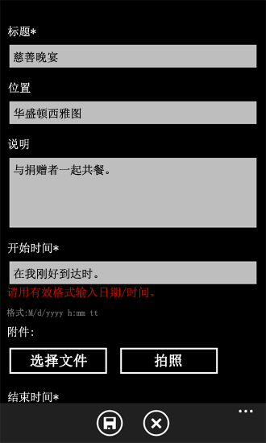
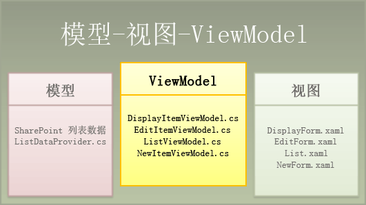
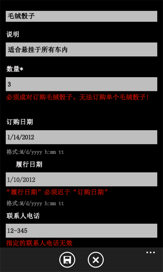

# 如何：在针对 Windows Phone 的 SharePoint 2013 应用程序中实现业务逻辑和数据验证
在用 Windows Phone SharePoint 列表应用程序模板创建的 Windows Phone 应用程序中实现数据验证。
在用于生产的 Windows Phone 应用程序中，您可能需要验证用户输入的数据，这样做的目的在于强制执行与您特定的情况相关的业务逻辑，或确保数值以适当格式输入，或仅仅为了在将数值保存到 SharePoint 列表前找到错误。基于 Windows Phone SharePoint 列表应用程序模板的项目包括默认数据验证逻辑，但这类项目也为开发人员提供实现自定义数据验证的机制。
  
    
    


> **重要信息**
> 如果您正在开发适用于 Windows Phone 8 的应用程序，则必须使用 Visual Studio Express 2012（而非 Visual Studio 2010 Express）。除开发环境以外，本文中的所有信息均适用于 Windows Phone 8 和 Windows Phone 7。 > 有关详细信息，请参阅 [如何：设置用于为 SharePoint 开发移动应用程序的环境](how-to-set-up-an-environment-for-developing-mobile-apps-for-sharepoint.md)。 
  
    
    


## 默认数据验证规则
<a name="BKMK_DefaultValidation"> </a>

默认情况下，SharePoint 列表中字段的某些数据类型与简单格式或数据验证相关联。如果您在 SharePoint 列表中为基于超链接或图片字段类型的字段输入了无效的 URL 并尝试保存您的更改，您会看到一条显示您输入的地址无效的消息。如果您为基于日期和时间字段类型的字段输入了一个客户的名称作为字段值，您会收到一条消息，指导您为字段输入有效的日期范围。
  
    
    

> **注释**
> 日期输入验证针对 SharePoint 的日期格式。如果您对电话区域设置日期格式有要求，请自定义字段并添加相应验证。 
  
    
    

在Windows Phone SharePoint 列表应用程序模板创建的 Windows Phone 应用程序中，这些基本验证规则中有部分会默认强制执行。如果您在基于 SharePoint 列表的 Windows Phone 应用程序编辑窗体中输入了不符合绑定到日期和时间类型的 SharePoint 字段形式的日期值，当焦点离开与该字段关联的 **TextBox** 控件时，您将看到一条验证错误消息。（参见图 1。）
  
    
    

**图 1. Windows Phone 应用程序中的验证错误提示**

  
    
    

  
    
    

  
    
    
编辑表单中标记为"开始时间"的文本框绑定到 SharePoint 列表中的某一日期和时间字段，此示例应用程序是以该 SharePoint 列表为基础。如果文本框中输入无效的日期（文本框随后失去焦点），将出现图 1 中所示的验证错误提示（文字为红色），因为在对 EditForm.xaml 文件中的 **ValidatesOnNotifyDataErrors**进行定义的 XAML 声明中， **Binding** 属性即 **Text** 与 **TextBox** 控件 **True**属性相关的对象已经设置为 **TextBox**。
  
    
    


```XML

<StackPanel Orientation="Vertical" Margin="0,5,0,5">
   <TextBlock TextWrapping="Wrap" HorizontalAlignment="Left" 
                    Style="{StaticResource PhoneTextNormalStyle}">Start Time*
   </TextBlock>
   <TextBox Height="Auto" Style="{StaticResource TextValidationTemplate}"
    FontSize="{StaticResource PhoneFontSizeNormal}" Width="470" 
        HorizontalAlignment="Left" Name="txtEventDate"
    Text="{Binding [EventDate], Mode=TwoWay, ValidatesOnNotifyDataErrors=True,
                       NotifyOnValidationError=True}"
    TextWrapping="Wrap" />
   <TextBlock FontSize="16" TextWrapping="Wrap" HorizontalAlignment="Left"
    Style="{StaticResource PhoneTextSubtleStyle}" Text="{Binding DateTimeFormat}" />
</StackPanel>
```

（如果将 **ValidatesOnNotifyDataErrors** 属性设置为 **False**，用户只有在选择"保存"按钮时，才会看到所输入信息无效的提示。此时，用户可以看到与验证错误有关的错误消息，因为对输入的日期值的格式验证仍由从其派生 **EditItemViewModel** 类的类执行。）
  
    
    
但是 Windows Phone 应用程序中的某些字段可能不会给出任何数据无效的通知。精心设计 Visual Studio 项目模板必须为通用模板以便用作许多不同应用程序的起始点。Windows Phone SharePoint 列表应用程序模板不能包括有关具体情况的验证规则，但仍然保留其作为通用模板的值。根据您的需要和您特定的 Windows Phone 应用程序的使用环境，您可能会想要实现您自己的自定义数据验证规则。
  
    
    

## 实现自定义的数据验证规则
<a name="BKMK_CustomValidation"> </a>

您可以通过多种方式验证 Windows Phone 应用程序用户输入的数据。使用 Windows Phone SharePoint 列表应用程序模板创建的项目中包括类，这些类作为 Windows Phone 应用程序（例如 EditForm.xaml 文件）中的数据的窗体（也就是视图）和应用程序所基于的 SharePoint 列表中的数据本身之间的中介。这些类可被视为实现 [Model-View-ViewModel 设计模式](http://blogs.msdn.com/b/johngossman/archive/2005/10/08/478683.aspx) 的 ViewModel 组件（图 2）(http://blogs.msdn.com/b/johngossman/archive/2005/10/08/478683.aspx)。（有关 Windows Phone SharePoint 列表应用程序模板如何符合 MVVM 软件设计模式的更多信息，请参阅 ["Windows Phone SharePoint 列表应用程序"模板的体系结构](architecture-of-the-windows-phone-sharepoint-list-application-template.md)。）
  
    
    

> **注释**
> SharePoint 列表模板不包含默认验证（例如 SharePoint 任务列表中的完成百分比、工作组讨论列表的后检查以及 SP 十进制字段类型验证），但您可以执行此类验证。 
  
    
    


**图 2. ViewModel 组件中的模板文件**

  
    
    

  
    
    

  
    
    
在基于 MVVM 模式设计的应用程序中，数据验证通常在数据层（也就是在模型组件中）处理。在 Windows Phone SharePoint 列表应用程序模板创建的项目中，为使开发人员更容易管理数据验证，已将一个可扩展的数据验证机制"推送"一个层，并在 ViewModel 组件中得到实现。因此，在基于该模板的项目中，存储验证用户输入或管理数据的自定义代码最合适的地点是这些 ViewModel 类。至于数据验证， **EditItemViewModel** 类和 **NewItemViewModel** 类（这些类与最有可能涉及编辑和更新列表数据的窗体有关）都能公开实现验证方法（名为 **Validate**），该验证方法取代了派生这两个类的类中使用的基本验证方法。
  
    
    


```cs

public override void Validate(string fieldName, object value)
   {
      base.Validate(fieldName, value);
   }
```

此方法为开发人员提供一种方便的机制，使他们能在个别字段中添加自定义验证逻辑。一般的方法是检查传递到 **fieldName** 方法的 **Validate** 参数值，以识别要与您的自定义验证代码相关联的字段。例如，您可以在实现此方法时使用 **switch** 语句，以便为您的 Windows 应用程序编辑窗体 (EditForm.xaml) 中各个字段提供特定的验证逻辑语句。
  
    
    
对于以下代码示例，假定 SharePoint Server 的安装已具备自定义列表模板创建的产品订单列表。已创建的列表中的列和字段类型如表 1 所示。
  
    
    

**表 1. 产品订单列表**


|**列**|**类型**|**必需**|
|:-----|:-----|:-----|
|产品（例如标题）  <br/> |单行文本（文本）  <br/> |是  <br/> |
|说明  <br/> |单行文本（文本）  <br/> |否  <br/> |
|数量  <br/> |编号  <br/> |是  <br/> |
|订单日期  <br/> |日期和时间 (Datetime)  <br/> |否  <br/> |
|完成时间  <br/> |日期和时间 (Datetime)  <br/> |否  <br/> |
|联系人号码  <br/> |单行文本（文本）  <br/> |否  <br/> |
   
另外，出于示例目的，本示例还假定根据虚构的 Contoso, Ltd. 的业务逻辑，对给定产品订购系统强制执行简单的验证规则：
  
    
    

- 履行订单的日期必须晚于下订单的日期。
    
  
- 如果客户想要订购名为 Fuzzy Dice 的产品，则必须成对订购。根据 Contoso, Ltd. 的特殊规定，根本没有名为 Fuzzy Die 的产品。
    
  
- 在产品订单列表中，电话号码的字段类型是"单行文本：（即文本），它可以是任何文本（默认最多为 255 个字符）。针对此示例，将强制执行格式有效性规则，要求输入的数据必须是常见电话号码格式的其中一种，例如"(555) 555-5555"。
    
  

### 实现自定义的验证规则


1. 假设您已创建 SharePoint 列表，该列表基于包含表 1 中指定列和类型的自定义列表模板，请使用 Visual Studio 中 Windows Phone SharePoint 列表应用程序模板创建一个 Windows Phone 应用程序，请执行以下 [如何：创建 Windows Phone SharePoint 2013 列表应用程序](how-to-create-a-windows-phone-sharepoint-2013-list-app.md)中的详细步骤。
    
  
2. 在"解决方案资源管理器"中，在项目的 ViewModels 文件夹中，双击 EditItemViewModel.cs 文件（或选择文件并按 F7）打开文件以供编辑。
    
  
3. 将以下 **using** 指令添加到文件顶部的指令列表中。
    
  ```cs
  
using System.Globalization;
using System.Text.RegularExpressions;
  ```

4. 用以下代码替换文件中 **Validate** 方法的默认实现。
    
  ```cs
  
public override void Validate(string fieldName, object value)
{
    string fieldValue = value.ToString();
    if (!string.IsNullOrEmpty(fieldValue)) //Allowing for blank fields.
    {
        bool isProperValue = false;

        switch (fieldName)
        {
            case "Quantity":
                // Enforce ordering Fuzzy Dice in pairs only.
                int quantityOrdered;
                isProperValue = Int32.TryParse(fieldValue, out quantityOrdered);
                if (isProperValue)
                {
                    if ((quantityOrdered % 2) != 0) // Odd number of product items ordered.
                    {
                        if ((string)this["Title"] == "Fuzzy Dice")
                        {
                            AddError("Item[Quantity]", "Fuzzy Dice must be ordered in pairs. 
                                                                   No such thing as a Fuzzy Die!");
                        }
                        else
                        {
                            // Restriction on ordering in pairs doesn't apply to other products.
                            RemoveAllErrors("Item[Quantity]");
                        }
                    }
                    else
                    {
                        RemoveAllErrors("Item[Quantity]");
                    }
                }
                break;
            case "Fulfillment_x0020_Date":
                // Determine whether fulfillment date is later than order date.
                DateTime fulfillmentDate;
                isProperValue = DateTime.TryParse(fieldValue, CultureInfo.CurrentCulture, 
                              DateTimeStyles.AssumeLocal, out fulfillmentDate);
                if (isProperValue)
                {
                    DateTime orderDate;
                    isProperValue = DateTime.TryParse((string)this["Order_x0020_Date"], 
                               CultureInfo.CurrentCulture, DateTimeStyles.AssumeLocal, out orderDate);

                    if (fulfillmentDate.CompareTo(orderDate) > 0)
                    {
                        RemoveAllErrors("Item[Fulfillment_x0020_Date]");
                    }
                    else
                    {
                        AddError("Item[Fulfillment_x0020_Date]", 
                                "Fulfillment Date must be later than Order Date.");
                    }
                }
                break;
            case "Contact_x0020_Number":
                // Check that contact number is in an appropriate format.
                Regex rx = new Regex(@"^\\(?([0-9]{3})\\)?[-. ]?([0-9]{3})[-. ]?([0-9]{4})$");
                if (rx.IsMatch(fieldValue))
                {
                    RemoveAllErrors("Item[Contact_x0020_Number]");
                }
                else
                {
                    //Specified Contact Number is not a valid phone number.
                    AddError("Item[Contact_x0020_Number]", "Specified Contact Number is invalid.");
                }
                break;
            default:
                // Not adding custom validation for other fields.
                break;
        }
    }

    //And then proceed with default validation from base class.
    base.Validate(fieldName, value);
}
  ```


    请记住此代码示例指定的字段名称是基于表 1 中指定的产品预订列表示例属性。（请注意在用于 SharePoint Server 列表字段的 XML 架构中，针对定义既定字段 **Field** 元素的 **Name** 属性，将字段名称空格替换为"_x0020_"字符串。该模板按照服务器的 XML 架构中的定义将 **Name** 属性而不是 **DisplayName** 属性用于 **Field** 元素。）您可以通过查看 EditForm.xaml 中定义的 **TextBox** 对象的 **Text** 属性的 **Binding** 声明或者通过检查 ListProvider.cs 文件中 **CamlQueryBuilder** 类的 **ViewFields** 字符串来识别希望实现验证逻辑字段名称。
    
  
5. 保存该文件。
    
  
本示例中的自定义有效代码仅当传递到 **value** 方法的 **Validate** 参数有效且不为空字符串时才会执行。如表 1 中所示，不要求"完成日期"和"联系人电话"字段包含数据（如为此示例目的在 SharePoint Server 中定义的列表），所以我们希望允许这些字段可以为空。简单的检查并不足以确定 **value** 参数是否为空，因为传递的值可以是零长度字符串（这并不等同于一个空值），而且，针对此示例，我们不希望使零长度字符串值在可以为空的字段中无效。"数量"和"完成日期"字段的验证逻辑包括对传入值的其他检查，以便确保它们属于适当类型。如果此处的初始检查（在 **switch** 语句之前）仅证实传入的值不为空（而不是对一个零长度字符串的细化状态进行检查），如果值是一个零长度字符串，这些验证将仍然不会执行，但用于验证"联系人电话"字段数据的逻辑仍旧会执行。在此示例中我们希望允许"联系人电话"字段为空（零长度字符串），特别是当用户开始打开"编辑"窗体编辑列表项的时候。
  
    
    
如果您生成该项目，并将其部署到 Windows Phone 仿真程序中运行，您可以通过将违反您的业务规则的数据输入到应用程序编辑窗体的列表字段中来测试您的验证逻辑。（见图 3。）
  
    
    

**图 3. 自定义验证错误提示**

  
    
    

  
    
    

  
    
    
此示例中的代码如果只包含在 EditItemViewModel.cs 文件中，只有用户在编辑窗体上输入的数据的验证规则会被强制执行。如果您希望用户 *添加*  新项目以及对它们进行编辑时验证规则都得到强制执行，您必须在 NewItemViewModel.cs 文件的 **Validate** 方法中包含相同的验证逻辑（或者您最好创建一个单独的类文件，该类文件具备包括此验证逻辑的函数，并从 EditItemViewModel.cs 文件和 NewItemViewModel.cs 文件的 **Validate** 方法中调用相同函数）。
  
    
    
此示例中的验证逻辑通过提示用户所输数据不是规则允许的格式来强制执行给定的业务规则，但此代码不会拦截或更改输入的数据。例如，在将数据保存到 SharePoint 列表之前要拦截并将电话号码设置为统一格式，可以对所输入的电话号码执自定义数据转换。有关列表项字段的自定义数据转换说明，请参阅 [如何：为 Windows Phone 应用程序支持和转换 SharePoint 2013 字段类型](how-to-support-and-convert-sharepoint-2013-field-types-for-windows-phone-apps.md)。
  
    
    

## 其他资源
<a name="SP15Implementbuslogic_addlresources"> </a>


-  [构建访问 SharePoint 2013 的 Windows Phone 应用程序](build-windows-phone-apps-that-access-sharepoint-2013.md)
    
  
-  [Silverlight 数据绑定](http://msdn.microsoft.com/zh-cn/library/cc278072%28VS.96%29.aspx)(http://msdn.microsoft.com/zh-cn/library/cc278072(VS.96).aspx)
    
  
-  [如何：设置用于为 SharePoint 开发移动应用程序的环境](how-to-set-up-an-environment-for-developing-mobile-apps-for-sharepoint.md)
    
  
-  [Windows Phone SDK 8.0 ](http://www.microsoft.com/zh-cn/download/details.aspx?id=35471)
    
  
-  [适用于 Windows Phone 8 的 Microsoft SharePoint SDK](http://www.microsoft.com/zh-cn/download/details.aspx?id=36818)
    
  
-  [Windows Phone 软件开发工具包 (SDK) 7.1](http://www.microsoft.com/zh-cn/download/details.aspx?id=27570)
    
  
-  [Microsoft SharePoint SDK for Windows Phone 7.1](http://www.microsoft.com/en-us/download/details.aspx?id=30476)（http://www.microsoft.com/en-us/download/details.aspx?id=30476）
    
  

