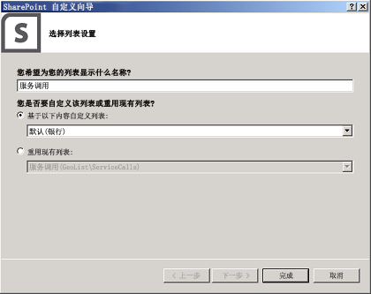
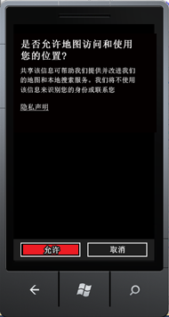

# 如何：将地图与 Windows Phone 应用程序和 SharePoint 2013 列表集成
了解如何使用新地位置字段、通过创建您自己的基于地理位置的字段类型，在 SharePoint 列表和基于位置的 Web和移动 SharePoint 外接程序中集成位置信息和地图。
SharePoint 2013 引入一个名为"地理位置"的新字段类型，该字段类型使您能够用位置信息注释 SharePoint 列表。在地理位置类型的列中，可以将地理信息输入为以小数位表示的一对纬度和经度的坐标，或从浏览器中检索用户当前位置的坐标（如果浏览器实现了 W3C Geolocation API）。在列表中，SharePoint 2013 显示 Bing 地图提供的地图上的位置。同时，"地理位置"字段和地图视图使您能够通过将 SharePoint 中的数据集成到地图体验，为任何信息提供空间范围，使您的用户以新的方式参与您的 Web 和移动应用程序以及解决方案。我们将帮助您创建一个简单的 Windows 7 移动应用程序，该程序使用 SharePoint 2013 地理位置字段类型功能使用地图功能，您将可以在移动 SharePoint 外接程序列表项目中显示地图。
  
    
    


> **重要信息**
> 如果您正在开发适用于 Windows Phone 8 的应用程序，则必须使用 Visual Studio Express 2012（而非 Visual Studio 2010 Express）。除开发环境以外，本文中的所有信息均适用于 Windows Phone 8 和 Windows Phone 7。 > 有关详细信息，请参阅 [如何：设置用于为 SharePoint 开发移动应用程序的环境](how-to-set-up-an-environment-for-developing-mobile-apps-for-sharepoint.md)。 
  
    
    


## 创建基于地图的 Windows 手机应用程序的先决条件
<a name="SP15Integratemaps_prereeq"> </a>

确保您已安装了下列程序：
  
    
    

- SharePoint 2013
    
  
- Visual Studio 2008
    
  
- 具有新的 SharePoint phone 模板的 Visual Studio Express 2010  [Microsoft SharePoint SDK for Windows Phone 7.1](http://www.microsoft.com/en-us/download/details.aspx?id=30476)
    
  
- 使用具有添加列的足够的权限访问 SharePoint 2013 列表
    
  
- 将 Bing 地图密钥部署到您的服务器；请参阅 [如何：在 SharePoint 2013 中设置 Web 和服务器场级别的必应 Bing 地图密钥](how-to-set-the-bing-maps-key-at-the-web-and-farm-level-in-sharepoint-2013.md)。
    
  

## 步骤 1：使用地理位置功能创建 SharePoint 字段
<a name="HowToCreateMapBasedPhoneApp_Step1"> </a>

默认情况下地理位置列在 SharePoint 列表中不可用。您必须编写代码将列添加到 SharePoint 列表。我们将向您展示如何使用 SharePoint 客户端对象模型将"地理位置"字段以编程方式添加到列表。将该字段添加到列表后，您可以将"地理位置"字段作为一项功能添加到列表。
  
    
    

### 创建 Visual Studio 项目


1. 以管理员身份登录运行 SharePoint 2013 的服务器。
    
  
2. 启动"Visual Studio"，然后选择"文件"，"新建项目"。这将打开"新建项目"对话框。
    
  
3. 在"新建项目"对话框中，依次选择"Visual C#"、"SharePoint 2013"、"SharePoint 2013"项目类型。 
    
  
4. 为项目命名。在此示例中，我们使用"GeoList"。选择"确定"按钮。
    
  
5. 在"SharePoint 自定义向导"中，输入使用同一 SharePoint 列表（您希望访问 Phone 开发的列表）的网站集的 URL。
    
  
6. 在"解决方案资源管理器"中打开"GeoList"项目的快捷菜单，然后选择"添加"、"新建项"。
    
  
7. 在"添加新项"对话框中选择"列表"。为列表命名。在此示例中，我们使用"ServiceCalls"。
    
  
8. 在"选择列表设置"对话框中，添加显示名称。在此示例中，我们使用"服务调用"。对于"选择以自定义列表"中选择"默认值(空白)"如图 1 所示。
    
    然后，选择"完成"。
    

   **图 1. 通过使用 SharePoint 列表向导添加 SharePoint 列表**

  


  

  

  

### 在 SharePoint 列表中添加功能


1. 在"解决方案资源管理器"中，展开"功能"节点。
    
  
2. 打开"Feature1"节点的快捷菜单，然后依次选择"添加"、"添加事件接收器"。
    
  
3. 取消注释 **FeatureActivated** 方法和 **FeatureDeactivating** 方法，然后添加以下代码。
    
  ```cs
  
public override void FeatureActivated(SPFeatureReceiverProperties properties)
{
    SPWeb site = properties.Feature.Parent as SPWeb;
    SPList list = site.Lists.TryGetList("Service Calls");
    if (list != null)
    {
        list.Fields.AddFieldAsXml(
            "<Field Type='Geolocation' DisplayName='Location'/>", 
            true, 
            SPAddFieldOptions.Default);
        list.Update();
    }
}
public override void FeatureDeactivating(
                     SPFeatureReceiverProperties properties)
{
    SPWeb site = properties.Feature.Parent as SPWeb;
    SPList list = site.Lists.TryGetList("Service Calls");
    if (list != null)
    {
        list.Delete();
    }
}
  ```

4. 通过选择 F6 键来生成解决方案。
    
  

## 步骤 2：部署列表并在基于位置的 SharePoint 列表中输入数据
<a name="HowToCreateMapBasedPhoneApp_Step2"> </a>

在此步骤中，您将在 Visual Studio中部署新建列表，并在 SharePoint 中使用新位置字段。 
  
    
    

### 部署 SharePoint 列表


- 在"解决方案资源管理器"中打开"GeoList"项目的快捷菜单，然后选择"部署"。
    
  

### 在具有"地理位置"字段的新 SharePoint 列表中输入数据


1. 成功部署列表后，打开您正在进行 phone 开发网站。
    
  
2. 选择"更多"，然后选择"服务调用"列表。
    
  
3. 选择"添加新项"。
    
  
4. 为"标题"字段提供标题。对于本示例，使用"新地理位置项"。
    
  
5. 在"位置"字段中选择"使用当前的位置"，或者您可以选择"指定位置"，然后输入"经度"和"纬度"值。
    
  
6. 选择"保存"。
    
  

## 步骤 3：为基于位置的列表建立 phone应用程序
<a name="HowToCreateMapBasedPhoneApp_Step3"> </a>

在此步骤中，您将创建一个使用您先前在步骤 1 和步骤 2 中创建的 SharePoint 列表创建一个手机应用程序。 
  
    
    

1. 登录到客户端上的手机开发环境。
    
  
2. 使用新的 SharePoint 模板启动 Visual Studio 2010 Express。
    
  
3. 在菜单栏中，选择"文件"，"新建项目"。
    
    则"新建项目"对话框打开。
    
  
4. 在"新建项目"对话框中依次选择"Visual C#"、"Silverlight for Windows Phone"、"Windows Phone SharePoint 列表应用程序"。
    
  
5. 为该项目命名。在此示例中，我们使用 GeoApp。选择"确定"按钮。
    
  
6. 在"SharePoint Phone 应用程序向导"的"步骤 2. 部署列表并在基于位置的 SharePoint 网站列表中输入数据"中输入已在其中部署列表的 SharePoint 网站的 URL，然后选择"查找列表"。
    
  
7. 选择"服务调用"列表，然后选择"下一步"。
    
  
8. 在"选择视图"页面上，选择"所有项"，然后选择"下一步"。
    
  
9. 在"选择操作"页面上选择"显示"，然后选择"下一步"。
    
  
10. 在"选择字段"页面上，选择您希望在手机应用程序中显示的字段，然后选择"下一步"。
    
  
11. 在"顺序字段"页面上，按需新排序字段，然后选择"完成"。
    
  

## 步骤 4：测试和验证您的应用程序
<a name="HowToCreateMapBasedPhoneApp_Step4"> </a>

在此步骤中，您可以运行您的应用程序并对其进行验证。
  
    
    

1. 在 Visual Studio 中，依次选择"调试"、"启动调试"。
    
  
2. 当出现提示时，在运行 SharePoint 的服务器上，使用具有管理员权限的凭据登录。
    
  
3. 在此示例中，请选择第一个条目"Brian Cox"。
    
  
4. 在"位置"字段中找到并选择"查找地图"链接。
    
  
5. 在"允许地图访问和使用您的位置"隐私策图屏幕上，选择"允许"如图 2 中所示。
    
   **图 2. 手机应用程序请求访问您当前的位置的权限**

  


  

    将显示地图视图，如图 3 所示。
    

   **图 3. 手机应用程序在 Bing 地图中显示位置**

  


  

  

  

> **注释**
> 用户对地理位置字段的体验在移动设备上与在浏览器中会有所不同。浏览器中提供的"使用特定位置"选项不可用于移动设备。对于移动设备，仅一个选项可用："使用我的位置"。 
  
    
    


## 其他资源
<a name="SP15Integmaps_addlresources"> </a>


-  [构建访问 SharePoint 2013 的 Windows Phone 应用程序](build-windows-phone-apps-that-access-sharepoint-2013.md)
    
  
-  [集成 SharePoint 2013 中的位置和映射功能](integrating-location-and-map-functionality-in-sharepoint-2013.md)
    
  
-  [如何：使用客户端呈现扩展地理位置字段类型](how-to-extend-the-geolocation-field-type-using-client-side-rendering.md)
    
  
-  [如何：在 SharePoint 2013 中以编程方式向列表添加 Geolocation 列](how-to-add-a-geolocation-column-to-a-list-programmatically-in-sharepoint-2013.md)
    
  
-  [如何：设置用于为 SharePoint 开发移动应用程序的环境](how-to-set-up-an-environment-for-developing-mobile-apps-for-sharepoint.md)
    
  
-  [Windows Phone 软件开发工具包 (SDK) 7.1](http://www.microsoft.com/zh-cn/download/details.aspx?id=27570)
    
  
-  [Microsoft SharePoint SDK for Windows Phone 7.1](http://www.microsoft.com/en-us/download/details.aspx?id=30476)
    
  

