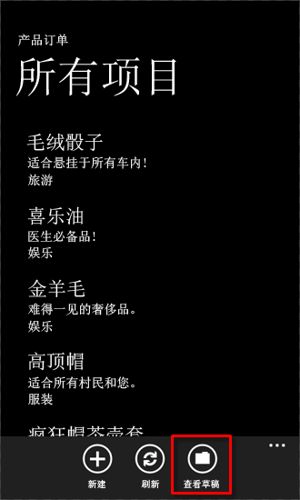
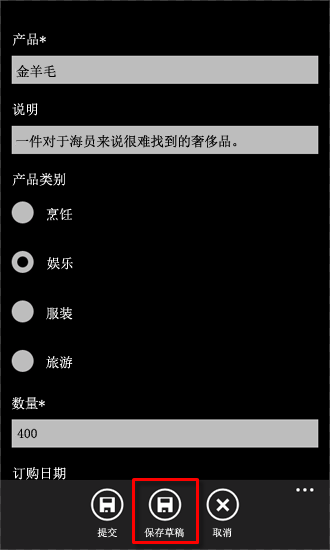
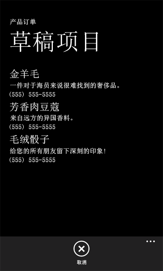
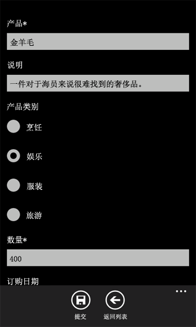

# 如何：在 Windows Phone 上存储和检索 SharePoint 列表项
了解 Windows Phone 应用程序生命周期和本地存储网络数据。
不管是对整个应用程序还是对应用程序中的各网页或数据项，Windows Phone 应用程序开发中最重要的考虑因素之一是管理状态信息。如果您正在开发 Windows Phone 应用程序，您必须考虑到应用程序的用户可能会丢失与网络资源（如 SharePoint 列表）的连接。Windows Phone 应用程序的开发基础结构提供了用于处理应用程序生命周期中各阶段状态信息的机制。
  
    
    


> **重要信息**
> 如果您正在开发适用于 Windows Phone 8 的应用程序，则必须使用 Visual Studio Express 2012（而非 Visual Studio 2010 Express）。除开发环境以外，本文中的所有信息均适用于 Windows Phone 8 和 Windows Phone 7。 > 有关详细信息，请参阅 [如何：设置用于为 SharePoint 开发移动应用程序的环境](how-to-set-up-an-environment-for-developing-mobile-apps-for-sharepoint.md)。 
  
    
    


## 在 Windows Phone 上本地存储 SharePoint 列表数据
<a name="BKMK_StoringDataLocally"> </a>

在 Windows Phone 上，在同一时刻只能运行一个应用程序，当用户切换到手机上的另一个应用程序时（例如，通过按手机上的"启动"按钮），当前运行的应用程序会停用，或用 Windows Phone 开发术语表示为"逻辑删除"。如果用户切换回已停用的应用程序（通过按"返回"按钮），应用程序会重新激活，但除非您提供用来处理应用程序生命周期中的应用程序状态信息的逻辑，否则在激活与停用之间的切换过程中，默认不保留状态信息。（有关 Windows Phone 应用程序的应用程序生命周期的详细信息，请参阅  [Windows Phone 执行模型概述](http://msdn.microsoft.com/zh-cn/library/ff817008%28v=VS.92%29.aspx)。）
  
    
    
对于 Windows Phone 应用程序， **PhoneApplicationService** 类公开了可用于管理应用程序状态的标准生命周期事件。在使用 Windows Phone SharePoint 列表应用程序模板创建的项目（与使用所有"Silverlight for Windows Phone"模板创建的项目一样）中，这些标准 Windows Phone 应用程序生命周期事件在 App.xaml 文件中声明并与代码隐藏文件 App.xaml.cs 中的事件处理程序相关联。您的 SharePoint 列表应用程序的 App.xaml 文件中的声明应类似于以下标记。
  
    
    


```

<Application.ApplicationLifetimeObjects>
    <!--Required object that handles lifetime events for the application-->
    <shell:PhoneApplicationService 
        Launching="Application_Launching" Closing="Application_Closing"Activated="Application_Activated" Deactivated="Application_Deactivated"/>
</Application.ApplicationLifetimeObjects>
```

在 App.xaml 文件中声明的 **Application_Activated** 和 **Application_Deactivated** 事件处理程序是在 App.xaml.cs 代码隐藏文件中实现的，该代码隐藏文件的默认逻辑是只要应用程序未终止即缓存应用程序状态信息以在手机应用程序中使用。这些事件的处理程序的实现使用 **PhoneApplicationService** 类的 **State** 属性（提供对 **Dictionary** 对象的访问权限）来存储数据。在此 **State** 属性中存储的数据是暂时的。即，它在应用程序停用或逻辑删除时会保留，但在应用程序终止时不会保留。在项目中处理应用程序生命周期事件时，要牢记当用户切换到另一个应用程序时，根据具体环境，停用的应用程序可能被 Windows Phone 操作系统终止。手机上未保存到永久存储的数据会丢失，即使使用 **PhoneApplicationService** 的 **State** 属性将数据保存到临时存储也会丢失。
  
    
    
在从 SharePoint 列表中获取数据的 Windows Phone 应用程序中，手机会话过程中使用的数据当然可以在运行 SharePoint Server 的服务器中检索到（如果服务器可用）。但是，由于服务覆盖范围的位置及其他因素的变化，Windows Phone 设备可能无法持续连接到 SharePoint Server。为了在与运行 SharePoint Server 的服务器丢失连接时您的应用程序用户能够访问数据，或是仅为了不管服务器是否可用都将应用程序会话之间的数据存储到永久存储中，您可以使用 **PhoneApplicationService** 类的 **Closing** 和 **Launching** 事件。
  
    
    
这些事件的 **Application_Launching** 和 **Application_Closing** 处理程序在 App.xaml 中声明且在 App.xaml.cs 文件中定义，但它们均未实现。要在应用程序终止环境中处理应用程序状态信息的存储和检索，您可以实现 **Application_Closing** 事件处理程序以将数据存储在为应用程序指定的独立存储中，以使应用程序会话之间的数据仍然存在，您还可以在启动新应用程序会话（即启动应用程序）时实现 **Application_Launching** 事件处理程序以从独立的存储中检索数据，即使连接不到作为原始数据源的运行 SharePoint Server 的服务器。
  
    
    

> **提示**
> 在将数据保存到本地设备之前，应该对数据加密。有关如何对数据加密的详细信息，请参阅 [如何加密 Windows Phone 应用程序](http://msdn.microsoft.com/zh-cn/library/hh487164%28VS.92%29.aspx)
  
    
    


### 实现用于存储、检索应用程序状态的事件处理程序


1. 按照 [如何：创建 Windows Phone SharePoint 2013 列表应用程序](how-to-create-a-windows-phone-sharepoint-2013-list-app.md)中的步骤，使用 Visual Studio 中的 Windows Phone SharePoint 列表应用程序模板创建一个 Windows Phone 应用程序。
    
  
2. 在"解决方案资源管理器"中，选择 App.xaml 文件。
    
  
3. 按 F7 打开代码隐藏文件 App.xaml.cs 以供编辑。
    
  
4. 找到 **Application_Launching** 事件处理程序的（空）实现并将该事件处理程序替换为以下代码。
    
  ```cs
  
private void Application_Launching(object sender, LaunchingEventArgs e)
{
    if (IsolatedStorageSettings.ApplicationSettings.Contains(DataProvider.ListTitle))
    {
        App.MainViewModel = (ListViewModel)IsolatedStorageSettings.ApplicationSettings
                                              [DataProvider.ListTitle];                
        App.MainViewModel.Initialize();
    }
}
  ```

5. 找到 **Application_Closing** 事件处理程序的（空）实现并将该事件处理程序替换为以下代码。
    
  ```cs
  
private void Application_Closing(object sender, ClosingEventArgs e)
{
    if (IsolatedStorageSettings.ApplicationSettings.Contains(DataProvider.ListTitle))
    {
        IsolatedStorageSettings.ApplicationSettings[DataProvider.ListTitle] = App.MainViewModel;
    }
    else
    {
        IsolatedStorageSettings.ApplicationSettings.Add(DataProvider.ListTitle, App.MainViewModel);
    }
    IsolatedStorageSettings.ApplicationSettings.Save();
}
  ```

6. 保存该文件。
    
  
完成以上实现后，运行您的应用程序以使用来自运行 SharePoint Server 的服务器的数据初始化应用程序中的主 ViewModel。退出手机上的应用程序（通过按"返回"按钮以导航到应用程序的第一页）以触发 **Application_Closing** 事件。如果您在未连接到服务器的情况下运行应用程序，将会检索并初始化已保存到 **IsolatedStorageSettings** **Dictionary** 对象（在 **Application_Closing** 事件中）的 ViewModel。在应用程序的上一会话中保存到独立存储的 SharePoint 列表项会显示在应用程序的列表窗体 (List.xaml) 中。
  
    
    

## 实现用于脱机编辑列表项的机制
<a name="BKMK_ImplementingOfflineEditing"> </a>

如果您按照上一部分中的过程在应用程序中实现 **Closing** 和 **Launching** 事件的处理程序，则当连接可用时从服务器检索的 SharePoint 列表数据可以显示在您的应用程序中，即使在应用程序的后续会话中丢失与服务器的连接也会如此，因为列表项是从手机上的永久存储中检索的。然而，基于上一部分中的实现，以这种方式脱机显示的列表项无法编辑和保存到服务器，除非恢复连接。在以下过程中，您要向您的应用程序添加一个机制，以便在连接不可用时本地存储编辑后的列表项。与服务器的连接再次可用时，您可以检索这些编辑后的列表项并将您的更改保存回服务器。
  
    
    
对于本部分中的过程，我们假设您在使用 Windows Phone SharePoint 列表应用程序模板创建的 Windows Phone 应用程序项目环境中工作，而且您的应用程序基于使用服务器上的自定义列表模板创建的"产品订单数"列表，并且包含表 1 中所示的列和字段类型。
  
    
    

**表 1. "产品订单数"列表示例**


|**列**|**类型**|**必需**|
|:-----|:-----|:-----|
|产品（例如，标题）  <br/> |单行文本（文本）  <br/> |是  <br/> |
|说明  <br/> |单行文本（文本）  <br/> |否  <br/> |
|数量  <br/> |编号  <br/> |是  <br/> |
|订单日期  <br/> |日期和时间 (Datetime)  <br/> |否  <br/> |
|完成时间  <br/> |日期和时间 (Datetime)  <br/> |否  <br/> |
|联系人号码  <br/> |单行文本（文本）  <br/> |否  <br/> |
   

### 实现用于支持脱机编辑项的类


1. 从基于表 1 表示的"产品订单数"列表创建的 Visual Studio 项目开始，在"解决方案资源管理器"中，选择表示该项目的节点（例如，SPListAppLocalStorage）。
    
  
2. 在"项目"菜单中，选择"添加类"。 
    
    "添加新项"对话框出现，其中 C#"类"模板处于选中状态。
    
  
3. 将类文件命名为 DraftItemStore.cs，然后选择"添加"。 
    
    类文件将添加到项目中并打开以供编辑。
    
  
4. 用以下代码替换类文件的内容。
    
  ```cs
  
using System;
using System.Net;
using System.Windows;
using System.Collections.Generic;
using System.IO.IsolatedStorage;

namespace SPListAppLocalStorage // Based on project name by default.
{
    public class DraftItemStore
    {
        const string DraftsKey = "Drafts";

        public static void AddDraftItem(string id, EditItemViewModel model)
        {
            Dictionary<string, EditItemViewModel> draftCollection = GetDraftItemCollection();
            draftCollection[id] = model;
            SaveDrafts(draftCollection);
        }

        public static void RemoveDraftItem(string id)
        {
            Dictionary<string, EditItemViewModel> draftCollection = GetDraftItemCollection();
            draftCollection.Remove(id);
            SaveDrafts(draftCollection);
        }

        public static void SaveDrafts(Dictionary<string, EditItemViewModel> draft)
        {
            if (IsolatedStorageSettings.ApplicationSettings.Contains(DraftsKey))
            {
                IsolatedStorageSettings.ApplicationSettings[DraftsKey] = draft;
            }
            else
            {
                IsolatedStorageSettings.ApplicationSettings.Add(DraftsKey, draft);
            }
        }

        public static List<EditItemViewModel> Drafts
        {
            get
            {
                Dictionary<string, EditItemViewModel> draftCollection = GetDraftItemCollection();

                List<EditItemViewModel> modelCollection = new List<EditItemViewModel>();
                foreach (KeyValuePair<string, EditItemViewModel> entry in draftCollection)
                {
                    modelCollection.Add(entry.Value);
                }

                return modelCollection;
            }
        }

        public static Dictionary<string, EditItemViewModel> GetDraftItemCollection()
        {
            Dictionary<string, EditItemViewModel> draftCollection = null;
            if (IsolatedStorageSettings.ApplicationSettings.Contains(DraftsKey))
                draftCollection = (Dictionary<string,
                EditItemViewModel>)IsolatedStorageSettings.ApplicationSettings[DraftsKey];

            if (draftCollection == null)
                draftCollection = new Dictionary<string, EditItemViewModel>();

            return draftCollection;
        }

        public static EditItemViewModel GetDraftItemById(string id)
        {
            Dictionary<string, EditItemViewModel> draftCollection = GetDraftItemCollection();
            return !draftCollection.ContainsKey(id) ? null : draftCollection[id];
        }
    }
}
  ```


    此代码中指定的命名空间基于项目的名称（在本例中为 SPListAppLocalStorage）。您可能希望基于您的项目名称指定一个不同的命名空间。
    
  
5. 保存该文件。
    
  
 **EditItemViewModel** 类的一个特定实例表示手机中正在编辑的一个 SharePoint 列表项。您可以考虑将编辑过的列表项视为"草稿项"，然后将对项目的更改保存到服务器。在此类中的代码中， **AddDraftItem** 方法将 **EditItemViewModel** 类（即草稿项目）的特定实例作为一个值添加到 **Dictionary** 对象，从而将 **Dictionary** 中的 **EditItemViewModel** 与基于给定列表项的标识符的一个键相关联。（标识符由 SharePoint Server 分配给列表中的每个项。在基于 Windows Phone SharePoint 列表应用程序模板的项目中，该标识符存储在给定 **ViewModel** 类的 **ID** 属性中，如 **EditItemViewModel** 或 **DisplayItemViewModel**，它表示列表项。） **RemoveDraftItem** 方法基于指定标识符从 **Dictionary** 对象中删除 **EditItemViewModel**。这两个方法均使用 **GetDraftItemCollection** 方法从独立的存储中检索包含 **EditItemViewModel** 对象的 **Dictionary** 对象，而且均使用 **SaveDrafts** 方法将修改后的 **Dictionary** 对象（在其中添加或删除了一个草稿项）保存回独立的存储中。 **GetDraftItemCollection** 方法首先确定"草稿" **Dictionary** 对象是否已保存到独立存储中。如果是，该方法将返回该 **Dictionary** 对象；否则，此方法将初始化并返回一个新的 **Dictionary** 对象。通过将草稿项的列表（即基于 **List<T>** 泛型的对象）作为 **EditItemViewModel** 对象返回，类的 **Drafts** 属性提供了对草稿项的 **Dictionary** 的访问权限。 **GetDraftItemById** 方法基于指定的标识符值从 **Dictionary** 对象返回一个给定的草稿项。
  
    
    
现在，您可以将元素添加到手机应用程序的用户界面并将它们配置为使用 **DraftItemStore** 类来脱机编辑列表项。在下列过程中，您将：
  
    
    

- 添加并配置一个 Windows Phone 页来显示作为草稿项保存在手机独立存储中的所有列表项。
    
  
- 添加并配置另一个页面，它绑定到 **EditItemViewModel**，用于编辑单个草稿项，类似于列表项的"编辑"窗体 (EditForm.xaml)。
    
  
- 将 **SaveAsDraft** 方法添加到 **EditItemViewModel** 类，该类执行在前面过程中实现的 **DraftItemStore** 类的 **AddDraftItem** 方法。
    
  
- 将一个 **ApplicationBar** 按钮添加到 EditForm.xaml 文件来调用 **SaveAsDraft** 方法。
    
  
- 将一个 **ApplicationBar** 按钮添加到 List.xaml 文件以导航到显示所有保存为草稿的列表项的页面。
    
  

### 添加用于显示手机上保存的所有草稿项的页面


1. 在"解决方案资源管理器"中，选择"视图"文件夹。
    
  
2. 在"项目"菜单中，选择"添加新项"。 
    
    将打开"添加新项"对话框。
    
  
3. 在"添加新项"对话框中，在"Visual C#"节点下，选择"Silverlight for Windows Phone"节点。
    
  
4. 在"模板"窗格中，选择"Windows Phone 纵向页面"模板。
    
  
5. 将文件命名为 Drafts.xaml，然后选择"添加"。 
    
    该文件将添加到项目的"视图"节点下并打开以供编辑。
    
  
6. 在设计器的 XAML 窗格中，用以下 XAML 替换文件的内容。
    
  ```
  
<phone:PhoneApplicationPage
    x:Class="SPListAppLocalStorage.Views.Drafts"
    xmlns="http://schemas.microsoft.com/winfx/2006/xaml/presentation"
    xmlns:x="http://schemas.microsoft.com/winfx/2006/xaml"
    xmlns:phone="clr-namespace:Microsoft.Phone.Controls;assembly=Microsoft.Phone"
    xmlns:shell="clr-namespace:Microsoft.Phone.Shell;assembly=Microsoft.Phone"
    xmlns:d="http://schemas.microsoft.com/expression/blend/2008"
    xmlns:mc="http://schemas.openxmlformats.org/markup-compatibility/2006"
    FontFamily="{StaticResource PhoneFontFamilyNormal}"
    FontSize="{StaticResource PhoneFontSizeNormal}"
    Foreground="{StaticResource PhoneForegroundBrush}"
    SupportedOrientations="Portrait" Orientation="Portrait"
    mc:Ignorable="d" d:DesignHeight="696" d:DesignWidth="480"
    shell:SystemTray.IsVisible="True">

    <!--LayoutRoot is the root grid where all page content is placed-->
    <Grid x:Name="LayoutRoot" Background="Transparent">
        <Grid.RowDefinitions>
            <RowDefinition Height="Auto"/>
            <RowDefinition Height="*"/>
        </Grid.RowDefinitions>

        <!--TitlePanel contains the name of the application and page title-->
        <StackPanel x:Name="TitlePanel" Grid.Row="0" Margin="12,17,0,28">
            <TextBlock x:Name="ApplicationTitle" Text="Product Orders" 
                                    Style="{StaticResource PhoneTextNormalStyle}"/>
            <TextBlock x:Name="PageTitle" Text="Draft Items" Margin="9,-7,0,0" 
                                      Style="{StaticResource PhoneTextTitle1Style}"/>
        </StackPanel>

        <!--ContentPanel - place additional content here-->
        <Grid x:Name="ContentPanel" Grid.Row="1" Margin="12,0,12,0">
            <ListBox x:Name="lstBoxDraftItems" ItemsSource="{Binding}"
                                  SelectionChanged="lstBoxDraftItems_SelectionChanged">
                <ListBox.ItemTemplate>
                    <DataTemplate>
                        <StackPanel>
                            <TextBlock Text="{Binding [Title]}" Style="
                                           {StaticResource PhoneTextTitle2Style}"></TextBlock>
                            <TextBlock Text="{Binding [Description]}" Style="
                                            {StaticResource PhoneTextNormalStyle}"></TextBlock>
                            <TextBlock Text="{Binding [Contact_x0020_Number]}" Style="
                                           {StaticResource PhoneTextNormalStyle}"></TextBlock>
                        </StackPanel>
                    </DataTemplate>
                </ListBox.ItemTemplate>
            </ListBox>
        </Grid>
    </Grid>
 
    <phone:PhoneApplicationPage.ApplicationBar>
        <shell:ApplicationBar IsVisible="True" IsMenuEnabled="True">
            <shell:ApplicationBarIconButton x:Name="btnCancel" 
             IconUri="/Images/appbar.cancel.rest.png" Text="Cancel" Click="OnCancelButtonClick" />
        </shell:ApplicationBar>
    </phone:PhoneApplicationPage.ApplicationBar>

</phone:PhoneApplicationPage>
  ```


    此代码中的命名空间指定  `<x:Class>`("SPListAppLocalStorage.Views.Drafts") 将根据您项目的名称而变化。
    
  
7. 在"解决方案资源管理器"中选中 Drafts.xaml 文件后，按 F7 打开相关联的代码隐藏文件 Drafts.xaml.cs 以供编辑。
    
  
8. 用以下代码替换文件的内容。
    
  ```cs
  
using System;
using System.Collections.Generic;
using System.Linq;
using System.Net;
using System.Windows;
using System.Windows.Controls;
using System.Windows.Documents;
using System.Windows.Input;
using System.Windows.Media;
using System.Windows.Media.Animation;
using System.Windows.Shapes;
using Microsoft.Phone.Controls;

namespace SPListAppLocalStorage.Views
{
    public partial class Drafts : PhoneApplicationPage
    {
        public Drafts()
        {
            InitializeComponent();
            this.Loaded += new RoutedEventHandler(Drafts_Loaded);
        }

        private void lstBoxDraftItems_SelectionChanged(object sender, SelectionChangedEventArgs e)
        {
            ListBox lstBox = sender as ListBox;
            if (lstBox.SelectedIndex == -1)
                return;

            EditItemViewModel selectedDraftItem = lstBox.SelectedItem as EditItemViewModel;
            NavigationService.Navigate(new Uri(string.Format("/Views/DraftItemEditForm.xaml?ID={0}",
                                                   selectedDraftItem.ID), UriKind.Relative));

            lstBox.SelectedIndex = -1;
        }

        void Drafts_Loaded(object sender, RoutedEventArgs e)
        {
            this.DataContext = DraftItemStore.Drafts;
        }

        private void OnCancelButtonClick(object sender, EventArgs e)
        {
            // Navigate back to initial List View form.
            NavigationService.Navigate(new Uri("/Views/List.xaml", UriKind.Relative));
        }
    }
}
  ```

9. 保存文件。
    
  

### 添加用于编辑单个草稿项的页面


1. 在"解决方案资源管理器"中，选择"视图"文件夹。
    
  
2. 在"项目"菜单中，选择"添加新项"。 
    
    将打开"添加新项"对话框。
    
  
3. 在"添加新项"对话框中，在"Visual C#"节点下，选择"Silverlight for Windows Phone"节点。
    
  
4. 在"模板"窗格中，选择"Windows Phone 纵向页面"模板。
    
  
5. 将文件命名为 DraftItemEditForm.xaml，然后选择"添加"。 
    
    该文件将添加到项目的"视图"节点下并打开以供编辑。
    
  
6. 在设计器的 XAML 窗格中，用以下 XAML 替换文件的内容。
    
  ```
  
<phone:PhoneApplicationPage
    x:Class="SPListAppLocalStorage.DraftItemEditForm"
    xmlns="http://schemas.microsoft.com/winfx/2006/xaml/presentation"
    xmlns:x="http://schemas.microsoft.com/winfx/2006/xaml"
    xmlns:phone="clr-namespace:Microsoft.Phone.Controls;assembly=Microsoft.Phone"
    xmlns:shell="clr-namespace:Microsoft.Phone.Shell;assembly=Microsoft.Phone"
    xmlns:d="http://schemas.microsoft.com/expression/blend/2008"
    xmlns:mc="http://schemas.openxmlformats.org/markup-compatibility/2006"
    mc:Ignorable="d" d:DesignWidth="480" d:DesignHeight="696"
    FontFamily="{StaticResource PhoneFontFamilyNormal}"
    FontSize="{StaticResource PhoneFontSizeNormal}"
    Foreground="{StaticResource PhoneForegroundBrush}"
    SupportedOrientations="Portrait" Orientation="Portrait"
    shell:SystemTray.IsVisible="True" x:Name="DraftItemEditPage">

    <!--LayoutRoot is the root grid where all page content is placed-->
    <Grid x:Name="LayoutRoot" Background="Transparent"
        xmlns:x="http://schemas.microsoft.com/winfx/2006/xaml" 
             xmlns:controls="clr-namespace:Microsoft.Phone.Controls;assembly=
                Microsoft.Phone.Controls">
        <StackPanel>
            <ProgressBar Background="Red" x:Name="progressBar" Opacity="1" 
                                    HorizontalAlignment="Center" VerticalAlignment="Top" 
                                    Height="15" Width="470" IsIndeterminate="{Binding IsBusy}" 
                                    Visibility="{Binding ShowIfBusy}" />
            <ScrollViewer HorizontalScrollBarVisibility="Auto" Height="700">
                <Grid x:Name="ContentPanel" Width="470">
                    <StackPanel Margin="0,5,0,5">
                        <StackPanel Orientation="Vertical" Margin="0,5,0,5">
                            <TextBlock TextWrapping="Wrap" HorizontalAlignment="Left" 
                                Style="{StaticResource PhoneTextNormalStyle}">Product*</TextBlock>
                            <TextBox Style="{StaticResource TextValidationTemplate}" 
                         FontSize="{StaticResource   PhoneFontSizeNormal}" Width="470" 
                         HorizontalAlignment="Left" Name="txtTitle" Text="{Binding [Title], 
                                   Mode=TwoWay,ValidatesOnNotifyDataErrors=True,NotifyOnValidationError=True}" 
                                                                         TextWrapping="Wrap" />
                        </StackPanel>
                        <StackPanel Orientation="Vertical" Margin="0,5,0,5">
                            <TextBlock TextWrapping="Wrap" HorizontalAlignment="Left" 
                               Style="{StaticResource PhoneTextNormalStyle}">Description</TextBlock>
                            <TextBox Style="{StaticResource TextValidationTemplate}" 
                               FontSize="{StaticResource PhoneFontSizeNormal}" Width="470" 
                                HorizontalAlignment="Left" Name="txtDescription" 
                                                           Text="{Binding [Description],
                                                           Mode=TwoWay, ValidatesOnNotifyDataErrors=True, 
                                                           NotifyOnValidationError=True}" 
                                       TextWrapping="Wrap" />
                        </StackPanel>
                        <StackPanel Orientation="Vertical" Margin="0,5,0,5">
                            <TextBlock TextWrapping="Wrap" HorizontalAlignment="Left" 
                               Style="{StaticResource PhoneTextNormalStyle}">
                                                           Product Category</TextBlock>
                            <ListBox MaxHeight="400" Width="Auto" x:Name="lstBoxProduct_x0020_Category"
                                              ItemsSource="{Binding [Product_x0020_Category]}">
                                <ListBox.ItemTemplate>
                                    <DataTemplate>
                                        <RadioButton FontSize="{StaticResource PhoneFontSizeNormal}" 
                                          HorizontalAlignment="Left" GroupName="Product_x0020_Category" 
                                                                 Content="{Binding Name}" 
                               IsChecked="{Binding IsChecked, Mode=TwoWay}" />
                                    </DataTemplate>
                                </ListBox.ItemTemplate>
                            </ListBox>
                        </StackPanel>
                        <StackPanel Orientation="Vertical" Margin="0,5,0,5">
                            <TextBlock TextWrapping="Wrap" HorizontalAlignment="Left" 
                                       Style="{StaticResource PhoneTextNormalStyle}">Quantity*</TextBlock>
                            <TextBox Style="{StaticResource TextValidationTemplate}" 
                                   FontSize="{StaticResource PhoneFontSizeNormal}" Width="470" 
                                      HorizontalAlignment="Left" Name="txtQuantity" Text="{Binding [Quantity], 
                                        Mode=TwoWay, ValidatesOnNotifyDataErrors=True, 
                                           NotifyOnValidationError=True}"
                                             TextWrapping="Wrap" />
                        </StackPanel>
                        <StackPanel Orientation="Vertical" Margin="0,5,0,5">
                            <TextBlock TextWrapping="Wrap" HorizontalAlignment="Left" 
                                Style="{StaticResource PhoneTextNormalStyle}">Order Date</TextBlock>
                            <TextBox Height="Auto" Style="{StaticResource TextValidationTemplate}"
                                               FontSize="{StaticResource PhoneFontSizeNormal}" Width="470"  
                                                         HorizontalAlignment="Left" Name="txtOrder_x0020_Date" 
                         Text="{Binding [Order_x0020_Date], Mode=TwoWay, ValidatesOnNotifyDataErrors=True, 
                                           NotifyOnValidationError=True}" TextWrapping="Wrap" />
                            <TextBlock FontSize="16" TextWrapping="Wrap" HorizontalAlignment="Left" 
                                                 Style="{StaticResource PhoneTextSubtleStyle}" 
                                                             Text="{Binding DateTimeFormat}" />
                        </StackPanel>
                        <StackPanel Orientation="Vertical" Margin="0,5,0,5">
                            <TextBlock TextWrapping="Wrap" HorizontalAlignment="Left" 
                         Style="{StaticResource PhoneTextNormalStyle}">Fulfillment Date</TextBlock>
                            <TextBox Height="Auto" Style="{StaticResource TextValidationTemplate}"
                                          FontSize="{StaticResource PhoneFontSizeNormal}" Width="470" 
                                          HorizontalAlignment="Left" Name="txtFulfillment_x0020_Date" 
                        Text="{Binding [Fulfillment_x0020_Date], Mode=TwoWay, 
                     ValidatesOnNotifyDataErrors=True, NotifyOnValidationError=True}" 
                         TextWrapping="Wrap" />
                            <TextBlock FontSize="16" TextWrapping="Wrap" HorizontalAlignment="Left"
                                                    Style="{StaticResource PhoneTextSubtleStyle}" Text="{Binding
                                                           DateTimeFormat}" />
                        </StackPanel>
                        <StackPanel Orientation="Horizontal">
                            <TextBlock TextWrapping="Wrap" Width="150" HorizontalAlignment="Left"
                                                  Style="{StaticResource PhoneTextNormalStyle}">Rush 
                                                                   :</TextBlock>
                            <CheckBox Name="txtRush" FontSize="{StaticResource PhoneFontSizeNormal}" 
                                          HorizontalAlignment="Left" IsChecked="{Binding [Rush], Mode=TwoWay, 
                               ValidatesOnNotifyDataErrors=True, NotifyOnValidationError=True}" />
                        </StackPanel>
                        <StackPanel Orientation="Vertical" Margin="0,5,0,5">
                            <TextBlock TextWrapping="Wrap" HorizontalAlignment="Left" 
                        Style="{StaticResource PhoneTextNormalStyle}">Contact Number</TextBlock>
                            <TextBox Style="{StaticResource TextValidationTemplate}" 
                                   FontSize="{StaticResource PhoneFontSizeNormal}" Width="470"
                                              HorizontalAlignment="Left" Name="txtContact_x0020_Number"
                                                         Text="{Binding [Contact_x0020_Number], 
                                                         Mode=TwoWay, ValidatesOnNotifyDataErrors=True, 
                                                         NotifyOnValidationError=True}" 
                                                                           TextWrapping="Wrap" />
                        </StackPanel>
                    </StackPanel>
                </Grid>
            </ScrollViewer>
        </StackPanel>
    </Grid>

    <phone:PhoneApplicationPage.ApplicationBar>
        <shell:ApplicationBar IsVisible="True" IsMenuEnabled="True">
            <shell:ApplicationBarIconButton x:Name="btnSubmit" 
                                IconUri="/Images/appbar.save.rest.png" 
                                Text="Submit" Click="OnSubmitButtonClick"/>
            <shell:ApplicationBarIconButton x:Name="btnBack" 
                                IconUri="/Images/appbar.back.rest.png" 
                                 Text="Back to List" Click="OnBackButtonClick"/>
        </shell:ApplicationBar>
    </phone:PhoneApplicationPage.ApplicationBar>

</phone:PhoneApplicationPage>
  ```


    用于定义此页的 XAML 与 EditForm.xaml 文件类似。您可以复制 EditForm.xaml 文件用作 DraftItemEditForm.xaml 的基础，依照此标记中的指示对文件进行修改。
    
  
7. 在"解决方案资源管理器"中选中 DraftItemEditForm.xaml 文件后，按 F7 打开相关联的代码隐藏文件 DraftItemEditForm.xaml.cs 以供编辑。
    
  
8. 用以下代码替换文件的内容。
    
  ```cs
  
using System;
using System.Collections.Generic;
using System.Linq;
using System.Net;
using System.Windows;
using System.Windows.Controls;
using System.Windows.Documents;
using System.Windows.Input;
using System.Windows.Media;
using System.Windows.Media.Animation;
using System.Windows.Shapes;
using Microsoft.Phone.Controls;
using Microsoft.SharePoint.Client;
using Microsoft.Phone.Tasks;
using System.Device.Location;
using Microsoft.Phone.Shell;
using Microsoft.SharePoint.Phone.Application;

namespace SPListAppLocalStorage
{
    public partial class DraftItemEditForm : PhoneApplicationPage
    {
        EditItemViewModel viewModel;

        /// <summary>
        /// Constructor for Draft Item Edit Form.
        /// </summary>
        public DraftItemEditForm()
        {
            InitializeComponent();
        }

        protected override void OnNavigatedTo(System.Windows.Navigation.NavigationEventArgs e)
        {
 // Include initialization of ViewModel here rather than in constructor to be able to use QueryString value.
            if (viewModel == null)
            {
                viewModel = DraftItemStore.GetDraftItemById(NavigationContext.QueryString["ID"].ToString());
            }

            viewModel.Initialize();
            this.DataContext = viewModel;

            base.OnNavigatedTo(e);
            viewModel.ItemUpdated += new EventHandler<ItemUpdatedEventArgs>(OnItemUpdated);
        }

        protected override void OnNavigatedFrom(System.Windows.Navigation.NavigationEventArgs e)
        {
            base.OnNavigatedFrom(e);
            viewModel.ItemUpdated -= new EventHandler<ItemUpdatedEventArgs>(OnItemUpdated);
        }

        private void OnViewModelInitialization(object sender, InitializationCompletedEventArgs e)
        {
            this.Dispatcher.BeginInvoke(() =>
            {
                // If initialization has failed show error message and return.
                if (e.Error != null)
                {
                    MessageBox.Show(e.Error.Message, e.Error.GetType().Name, MessageBoxButton.OK);
                    return;
                }

                // Set Page's DataContext to current ViewModel instance.
                this.DataContext = (sender as EditItemViewModel);
            });
        }

        private void OnCancelButtonClick(object sender, EventArgs e)
        {
            NavigationService.Navigate(new Uri("/Views/List.xaml", UriKind.Relative));
        }

        private void OnSubmitButtonClick(object sender, EventArgs e)
        {
            viewModel.UpdateItem();
        }

        private void OnItemUpdated(object sender, ItemUpdatedEventArgs e)
        {
            this.Dispatcher.BeginInvoke(() =>
            {
                if (e.Error != null)
                {
                    MessageBox.Show(e.Error.Message, e.Error.GetType().Name, MessageBoxButton.OK);
                    return;
                }

                // Remove Draft Item from local storage if update to server succeeds.
                DraftItemStore.RemoveDraftItem(viewModel.ID.ToString());
                this.NavigationService.Navigate(new Uri("/Views/List.xaml", UriKind.Relative));
            });
        }

        private void OnBackButtonClick(object sender, EventArgs e)
        {
            NavigationService.Navigate(new Uri("/Views/List.xaml", UriKind.Relative));
        }
    }
}
  ```


    您可以看到，此文件中使用的命名空间基于项目名称 (SPListAppLocalStorage)。
    
  
9. 将在 DraftItemEditForm.xaml 文件中声明的 **ApplicationBar** 按钮 (btnBack) 的 appbar.back.rest.png 图像添加到您的项目。在"解决方案资源管理器"中，选择项目中的"Images"文件夹节点。
    
  
10. 在"项目"菜单中，选择"添加现有项"。 
    
  
11. 在打开的浏览器中，导航到包含由 Windows Phone SDK 7.1 安装的标准 Windows Phone 图标图像的文件夹中。
    
    > **注释**
      > 前景为浅色且背景为深色的图像位于 SDK 标准安装的  `%PROGRAMFILES%(x86)\\Microsoft SDKs\\Windows Phone\\v7.1\\Icons\\dark` 中。
12. 选择名为 appbar.back.rest.png 的文件图像，并选择"添加"。图像会添加到项目的Images节点下。
    
  
13. 在"解决方案资源管理器"中，选择您刚添加的图像文件，并在该文件的"属性窗口"中，将图像文件的"生成操作"属性设置为"内容"，并将"复制到输出目录"属性设置为"如果较新则复制"[###Copy if newer]。
    
  
14. 保存文件。
    
  

### 将 ApplicationBar 按钮添加到"编辑"窗体以将项保存为草稿


1. 在"解决方案资源管理器"中，选择项目中的"ViewModels"节点下的 EditItemViewModel.cs 文件。按 F7 打开文件以供编辑。
    
  
2. 在用于实现 **EditItemViewModel** 类的代码块（由成对的括号限定）内，将以下公用方法添加到文件。
    
  ```cs
  
public void SaveAsDraft()
{
    DraftItemStore.AddDraftItem(this.ID.ToString(), this);
}
  ```

3. 在"解决方案资源管理器"中，在项目中的"视图节点下，双击 EditForm.xaml 文件。 
    
    文件在设计器中打开以供编辑。
    
  
4. 在设计器的 XAML 窗格中，将另一个按钮（即除了现有的"提交"和"取消"按钮以外）添加到  `<shell:ApplicationBar>` 标记，如以下 XAML 中所示。
    
  ```
  
<phone:PhoneApplicationPage.ApplicationBar>
    <shell:ApplicationBar IsVisible="True" IsMenuEnabled="True">
        <shell:ApplicationBarIconButton x:Name="btnSubmit" 
              IconUri="/Images/appbar.save.rest.png" 
              Text="Submit" Click="OnBtnSubmitClick"/>
        <shell:ApplicationBarIconButton x:Name="btnSaveDraft"            IconUri="/Images/appbar.save.rest.png" Text="Save Draft"            Click="OnSaveDraftButtonClick"/>
        <shell:ApplicationBarIconButton x:Name="btnCancel" 
                      IconUri="/Images/appbar.cancel.rest.png" 
                      Text="Cancel" Click="OnCancelButtonClick"/>
    </shell:ApplicationBar>
</phone:PhoneApplicationPage.ApplicationBar>
  ```

5. 在"解决方案资源管理器"中选中 EditForm.xaml 文件后，按 F7 打开相关联的代码隐藏文件 EditForm.xaml.cs 以供编辑。
    
  
6. 在用于实现 **EditForm** 分部类的代码块（由成对的括号限定）内，将以下事件处理程序添加到文件。
    
  ```cs
  
private void OnSaveDraftButtonClick(object sender, EventArgs e)
{
    viewModel.SaveAsDraft();
}
  ```

7. 保存文件。
    
  

### 将 ApplicationBar 按钮添加到列表视图窗体以显示所有草稿项


1. 在"解决方案资源管理器"中的"视图"节点下，双击 List.xaml 文件。 
    
    文件在设计器中打开以供编辑。
    
  
2. 在设计器的 XAML 窗格中，将另一个按钮（即除了现有的"新建"和"刷新"按钮以外）添加到 **<shell:ApplicationBar>** 标记，如以下 XAML 中所示。
    
  ```
  
<phone:PhoneApplicationPage.ApplicationBar>
    <shell:ApplicationBar IsVisible="True" IsMenuEnabled="True">
        <shell:ApplicationBarIconButton x:Name="btnNew" 
        IconUri="/Images/appbar.new.rest.png" Text="New" 
                    Click="OnNewButtonClick"/>
        <shell:ApplicationBarIconButton x:Name="btnRefresh" 
                   IconUri="/Images/appbar.refresh.rest.png" 
        Text="Refresh" IsEnabled="True" Click="OnRefreshButtonClick"/>
        <shell:ApplicationBarIconButton x:Name="btnDrafts"            IconUri="/Images/appbar.folder.rest.png"            Text="View Drafts" IsEnabled="True"            Click="OnDraftsButtonClick"/>
    </shell:ApplicationBar>
</phone:PhoneApplicationPage.ApplicationBar>
  ```

3. 将"草稿"[###Drafts]按钮的图标图像添加到您的项目中。在"解决方案资源管理器"中，选择项目中的"图像"文件夹节点。
    
  
4. 在"项目"菜单中，选择"添加现有项"。 
    
  
5. 在打开的浏览器中，导航到包含由 Windows Phone SDK 7.1 安装的标准 Windows Phone 图标图像的文件夹中。
    
    > **注释**
      > 前景为浅色且背景为深色的图像位于 SDK 标准安装的  `%PROGRAMFILES%(x86)\\Microsoft SDKs\\Windows Phone\\v7.1\\Icons\\dark` 中。
6. 选择名为 appbar.folder.rest.png 的图像文件，然后选择"添加"。 
    
    图像将添加到项目中的Images节点下。
    
  
7. 在"解决方案资源管理器"中，选择您刚添加的图像文件，并在"属性窗口"中将图像文件的"生成操作"属性设置为"内容"，将"复制到输出目录"[###Copy to Output Directory]属性设置为"如果较新则复制"。
    
  
8. 在"解决方案资源管理器"中，选择"视图"节点下的 List.xaml 文件，并按 F7。将打开相关联的代码隐藏文件 List.xaml.cs 以供编辑。
    
  
9. 将以下事件处理程序添加到该文件中用于实现 **ListForm** 分部类的代码块（由成对的括号限定）内。
    
  ```cs
  
private void OnDraftsButtonClick(object sender, EventArgs e)
{
    NavigationService.Navigate(new Uri("/Views/Drafts.xaml", UriKind.Relative));
}
  ```

10. 保存解决方案中的所有文件并按 F6 编译该解决方案。
    
  
如果您启动该项目并将其部署到一个 Windows Phone Emulator，您会看到列表窗体的 **ApplicationBar** 上有个"视图草稿"按钮（图 1），它可以显示以草稿形式存储的所有列表项。
  
    
    

**图 1. 带有"视图草稿"按钮的修改后的列表窗体**

  
    
    

  
    
    

  
    
    
最初，由于没有保存草稿，显示草稿的页面将为空。从"列表"窗体（用于显示一个项的"显示"窗体 (DisplayForm.xaml)）中选择一个项，然后选择"编辑"按钮以显示"编辑"窗体。如果您丢失与 SharePoint Server 的连接，则可以在"编辑"窗体中选择"保存草稿"按钮（图 2），以将您对列表项所做的任何更改保存到独立存储中。 
  
    
    

**图 2. 带有"保存草稿"按钮的修改后的"编辑"窗体**

  
    
    

  
    
    

  
    
    
当服务器再次变为可用时，您可以选择"列表"窗体中的"查看草稿"[###View Drafts]按钮来显示"草稿"页（图 3）。 
  
    
    

**图 3. 用于显示作为草稿保存到独立存储中的项的"草稿"页**

  
    
    

  
    
    

  
    
    
如果您在"草稿"页上选择一个项，会显示"草稿项编辑"窗体 (DraftItemEditForm.xaml)（图 4），您可以对其进行任何其他更改，然后单击"提交"按钮以将编辑后的项保存到服务器。此时，该项会从独立存储中删除，因为如果它经修改后保存到服务器中，就不再被视为草稿项了。
  
    
    

**图 4. "草稿项编辑"窗体**

  
    
    

  
    
    

  
    
    
请注意"草稿项编辑"窗体（图 4）与此应用程序中的标准"编辑"窗体（图 2）之间的相似性。草稿项的编辑体验应该与在"编辑"窗体环境下的项的编辑体验大致相同。
  
    
    

## 其他资源
<a name="SP15StoreSPlist_addlresources"> </a>


-  [构建访问 SharePoint 2013 的 Windows Phone 应用程序](build-windows-phone-apps-that-access-sharepoint-2013.md)
    
  
-  [Windows Phone 的本地数据存储](http://msdn.microsoft.com/library/fdf7e973-5de5-4cfa-bf63-1e65c90744cc%28Office.15%29.aspx)
    
  
-  [如何：保存和恢复 Windows Phone 的应用程序状态](http://msdn.microsoft.com/library/342e97c1-ff92-4cb2-81fa-e46f87c3cfc2%28Office.15%29.aspx)
    
  
-  [Windows Phone SDK 2.0](http://www.microsoft.com/zh-cn/download/details.aspx?id=35471)
    
  
-  [适用于 Windows Phone 8 的 Microsoft SharePoint SDK](http://www.microsoft.com/zh-cn/download/details.aspx?id=36818)
    
  
-  [如何：设置用于为 SharePoint 开发移动应用程序的环境](how-to-set-up-an-environment-for-developing-mobile-apps-for-sharepoint.md)
    
  
-  [Windows Phone 软件开发工具包 (SDK) 7.1](http://www.microsoft.com/zh-cn/download/details.aspx?id=27570)
    
  
-  [Microsoft SharePoint SDK for Windows Phone 7.1](http://www.microsoft.com/en-us/download/details.aspx?id=30476)（http://www.microsoft.com/en-us/download/details.aspx?id=30476）
    
  

