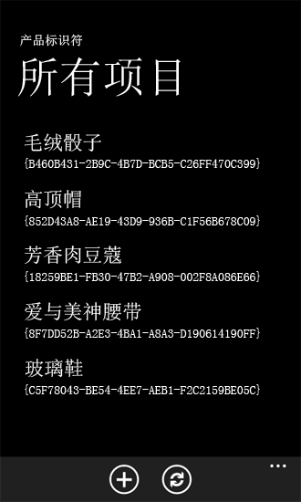

# 如何：为 Windows Phone 应用程序支持和转换 SharePoint 2013 字段类型
实现数据转换逻辑，以支持 Windows Phone 应用程序中的 SharePoint 字段类型。
在基于 Windows Phone SharePoint 应用程序列表模板的项目中，许多 SharePoint 字段类型数据由默认转换逻辑处理，以便在 Windows Phone 的 Silverlight 用户界面中显示和操作，但开发人员仍可以实现自己的自定义数据处理例程。
  
    
    


> **重要信息**
> 如果您正在开发适用于 Windows Phone 8 的应用程序，则必须使用 Visual Studio Express 2012（而非 Visual Studio 2010 Express）。除开发环境以外，本文中的所有信息均适用于 Windows Phone 8 和 Windows Phone 7。 > 有关详细信息，请参阅 [如何：设置用于为 SharePoint 开发移动应用程序的环境](how-to-set-up-an-environment-for-developing-mobile-apps-for-sharepoint.md)。 
  
    
    


## Windows Phone 应用程序中的 SharePoint 字段类型
<a name="BKMK_SharePointFieldTypes"> </a>

SharePoint 列表由数据字段构成（在列中排列），且指定一个给定字段包含特定类型的数据（即按特定方式构造的数据）。这些类型称为字段类型。（这种类型也可以称为列类型，因为当您将列添加到 SharePoint 列表时，您是在添加与特定数据类型相关联的字段列。）这些字段由 XML 架构定义。具有 **DateTime**数据类型（表示为 Microsoft SharePoint Server 用户界面中的"日期和时间"字段）的称为"订单日期"字段的架构可能如下图所示。
  
    
    

```XML

<Field Type="DateTime" DisplayName="Order Date" Required="FALSE"
 EnforceUniqueValues="FALSE" Indexed="FALSE" Format="DateOnly"
 FriendlyDisplayFormat="Disabled" Name="Order_x0020_Date">
  <Default>[today]</Default>
  <DefaultFormulaValue>2012-01-10T00:00:00Z</DefaultFormulaValue>
</Field>
```

尤其需要注意此架构中 **Field** 元素的 **Type** 属性的值（此处指定为"日期时间"）。可能使用 **Type** 值（例如，"选择"、"文本"或"布尔值"的此值）指定创建的包含其他结构数据的列表字段。
  
    
    
SharePoint 字段类型不能直接绑定到 Windows Phone 应用程序中的 Silverlight 控件。必须以特定方式准备或处理 SharePoint 列表中的数据（Silverlight 数据绑定的标准术语称之为转换），以便绑定到应用程序中的控件；这种准备和协调由使用 Windows Phone SharePoint 列表应用程序模板创建的项目中的 ViewModels 处理。基于此模板的项目被设计为包含默认转换逻辑，以支持 Windows Phone 应用程序中多个 SharePoint 标准字段类型（或基于其中某个标准类型创建的自定义字段）的 SharePoint 数据的绑定和显示。表 1 中列出了具有默认转换逻辑支持的字段类型。
  
    
    

**表 1. 具有默认转换设置的字段类型**


|**SharePoint 字段类型**|**Silverlight 数据类型**|
|:-----|:-----|
|附件  <br/> |文件  <br/> |
|布尔值  <br/> |布尔值  <br/> |
|已计算（仅用于显示）  <br/> |字符串  <br/> |
|选择  <br/> |字符串  <br/> |
|货币  <br/> |数字  <br/> |
|日期时间  <br/> |日期（根据电话的区域设置显示）  <br/> |
|URL  <br/> |链接  <br/> |
|整型  <br/> |数字  <br/> |
|位置  <br/> |地理坐标  <br/> |
|查找  <br/> |字符串  <br/> |
|多选  <br/> |字符串  <br/> |
|注释  <br/> |字符串  <br/> |
|编号  <br/> |数字  <br/> |
|结果选择  <br/> |字符串  <br/> |
|图片  <br/> |链接  <br/> |
|文本  <br/> |字符串  <br/> |
|用户  <br/> |字符串  <br/> |
   
其他 SharePoint 字段类型（如 **Guid** 字段）可以在 Windows Phone 应用程序中使用，但开发人员需提供自定义转换逻辑，以支持绑定和显示没有提供默认转换逻辑的字段类型的值。（请参阅本文中的 [自定义转换逻辑以提供不受支持的字段类型](#BKMK_ConversionForUnsupportedFields)。）
  
    
    
为了说明该模板如何为某些字段类型提供默认转换和支持，我们假定 SharePoint 列表包括一个名为"产品类别"的字段列，该字段列使用 **Choice** 类型指定并与一些选项（例如"娱乐"和"烹饪"）相关联。服务器上此类字段的架构可能类似于以下标记。
  
    
    


```XML

<Field Type="Choice" DisplayName="Product Category" Required="FALSE"
 EnforceUniqueValues="FALSE" Indexed="FALSE" Format="Dropdown"
 FillInChoice="TRUE" 
 Name="Product_x0020_Category">
  <Default>Recreation</Default>
  <CHOICES>
    <CHOICE>Culinary</CHOICE>
    <CHOICE>Recreation</CHOICE>
    <CHOICE>Sartorial</CHOICE>
    <CHOICE>Travel</CHOICE>
    <CHOICE>Other</CHOICE>
  </CHOICES>
</Field>
```

 **Choice** 字段必须经过处理以便适合在 Windows Phone 界面中显示。在这种情况下，字段中的数据表示为一个字符串值的集合内的一个字符串（例如，"娱乐"）；具体而言，是作为 **ListItem** 对象的 **FieldValuesAsText** 属性的值之一。 **Choice** 字段的转换逻辑提取字符串并将其显示在手机的用户界面中。该字符串也可能被绑定并显示在一个窗体中的 **TextBlock** 控件中。如果显示值以供编辑，则 **Choice** 字段的默认转换逻辑从 XML 架构中提取字段的可用选项（"美食"、"娱乐"、"服饰"等）以定义该字段并将这些可用选项表示为一个对象（这些对象本身包含特定选项（如"烹饪"））的集合（具体而言，是一种基于 **ObservableCollection(T)** 类的集合）以及该选项是否已选中。这些操作都在应用程序的 ViewModel 层内进行。在视图（或表示）层中（即，在由 Windows Phone SharePoint 列表应用程序模板针对"编辑"窗体生成的 XAML 文件中），默认情况下这些选项呈现为 **ListBox** 控件内的 Silverlight **RadioButton** 控件。
  
    
    

## 自定义 SharePoint 字段类型的转换
<a name="BKMK_CustomConversion"> </a>

在基于 Windows Phone SharePoint 列表应用程序模板的 Visual Studio 项目中，SharePoint 和 Windows Phone Silverlight 用户界面之间的数据协调和转换机制的设计很灵活且可扩展。
  
    
    
根据您的特定应用程序的设计意图，您可能希望提供转换逻辑，以支持绑定和显示默认情况下不提供转换逻辑的 SharePoint 字段类型，或者您可能要以与默认实现不同的方式为支持字段显示数据。
  
    
    
基于 Windows Phone SharePoint 列表应用程序模板的项目实现一个静态的 **Converter** 类，它包含专为给定数据类型处理数据转换操作的注册方法例程。默认情况下,项目还包括针对特定数据类型的数据转换的例程并为其注册。注册机制使用委托来允许扩展。因此，开发人员可以自己编写函数来提供数据转换逻辑，当调用委托时会调用这些自定义函数而不是默认函数。为了安排调用自定义函数实现数据转换操作，请使用类的注册方法来注册具有 **Converter** 类的函数。每个 ViewModel 的注册方法都不同，这样，您可以根据提供数据以供编辑还是仅供显示（不编辑）来实现和注册不同的函数来以不同方式处理数据。
  
    
    

> **提示**
> 即使 Windows Phone 区域设置不同，但在显示窗体中显示的货币符号来自 SharePoint 区域。开发人员可以使用 **Converter** 对象对其进行自定义。
  
    
    

要为"显示"窗体 (DisplayForm.xaml) 注册数据转换函数，请使用 **Converter** 类的 **RegisterDisplayFieldValueConverter** 方法。要为"编辑"窗体 (EditForm.xaml) 注册函数，请使用 **RegisterEditFieldValueConverter** 方法，对于"新建"窗体 (NewForm.xaml)，请使用 **RegisterNewFieldValueConverter** 方法。
  
    
    
您可以注册转换函数使其处理来自列表并显示在用户界面中的数据（即确定如何"获取"数据的函数）；您也可以注册函数来处理来自用户界面并保存到服务器上的列表的数据（即函数确定如何"设置"数据）。
  
    
    
 **get** 函数必须与 **Converter** 类中的以下委托声明的签名相匹配。
  
    
    


```cs

public delegate object GetConvertedFieldValue(string fieldName,
  ListItem item, ConversionContext context);
```

 **set** 函数必须与以下委托声明的签名相匹配。
  
    
    


```cs

public delegate void SetConvertedFieldValue(string fieldName,
  object fieldValue, ListItem item, ConversionContext context);
```

 **RegisterDisplayFieldValueConverter** 方法只能接受一个 **get** 函数，因为 **DisplayItemViewModel** 类旨在显示数据而不是编辑数据。 **RegisterEditFieldValueConverter** 和 **RegisterNewFieldValueConverter** 方法过载以接受一个 **get** 函数或一个 **set** 函数，或者两者兼而有之。
  
    
    
在 [如何：在针对 Windows Phone 的 SharePoint 2013 应用程序中实现业务逻辑和数据验证](how-to-implement-business-logic-and-data-validation-in-a-windows-phone-app-for-s.md)中，开发了一个验证例程以验证由 Windows Phone 应用程序的用户提供的格式或电话号码。为了演示自定义数据转换，在以下代码示例中，我们会实现 **get** 和 **set** 函数以特定方式处理电话号码数据，并注册这些要用于具有 **Converter** 类的"编辑"和"新建"窗体的函数。
  
    
    
以下列代码为例，假定您已创建了一个 Windows Phone SharePoint 列表应用程序，该应用程序基于使用服务器上的自定义列表模板创建的产品订单列表。假设列表中有一个名为"联系人号码"的字段，且该字段在列表中被指定为 **Text** 字段。在指定为 SharePoint Server 上的 **Text** 类型的默认列表字段中，用户可以输入任何文本字符（最多 255 个字符）。该模板提供用于显示和编辑 SharePoint 中的 **Text** 字段的数据的转换逻辑，但不能构造一个默认 **Text** 字段来公开或显示任何特定格式设置，例如可能传统上应用于电话号码的格式。在 Windows Phone 应用程序中，您可能希望电话号码对用户的显示保持一致，并且以特定的格式保存在服务器的列表中，即使基础字段类型 ( **Text**) 并不与特定格式设置规则相关联。要应用特定格式设置规则，您可以实现自己的自定义数据转换逻辑（而不是默认逻辑）来支持一种字段类型。
  
    
    

### 实现自定义数据转换


1. 假设您已经在 SharePoint Server 上创建了一个列表，其中包含一个名为"联系人号码"的 **Text** 字段（类似于在 [如何：在针对 Windows Phone 的 SharePoint 2013 应用程序中实现业务逻辑和数据验证](how-to-implement-business-logic-and-data-validation-in-a-windows-phone-app-for-s.md)中使用的"产品订单数"示例列表），现在按照  [如何：创建 Windows Phone SharePoint 2013 列表应用程序](how-to-create-a-windows-phone-sharepoint-2013-list-app.md)中详细介绍的以下步骤，使用 Visual Studio 中的 Windows Phone SharePoint 列表应用程序模板创建一个 Windows Phone 应用程序。
    
  
2. 在"解决方案资源管理器"中，选择表示该项目的节点（例如，名为ContosoSPListApp）。
    
  
3. 在 Visual Studio（或 Visual Studio Express for Windows Phone）中的"项目"菜单中，选择"添加类"。"添加新项"对话框会打开，其中已选中 C#"类"模板。
    
  
4. 指定类文件的名称（如 ContosoConverter.cs），然后选择"添加"。类文件将添加到项目中并打开以供编辑。
    
  
5. 用以下代码替换文件的内容。
    
  ```cs
  
using System;
using Microsoft.SharePoint.Client;  // Added for ListItem.
using Microsoft.SharePoint.Phone.Application; // Added for ConversionContext.
using System.Text.RegularExpressions;

// Specify a namespace appropriate for your particular project.
namespace ContosoSPListApp
{
    public static class ContosoConverter
    {
        static Regex StandardNumberFormat = 
          new Regex(@"^\\(?([0-9]{3})\\)?[-. ]?([0-9]{3})[-. ]?([0-9]{4})$", RegexOptions.Compiled);

        public static object GetConvertedTextFieldValue(string fieldName, 
          ListItem item, ConversionContext context)
        {
            if (item == null) return null;

            if (fieldName == "Contact_x0020_Number")
            {
                string contactNumber = string.Empty;
                try
                {
                    contactNumber = item.FieldValuesAsText[fieldName];
                }
                catch (PropertyOrFieldNotInitializedException)
                {
                    object itemValue = item[fieldName];
                    if (itemValue != null)
                    {
                        contactNumber = itemValue.ToString();
                    }
                }

                // Regularize the formatting of phone number for display in UI.
                if (StandardNumberFormat.IsMatch(contactNumber))
                {
                    // Phone number is in an acceptable format, but formatting it
                    // in a specific way for visual consistency in the UI.
                    string properlyFormattedNumber = 
                      StandardNumberFormat.Replace(contactNumber, "($1) $2-$3");
                    return properlyFormattedNumber;
                }
                else
                {
                    // Return a representation of the data adorned in such a way 
                    // as to designate its invalidity.
                    if (!contactNumber.Contains("Invalid Number"))
                    {
                        return string.Format("Invalid Number: {0}", contactNumber);
                    }
                    else
                    {
                        // Assume data is already adorned with an invalidity designation.
                        return contactNumber;
                    }
                }
            }
            else
            {
                return item[fieldName];
            }
        }

        public static void SetConvertedTextFieldValue(string fieldName, 
                             object fieldValue, ListItem item, ConversionContext context)
        {
            if (fieldValue == null) return;

            if (fieldName == "Contact_x0020_Number")
            {
                // Conventional formats (e.g., 555-555-5555) are acceptable,
                // but formatting phone numbers consistently here for storage in list on Server.
                string contactNumber = (string)fieldValue;

                if (StandardNumberFormat.IsMatch(contactNumber))
                {
                    string properlyFormattedNumber = StandardNumberFormat.Replace
                                                               (contactNumber, "($1) $2-$3");
                    item[fieldName] = properlyFormattedNumber;
                }
                else
                {
                    if (!contactNumber.Contains("Invalid Number"))
                    {
                        item[fieldName] = string.Format("Invalid Number: {0}", contactNumber);
                    }
                    else
                    {
                        // Assume data is already adorned with an invalidity designation.
                        item[fieldName] = contactNumber;
                    }                    
                }
            }
            else
            {
                // Allow values for other Text fields to be passed on to list without modification.
                item[fieldName] = fieldValue;                
            }
        }
    }
}
  ```

6. 保存该文件。
    
  
此处的 **GetConvertedTextFieldValue** 函数确定是否根据电话号码标准规定（北美）对来自拟包含电话号码的字段（在此示例中，名为"联系人号码"）的字符串数据进行设置；如果是，则将电话号码转换成特定显示格式"(XXX) XXX-XXXX"。如果数据未设置为标准电话号码格式，它会带有一个指示符作为前缀。此函数不会实际更改列表中的数据。另一方面， **SetConvertedTextFieldValue** 函数则与之相反。它检查用户为一个字段提供的数据值来确定该数据是否与标准电话号码格式相符。如果相符，数据值会转换为特定格式并保存到服务器上的列表中。如果提供的数据不是标准格式，则该值会以一个指示符为前缀并将带有该前缀的值保存到服务器上。
  
    
    
现在，仍需注册这些使用 **Converter** 类的数据转换函数以在"编辑"和"新建"窗体上使用。您可以在多个位置注册转换器。在以下过程中，转换器在"列表"窗体 (List.xaml) 的 **OnNavigatedTo** 事件中注册。创建"列表"窗体并导航到该窗体后，才能在应用程序中对"编辑"和"新建"窗体进行实例化，以便在"列表"窗体的此事件中注册的转换器对所有窗体中的文本字段生效。
  
    
    

### 注册数据转换函数


1. 在您在以上过程中为其创建类的项目的"解决方案资源管理器"中，选择"视图"节点下的 List.xaml 文件。
    
  
2. 按 F7 打开相关联的代码隐藏文件 List.xaml.cs 以供编辑。
    
  
3. 将以下私有变量声明添加到实现 **ListForm** 分部类的代码块顶部，具体位置是代码块左大括号之后和 `ListForm()` 构造函数之前。
    
  ```cs
  
private bool _isConversionRegistered;
  ```

4. 将以下 **RegisterTextFieldValueConverters** 方法添加到文件中用于实现 **ListForm** 分部类的代码块（由成对的括号限定）内。
    
  ```cs
  private void RegisterTextFieldValueConverters()
{
    Converter.RegisterEditFieldValueConverter(FieldType.Text, 
                      ContosoConverter.GetConvertedTextFieldValue, 
                        ContosoConverter.SetConvertedTextFieldValue);

    Converter.RegisterNewFieldValueConverter(FieldType.Text, 
                          ContosoConverter.GetConvertedTextFieldValue, 
                          ContosoConverter.SetConvertedTextFieldValue);
}
  ```


    此方法直接调用 **Converter** 类的适当注册方法。对于此代码，它假定在之前过程中创建的包含 **get** 和 **set** 函数的自定义类名为"ContosoConverter"。如果您为自己的类指定一个不同的名称，请相应地更改此处的代码。
    
  
5. 通过以下方法修改文件中 **OnNavigatedTo** 事件处理程序的实现：添加对 **_isConversionRegistered** 标记的值的检查，以及对在上一步中添加的 **RegisterTextFieldValueConverters** 函数的调用。修改后的处理程序应如下所示。
    
  ```cs
  
protected override void OnNavigatedTo(System.Windows.Navigation.NavigationEventArgs e)
{
    base.OnNavigatedTo(e);

    App.MainViewModel.ViewDataLoaded += 
      new EventHandler<ViewDataLoadedEventArgs>(OnViewDataLoaded);
    App.MainViewModel.InitializationCompleted += 
      new EventHandler<InitializationCompletedEventArgs>(OnViewModelInitialization);

    // The OnNavigatedTo event can fire more than once, but the converters only need
    // to be registered once, so checking the conversion flag first.
    if (_isConversionRegistered == false)
    {
        // Register converters.
        RegisterTextFieldValueConverters();
        _isConversionRegistered = true;
    }
}
  ```

6. 保存该文件。
    
  
请注意，数据转换函数是针对与"编辑"和"新建"窗体中的 **Text** 数据类型相关联的所有字段注册的。因此，为在前面的过程中创建的 **ContosoConverter** 类实施的 **get** 和 **set** 函数包含额外检查以仅处理特殊字段（在本例中名为"Contact_x0020_Number"）的数据，从而允许数据"通过"其他 **Text** 字段。
  
    
    

## 自定义转换逻辑以提供不受支持的字段类型
<a name="BKMK_ConversionForUnsupportedFields"> </a>

即使您在应用程序中不提供 **Text** 字段的转换逻辑，让可以显示和编辑这些字段。如果默认逻辑不适合您的设计意图，向已经提供默认转换逻辑的字段提供您自己的转换逻辑会让您在更大程度上对字段中的格式、结构或数据进行控制。对于具有某些其他数据类型的字段（如 **Guid** 字段），默认情况下不提供转换逻辑，但如果您理解向字段中提供转换逻辑的机制（如上一节中所述），那么，提供您自己的转换逻辑以在应用程序中支持 Windows Phone SharePoint 列表应用程序模板不支持的默认逻辑的字段类型，可能很简单。
  
    
    
假设您正在基于名为"产品标识符"的 SharePoint 列表创建一个 Windows Phone 应用程序，其中包括一个具有 **Guid** 数据类型的字段。以下代码示例假定列表中有"产品"（或标题）字段（ **Text** 类型）和"标识符"字段（ **Guid** 类型）。
  
    
    

> **注释**
> 具有 **Guid** 字段的 SharePoint 列表必须以编程方式或使用包含 **Guid** 字段的列表模板创建。
  
    
    

在使用该模板且基于此简单列表创建的 Windows Phone 应用程序中， **Guid** 字段中的数据默认情况下不显示。（取代该数据的是类似以下的显示消息："字段类型'Guid'未注册转换器。"）在以下过程中，您将包含转换逻辑以支持 Windows Phone 应用程序的 **Guid** 字段。您将添加一个包含多个方法的类，这些方法用于注册字段值转换器、显示 GUID 和为添加的列表项生成新 GUID 值。
  
    
    

### 为不支持的字段类型提供转换逻辑


1. 在一个从 Windows Phone SharePoint 列表应用程序中创建的且基于上文所述的产品标识符列表的项目（例如，名为 SPListAppGuidConversion）中，选择"解决方案资源管理器"中表示项目的节点。
    
  
2. 在"项目"菜单中，选择"添加类"。将出现"添加新项"对话框，其中已选中 C#"类"模板。
    
  
3. 指定 GuidConversion.cs 作为该文件的名称，然后选择"添加"。该类文件即添加到解决方案中并打开以供编辑。
    
  
4. 用以下代码替换文件的内容。
    
  ```cs
  
using System;
using Microsoft.SharePoint.Phone.Application;
using Microsoft.SharePoint.Client;

namespace SPListAppGuidConversion
{
    public class GuidConversion
    {
        /// <summary>
        /// Registers a GET converter to prepare GUID values for display.
        /// </summary>
        static public void RegisterDisplayFieldGuidConverter()
        {
            // Register GET converter to display GUID values.
            Converter.RegisterDisplayFieldValueConverter(FieldType.Guid,
            getConvertedFieldValue: (string fieldName, ListItem item, ConversionContext context) =>
            {
                string guidValue = string.Empty;

                try
                {
                    guidValue = item.FieldValuesAsText[fieldName];
                }
                catch (PropertyOrFieldNotInitializedException)
                {
                    object itemValue = item[fieldName];
                    if (itemValue != null)
                    {
                        guidValue = itemValue.ToString();
                    }
                }

                if (string.IsNullOrWhiteSpace(guidValue))
                {
                    return string.Format("{{{0}}}", Guid.Empty);
                }
                else
                {
                    Guid g = new Guid();

                    if (Guid.TryParse(guidValue, out g))
                    {
                        guidValue = string.Format("{{{0}}}", g.ToString().ToUpper());
                        return guidValue;
                    }
                    else
                    {
                        return "Invalid Identifier (GUID)";
                    }
                }
            });
        }

        /// <summary>
        /// Registers GET and SET converters for GUID value of new (i.e., added) list items.
        /// </summary>
        public static void RegisterNewFieldGuidConverter()
        {
            Converter.RegisterNewFieldValueConverter(FieldType.Guid,
                getConvertedFieldValue: (string fieldName, ListItem item, 
                                 ConversionContext context) => Guid.NewGuid().ToString(),
                setConvertedFieldValue: (string fieldName, object fieldValue, 
                                ListItem item, ConversionContext context) =>
                {
                    if (fieldValue == null)
                    {
                        item[fieldName] = Guid.Empty.ToString();
                    }
                    else
                    {
                        item[fieldName] = fieldValue;
                    }
                });
        }
    }
}
  ```


    在此自定义类中，通过匿名函数（由语句 lambda 定义）调用 **Converter** 类的 **RegisterDisplayFieldValueConverter** 和 **RegisterNewFieldValueConverter** 方法来为注册方法所需的委托实现 **get** 和 **set** 例程。此处的可选参数标签（例如，"getConvertedFieldValue:"）包含在此代码中仅是为了明确说明定义了哪些委托）。
    
    这种方法涉及 lambda 表达式，可以替代将命名函数作为参数传递给转换器注册函数的那种方法，后者在本主题的上述过程中已演示（在 [注册数据转换函数](#BKMK_RegisterFunctions)部分）。
    
  
5. 保存该文件。
    
  
6. 在"解决方案资源管理器"中，选择 App.xaml 文件。
    
  
7. 按 F7 打开相关联的代码隐藏文件 App.xaml.cs 以供编辑。
    
  
8. 找到 **Application_Launching** 事件处理程序的实现（它在使用 Windows Phone SharePoint 列表应用程序模板创建的新项目中为空），并将其替换为以下代码。
    
  ```cs
  
private void Application_Launching(object sender, LaunchingEventArgs e)
{
    // Register converters for GUID fields. Converters can be
    // registered just once for the app.
    GuidConversion.RegisterDisplayFieldGuidConverter();
    GuidConversion.RegisterNewFieldGuidConverter();
}
  ```

9. 为了使转换器逻辑对新列表项生效（即，当列表添加到新项时生成 GUID 值），您需要确保 **NewItemViewModel** 的标识符字段绑定到新窗体。实现此目的的一种做法是将一个隐藏的 **TextBlock** 控件添加到 NewForm.xaml 并将其 **Text** 属性的 **Binding** 声明设置为标识符字段。您可以将 **TextBlock** 控件添加到包含 **TextBox** 控件的 **StackPanel** 容器控件中作为标题字段，如以下 NewForm.xaml 文件中的标记部分所示。
    
  ```
  
...
    <Grid x:Name="LayoutRoot" Background="Transparent" 
         xmlns:x="http://schemas.microsoft.com/winfx/2006/xaml" 
                 xmlns:controls="clr-namespace:Microsoft.Phone.Controls;
                                      assembly=Microsoft.Phone.Controls">
        <StackPanel>
            <ProgressBar Background="Red" x:Name="progressBar" 
                  Opacity="1" HorizontalAlignment="Center" VerticalAlignment="Top" 
                                    Height="15" Width="470" IsIndeterminate="{Binding IsBusy}"
                                       Visibility="{Binding ShowIfBusy}" />
            <ScrollViewer HorizontalScrollBarVisibility="Auto" Height="700">
                <Grid x:Name="ContentPanel" Width="470">
                    <StackPanel Margin="0,5,0,5">
                        <StackPanel Orientation="Vertical" Margin="0,5,0,5">
                            <TextBlock TextWrapping="Wrap" 
                           HorizontalAlignment="Left" Style="{StaticResource PhoneTextNormalStyle}">
                                        Title*</TextBlock>
                            <TextBox Style="{StaticResource TextValidationTemplate}" 
                              FontSize="{StaticResource PhoneFontSizeNormal}" Width="470" 
                                   HorizontalAlignment="Left" Name="txtTitle" Text="{Binding [Title], 
                                    Mode=TwoWay, ValidatesOnNotifyDataErrors=True, 
                                      NotifyOnValidationError=True}" TextWrapping="Wrap" />
                            <TextBlock Name="txtIdentifier" Text="{Binding [Identifier]}" Visibility="Collapsed"/>
                        </StackPanel>
                    </StackPanel>
                </Grid>
            </ScrollViewer>
        </StackPanel>
    </Grid>
...
  ```


    保存该文件。
    
  
如果您启动项目并将应用程序部署到 Windows Phone Emulator 来运行它，则只要 SharePoint 列表中的相应字段包含 GUID 值，"标识符"字段中的数据就会显示在"列表"窗体 (List.xaml) 中（参见图 1）。
  
    
    

**图 1. 显示 Guid 字段**

  
    
    

  
    
    

  
    
    
在基于 Windows Phone SharePoint 列表应用程序模板的项目中，Silverlight 控件可能不会添加到窗体并绑定到模板中不支持默认转换逻辑的字段类型。对于在前面的过程中使用的"产品标识符"列表的"标识符"字段，您可以将标记添加到 DisplayForm.xaml 文件来定义其他控件以显示 GUID 值，如 **StackPanel** 控件（它本身包含在用户界面的 **Grid** 控件内）中的 **TextBlock** 控件和 **TextBox** 控件。所添加的 **StackPanel** 控件的标记可能如下所示。
  
    
    


```

<StackPanel HorizontalAlignment="Left" Orientation="Horizontal"
                                             Margin="0,5,0,5">
    <TextBlock TextWrapping="Wrap" Width="150" HorizontalAlignment="Left" 
                      Style="{StaticResource PhoneTextNormalStyle}">Identifier:</TextBlock>
    <TextBlock Width="310" HorizontalAlignment="Left" Name="txtIdentifier" 
                 Text="{Binding [Identifier]}" TextWrapping="Wrap" Style="
                                           {StaticResource PhoneTextSubtleStyle}" />
</StackPanel>
```

现在"标识符"字段在"显示"窗体和"列表"窗体上都会显示。
  
    
    

## 其他资源
<a name="SP15Supportwinphone_addlresources"> </a>


-  [构建访问 SharePoint 2013 的 Windows Phone 应用程序](build-windows-phone-apps-that-access-sharepoint-2013.md)
    
  
-  [如何：设置用于为 SharePoint 开发移动应用程序的环境](how-to-set-up-an-environment-for-developing-mobile-apps-for-sharepoint.md)
    
  
-  [Windows Phone SDK 2.0](http://www.microsoft.com/zh-cn/download/details.aspx?id=35471)
    
  
-  [适用于 Windows Phone 8 的 Microsoft SharePoint SDK](http://www.microsoft.com/zh-cn/download/details.aspx?id=36818)
    
  
-  [Windows Phone 软件开发工具包 (SDK) 7.1](http://www.microsoft.com/zh-cn/download/details.aspx?id=27570)
    
  
-  [Microsoft SharePoint SDK for Windows Phone 7.1](http://www.microsoft.com/en-us/download/details.aspx?id=30476)（http://www.microsoft.com/en-us/download/details.aspx?id=30476）
    
  

