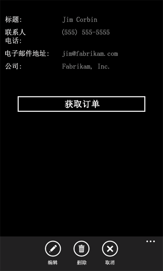
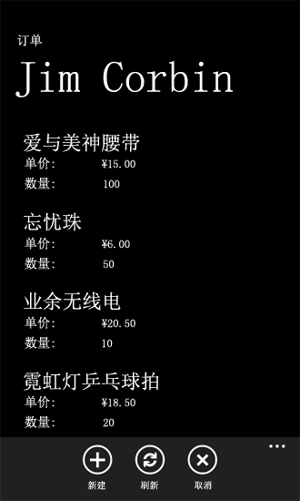

# 如何：在 Windows Phone 应用程序中使用多个 SharePoint 2013 列表
创建使用来自多个 SharePoint 列表的数据的 Windows Phone 应用程序。
您可以多种方式在应用程序中使用多个 SharePoint 列表。当您基于 Windows Phone SharePoint 列表应用程序模板创建一个 Windows Phone 应用程序时，您要指定一个单一目标 SharePoint 列表，但是生成的项目的体系结构是可扩展的，足以容纳多个列表的集成。
  
    
    


> **重要信息**
> 如果您正在开发适用于 Windows Phone 8 的应用程序，则必须使用 Visual Studio Express 2012（而非 Visual Studio 2010 Express）。除开发环境以外，本文中的所有信息均适用于 Windows Phone 8 和 Windows Phone 7。 > 有关详细信息，请参阅 [如何：设置用于为 SharePoint 开发移动应用程序的环境](how-to-set-up-an-environment-for-developing-mobile-apps-for-sharepoint.md)。 
  
    
    


## 创建涉及基于相同架构的 SharePoint 列表的解决方案
<a name="BKMK_SameSchemaProject"> </a>

如果您有两个基于相同架构的 SharePoint 列表，您可以利用由 Windows Phone SharePoint 列表应用程序模板实施的类并创建这些特定于每个列表的类的对象。
  
    
    
假设您有两个基于"联系人"列表模板的 SharePoint 列表。一个列表（例如，名为"营销团队"）包含您组织中的营销团队成员，另一个列表（名为"工程团队"）包含工程团队成员。如果您使用 Windows Phone SharePoint 列表应用程序模板创建一个项目，并指定营销团队列表为创建该项目所依据的目标列表，则在实现该项目中的 App.xaml.cs 文件的 **App** 类时，会创建 **ListDataProvider** 类（默认情况下名为 **DataProvider**）。此对象将列表（即"营销团队"列表）作为应用程序的数据源，从而提供了用于访问和处理列表中各项的操作。还会为创建该应用程序所依据的列表创建一个 **ListViewModel** 类的实例。此对象有一个属性成员（怡巧也被命名为 **DataProvider**），可以将该成员设置为一个给定的 **ListDataProvider** 类的实例，这样就为 **ListViewModel** 类实例建立了数据源。
  
    
    
您可以在项目中创建一个额外的 **ListDataProvider** 类实例作为 App.xaml.cs 文件中第二个列表（工程团队）的数据源。该对象在以下代码中称为 **SecondaryDataProvider**。
  
    
    


```cs

private static ListDataProvider m_SecondaryDataProvider;

public static ListDataProvider SecondaryDataProvider
{
    get
    {
        if (m_SecondaryDataProvider != null)
            return m_SecondaryDataProvider;

        m_SecondaryDataProvider = new ListDataProvider();
        m_SecondaryDataProvider.ListTitle = "Engineering Team";
        m_SecondaryDataProvider.SiteUrl = new Uri("http://contoso:2012/sites/samplesite/");

        return m_SecondaryDataProvider;
    }
}
```

然后您可以实例化 **ListViewModel** 类的另一个对象（例如，名为 **SecondaryViewModel**），并将 **SecondaryDataProvider** 对象分配到它的 **DataProvider** 属性，如以下代码中所示。
  
    
    


```cs

private static ListViewModel m_SecondaryViewModel;

public static ListViewModel SecondaryViewModel
{
    get
    {
        if (m_SecondaryViewModel == null)
            m_SecondaryViewModel = new ListViewModel { DataProvider = App.SecondaryDataProvider };

        return m_SecondaryViewModel;
    }
    set
    {
        m_SecondaryViewModel = value;
    }
}
```

如果两个列表的相同字段和视图都适用于您的意图（并且，如果两个列表又具有相同的列和字段），那么在执行 **ListDataProvider** 类（在 ListDataProvider.cs 文件中）时，您不需要进行任何更改。
  
    
    
但是，若要显示或修改您的项目中第二个列表的数据，您需要将视图窗体添加到您的项目，这些视图窗体绑定到了 **SecondaryViewModel** 并为此进行了配置。例如，可以将一个名为"SecondaryViews"的文件夹添加到您的项目，并将 SecondaryList.xaml 文件添加到该文件夹，该文件夹的标记与由项目中主列表的模板生成的默认 List.xaml 文件类似。请注意，您应该通过为 SecondaryList.xaml 文件中 **PhoneApplicationPage** 元素的 **x:Class** 属性指定一个有区别意义的值，来区分应用程序的辅助列表窗体和主列表窗体。
  
    
    


```

<phone:PhoneApplicationPage
    x:Class="MultipleSPListApp.SecondaryViews.ListForm"
    xmlns="http://schemas.microsoft.com/winfx/2006/xaml/presentation"
    xmlns:x="http://schemas.microsoft.com/winfx/2006/xaml"
    xmlns:phone="clr-namespace:Microsoft.Phone.Controls;assembly=Microsoft.Phone"
    xmlns:shell="clr-namespace:Microsoft.Phone.Shell;assembly=Microsoft.Phone"
    xmlns:d="http://schemas.microsoft.com/expression/blend/2008"
    xmlns:mc="http://schemas.openxmlformats.org/markup-compatibility/2006"
    mc:Ignorable="d" d:DesignWidth="480" d:DesignHeight="696"
    FontFamily="{StaticResource PhoneFontFamilyNormal}"
    FontSize="{StaticResource PhoneFontSizeNormal}"
    Foreground="{StaticResource PhoneForegroundBrush}"
    SupportedOrientations="PortraitOrLandscape" Orientation="Portrait"
    shell:SystemTray.IsVisible="True" x:Name = "ListViewPage">
...
</phone:PhoneApplicationPage>
```

在相关联的代码隐藏文件 SecondaryList.xaml.cs 中，请将对"App.MainViewModel"的所有引用替换为对"App.SecondaryViewModel"的引用。例如，该文件中的构造函数应该如下所示。
  
    
    


```cs

public ListForm()
    {
        InitializeComponent();
        this.DataContext = App.SecondaryViewModel;
    }
```

还要将代码隐藏文件中对"pp.DataProvider"的所有引用替换为对"pp.SecondaryDataProvider"的引用，并更新任何导航路径以指向适当的辅助 XAML 页面。如果您还将辅助"新窗体"添加到您的项目（例如，即您项目的 SecondaryViews 文件夹中的 SecondaryNewForm.xaml），则 **OnNewButtonClick** 事件的 SecondaryList.xaml.cs 文件中的处理程序类似于以下代码。
  
    
    


```cs

private void OnNewButtonClick(object sender, EventArgs e)
    {
        // Instantiate a new instance of NewItemViewModel and go to NewForm.
        App.SecondaryViewModel.CreateItemViewModelInstance = new NewItemViewModel { DataProvider = App.SecondaryDataProvider };
        NavigationService.Navigate(new Uri("/SecondaryViews/SecondaryNewForm.xaml", UriKind.Relative));
    }
```

最后，您可以将一个按钮添加到 List.xaml 文件中的 **ApplicationBar** 来显示 SecondaryList.xaml 页面。
  
    
    


```

...
    <phone:PhoneApplicationPage.ApplicationBar>
        <shell:ApplicationBar IsVisible="True" IsMenuEnabled="True">
            <shell:ApplicationBarIconButton x:Name="btnNew" IconUri="/Images/appbar.new.rest.png" Text="New" Click="OnNewButtonClick"/>
            <shell:ApplicationBarIconButton x:Name="btnRefresh" IconUri="/Images/appbar.refresh.rest.png" Text="Refresh" IsEnabled="True" Click="OnRefreshButtonClick"/>
            <!--Add the following button to navigate to the secondary list (Engineering Team).-->
            <shell:ApplicationBarIconButton x:Name="btnSecondaryList" IconUri="/Images/appbar.upload.rest.png" Text="Engineering" IsEnabled="True" Click="OnSecondaryListButtonClick"/>
        </shell:ApplicationBar>
    </phone:PhoneApplicationPage.ApplicationBar>
...
```

在相关联的代码隐藏文件 List.xaml.cs 中，请添加一个在 List.xaml 文件中声明的 **OnSecondaryListButtonClick** 事件的处理程序。
  
    
    


```cs

private void OnSecondaryListButtonClick(object sender, EventArgs e)
{
    NavigationService.Navigate(new Uri("/SecondaryViews/SecondaryList.xaml", UriKind.Relative));
}
```

然后，您的应用程序的用户可以在营销团队列表和工程团队列表之间导航。由于基础列表架构相同，由模板生成的默认 **DataProvider** 和 **MainViewModel** 对象以及添加进来的 **SecondaryDataProvider** 和 **SecondaryViewModel** 对象能够处理所有的数据事务而无需对 ListDataProvider.cs 文件进行任何修改。
  
    
    

## 创建涉及基于不同架构的 SharePoint 列表的解决方案
<a name="BKMK_DifferentSchemasProject"> </a>

前一部分中的方法能够运行（也就是说，对于基于相同架构的 SharePoint 列表），但是，开发人员可以使用 Windows Phone SharePoint 列表应用程序模板中的 **ListDataProvider** 类进行自定义，以处理可能不基于相同架构或者不包含相同的列和字段的多个 SharePoint 列表。
  
    
    
与在前面部分中一样，假设您有一个 SharePoint 列表，即"营销团队"（基于"联系人"列表模板），它包含营销团队成员。还假设您有另一个列表，称为"订单"（基于"自定义"列表模板），它包含表 1 中所示的列和字段类型。
  
    
    

**表 1. "订单"列表的列和字段**


|**列**|**字段类型**|**必需**|
|:-----|:-----|:-----|
|产品（例如标题）  <br/> |单行文本（文本）  <br/> |是  <br/> |
|单价  <br/> |货币  <br/> |是  <br/> |
|数量  <br/> |编号  <br/> |编号（默认值为零）  <br/> |
|订单价值  <br/> |计算值（单价 ＊ 数量）  <br/> |否  <br/> |
|订单日期  <br/> |日期和时间 (Datetime)  <br/> |否  <br/> |
|订单状态  <br/> |选择  <br/> |否  <br/> |
|客户  <br/> |单行文本（文本）  <br/> |否  <br/> |
   
与前一部分的示例一样，您可以实例化一个单独的 **ListDataProvider** 对象和另一个 **ListViewModel** 对象来管理"订单"列表。假定该实例化的 **ListDataProvider** 对象命名为 **OrdersListDataProvider**，如以下代码所示。
  
    
    


```cs

private static ListDataProvider m_OrdersListDataProvider;

public static ListDataProvider OrdersListDataProvider
{
    get
    {
        if (m_OrdersListDataProvider != null)
            return m_OrdersListDataProvider;

        m_OrdersListDataProvider = new ListDataProvider();
        m_OrdersListDataProvider.ListTitle = "Orders";
        m_OrdersListDataProvider.SiteUrl = new Uri("http://contoso:2012/sites/samplesite/"); // Specify a URL here for your server.

        return m_OrdersListDataProvider;
    }
}
```

并假定该"订单"列表的实例化的 **ListViewModel** 对象命名为 **OrdersListViewModel**，如以下代码所示。
  
    
    


```cs

private static ListViewModel m_OrdersListViewModel;

public static ListViewModel OrdersListViewModel
{
    get
    {
        if (m_OrdersListViewModel == null)
            m_OrdersListViewModel = new ListViewModel { DataProvider = App.OrdersListDataProvider };

        return m_OrdersListViewModel;
    }
    set
    {
        m_OrdersListViewModel = value;
    }
}
```

"订单"列表的架构不同于"营销团队"列表的架构。您可以通过将代码添加到 ListDataProvider.cs 文件（特别是添加到 **CamlQueryBuilder** 类）来容纳差异。
  
    
    


```cs

public static class CamlQueryBuilder
{
    static Dictionary<string, string> ViewXmls = new Dictionary<string, string>()
    {   
        {"View1",   @"<View><Query><OrderBy><FieldRef Name='Title' />
                    <FieldRef Name='FirstName'  /></OrderBy></Query><RowLimit>30</RowLimit><ViewFields>{0}</ViewFields></View>"},
      {"View2",   @"<View><Query><OrderBy><FieldRef Name='ID' /></OrderBy></Query><RowLimit>30</RowLimit>
     <ViewFields>{0}</ViewFields></View>"}
    };

    static string View1Fields = @"<FieldRef Name='Title'/><FieldRef Name='FirstName'/>
   <FieldRef Name='JobTitle'/><FieldRef Name='Email'/><FieldRef Name='Comments'/>";
    static string View2Fields = @"<FieldRef Name='Title'/><FieldRef Name='Unit_x0020_Price'/><FieldRef Name='Quantity'/>
            <FieldRef Name='Order_x0020_Value'/><FieldRef Name='Order_x0020_Date'/>
            <FieldRef Name='Status'/><FieldRef Name='Customer'/>";

    public static CamlQuery GetCamlQuery(string viewName)
    {
        string viewXml = ViewXmls[viewName];
        // Add ViewFields to the ViewXml depending on the view.
        switch (viewName)
        {
            case "View2":
                viewXml = string.Format(viewXml, View2Fields);
                break;
            case "View1":
            default:
                viewXml = string.Format(viewXml, View1Fields);
                break;
        }
        return new CamlQuery { ViewXml = viewXml };
    }
}
```

在这里，键值为"View2"的条目被添加到"订单"列表的 **ViewXmls** **Dictionary** 对象。（请记住，添加到 **CamlQueryBuilder** 类中的 **ViewXmls** **Dictionary** 的条目的键值，对于模板中的每个缓存逻辑来说必须是唯一的（在解决方案范围内），才能正常运行。）字符串变量（ **View1Fields** 和 **View2Fields**）用于存储每个视图的字段列表。然后，依据传递给 **GetCamlQuery** 方法的 **viewName** 参数的值，创建适当的 CAML 查询 XML 字符串。
  
    
    
然后，与前面部分一样，您可以为列表创建视图窗体，这次是绑定到 **OrdersListViewModel** 和 **OrdersListDataProvider** 对象。作为一个示例，特定于"订单"列表的列表窗体的 XAML（名为 OrdersList.xaml）类似于由应用程序中的主列表模板生成的 List.xaml 文件中的标记。但是有以下不同之处：您要为用于呈现列表"View2"（而不是默认值"View1"）的 **PivotItem** 控件命名，并设置 **ListBox** 控件（在此控件中列表项呈现为"View2"）的 **ItemsSource** 属性的 **Binding** 声明，如以下标记中所示（只显示页面根网格的标记）。
  
    
    


```

...
    <Grid x:Name="LayoutRoot" Background="Transparent" xmlns:x="http://schemas.microsoft.com/winfx/2006/xaml" xmlns:controls="clr-namespace:Microsoft.Phone.Controls;assembly=Microsoft.Phone.Controls">
        <!--Pivot Control-->
        <ProgressBar x:Name="progressBar" Opacity="1" HorizontalAlignment="Center" VerticalAlignment="Top" 
               Height="30" Width="470" IsIndeterminate="{Binding IsBusy}" Visibility="{Binding ShowIfBusy}" />
        <Grid x:Name="ContentPanel" Grid.Row="0" Width="470">
            <controls:Pivot Name="Views" Title="Orders" LoadedPivotItem="OnPivotItemLoaded">
                <!--Pivot item-->
                <controls:PivotItem Name="View2" Header="All Orders">
                    <!--Double line list with text wrapping-->
                    <ListBox x:Name="lstBox1" Margin="0,0,-12,0" SelectionChanged="OnSelectionChanged" ItemsSource="{Binding [View2]}">
                        <ListBox.ItemTemplate>
                            <DataTemplate>
                                <StackPanel Orientation="Vertical" Margin="10">
                                    <TextBlock Name="txtTitle" Text="{Binding [Title]}" TextWrapping="NoWrap" 
                                          Style="{StaticResource PhoneTextTitle2Style}" />
                                    <TextBlock Name="txtUnitPrice" Text="{Binding [Unit_x0020_Price]}" 
                                         TextWrapping="NoWrap" Style="{StaticResource PhoneTextNormalStyle}" />
                                    <TextBlock Name="txtQuantity" Text="{Binding [Quantity]}"
                                         TextWrapping="NoWrap" Style="{StaticResource PhoneTextNormalStyle}" />
                                </StackPanel>
                            </DataTemplate>
                        </ListBox.ItemTemplate>
                    </ListBox>
                </controls:PivotItem>
            </controls:Pivot>
        </Grid>
    </Grid>
...
```

创建合适的 XAML 标记的一种简便方法是：使用 Windows Phone SharePoint 列表应用程序模板来基于"订单"列表生成一个单独的项目，然后将生成的 XAML 从该项目复制到具有多个列表的项目中，注意要将 **PivotItem** 控件的名称（默认为"View1"）更改为"View2"并更改 **ListBox** 控件的 **Binding** 声明，如此处所示。您还需要更改窗体的相关联的代码隐藏文件的所有引用以指定适当的 **ListViewModel** 和 **DataProvider** 对象（例如，象 **OrdersListViewModel** 和 **OrdersListDataProvider** 一样）。
  
    
    
这种方法奏效，因为在相关联的代码隐藏文件（本例中名为 OrdersList.xaml.cs）中，各种通过调用 **ListDataProvider** 对象（此处是 **OrdersListDataProvider**）来访问列表数据的事件处理程序使用 **PivotItem** 控件的名称来指定要使用的适当视图。例如， **OnPivotItemLoaded** 事件处理程序调用从 **ListViewModel** 类实例化来的 **OrdersListViewModel** 对象的 **LoadData** 方法（并且该方法又调用 **OrdersListDataProvider** 对象的 **LoadData** 方法），将 **PivotItem** 控件的名称（这里是"View2"）作为 **ViewName** 参数的值传递给该方法。在以上所示的 **CamlQueryBuilder** 类的修改后的实施过程中，此值最终（作为 **viewName** 参数的值）传递到 **GetCamlQuery** 方法。
  
    
    

## 涉及基于不同架构的 SharePoint 列表的解决方案的另一种方法
<a name="BKMK_DifferentSchemasAlternative"> </a>

作为前一部分中的方法的替代方法，您可以使用 Windows Phone SharePoint 列表应用程序模板在 Microsoft Visual Studio 2010 解决方案中基于给定的 SharePoint 列表创建一个 Windows Phone 应用程序项目，然后将基于其他列表构建的项目添加到同一个解决方案中。这种方法允许您利用模板来生成特定于每个 SharePoint 列表的窗体。然后，您可以根据需要自定义解决方案来控制用户如何与列表进行交互。本部分中的步骤说明了该方法。
  
    
    
在以下过程中假定您有一个名为"订单"的 SharePoint 列表（基于"自定义"列表模板），其列和字段类型如上一部分中的表 1 中所示。另外，假定您有另一个名为"客户"的 SharePoint 列表（同样基于"自定义"列表模板），其列和字段类型如表 2 中所示。
  
    
    

**表 2."客户"列表中的列和字段**


|**列**|**字段类型**|**必需**|
|:-----|:-----|:-----|
|客户名称（即，标题）  <br/> |单行文本（文本）  <br/> |是  <br/> |
|联系人号码  <br/> |单行文本（文本）  <br/> |否  <br/> |
|电子邮件地址  <br/> |单行文本（文本）  <br/> |否  <br/> |
|公司  <br/> |单行文本（文本）  <br/> |否  <br/> |
   
在下列过程中，您将创建一个使用这两个列表的 Windows Phone 应用程序。应用程序的主列表是"客户"列表。当您在显示窗体中显示给定客户的详细信息时，窗体上的一个按钮使用户可以显示所有与该客户关联的订单（从"订单"列表）。
  
    
    

### 为解决方案创建组件项目


1. 通过使用 Windows Phone SharePoint 列表应用程序模板创建 Windows Phone 应用程序，指定一个基于表 2 中显示的列和字段类型定义的 SharePoint 列表。在本节的过程中，假定项目中的列表名称为"Customers"，项目名称是"CustomersSPListApp"。（有关创建基于 Windows Phone SharePoint 列表应用程序模板的应用程序的信息，请参阅  [如何：创建 Windows Phone SharePoint 2013 列表应用程序](how-to-create-a-windows-phone-sharepoint-2013-list-app.md)。）
    
  
2. 在 Visual Studio 中，选择"文件"、"添加"、"新建项目"。 
    
    将显示"添加新项目"对话框。
    
  
3. 在"添加新项目"对话框中的"Visual C#" 节点下，选择"Silverlight for Windows Phone"节点。
    
  
4. 在"模板"窗格中，选择 Windows Phone SharePoint 列表应用程序模板。
    
  
5. 为应用程序命名（例如，OrdersSPListApp），然后选择"确定"。
    
  
6. 按照  [如何：创建 Windows Phone SharePoint 2013 列表应用程序](how-to-create-a-windows-phone-sharepoint-2013-list-app.md)中描述的过程创建另一个 Windows Phone 应用程序项目，指定一个基于表 1 中所示的列和字段类型定义的 SharePoint 列表作为该项目的目标列表。在您的解决方案中，目前应该有名为"CustomersSPListApp"和"OrdersSPListApp"（如果在此过程中您遵循命名约定）的两个项目。
    
  
7. 在"解决方案资源管理器"中，选择 CustomerSPListApp 项目节点。
    
  
8. 在"项目"菜单中，选择"添加引用"。 
    
    将显示"添加引用"对话框。
    
  
9. 在"项目"选项卡上，在解决方案中选择 OrdersSPListApp 项目，然后选择"确定"按钮。该项目已添加到 CustomersSPListApp 项目的"引用"节点下。
    
  
接下来，在解决方案中配置这两个项目。一般情况下，您将 OrdersSPListApp 项目（基于"订单"列表）配置为 CustomerSPListApp 项目（基于"客户"列表）的"查找"项目方式执行。
  
    
    

### 配置 OrdersSPListApp 项目


1. 更改 OrdersSPListApp 项目的视图窗体中的导航路径，以包含项目（"OrdersSPListApp"）的主要命名空间和"组件"头衔。例如，在 OrdersSPListApp 项目的 List.xaml.cs 文件中的 OnNewButtonClick 事件的处理程序中，将对 NavigationService 项目的导航方法的调用从此处：
    
     `NavigationService.Navigate(new Uri("/Views/NewForm.xaml", UriKind.Relative));`
    
    更改到此处：
    
     `NavigationService.Navigate(new Uri("/OrdersSPListApp;component/Views/NewForm.xaml", UriKind.Relative));`
    
    进行这些更改最简单方法是使用 OrdersSPListApp 项目中的"快速替换"命令。
    
1. 在"解决方案资源管理器"中选择 OrdersSPListApp 项目节点。
    
  
2. 请按 Ctrl + H 以显示"快速替换"对话框。
    
  
3. 在"查找内容"文字框中，照此处原样精确地指定以下文本：
    
    Uri("/Views/
    
  
4. 在"替换为"文字框中，照此处原样精确地指定以下文本：
    
    Uri("/OrdersSPListApp;component/Views/
    
  
5. 确保在"查找范围"下拉列表中选择了"当前项目"。
    
  
6. 选择"全部替换"。
    
  
7. 保存项目中所有更改过的文件。
    
  
2. 将成员属性添加到 OrdersSPListApp 项目的 App.xaml.cs 文件。在"解决方案资源管理器"中的 OrdersSPListApp 节点下，选择 App.xaml 文件。
    
  
3. 按 F7 打开与其相关联的代码隐藏文件 App.xaml.cs 以供编辑。
    
  
4. 在实现 **App** 分部类的代码块（由左括号和右括号标明界线）中，添加以下代码。
    
  ```cs
  
public static string CustomerName { get; set; }
  ```

5. 在"解决方案资源管理器"中的 OrdersSPListApp 项目节点下，选择的 List.xaml 文件。
    
  
6. 按 F7 打开与其相关联的代码隐藏文件 List.xaml.cs 以供编辑。
    
  
7. 修改文件中的 **OnNavigatedTo** 事件处理程序以便分析 **NavigationContext** 对象的 **QueryString** 属性来设置步骤 4 中声明的 **CustomerName** 变量的值。为了方便用户，您还可以设置列表窗体中的 **PivotItem** 控件的 **Header** 属性以匹配客户名称。修改后的处理程序应如下所示。
    
  ```cs
  protected override void OnNavigatedTo(System.Windows.Navigation.NavigationEventArgs e)
{
    base.OnNavigatedTo(e);

    if (this.NavigationContext.QueryString.ContainsKey("CustomerName"))
    {
        App.CustomerName = NavigationContext.QueryString["CustomerName"];
    }

    // Also set the value of the Header property for the PivotItem to match the customer name.
    if (!string.IsNullOrWhiteSpace(App.CustomerName))
    {
        this.View1.Header = App.CustomerName;
    }

    App.MainViewModel.ViewDataLoaded += new EventHandler<ViewDataLoadedEventArgs>(OnViewDataLoaded);
    App.MainViewModel.InitializationCompleted += new EventHandler<InitializationCompletedEventArgs>(OnViewModelInitialization);
}
  ```

8. 将 **CustomerName** 变量作为对 **OnPivotItemLoaded** 事件处理程序的 **LoadData** 方法的调用中的一个参数添加到 List.xaml.cs 文件。 **OnPivotItemLoaded** 事件处理程序的实施应如下所示。
    
  ```cs
  
private void OnPivotItemLoaded(object sender, PivotItemEventArgs e)
{
    if (!App.MainViewModel.IsInitialized)
    {
        //Initialize ViewModel and Load Data for PivotItem upon initialization.
        App.MainViewModel.Initialize();
    }
    else
    {
        //Load Data for the currently loaded PivotItem.
        App.MainViewModel.LoadData(e.Item.Name, App.CustomerName);
    }
}
  ```


    请定义模板中的 **ListViewModel** 类的 **LoadData** 方法，以便能够接受可选参数。
    
  
9. 也将 **CustomerName** 变量作为调用参数添加到 **OnViewModelInitialization** 事件处理程序的 **LoadData** 方法。 **OnViewModelInitialization** 事件处理程序实施应如下所示。
    
  ```cs
  
private void OnViewModelInitialization(object sender, InitializationCompletedEventArgs e)
{
    this.Dispatcher.BeginInvoke(() =>
    {
        //If initialization has failed, show error message and return.
        if (e.Error != null)
        {
            MessageBox.Show(e.Error.Message, e.Error.GetType().Name, MessageBoxButton.OK);
            return;
        }
        App.MainViewModel.LoadData(((PivotItem)Views.SelectedItem).Name, App.CustomerName);
        this.DataContext = (sender as ListViewModel);
    });
}
  ```

10. 将 **CustomerName** 变量作为对 **OnRefreshButtonClick** 事件处理程序中的 **RefreshData** 方法的调用的参数添加到 List.xaml.cs 文件。 **OnRefreshButtonClick** 事件处理程序的实施应如下所示。
    
  ```cs
  
private void OnRefreshButtonClick(object sender, EventArgs e)
{
    if (Views.SelectedItem == null)
        return;

    if (!App.MainViewModel.IsInitialized)
    {
        //Initialize ViewModel and Load Data for PivotItem upon completion.
        App.MainViewModel.Initialize();
    }
    else
    {   //Refresh Data for the currently loaded PivotItem.
        App.MainViewModel.RefreshData(((PivotItem)Views.SelectedItem).Name, App.CustomerName);
    }
}
  ```


    至于 **LoadData** 方法，也定义 **RefreshData** 方法以便能够接受可选参数。请注意在前面的三个步骤中，对由模板生成的事件处理程序所作的唯一更改是将 **CustomerName** 变量作为调用参数添加到 **LoadData** 或 **RefreshData** 方法。
    
  
11. 当用户在您的应用程序中的"订单"列表的列表窗体上选择"新建"按钮时，"新建窗体"中的"客户"字段应已包含客户名称，这是因为对用户显示的订单列表已根据客户名称进行了筛选。从该筛选的列表中添加的新订单应与作为列表筛选依据的客户名称相关。若要将 **CustomerName** 的变量值传递到"新窗体"，请修改 **OnNewButtonClick** 事件来将这个值作为导航路径中的查询字符串包含到"新窗体"中，如以下代码所示。
    
  ```cs
  
private void OnNewButtonClick(object sender, EventArgs e)
{
    //Instantiate a new instance of NewItemViewModel and go to NewForm.
    App.MainViewModel.CreateItemViewModelInstance = new NewItemViewModel { DataProvider = App.DataProvider };
    
    if (!string.IsNullOrWhiteSpace(App.CustomerName))
    {
        NavigationService.Navigate(new Uri("/OrdersSPListApp;component/Views/NewForm.xaml?CustomerName=" + 
                                                                            App.CustomerName, UriKind.Relative));
    }
    else
    {
        NavigationService.Navigate(new Uri("/OrdersSPListApp;component/Views/NewForm.xaml", UriKind.Relative));
    }
}
  ```

12. 在"新窗体"的 **OnNavigatedTo** 事件处理程序中，请为客户名称检查查询字符串，如果可用，将其分配到窗体的 ViewModel 的"客户"字段。在"解决方案资源管理器"中的 OrdersSPListApp 项目下，选择 NewForm.xaml 文件并按下 F7 以打开与其相关联的代码隐藏文件 NewForm.xaml.cs 以供编辑。
    
  
13. 修改文件中的 **OnNavigatedTo** 事件处理程序以匹配以下代码。
    
  ```cs
  
protected override void OnNavigatedTo(System.Windows.Navigation.NavigationEventArgs e)
{
    base.OnNavigatedTo(e);

    if (this.NavigationContext.QueryString.ContainsKey("CustomerName"))
    {
        this.viewModel["Customer"] = NavigationContext.QueryString["CustomerName"];
    }

    viewModel.ItemCreated += new EventHandler<ItemCreatedEventArgs>(OnItemCreated);
}
  ```

14. 在 OrdersSPListApp 项目的 ListDataProvider.cs 文件中的 **CamlQueryBuilder** 类中，将一个 **WHERE** 子句添加到 CAML 查询中的"客户"字段，该查询用来获取"订单"列表中的项以基于一个给定客户名称（来自 **CustomerName** 变量）过滤列表。为了传递客户名称，添加一个参数到该类的 **GetCamlQuery** 方法。修改过的 **CamlQueryBuilder** 类应如下所示。
    
  ```cs
  
public static class CamlQueryBuilder
{
    static Dictionary<string, string> ViewXmls = new Dictionary<string, string>()
    {   
        {"View1", @"<View><Query>{0}</Query><RowLimit>30</RowLimit><ViewFields>{1}</ViewFields></View>"}
    };

    static string ViewFields = @"<FieldRef Name='Title'/><FieldRef Name='Unit_x0020_Price'/><FieldRef Name='Quantity'/><FieldRef Name='Order_x0020_Value'/><FieldRef Name='Order_x0020_Date'/><FieldRef Name='Status'/><FieldRef Name='Customer'/>";

    public static CamlQuery GetCamlQuery(string viewName, string customerName)
    {
        string queryClause = string.Empty;

        // Create appropriate Query Clause, depending on customerName parameter.
        if (string.IsNullOrWhiteSpace(customerName))
        {
            queryClause = "<OrderBy><FieldRef Name='ID' /></OrderBy>";
        }
        else
        {
            queryClause = string.Format("<Where><Eq><FieldRef Name='Customer' /><Value Type='Text'>{0}</Value></Eq></Where>", customerName);
        }

        // Add Query Clause and ViewFields to ViewXml.
        string viewXml = ViewXmls[viewName];
        viewXml = string.Format(viewXml, queryClause, ViewFields);

        return new CamlQuery { ViewXml = viewXml };
    }
}
  ```

15. 修改 ListDataProvider.cs 文件中的 **LoadDataFromServer** 方法以检查 **CustomerName** 参数并将参数传递给 **GetCamlQuery** 方法。修改过的方法应如下所示。
    
  ```cs
  
private void LoadDataFromServer(string ViewName, Action<LoadViewCompletedEventArgs>
                                              loadItemCompletedCallback, params object[] filterParameters)
{
    string customerName = string.Empty;
    string cacheKey = ViewName;

    // Parse the optional parameters:
    if (filterParameters.Length > 0)
    {
        customerName = filterParameters[0].ToString();
        cacheKey += "-" + customerName;
    }

    CamlQuery query = CamlQueryBuilder.GetCamlQuery(ViewName, customerName);
    ListItemCollection items = Context.Web.Lists.GetByTitle(ListTitle).GetItems(query);
    Context.Load(items);
    Context.Load(items, listItems => listItems.Include(item => item.FieldValuesAsText));

    Context.ExecuteQueryAsync(
        delegate(object sender, ClientRequestSucceededEventArgs args)
        {
            base.CacheView(cacheKey, items);
            loadItemCompletedCallback(new LoadViewCompletedEventArgs { ViewName = ViewName, Items = base.GetCachedView(cacheKey) });
        },
        delegate(object sender, ClientRequestFailedEventArgs args)
        {
            loadItemCompletedCallback(new LoadViewCompletedEventArgs { Error = args.Exception });
        });
}
  ```

16. 同样，修改 ListDataProvider.cs 文件中的 **LoadData** 方法以处理 **CustomerName** 参数。
    
  ```cs
  
public override void LoadData(string ViewName, Action<LoadViewCompletedEventArgs>
                                                           loadViewCompletedCallback, params object[] filterParameters)
{
    string customerName = string.Empty;
    string cacheKey = ViewName;

    // Parse the optional parameters:
    if (filterParameters.Length > 0)
    {
        customerName = filterParameters[0].ToString();
        cacheKey += "-" + customerName;
    }

    List<ListItem> CachedItems = GetCachedView(cacheKey);
    if (CachedItems != null)
    {
        loadViewCompletedCallback(new LoadViewCompletedEventArgs { ViewName = ViewName, Items = CachedItems });
        return;
    }

    LoadDataFromServer(ViewName, loadViewCompletedCallback, filterParameters);
}
  ```

17. 请添加一个"取消"按钮到 OrdersSPListApp项目的 List.xaml 文件中的 **ApplicationBar** 元素。在"解决方案资源管理器"的OrdersSPListApp节点下，选择 List.xaml 文件，然后按 SHIFT+F7 设计器中打开文件以供编辑。
    
  
18. 添加 XAML 以便在  `<phone:PhoneApplicationPage.ApplicationBar>` 标记中声明一个"取消"按钮，如以下标记所示。
    
  ```
  
<phone:PhoneApplicationPage.ApplicationBar>
    <shell:ApplicationBar IsVisible="True" IsMenuEnabled="True">
        <shell:ApplicationBarIconButton x:Name="btnNew" 
                 IconUri="/Images/appbar.new.rest.png" Text="New" Click="OnNewButtonClick"/>
        <shell:ApplicationBarIconButton x:Name="btnRefresh" IconUri="/Images/appbar.refresh.rest.png" 
                 Text="Refresh" IsEnabled="True" Click="OnRefreshButtonClick"/>
        <shell:ApplicationBarIconButton x:Name="btnCancel" IconUri="/Images/appbar.cancel.rest.png" Text="Cancel" IsEnabled="True" Click="OnCancelButtonClick" />
    </shell:ApplicationBar>
</phone:PhoneApplicationPage.ApplicationBar>
  ```

19. 对于"解决方案资源管理器"中选定的 List.xaml 的文件，请按 F7 打开相关联的代码隐藏文件 List.xaml.cs 以供编辑。
    
  
20. 在实现 **ListForm** 分部类的代码块（由左括号和右括号标明界线）中，为 **OnCancelButtonClick** 事件添加以下处理程序。
    
  ```cs
  
private void OnCancelButtonClick(object sender, EventArgs e)
{
    NavigationService.Navigate(new Uri("/CustomersSPListApp;component/Views/DisplayForm.xaml", UriKind.Relative));
}
  ```

21. 在项目中保存此文件。
    
  
现在，尚待添加一个按钮到 CustomersSPListApp 项目中的"显示"窗体来显示与给定的客户相关联的订单。
  
    
    

### 配置 CustomersSPListApp 项目


1. 在"解决方案资源管理器"中的 CustomersSPListApp 项目节点下，选择的 DisplayForm.xaml 文件。
    
  
2. 按 Shift + F7 （或者双击该文件）打开文件在设计器中以供编辑。
    
  
3. 为该列表项的最后一个字段，在最终 **StackPanel** 控件后的 **StackPanel** 包含控件里中，添加一个 **Button** 控件的 XAML 声明。如以下标记所示。
    
  ```
  
...
    <Grid x:Name="LayoutRoot" Background="Transparent" xmlns:x="http://schemas.microsoft.com/winfx/2006/xaml" xmlns:controls="clr-namespace:Microsoft.Phone.Controls;assembly=Microsoft.Phone.Controls">
        <StackPanel>
            <ProgressBar Background="Red" x:Name="progressBar" Opacity="1" HorizontalAlignment="Center" 
              VerticalAlignment="Top" Height="15" Width="470" IsIndeterminate="{Binding IsBusy}" 
               Visibility="{Binding ShowIfBusy}" />
            <ScrollViewer HorizontalScrollBarVisibility="Auto" Height="700">
                <Grid x:Name="ContentPanel" Width="470">
                    <StackPanel Margin="0,5,0,5">
                        <StackPanel HorizontalAlignment="Left" Orientation="Horizontal" Margin="0,5,0,5">
                            <TextBlock TextWrapping="Wrap" Width="150" HorizontalAlignment="Left" 
                                           Style="{StaticResource PhoneTextNormalStyle}">Title :</TextBlock>
                            <TextBlock Width="310" HorizontalAlignment="Left" Name="txtTitle"
                                    Text="{Binding [Title]}" TextWrapping="Wrap" Style="{StaticResource PhoneTextSubtleStyle}" />
                                   </StackPanel>
                        <StackPanel HorizontalAlignment="Left" Orientation="Horizontal" Margin="0,5,0,5">
                            <TextBlock TextWrapping="Wrap" Width="150" HorizontalAlignment="Left" 
                                       Style="{StaticResource PhoneTextNormalStyle}">Contact Number :</TextBlock>
                            <TextBlock Width="310" HorizontalAlignment="Left" Name="txtContact_x0020_Number"
                                       Text="{Binding [Contact_x0020_Number]}" TextWrapping="Wrap" 
                                       Style="{StaticResource PhoneTextSubtleStyle}" />
                        </StackPanel>
                        <StackPanel HorizontalAlignment="Left" Orientation="Horizontal" Margin="0,5,0,5">
                            <TextBlock TextWrapping="Wrap" Width="150" HorizontalAlignment="Left" 
                                     Style="{StaticResource PhoneTextNormalStyle}">E-mail Address :</TextBlock>
                            <TextBlock Width="310" HorizontalAlignment="Left" Name="txtE_x002d_mail_x0020_Address" 
                                 Text="{Binding [E_x002d_mail_x0020_Address]}" TextWrapping="Wrap" 
                                             Style="{StaticResource PhoneTextSubtleStyle}" />
                        </StackPanel>
                        <StackPanel HorizontalAlignment="Left" Orientation="Horizontal" Margin="0,5,0,5">
                            <TextBlock TextWrapping="Wrap" Width="150" HorizontalAlignment="Left" 
                                     Style="{StaticResource PhoneTextNormalStyle}">Company :</TextBlock>
                            <TextBlock Width="310" HorizontalAlignment="Left" Name="txtCompany" 
                                     Text="{Binding [Company]}" TextWrapping="Wrap" Style="{StaticResource PhoneTextSubtleStyle}" />
                        </StackPanel>
                        <StackPanel Margin="0,60,0,5"><Button Content="Get Orders" Height="70" Name="OrdersButton" Width="400" Click="OnButtonOrdersClick" /></StackPanel>
                    </StackPanel>
                </Grid>
            </ScrollViewer>
        </StackPanel>
    </Grid>
...
  ```

4. 对于在"解决方案资源管理器"中选择的 DisplayForm.xaml 的文件，请按 F7 打开相关联的代码隐藏文件 DisplayForm.xaml.cs 以供编辑。
    
  
5. 在实现 **DisplayForm** 分部类的代码块（由左括号和右括号标明界线）中，为 **OnButtonOrdersClick** 事件添加以下处理程序。
    
  ```cs
  
private void OnOrdersButtonClick(object sender, RoutedEventArgs e)
{
    this.NavigationService.Navigate(new Uri("/OrdersSPListApp;component/Views/List.xaml?CustomerName=" + 
                                                                 viewModel["Title"], UriKind.Relative));
}
  ```

6. 保存该文件。
    
  
如果您构建解决方案并将其部署到 Windows Phone Emulator 中，将显示"客户"列表的"列表"窗体。如果您在列表中选择一个项目来为某个给定客户显示"显示"窗体，您将看到一个用于检索与该客户相关联的订单的按钮（图 1）。
  
    
    

**图 1. 客户显示窗体**

  
    
    

  
    
    

  
    
    
当您选择"显示"窗体上的"获得订单"按钮时，该客户的订单将显示在解决方案中的 OrdersSPListApp 项目的列表窗体中（图 2）。
  
    
    

**图 2. 订单列表窗体**

  
    
    

  
    
    

  
    
    
在此窗体（订单列表的列表表单）中，您可以添加、编辑或删除客户订单。如果您选择"取消"按钮，您将返回客户列表的列表窗体。在单个移动应用程序中，您可以管理两个 SharePoint 列表的列表项。
  
    
    

## 其他资源
<a name="SP15Usemultlists_addlresources"> </a>


-  [如何：在针对 Windows Phone 的 SharePoint 2013 应用程序中配置和使用推送通知](how-to-configure-and-use-push-notifications-in-sharepoint-2013-apps-for-windows.md)
    
  
-  [如何：设置用于为 SharePoint 开发移动应用程序的环境](how-to-set-up-an-environment-for-developing-mobile-apps-for-sharepoint.md)
    
  
-  [Windows Phone SDK 8.0](http://www.microsoft.com/zh-cn/download/details.aspx?id=35471)
    
  
-  [适用于 Windows Phone 8 的 Microsoft SharePoint SDK](http://www.microsoft.com/zh-cn/download/details.aspx?id=36818)
    
  
-  [Windows Phone 软件开发工具包 (SDK) 7.1](http://www.microsoft.com/zh-cn/download/details.aspx?id=27570)
    
  
-  [Microsoft SharePoint SDK for Windows Phone 7.1](http://www.microsoft.com/en-us/download/details.aspx?id=30476)（http://www.microsoft.com/en-us/download/details.aspx?id=30476）
    
  

