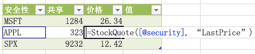

# JavaScript 用户定义的功能概述
JavaScript 用户定义的功能 (UDF) 是 SharePoint Server 2013 的 Excel Services 中的新增功能。本文提供了 JavaScript UDF 上的高级别查找，包括它们在 Excel Services 中如何工作的基本信息。
## 什么是 UDF？
<a name="xlsWhatAreUdfs"> </a>

用户定义的功能 (UDF) 是一种您可以自己创建然后添加到 Excel 的可用功能列表中（当 Excel 没有提供您希望的现成功能类型时）的功能。
  
    
    
Excel Services 已经允许您使用托管代码创建 UDF，因此如果您已使用了现有的 Excel Services UDF，您应该很熟悉 JavaScript UDF。有关使用托管代码创建 UDF 的详细信息，请参阅  [Excel Services 用户定义函数](excel-services-user-defined-functions.md)。
  
    
    

## JavaScript UDF
<a name="xlsJsUDFs"> </a>

JavaScript UDF 是在包含嵌入式 Excel 工作簿的网页上的浏览器中运行的 UDF。您在嵌入的工作簿内使用 JavaScript UDF。只要您正在使用浏览器中的工作薄，您便可以使用 JavaScript UDF，就像您使用内置的 Excel 功能一样。当关闭网页时，JavaScript UDF 不再可用。
  
    
    

## JavaScript UDF 如何工作？
<a name="xlsJsUDFs"> </a>

若要使用 JavaScript UDF，您必须能够修改您在其中嵌入工作薄的网页的内容。在您引用了正确的 Excel Services JavaScript 源文件之后，将您的 JavaScript UDF 代码添加到该页。此外，在您使用您的 JavaScript UDF 之前，必须首先使用Excel Calculation Services 注册 UDF。JavaScript UDF API 提供了注册和注销 JavaScript UDF 的方法。
  
    
    
当具有 Excel Web Access Web 部件或嵌入的工作薄的网页呈现时，您可以调用该工作薄中的 JavaScript UDF，就像在其他任何 Excel 工作薄中一样。
  
    
    
例如，您可能拥有获取特定股票的当前股票价格的功能。您可以将 JavaScript UDF 添加到寄宿使用以下 JavaScript 代码的 Excel 工作薄的网页（假设您具有该网页的创作权利）。
  
    
    


```

function StockInfo(symbol, measure) {
  var req = new XMLHttpRequest();
  req.open('GET', 'http://www.contoso-stock-quotes.com/quote/' + symbol + '/' + measure, false); 
  req.send(null);
  if (req.status == 200) {
    return req.responseText;
  } else {
    throw new Error(ExcelCalcError.Value);
  }
 
ewa.BrowserUdfs.add("StockQuote",
                       StockInfo,
                       "Gets a stock quote given a security symbol and measure to return."
                       false,
                       false
                       );

```

您然后可以以 Excel Online 内的单元格中的公式调用 JavaScript UDF、StockInfo。
  
    
    

**图 1.在 Excel Online 中调用的 JavaScript UDF**

  
    
    

  
    
    

  
    
    

  
    
    

  
    
    

## 哪里可以使用 JavaScript UDF？
<a name="xlsWhereUseJsUdfs"> </a>

您可以在 SharePoint Server 2013 Excel Web Access Web 部件中显示的工作薄上或在具有嵌入式工作薄的宿主网页上创建并使用 JavaScript UDF。工作薄必须存储在 Microsoft OneDrive 上。主要差异在于添加到 Excel Web Access Web 部件的 JavaScript UDF 需要 SharePoint 服务器。而添加到具有嵌入式工作薄的宿主网页的 JavaScript UDF 只要求工作薄存储在 OneDrive 中。
  
    
    

## 要点
<a name="xlsWhereUseJsUdfs"> </a>


- 仅当正在显示 JavaScript UDF 存在的网页时，它们才存在。它们坚持的时间不会比创建它们的网页的寿命长。
    
  
- 您不能调用 JavaScript UDF 内的 Excel Services JavaScript 对象模型。
    
  

## 其他资源
<a name="bk_addresources"> </a>


-  [SharePoint 2013 中的 Excel Services](excel-services-in-sharepoint-2013.md)
    
  
-  [Excel Services 中面向开发人员的新增功能](09e96c8b-cb55-4fd1-a797-b50fbf0f9296.md)
    
  
-  [Excel 服务用户定义的功能](http://msdn.microsoft.com/zh-cn/library/ms493934.aspx)
    
  

