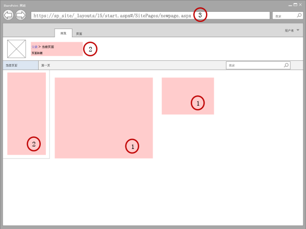
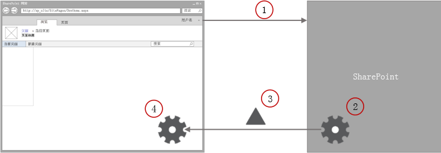

# 最少下载策略概述
了解最少下载策略 (MDS)，该策略是 SharePoint 2013 中的一种新功能，通过在用户导航到新页面时仅发送差异内容来减少页面加载时间。
最少下载策略 (MDS) 是 SharePoint 2013 中的一种新技术，可减少用户在 SharePoint 网站中从一个页面导航到另一个页面时浏览器需要下载的数据量。当用户浏览启用了 MDS 的网站时，客户端仅处理当前页面和请求页面之间的差异内容（或增量）。图 1 显示了页面之间出现变化且因此需要更新的部分。增量通常包含 (1) 内容区域中的数据，以及 (2) 导航控件之类的其他组件。
  
    
    


**图 1. 使用 MDS 处理的页面**

  
    
    

  
    
    

  
    
    
您可以通过查看 URL 识别启用了 MDS 的网站。启用了 MDS 的网站的 URL 中包含 (3) **_layouts/15/start.aspx** 页面，后跟哈希标记 ( **#** ) 及请求资源的相关 URL，如图 1 所示。例如，下面是页面 **newpage.aspx** 的 MDS 格式化 URL： **https://sp_site/_layouts/15/start.aspx#/SitePages/newpage.aspx**该 URL 相当于下面非 MDS 格式化的 URL： **https://sp_site/SitePages/newpage.aspx**作为开发人员，您可能已创建 SharePoint 组件，这些组件需要进行一些更新才能与 MDS 进行无缝协作。 
## 启用 MDS
<a name="SP15MDSOverview_Enable"> </a>

您可以通过使用网站管理页面或 SharePoint 客户端对象模型在网站中启用 MDS。
  
    
    
若要通过在管理页面中激活 MDS 功能来启用，请选择"网站设置">"管理网站功能"，然后激活"最少下载策略"功能。
  
    
    
由于该功能是通过修改  [EnableMinimalDownload](https://msdn.microsoft.com/library/Microsoft.SharePoint.Client.Web.EnableMinimalDownload.aspx) 属性激活，因此您也可以使用客户端 API。下面的代码显示了如何使用 JavaScript 对象模型 (JSOM) 启用 MDS。
  
    
    


```

var clientContext;

clientContext = new SP.ClientContext.get_current();
this.oWebsite = clientContext.get_web();

this.oWebsite.set_enableMinimalDownload(true);
this.oWebsite.update();

clientContext.load(this.oWebsite);

clientContext.executeQueryAsync(
    Function.createDelegate(this, successHandler),
    Function.createDelegate(this, errorHandler)
);

function successHandler() {
    alert("MDS is enabled in this site.");
}

function errorHandler() {
    alert("Request failed: " + arguments[1].get_message());
}
```


## 使用 MDS 的好处
<a name="SP15MDSOverview_Benefits"> </a>

使用 MDS 有几点好处，包括：
  
    
    

- **速度：** 这是 MDS 的主要目标。如果您使用了 MDS，则浏览器不必再次处理 Chrome 用户界面 (UI)。与全页加载相比，MDS 还减少了负载。
    
  
- **平稳过渡：** 通过仅更新有变化的区域，您可以将用户注意力集中在这些区域，与整个页面"闪动"的全页加载完全不同。如果更新了整个页面，用户必须分析整个页面以找到新内容。浏览仅更新相比前一页有变化区域的网站时，用户会更轻松。
    
  
- **浏览器导航控件：** 其他基于 AJAX 的系统会混淆浏览器中的"上一页"和"下一页"按钮。由于 MDS 在浏览器窗口中更新 URL，因此上一页和下一页按钮会按本来的方式工作。
    
  
- **向后兼容：** MDS 引擎会立即提供 MDS 导航，或者检测无法进行导航的情况。如果无法进行 MDS 导航，将显示全页加载来替代。该过程称为 **故障转移** ，可确保所有页面正确呈现，无论其中是否包含 MDS 兼容组件。MDS 还可以与搜索引擎进行很好的协作，因为定位标记的 **href** 属性使用常规的非 MDS 格式化 URL。然而，客户端的 MDS 引擎会捕获 **onclick** 事件，并使用该事件与服务器进行通信。
    
  

## MDS 体系结构
<a name="SP15MDSOverview_Architecture"> </a>

MDS 的基本结构很简单。MDS 的主要组件是两个引擎，一个是在服务器中，另一个是在客户端中；当用户在网站中的页面之间导航时，这两个引擎会共同协作以计算变化内容并在浏览器中呈现页面。图 2 显示了用户浏览启用了 MDS 的网站时的 MDS 流。
  
    
    

**图 2. 用户浏览网站时的 MDS 流**

  
    
    

  
    
    

  
    
    

  
    
    

1. 浏览器请求 SharePoint 网站中当前页面和新页面之间的变化内容。
    
  
2. 服务器中的 MDS 引擎计算当前页面和新页面之间的增量。
    
  
3. 服务器中的 MDS 引擎将增量发送给客户端的 MDS 引擎。
    
  
4. 客户端的 MDS 引擎将当前页面上的变化区域替换为新页面内容。
    
  
生成的页面与未使用 MDS 情况下所下载的页面完全相同。
  
    
    
客户端的 MDS 引擎包含一个下载管理器。页面中的所有请求都通过下载管理器传送。页面中的所有控件必须订阅下载管理器以了解 URL 何时出现更改。下载管理器对所有新控件数据作出一次请求。为了能够与搜索引擎协作，MDS 引擎不直接使用定位标记的 **href** 属性来存储 MDS 格式化的 URL。作为替代， **SPUpdatePage** 函数会处理 **onclick** 事件并使用该事件与服务器通信。 **SPUpdatePage** 函数在 **_layouts/15/start.js** 文件中声明。
  
    
    
服务器中的 MDS 引擎将信息发送回客户端。此信息可能包含具有嵌入式脚本和样式的 HTML、XML 或 JavaScript 对象表示法 (JSON)。
  
    
    
URL 在 MDS 中起着重要作用。MDS URL 应如下所示： **https://sp_site/_layouts/15/start.aspx#/SitePages/newpage.aspx** 。 **Start.aspx** 包含加载页变化的最少共享 UI 和说明。MDS 将哈希标记 (#) 之后的部分视为目标页面。目标页面以斜线 (/) 开头，后跟与 SharePoint 网站相关的 URL。当浏览器收到 URL 时，会发现哈希标记左侧的部分发生更改，因此触发本地导航事件。客户端的 MDS 引擎捕获本地导航事件，并使用该事件执行 MDS 更新。
  
    
    
如本文中前面所述，在某些情况下无法确定页面能否正确更新。在这些情况下，MDS 引擎会发出 **故障转移** ，其中包含额外的往返过程，可将浏览器重定向到新页面的完整版本。以下是出现故障转移的最常见原因：
  
    
    

- 新页面具有不同母版页。
    
  
- 当前母版页已更改。
    
  
- MDS 引擎检测到不兼容的 HTML，例如：
    
  - 使用 ASP.NET 2.0 的页面
    
  
  - 未在 MDS 引擎中注册的 CSS 或脚本
    
  
  - 非法 HTML
    
  
- 页面上有不兼容的控件，例如：
    
  - 控件不在 MDS 引擎白名单中。
    
  
  - 控件程序集未标记为兼容。
    
  
  - 控件类不具有 MDS 属性。
    
  
当用户导航到另一个新页面后，MDS 引擎尝试从故障转移恢复。
  
    
    

## 开发人员控件
<a name="SP15MDSOverview_DevControls"> </a>

由于存在故障转移机制，无论用户网站中是否启用了 MDS，您的控件都可以无缝工作。但是，最好更新您的 SharePoint 控件和组件以充分利用 MDS。在页面和控件与 MDS 兼容的情况下，用户可以获得更好体验。以下是可针对 MDS 优化的良好候选对象：
  
    
    

- 母版页
    
  
- ASP.NET 页面
    
  
- 控件和 Web 部件
    
  

## 其他资源
<a name="bk_addresources"> </a>


-  [EnableMinimalDownload](https://msdn.microsoft.com/library/Microsoft.SharePoint.Client.Web.EnableMinimalDownload.aspx)
    
  
-  [为 MDS 修改 SharePoint 组件](modify-sharepoint-components-for-mds.md)
    
  
-  [为 SharePoint 构建网站](build-sites-for-sharepoint.md)
    
  

