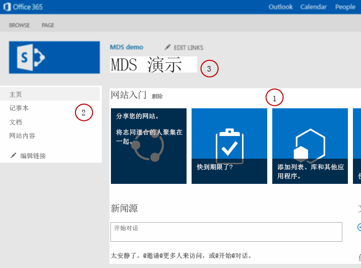

# 为 MDS 修改 SharePoint 组件
了解如何修改 SharePoint 项目中的组件以在 SharePoint 2013 中利用最少下载策略(MDS)。
最少下载策略 (MDS) 通过仅从服务器返回在浏览器中正确呈现页面所需的页面部分来改善用户体验。由于完全呈现的页面不会返回到客户端，因此服务器必须能够准确识别呈现页面所需的部分。您可能需要修改 SharePoint 项目中的组件，以便标识为 MDS 兼容，并与 MDS 引擎一起工作。请参阅 [最少下载策略概述](minimal-download-strategy-overview.md)了解有关 MDS 的详细信息。
  
    
    


## 为何修改 SharePoint 组件？
<a name="bk_whymodify"> </a>

如 [最少下载策略概述](minimal-download-strategy-overview.md)中所述，无论您是否修改 SharePoint 控件以充分利用 MDS，控件都会正常工作。但是，如果您的组件与 MDS 不兼容，MDS 引擎会发出故障转移。在故障转移中，MDS 引擎会进行额外的往返过程来将浏览器重定向到新页面的完整版本。如果您修改组件以与 MDS 一起工作并避免每次在 SharePoint 中浏览到新页面时出现故障转移，用户将获得最佳体验。您通常需要修改母版页、ASP.NET 页、控件和 Web 部件。 
  
    
    

  
    
    

## 母版页
<a name="SP15MDSDev_MasterPages"> </a>

母版页提供了一个模板，可让 MDS 在用户导航到新页面时识别可能需要更新的内容区域。优化性能时，优化母版页是要采取的最重要步骤之一，因为母版页可识别需要更新内容的部分。SharePoint 中包含的 Seattle.master 母版页是经优化母版页的很好示例。图 1 显示了 Seattle.master 母版页中会根据页面不同而变化的组件示例，如 (1) 主内容区域、(2) 左侧导航栏和 (3) 页面标题。
  
    
    

**图 1. 母版页中需要更新的组件**

  
    
    

  
    
    

  
    
    

    
> **注释**
> Seattle.master 母版页中还有很多组件会根据页面不同而变化，如样式表和 JavaScript 文件。图 1 仅显示了少数示例。 
  
    
    

优化母版页中的组件有不同模式。您可以对以下组件使用一个模式：
  
    
    

- HTML 区域和控件
    
  
- 样式表
    
  
- JavaScript 文件
    
  
- 页面标题
    
  
如果 HTML 区域和控件封装在 **SharePoint:AjaxDelta** 标记内，则与 MDS 兼容。将内容封装在 **SharePoint:AjaxDelta** 标记内表示 MDS 引擎应更新封装的控件和 HTML。如果控件或 HTML 部分在页面之间没有变化，则不应发送到客户端。因此，您应将这些控件保留在 **AjaxDelta** 标记以外。在图 1 所示的 Seattle.master 母版页中，(1) 主内容区域封装在 **AjaxDelta** 标记内，如下所示。
  
    
    


```cs
<SharePoint:AjaxDelta
            id="DeltaPlaceHolderMain"
            BlockElement="true"
            IsMainContent="true"
            runat="server">
    <a id="mainContent" name="mainContent" tabindex="-1"></a>
    <asp:ContentPlaceHolder id="PlaceHolderMain" runat="server" />
</SharePoint:AjaxDelta>
```

 **AjaxDelta** 模式的另一个示例是图 1 中的 (2) 左侧导航栏。以下代码显示了该控件如何与其他大量控件和 HTML 封装在 **AjaxDelta** 标记内。
  
    
    


```cs
<SharePoint:AjaxDelta
            id="DeltaPlaceHolderLeftNavBar"
            BlockElement="true"
            CssClass="ms-core-navigation"
            role="navigation"
            runat="server">
    <asp:ContentPlaceHolder id="PlaceHolderLeftNavBar" runat="server">
        <a id="startNavigation" name="startNavigation" tabIndex="-1"></a>
        <asp:ContentPlaceHolder id="PlaceHolderLeftNavBarTop" runat="server" />
        <asp:ContentPlaceHolder id="PlaceHolderQuickLaunchTop" runat="server" />
        <asp:ContentPlaceHolder id="PlaceHolderLeftNavBarDataSource" runat="server" />
        <asp:ContentPlaceHolder id="PlaceHolderCalendarNavigator" runat="server" />
        <asp:ContentPlaceHolder id="PlaceHolderLeftActions" runat="server" />
        <!-- There are more controls and HTML in this placeholder in the Seattle master page -->
    </asp:ContentPlaceHolder>
</SharePoint:AjaxDelta>
```

要记住的有关 **AjaxDelta** 标记的最后一点是标记不能嵌套。您应在母版页结构中的最高要求级别指定 **AjaxDelta** 标记。
  
    
    
图 1 中的最后一个示例是 (3) 页面标题，该组件需要使用 **SharePoint:PageTitle** 标记的特殊模式。以下代码显示了 Seattle.master 母版页中使用的 **PageTitle** 标记。
  
    
    


```cs

<SharePoint:PageTitle runat="server">
    <asp:ContentPlaceHolder id="PlaceHolderPageTitle" runat="server">
        <SharePoint:ProjectProperty Property="Title" runat="server" />
    </asp:ContentPlaceHolder>
</SharePoint:PageTitle>
```

您的母版页也可以包含样式表和 JavaScript 文件。服务器引擎需要根据需要识别 CSS 和 JavaScript 文件。若要根据需要识别 CSS 文件资源，请使用以下模式。
  
    
    


```cs

<SharePoint:CssLink runat="server" Version="15"/>
<SharePoint:CssRegistration Name="my_styles.css" runat="server" />
```

请注意，每个母版页只能有一个 **CssLink** 标记，但可以有很多 **CssRegistration** 标记，因此您可以添加大量 CSS 文件。对于 JavaScript 文件，请使用以下模式。
  
    
    


```cs

<SharePoint:ScriptLink language="javascript" name="my_javascript.js" runat="server" />
```

包含使用 HTML **style** 和 **script** 标记的 CSS 和 JavaScript 文件在 MDS 中不受支持。
  
    
    

## ASP.NET 页面
<a name="SP15MDSDev_ASPNET"> </a>

如果您的项目包含 ASP.NET 页面，可能需要引用 CSS 和 JavaScript 文件。HTML **style** 和 **script** 标记与 MDS 不兼容。然而，可以使用前一部分中介绍的 **CssRegistration** 和 **ScriptLink** 模式。
  
    
    
您的 ASP.NET 页面还可以使用 **Response.Output** 方法将内容写入页面，MDS 不允许此方法。然而，您可以使用以下 [SPHttpUtility](https://msdn.microsoft.com/library/Microsoft.SharePoint.Utilities.SPHttpUtility.aspx) 类的 MDS 兼容方法。
  
    
    

-  [WriteNoEncode()](https://msdn.microsoft.com/library/Microsoft.SharePoint.Utilities.SPHttpUtility.WriteNoEncode.aspx)
    
  
-  [WriteHtmlEncode()](https://msdn.microsoft.com/library/Microsoft.SharePoint.Utilities.SPHttpUtility.WriteHtmlEncode.aspx)
    
  
-  [WriteEcmaScriptStringLiteralEncode()](https://msdn.microsoft.com/library/Microsoft.SharePoint.Utilities.SPHttpUtility.WriteEcmaScriptStringLiteralEncode.aspx)
    
  
-  [WriteHtmlEncodeAllowSimpleTextFormatting()](https://msdn.microsoft.com/library/Microsoft.SharePoint.Utilities.SPHttpUtility.WriteHtmlEncodeAllowSimpleTextFormatting.aspx)
    
  
-  [WriteHtmlUrlAttributeEncode()](https://msdn.microsoft.com/library/Microsoft.SharePoint.Utilities.SPHttpUtility.WriteHtmlUrlAttributeEncode.aspx)
    
  
-  [WriteUrlKeyValueEncode()](https://msdn.microsoft.com/library/Microsoft.SharePoint.Utilities.SPHttpUtility.WriteUrlKeyValueEncode.aspx)
    
  
-  [WriteUrlPathEncode()](https://msdn.microsoft.com/library/Microsoft.SharePoint.Utilities.SPHttpUtility.WriteUrlPathEncode.aspx)
    
  
除了引用 JavaScript 文件，您的 ASP.NET 页面还可以具有内嵌 JavaScript 代码。使用以下模式以让脚本块与 MDS 兼容。
  
    
    


```cs
<SharePoint:ScriptBlock runat="server" >
    // Your JavaScript code here.
</SharePoint:ScriptBlock>
```


## 控件和 Web 部件
<a name="SP15MDSDev_WebParts"> </a>

您还需要将控件和 Web 部件标记为 MDS 兼容。以下代码显示了要使用的模式。
  
    
    

```cs

[assembly: Microsoft.SharePoint.WebControls.MdsCompliantAttribute(IsCompliant = true)]
namespace VisualWebPartProject2.VisualWebPart1
{
    // Rest of your control logic
```

此外，您的控件和 Web 部件需要使用  [SPPageContentManager](https://msdn.microsoft.com/library/Microsoft.SharePoint.WebControls.SPPageContentManager.aspx) 类中的方法注册资源。最常见资源是 JavaScript 代码段和隐藏文件，可以分别使用 **RegisterClientScriptBlock** 和 **RegisterHiddenField** 注册。
  
    
    
您的控件和 Web 部件还可以使用 XSLT 文件来控制呈现过程。您的 XSLT 文件可以具有嵌入式 JavaScript 代码或文件。MDS 引擎需要知道这些资源。您可以使用名为 **pcm** 的 XSLT 扩展对象注册 JavaScript 资源。如何使用 **pcm** 对象的一个很好示例是用于 %ProgramFiles%\\Common Files\\Microsoft Shared\\web server extensions\\15\\TEMPLATE\\LAYOUTS\\XSL\\fldtypes.xsl 文件中。以下代码显示了 **fldtypes.xsl** 文件如何使用 **pcm** 对象来注册 JavaScript 资源。
  
    
    


```XML

<xsl:value-of select="pcm:RegisterScriptBlock(concat('block1',$ViewCounter), string($scriptbody1))"/>
<xsl:value-of select="pcm:RegisterScriptLink('/_layouts/15/wssactionmenu.js')"/>
```


## 其他资源
<a name="bk_addresources"> </a>


-  [最少下载策略概述](minimal-download-strategy-overview.md)
    
  
-  [为 SharePoint 构建网站](build-sites-for-sharepoint.md)
    
  

