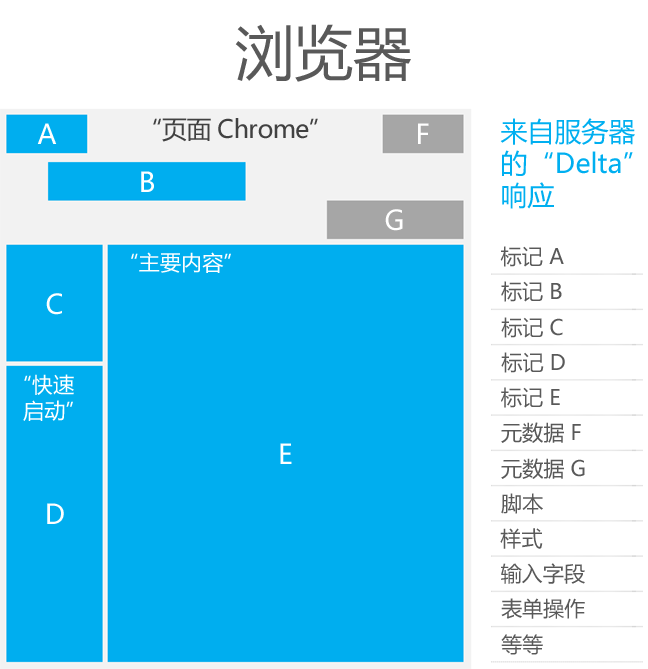
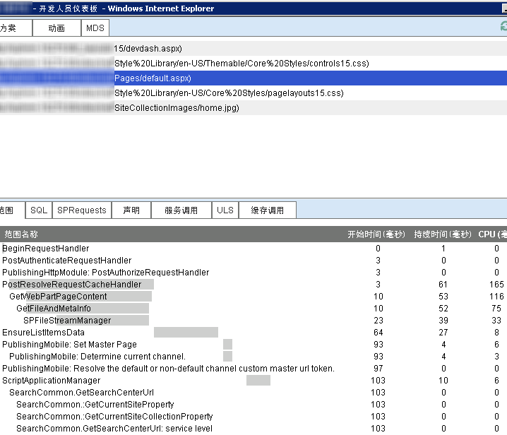

# 优化 SharePoint 2013 中的页面性能
了解用于改进 SharePoint 2013 中的页面性能的功能。这些功能可用于改进地域分布式实施中的体验。
 * **提供者：*** David Crawford，Microsoft Corporation
  
    
    

本文提供了帮助优化 SharePoint 中性能的说明。SharePoint 2013 包括有助于优化通过广域网 (WAN) 进行页面加载的功能。通过将页面设计得尽可能小而响应迅速，补充了这些性能改进。
## 最少下载策略 (MDS)
<a name="MDS"> </a>

最少下载策略 (MDS) 依赖于仅下载完全呈现在服务器上的页面的特定部分的功能。通过仅下载这些特定部分，提供了一个非常有效的加载模型。完全呈现的页面不会返回到客户端。服务器必须能够精确识别必须返回的部分以及不必要的部分。可能属于也可能不属于响应的部分包括脚本、样式和标记。
  
    
    
下表显示了使用 MDS 的一些好处。
  
    
    

**表 1. 使用 MDS 的好处**


|**表现**|**结果**|
|:-----|:-----|
|每个页面请求下载的数据量更少。  <br/> |重新加载完整页面不会导致浏览器闪烁。  <br/> |
|浏览器仅需更新自上次请求以来更改的页面部分。  <br/> |易于识别动画。  <br/> |
|在客户端上只需进行少量处理。  <br/> > **注释**> 客户端页面加载时间 1 (PLT1) 有一半是由于部件版式级联样式表 (CSS) 呈现和 JavaScript 解析与执行。           |页面更改会吸引用户的注意。  <br/> |
   
AJAX 和 MDS 两种技术仅请求页面的某些部分，从而最大限度地减少数据下载并改进页面响应速度。下图显示了 MDS 体系结构。
  
    
    

**图 1. MDS 体系结构**

  
    
    

  
    
    

  
    
    
MDS 框架假定母版页定义了部件版式和内容区域。在 MDS 中，SharePoint 浏览到页面意味着仅请求这些区域的内容以及这些页面所依赖的资源。这些内容下载到浏览器之后，脚本代码则会将标记或资源应用到相应的页面。浏览器表现得好像请求的页面已从服务器完全加载一样。
  
    
    

**图 2. SharePoint 页面中的页面版式和区域**

  
    
    

  
    
    

  
    
    
当用户浏览到 MDS 模式的 SharePoint 网站时，将不会回发并重新加载整个页面。相反，他们所访问的页面的 URL 将保持不变，片段标识符（"#"符号）将变为包含他们所访问的页面。URL 的格式为： `[Path to site (spweb)] + /_layouts/15/start.aspx# + [path to page] + [query string]`
  
    
    
下表显示了采用 MDS 模式的某些 URL 示例。
  
    
    

**表 2. 采用 MDS 模式的 URL**


|**非 MDS URL**|**MDS URL**|
|:-----|:-----|
|http://server/SitePages/  <br/> |http://server/_layouts/15/start.aspx#/SitePages/  <br/> |
|http://server/subsite/SitePages/home.aspx  <br/> |http://server/subsite/_layouts/15/start.aspx#/SitePages/home.aspx  <br/> |
|http://server/_layouts/15/viewlsts.aspx?BaseType=0  <br/> |http://server/_layouts/15/start.aspx#/_layouts/viewlsts.aspx?BaseType=0  <br/> |
   
用于 AJAX 导航的对象为 **AjaxNavigate**。默认情况下，有一个 **AjaxNavigate** 实例可供您使用，名为 **ajaxNavigate**。要使用 **ajaxNavigate** 实例，请执行以下操作：
  
    
    


```cs

ajaxNavigate.update(serverRelativeURL, null);
```

如果您希望某个控件或 Web 部件侦听导航事件，您可以使用 **add_navigate** 处理程序。调用此处理程序时，您的回调函数将收到对字典中的导航对象和解析哈希值的引用。此控件或 Web 部件可以检索来自字典的参数的值、将其与当前值进行比较并决定需采取的操作。一个常规操作是向服务器发送 AJAX 请求，以检索某些数据或在视图中对项目重新排序。当某个控件完成对导航事件的侦听后，即可使用 **remove_navigate** 处理程序。
  
    
    
MDS 还支持键/值对中的多个哈希标记。MDS 可将哈希标记附加到 URL 后面。URL 中哈希标记的格式为：http://server/_layouts/15/start.aspx#/SitePages/page.aspx#key1=value1#key2=value2。下面的代码示例说明了如何更新哈希标记。
  
    
    


```
var updateParts;
updateParts = {key1: "value1", key2: "value2", keyn: "valuen"}
ajaxNavigate.update(null, updateParts);

```

如果您发现网站中的页面持续后退以下载整个页面，您可能会考虑关闭 MDS 功能。如果您希望使用其他策略来改进性能，也可以关闭 MDS 功能。
  
    
    
页面中的特定元素必须确保工作所需的关键资源在服务器呈现时已为 MDS 基础结构所知。要将现有项目转换为使用 MDS，您需要更新以下文件和组件：
  
    
    

- 母版页
    
  
- ASP.NET 页面
    
  
- 错误的自定义母版页
    
  
- JavaScript 文件
    
  
- 控件和 Web 部件
    
  

### 母版页

母版页中的主要变化是使用一个名为 **SharePoint:AjaxDelta** 的特殊控件，将要发送到客户端的 HTML 标记区域包围起来。需要用 **SharePoint:AjaxDelta** 控件包围起来的最常见部件是母版页部件版式和内容占位符中嵌入的控件。如果控件在网站中的所有页面上均保持不变，则不应用 **SharePoint:AjaxDelta** 控件封装。以下标记显示了被 **SharePoint:AjaxDelta** 控件包围的可见内容占位符。
  
    
    

```HTML

<SharePoint:AjaxDelta id="DeltaPlaceHolderMain" IsMainContent="true" runat="server">
    <asp:ContentPlaceHolder id="PlaceHolderMain" runat="server" />
</SharePoint:AjaxDelta>
```

具有依赖于当前 URL 的内容的控件必须用 **SharePoint:AjaxDelta** 控件封装。以下标记显示了被 **SharePoint:AjaxDelta** 控件包围的菜单。
  
    
    


```HTML

<SharePoint:AjaxDelta id="DeltaBreadcrumbDropdown" runat="server">
    <SharePoint:PopoutMenu
        runat="server"
        ID="GlobalBreadCrumbNavPopout"
        IconUrl=IMGCLUSTER_FG_IMG
        IconAlt=LOC_ATTR_WSS(master_breadcrumbIconAlt)
        IconOffsetX=IMGCLUSTER_FG_LEFT(BREADCRUMBBUTTON)
        IconOffsetY=IMGCLUSTER_FG_TOP(BREADCRUMBBUTTON)
        IconWidth=IMGCLUSTER_FG_WIDTH(BREADCRUMBBUTTON)
        IconHeight=IMGCLUSTER_FG_HEIGHT(BREADCRUMBBUTTON)
        AnchorCss="s4-breadcrumb-anchor"
        AnchorOpenCss="s4-breadcrumb-anchor-open"
        MenuCss="s4-breadcrumb-menu">
    </SharePoint:PopoutMenu>
</SharePoint:AjaxDelta>

```


> **注释**
> **SharePoint:AjaxDelta** 控件本身不应嵌套。请在所需的最高级别指定此控件。
  
    
    

如果您希望包含级联样式表 (CSS) 文件，则需使用 **SharePoint:CssLink** 和 **SharePoint:CssRegistration** 控件。这些控件已更新为可在 MDS 和非 MDS 模式下使用。以下标记显示如何使用 **SharePoint:CssLink** 和 **SharePoint:CssRegistration** 控件。
  
    
    


```HTML

<SharePoint:CssLink runat="server" Version="15"/>
<SharePoint:CssRegistration Name="my_stylesheet.css" runat="server" />
```


> **警告**
> 每个页面只能有一个 **SharePoint:CssLink** 控件。在 MDS 模式下，如果某个页面中包含多个 **SharePoint:CssLink** 控件，将收到错误。在 MDS 模式下，不支持包含使用 HTML 样式元素的 CSS 文件，因为服务器逻辑无法在呈现响应时将此文件识别为所需资源。
  
    
    

要包含 JavaScript 文件，请使用 **SharePoint:ScriptLink** 控件。下面的标记显示了如何使用 **SharePoint:ScriptLink** 控件。
  
    
    


```HTML

<SharePoint:ScriptLink language="javascript" name="my_javascriptfile.js" runat="server" />
```


> **警告**
> 在 MDS 模式下，不支持包含使用 HTML 脚本标记的 JavaScript 文件，因为服务器逻辑无法在呈现响应时将此文件识别为所需资源。 
  
    
    

要在页面的头元素内呈现标题元素，我们采用了使用 **SharePoint:PageTitle** 控件的特殊模式。下面的标记显示了如何使用 **SharePoint:PageTitle** 控件。
  
    
    


```HTML
<SharePoint:PageTitle runat="server">
    <asp:ContentPlaceHolder id="PlaceHolderPageTitle" runat="server" />
</SharePoint:PageTitle>

```


> **注释**
> 每个页面都必须替换 **SharePoint:PageTitle** 控件内的 **asp:ContentPlaceHolder** 控件以覆盖标题。
  
    
    


### ASP.NET 页面

要包含 JavaScript 或 CSS 文件，请使用上一节中所述的相同 **SharePoint:ScriptLink** 和 **SharePoint:CssLink** 控件。
  
    
    
在 SharePoint 的之前版本中，某些页面使用 **Response.Output** 属性写入内容。如果您使用 MDS，将不再允许此操作。您必须将 **Response.Output** 调用更改为使用新的 API。下表显示了 SharePoint 页面中的常用 API 和兼容 MDS 的新 API。
  
    
    

**表 3. 常用 API 及其与 MDS 兼容的替代项**


|**常用 API**|**与 MDS 兼容的替代项**|
|:-----|:-----|
| [NoEncode()](https://msdn.microsoft.com/library/Microsoft.SharePoint.Utilities.SPHttpUtility.NoEncode.aspx) <br/> | [WriteNoEncode()](https://msdn.microsoft.com/library/Microsoft.SharePoint.Utilities.SPHttpUtility.WriteNoEncode.aspx) <br/> |
| [HtmlEncode()](https://msdn.microsoft.com/library/Microsoft.SharePoint.Utilities.SPHttpUtility.HtmlEncode.aspx) <br/> | [WriteHtmlEncode()](https://msdn.microsoft.com/library/Microsoft.SharePoint.Utilities.SPHttpUtility.WriteHtmlEncode.aspx) <br/> |
| [EcmaScriptStringLiteralEncode()](https://msdn.microsoft.com/library/Microsoft.SharePoint.Utilities.SPHttpUtility.EcmaScriptStringLiteralEncode.aspx) <br/> | [WriteEcmaScriptStringLiteralEncode()](https://msdn.microsoft.com/library/Microsoft.SharePoint.Utilities.SPHttpUtility.WriteEcmaScriptStringLiteralEncode.aspx) <br/> |
| [HtmlEncodeAllowSimpleTextFormatting()](https://msdn.microsoft.com/library/Microsoft.SharePoint.Utilities.SPHttpUtility.HtmlEncodeAllowSimpleTextFormatting.aspx) <br/> | [WriteHtmlEncodeAllowSimpleTextFormatting()](https://msdn.microsoft.com/library/Microsoft.SharePoint.Utilities.SPHttpUtility.WriteHtmlEncodeAllowSimpleTextFormatting.aspx) <br/> |
| [HtmlUrlAttributeEncode()](https://msdn.microsoft.com/library/Microsoft.SharePoint.Utilities.SPHttpUtility.HtmlUrlAttributeEncode.aspx) <br/> | [WriteHtmlUrlAttributeEncode()](https://msdn.microsoft.com/library/Microsoft.SharePoint.Utilities.SPHttpUtility.WriteHtmlUrlAttributeEncode.aspx) <br/> |
| [UrlKeyValueEncode()](https://msdn.microsoft.com/library/Microsoft.SharePoint.Utilities.SPHttpUtility.UrlKeyValueEncode.aspx) <br/> | [WriteUrlKeyValueEncode()](https://msdn.microsoft.com/library/Microsoft.SharePoint.Utilities.SPHttpUtility.WriteUrlKeyValueEncode.aspx) <br/> |
| [UrlPathEncode()](https://msdn.microsoft.com/library/Microsoft.SharePoint.Utilities.SPHttpUtility.UrlPathEncode.aspx) <br/> | [WriteUrlPathEncode()](https://msdn.microsoft.com/library/Microsoft.SharePoint.Utilities.SPHttpUtility.WriteUrlPathEncode.aspx) <br/> |
   
如果某个页面、控件或 Web 部件将其输出指向 **Response.Output** 属性，将导致 MDS 进行故障恢复。当 MDS 进行故障恢复时，它将执行到所请求页面的完整导航。您可以在调试服务器组件时，使用 **DeltaPage ._shipRender** 属性查找有冲突的控件。
  
    
    
您应使用 **SharePoint:ScriptBlock** 控件替换 HTML 内联脚本元素。下表显示了 HTML 内联脚本元素和 **SharePoint:ScriptBlock** 控件。
  
    
    

**表 4. HTML 内联脚本元素及其与 MDS 兼容的替代项**


|**HTML 内联脚本元素**|**与 MDS 兼容的替代项**|
|:-----|:-----|
|
```

<script type="text/javascript">
    // Your JavaScript code goes here.
</script>
```

|
```

<SharePoint:ScriptBlock runat="server">
    // Your JavaScript code goes here.
</SharePoint:ScriptBlock>
```

|
   
在页面中引入 **SharePoint:ScriptBlock** 可以更改页面中的变量范围。有时必须将变量声明从 `<% %>` 移到 `<script runat="server"> <script>`。要测试这一点，请在执行更新后在浏览器中加载页面。
  
    
    

> **注释**
> MDS 基础结构不支持 VBScript，因为它在 ASP.NET 中无法注册为脚本。脚本必须转换为 JavaScript。 
  
    
    

ASP.NET 页面中的超链接必须更新为使用 **SPUpdatePage** 类型。表 5 显示了 ASP.NET 页面中的超链接以及使用 **SPUpdatePage** 类型更新的相同链接。
  
    
    

**表 5. ASP.NET 中的超链接及其与 MDS 兼容的替代项**


|**ASP.NET 中的超链接**|**与 MDS 兼容的替代项**|
|:-----|:-----|
|
```cs

<a
    id=<%_STSWriteHTML("viewlist" + spList.BaseTemplate.ToString());%>
    href=<%_STSWriteURL(listViewUrl);%>
>

```

|
```cs

<a
    id=<%_STSWriteHTML("viewlist" + spList.BaseTemplate.ToString());%>
    href=<%_STSWriteURL(listViewUrl);%>
    onclick="if (typeof(SPUpdatePage) !== 'undefined') return SPUpdatePage(this.href);"
>
```

|
   

### 错误的自定义母版页

您可以在 MDS 模式下显示错误消息，即使当您使用错误的自定义母版页时。要在 MDS 模式下使用错误的自定义母版页，您必须在将 **id** 属性设置为字符串 **"DeltaPlaceHolderMain"** 的错误母版页中定义 **AjaxDelta** 。必须将错误消息的内容呈现在 **AjaxDelta** 中。当错误页面从服务器返回到浏览器时，浏览器会将其识别为要显示的主要内容并向用户显示。
  
    
    
尽管错误页面和 **start.aspx** 的母版页并不明显匹配，但浏览器可以检测到发生了错误。浏览器允许 MDS 在现有母版页内使用相关的错误消息内容，以维持一致、流畅的用户体验。
  
    
    

### JavaScript 文件

JavaScript 文件应仅包含函数声明。但是，许多旧脚本仍包含全局变量初始化。在 MDS 模式下呈现新页面时，需要重新初始化全局变量。您可以使用 **ExecuteAndRegisterBeginEndFunctions** 初始化全局变量。下面的代码示例显示了如何使用 **ExecuteAndRegisterBeginEndFunctions**。
  
    
    

```

function ExecuteAndRegisterBeginEndFunctions(tag, beginFunc, endFunc, loadFunc)

```

 **ExecuteAndRegisterBeginEndFunctions** 具有以下参数：
  
    
    

-  _tag_：注册回调的文件的名称，仅用于调试目的。
    
  
-  _beginFunc_：在请求页面增量之前调用的函数。
    
  
-  _endFunc_：在检索数据之后、应用新页面的 HTML 和 JavaScript 之前调用的函数。
    
  
-  _loadFunc_：在应用新页面的 HTML 和 JavaScript 之后调用的函数。
    
  

### 控件和 Web 部件

要使用 MDS，控件和 Web 部件必须使用 **SPPageContentManager** 对象注册页面资源。使用 **SPPageContentManager** 的最常注册的资源为 JavaScript 代码段（函数或 JSON 变量）和隐藏字段。下表显示了插入隐藏字段和 JavaScript 代码段的常规模式，以及如何使用 **SPPageContentManager** 对象执行相同操作。
  
    
    

**表 6. 呈现内容的常见做法及其与 MDS 兼容的替代项**


|**呈现内容的常见做法**|**与 MDS 兼容的替代项**|
|:-----|:-----|
|
```cs

output.Write("<input type=\\"hidden\\" name=\\"");
output.Write(SPHttpUtility.NoEncode("HiddenField));
output.Write("\\" value=\\"");
output.Write(DigestValue);
output.Write("\\" />");
```

|
```cs

SPPageContentManager.RegisterHiddenField(this, "HiddenField", DigestValue);
```

|
|
```cs
Page.ClientScript.RegisterClientScriptBlock(typeof(MyType), "MyKey", "var myvar=1", true);

```

|
```cs

SPPageContentManager.RegisterClientScriptBlock(this, typeof(MyType), "MyKey", "var myvar=1");
```

|
   

> **注释**
> **SPPageContentManager** 对象中的 **RegisterHiddenField** 和 **RegisterClientScriptBlock** 函数要求第一个参数中为 **Control** 或 **Page** 类型的对象。
  
    
    

MDS 引擎使用第一个参数来筛选脚本。以下是在 MDS 增量模式下呈现页面时的筛选规则：
  
    
    

- 如果第一个参数类型为 **Page** ，脚本将在浏览器中执行。
    
  
- 如果第一个参数类型不为 **Page** 且控件属于 **SharePoint:AsyncDelta** ，脚本将在浏览器中执行。
    
  
- 如果第一个参数为 Web 部件，脚本将在浏览器中执行。
    
  
SharePoint 之前版本中的很多 API 不会将当前控件作为参数提供。SharePoint 2013 中的公共对象模型旨在提供注册资源的替代方法。不将当前控件作为参数提供的方法仍位于 API 中以实现向后兼容。
  
    
    
您可以使用名为 **SPUpdatePage** 的新函数在两个页面之间导航。当控件或 Web 部件在 MDS 增量模式下呈现时， **HyperLink** 控件必须添加 **onclick** 处理程序并调用 **SPUpdatePage**。
  
    
    
您必须更新 Web 部件使用的 XSLT，因为所有资源都必须使用 **SPPageContentManager** 对象添加，使其与 MDS 兼容。您可以使用 **SPPageContentManager** 对象的 **RegisterScriptLink** 和 **RegisterScriptBlock**方法 将 JavaScript 代码段添加到 XSLT。
  
    
    

## 优化页面下载
<a name="MDS"> </a>

了解页面组成后，您可以使用不同的方法来优化此页面的下载体验。通常情况下，目标是最大限度地降低客户端和服务器计算机之间的往返次数，并降低通过网络传输的数据量。本文中的指南包括您可以广泛应用于 SharePoint 2013 各种不同实施的建议。
  
    
    
表 7 显示了说明第一次、第二次和后续页面加载之间差异的示例加载时间。
  
    
    

**表 7. 页面加载时间**

|||
|:-----|:-----|
|第一次页面加载  <br/> |3-4 秒  <br/> |
|第二次页面加载  <br/> |1.5 秒  <br/> |
|后续页面加载  <br/> |1 秒  <br/> |
   

> **注释**
> 页面加载时间在特定方案下可能有所不同。加载时间受很多变量影响，这包括但不仅限于页面大小、延迟和服务器负载。 
  
    
    

您应将页面优化技术分为两类：第一个页面请求和后续页面请求。第一个页面请求的优化（页面加载时间 1 或 PLT1）是第一次请求页面时有效，但不影响后续页面请求的优化。下面是 PLT1 的部分优化：
  
    
    

- 优化 HTML 标记。
    
  
- 使用合并图像和文件；例如，将多个 CSS 文件合并成一个。将图像合并成一个图像条或群集。
    
  
- 使用压缩 (crunch) 技术。有关详细信息，请参阅 [压缩 (crunch) JavaScript 和 CSS 文件](optimize-page-performance-in-sharepoint-2013.md#OptimizingPagePerformance_Crunch)。
    
  
- 确认您引用的是常规 JavaScript 库的生产版本（例如 jQuery），而非调试版本。
    
  
- 请考虑使用已知的内容交付网络 (CDN)，如  [Microsoft Ajax 内容交付网络](http://www.asp.net/ajaxlibrary/cdn.ashx)。页面中所需的文件可能已由客户端浏览器缓存。
    
  
后续页面请求优化是可以改进后续页面加载的用户体验的优化。关键在于，您需要平衡功能损失与所获得的好处。如果仅在用户第一次点击网站时能获得好处，那么优化可能不足以弥补功能损失。
  
    
    

## 压缩 (crunch) JavaScript 和 CSS 文件
<a name="OptimizingPagePerformance_Crunch"> </a>

通过删除空白、样式继承和代码重用，包含 JavaScript 和样式的文件大小可能大大减小。某些库提供常规（调试）和压缩 (crunch) 版本。您可以通过搜索 Internet，查找自动进行文件处理的各种工具。
  
    
    
确认压缩版本已部署到生产服务器。此示例显示如何通过相对简单的重新编写来减小 CSS 文件大小。
  
    
    


```
.article-ByLine  {
  font-family: Tahoma,sans-serif; 
  font-size: 9.5pt; 
  font-style: normal; 
  line-height: normal; 
  font-weight: normal; 
  color: #000000
}
.article-Caption { 
  font-family: Tahoma,sans-serif; 
  font-size: 8pt; 
  font-style: normal; 
  line-height: normal; 
  font-weight: normal; 
  color: #000000
}
.article-Headline { 
  font-family: Tahoma,sans-serif; 
  font-size: 14pt; 
  font-style: normal; 
  line-height: normal; 
  font-weight: bold; 
  color: #000000
}
.article-SubHead  { 
  font-family: Tahoma, sans-serif; 
  font-size: 11pt; 
  font-style: normal; 
  line-height: normal; 
  font-weight: normal; 
  color: #000000
}
.article-Text {
  font-family: Tahoma, sans-serif; 
  font-size: 10pt; 
  font-style: normal; 
  line-height: normal; 
  font-weight: normal; 
  color: #000000
}

```

您通常可以找到方法实现相同的样式，并通过有效地重新编写 CSS 文件来减小文件大小。以下示例显示了如何通过从父元素继承样式来优化以前的 CSS 大小。
  
    
    


```

BODY {font:100% Tahoma,sans-serif}
.art-By {font: 79%}
.art-Cap {font: 67%}
.art-Head {font: bold 117%}
.art-Sub {font: 92%}
.art-Txt {font: 83%}
```

CSS 的第一个版本长度为 783 个字符，第二个版本长度为 140 个字符。
  
    
    

## 实体标记
<a name="OptimizingPagePerformance_Crunch"> </a>

实体标记 (ETag) 可能使客户端不必要地重新加载文件。ETag 用于使用服务器生成的数字唯一标识。在服务器群集中，每个服务器都将创建一个不同的编号。例如，对于在缓存中找到的文件，浏览器将使用 **If-Modified** 头字段发送 **Get** 方法。如果只有一个服务器，文件可能匹配并将发送 **304 Not-Modified** http 状态。但是，如果用户正在访问大型服务器场，可能会命中一个使用不同实体标记的其他服务器，使该服务器向浏览器发送文件。
  
    
    

## 缓存设置
<a name="OptimizingPagePerformance_Crunch"> </a>

使用 Fiddler 或类似的工具确认缓存是否为请求提供服务。缓存不为请求提供服务的部分原因包括：
  
    
    

- 资源没有过期日期值。
    
  
- 查询字符串一直在变化。
    
  
- **max-age** 缓存控制指令加上 **last-modified** 头的和产生了一个早于今天的日期。
    
  
- 代理服务器不支持 **max-age** 属性。
    
  
- **cache-control** 头的值为 **no-cache** 。若值为 **private** ，将缓存仅适用于发出该请求的用户的资源。
    
  

## 图像的数量和大小
<a name="OptimizingPagePerformance_Crunch"> </a>

您应最大限度地减少网站中的图像数量。为实现这一点，您可以将多个图像嵌入一个文件，然后在页面中引用单个图像。这样不仅可以减小文件下载大小，还可以减少文件数量，从而降低网络流量。使用此技术编写页面更为复杂，但在每次往返和每个文件大小都需计算在内的情况下，这已证明是改进性能的有效方法。图 3 是包含多个图像的单个图像文件的示例。
  
    
    

**图 3. 包含多个图像的单个图像文件**

  
    
    

  
    
    

  
    
    
图 4 说明了后来如何将图像文件更改为在表中显示单个图片。
  
    
    

**图 4. 以表格形式显示多个图像**

  
    
    

  
    
    

  
    
    
图像操作已完全通过样式表类完成。每个表格单元的 **div** 和 **img** 元素中使用两个主要类。这些类如下所示。
  
    
    


```

BODY {font:100% Tahoma,sans-serif}
.art-By  {font: 79%}
.art-Cap {font: 67%}
.art-Head {font: bold 117%}
.art-Sub  {font: 92%}
.art-Txt {font: 83%}


.cluster { 
   height:50px; 
   position:relative; 
   width:50px; 
} 
.cluster img { 
   position:absolute; 
}
```

根据图像的标识符 (ID)，每个图像都有一个与其关联的类。该样式剪辑图片，并定义与群集中初始图片的偏差。这些类如下所示。
  
    
    


```

#person {
   border:none; 
   clip:rect(0, 49, 49, 0); 
} 
#keys { 
   clip:rect(0, 99, 49, 50); 
   left:-50px; 
} 
#people { 
   clip: rect(0, 149, 49, 100); 
   left:-100px; 
} 
#lock { 
   clip:rect(0, 199, 49, 150); 
   left:-150px; 
} 
#phone { 
   clip:rect(0,249, 49, 200); 
   left:-200px; 
}
#question {
    clip: rect(0, 299, 49, 250);
    left: -250px;
}
```


## 列表视图页面
<a name="OptimizingPagePerformance_Crunch"> </a>

Microsoft 一直努力量化和改进列表视图页面呈现时间的性能。列表视图页面是每个列表和库浏览内容时使用的 AllItems.aspx 页面。根据视图中可见的列数和列的格式，该页面的呈现时间可能大不相同。例如，显示选项和启用状态图标可能对呈现时间产生很大的影响。折叠的分组选项所需的呈现时间可能比展开的分组选项要长得多，而这两者又比完全没有分组选项要慢。
  
    
    
这些类型的细微差别正是为何要仔细考虑在列表视图页面中如何构建视图的原因所在，尤其在网络连接缓慢的情况下。使用包含大量数据的列表时，必须谨慎设计所有视图，尤其是默认视图。通常情况下，您可以使用以下建议，加速列表视图页面的呈现时间：
  
    
    

- 仅显示确实需要的列。
    
  
- 如果可能，排除包含状态信息的列。
    
  
- 使用链接而非编辑菜单来查看项目详细信息。
    
  
下表描述了缩短视图呈现时间的自定义设置。
  
    
    

**表 8. 用于降低视图呈现时间的自定义设置**


|**项目**|**说明**|
|:-----|:-----|
|视图类型  <br/> |将视图创建为数据表视图，而非标准视图。  <br/> |
|视图：项目限制  <br/> |超过 1000 个的项目可能都会呈现得很慢。在连接缓慢的情况下，必须进行试验，在一次显示的数据量和查看所有数据所需的往返次数之间找到适当的平衡点。一次显示的行数越多，往返次数就越少，但页面也越大。  <br/> |
|视图：筛选器  <br/> |使用 **[Today]** 或 **[Me]** 关键字，按新鲜度或分配筛选项目。使用"状态"字段，仅在默认视图中显示活动项目。 <br/> |
|视图：列  <br/> |包括数量最少的列。创建包含少量列的默认视图，允许用户对其进行高级别浏览。  <br/> |
   
下表描述了增加视图呈现时间的自定义设置。每增加一列，便会增加呈现时间：对于超过 1000 个项目的列表，在网络连接较快的情况下，每个列最多为半秒。有些列增加的呈现时间比其他列要多，如下表中所示。
  
    
    

**表 9. 用于增加视图呈现时间的自定义设置**


|**项目**|**说明**|
|:-----|:-----|
|分组依据  <br/> |分组会添加 HTML 和 JScript，这将减缓大型网站呈现。默认情况下，所有组折叠，这实际上会进一步增加呈现时间，因为需要对浏览器对象模型执行额外操作。  <br/> |
|列 - 链接到编辑菜单项目的标题  <br/> |选项"链接到编辑菜单项目"所需时间最长；类似的选项"链接到项目"不会显著增加呈现时间。  <br/> |
   

## 开发人员仪表板
<a name="DeveloperDashboard"> </a>

将为 SharePoint 2013 重新构建开发人员仪表板，以提供详细信息，包括 MDS。它在单独的窗口中运行以避免呈现实际页面，并使用图表视图提供每个页面的详细请求信息。它还包括特定请求的统一日志记录系统 (ULS) 日志条目的专用选项卡。还包含其他详细信息，以进行请求分析。它使用设计为提供跟踪信息的专用 Windows Communication Foundation (WCF) 服务 (diagnosticsdata.svc)。
  
    
    
了解有关开发人员仪表板的详细信息：
  
    
    

-  [SharePoint 2013 更新开发人员仪表板概述](http://www.microsoft.com/resources/technet/en-us/office/media/video/video.mdl?cid=stc&amp;amp;from=mscomstc&amp;amp;VideoID=505bdd61-1fcc-4125-97fc-b5f0dda72cbc)（视频）。
    
  
-  [更新开发人员仪表板](http://download.microsoft.com/download/7/7/3/773CA2C2-579B-408C-808E-A6F561194E20/Ig15_SP_IT_M10V3_devdash.pptx)（PowerPoint 幻灯片平台）。
    
  
要启用开发人员仪表板，请使用以下 Windows PowerShell 代码段。
  
    
    


```

$content = ([Microsoft.SharePoint.Administration.SPWebService]::ContentService)
$appsetting =$content.DeveloperDashboardSettings
$appsetting.DisplayLevel = [Microsoft.SharePoint.Administration.SPDeveloperDashboardLevel]::On
$appsetting.Update() 

```

图 5 显示了开发人员仪表板。
  
    
    

**图 5. 开发人员仪表板**

  
    
    

  
    
    

  
    
    
您必须了解这些请求以及图像和查询数量对性能有何影响。对于服务器端呈现的列表视图（XSL 或 CAML），它们有一些相似之处，因为它们遵循与客户端呈现的列表视图相同的大小建议。但是，服务器列表视图指南是仅创建满足要求所需的列表视图（如果您的目标是最优性能），因为数千个视图将导致性能大大降低，以便于进行编译缓存管理。计算机的内存和处理器速度等物理特性将影响整体速度。同时，还要考虑请求将路由到的位置或其分发的方式。为了更好地了解 SharePoint 如何路由和分发请求，您可以使用请求管理器工具。但是，本文不讨论请求分发。有关详细信息请，请参阅 [在 SharePoint Server 2013 中配置请求管理器](http://technet.microsoft.com/library/jj712708.aspx)。
  
    
    

## 结论
<a name="bk_conclusion"> </a>

SharePoint 2010 页面性能优化的大部分指南都适用于 SharePoint 2013。本文提供了 SharePoint 2010 指南的某些元素，同时深入讨论对性能有益处的新领域。我们涵盖了一些明显的变更或增强功能，例如 MDS 和增强的开发人员仪表板。我们还提供了一些常规指南：压缩 JavaScript 和级联样式表、根据需要对常规 JavaScript 库使用 CDN 以便进行缓存、尽量合并和压缩图像、限制或删除视图中的不必要数据，以及恰当构建列表视图。本文讨论的技术和功能有助于实现您的性能目标。
  
    
    

## 其他资源
<a name="bk_addresources"> </a>


-  [为 SharePoint 构建网站](build-sites-for-sharepoint.md)
    
  
-  [SharePoint 2013 设计管理器图像呈现形式](sharepoint-2013-design-manager-image-renditions.md)
    
  
-  [SharePoint 2013 中的设计管理器概述](overview-of-design-manager-in-sharepoint-2013.md)
    
  
-  [SharePoint 2013 页面模型概述](overview-of-the-sharepoint-2013-page-model.md)
    
  
