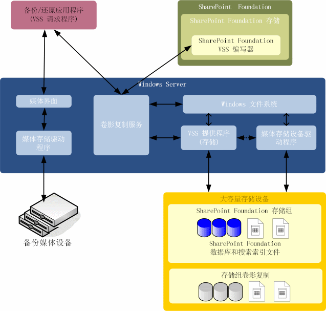

# SharePoint 2013 和卷影复制服务概述
 **摘要：** 了解卷影复制服务 (VSS) 的 Microsoft SharePoint 2013界面。
对备份供应商而言，卷影复制服务 (VSS) 使用集中式 API 简化了 Microsoft 服务器解决方案的备份。Microsoft SharePoint Foundation 包括一个参考 VSS 编写器（后文称为"SPF-VSS 编写器"），这一编写器与 Windows VSS 备份框架集成，能使备份应用程序备份和还原 SharePoint Foundation 数据。它支持整个场（包括搜索索引）的灾难性重写场景。恢复时，它能连接数据库并同步网站映射。
  
    
    

## 系统设计

下图显示系统中的主要组件：Microsoft Windows Server（和卷影复制服务），SharePoint Foundation（和适用于 Windows Server 卷影复制服务的的 SPF-VSS 编写器），以及第三方（或自定义）备份/还原应用程序（包括请求程序和提供程序）。
  
    
    

  
    
    

  
    
    
VSS 通过第三方（或自定义）提供程序与 Windows Server 文件系统以及大容量存储设备驱动程序通信。硬件提供商必须确定创建影子副本的位置。VSS 对硬件特有的影子副本进行抽象化，这样备份/还原应用程序就能以统一的方式访问影子副本，无需知道硬件实现详细信息。 
  
    
    
SharePoint Foundation 存储是 SharePoint Foundation 的一个组件，通过 Windows Server 文件系统访问 SharePoint Foundation 存储组。在文件系统内，每个 SharePoint Foundation 存储组都包含配置、内容、搜索数据库以及在配置数据库和搜索索引文件中注册的任何第三方数据库。另外还包括 SharePoint Foundation 服务应用程序框架中构建的任何服务。 
  
    
    
为支持 VSS，SharePoint Foundation 加入了 SPF-VSS 编写器。SPF-VSS 编写器与 SharePoint Foundation 存储共同工作（代表请求程序执行操作），以在备份之前冻结并卸载存储组，并在备份完成后解除冻结并安装存储组。
  
    
    
在还原过程中，备份/还原应用程序指导 SPF-VSS 编写器与 SharePoint Foundation 存储共同合作（代表请求程序执行操作），以卸载存储组，更换数据库文件，并安装存储组。
  
    
    

    
> **注释**
> 请参阅  [VSS 请求程序和 SharePoint 2013](vss-requestors-and-sharepoint-2013.md) 中的"还原"，获取有关还原的重要信息。
  
    
    

请求程序是一个第三方（或自定义）应用程序，用于使用 VSS 来合理地备份和还原 SharePoint Foundation 数据。请求程序与 VSS 通信，以获取有关 SharePoint Foundation 的信息，指示影子复件的创建，并获取数据访问权限以进行备份。 
  
    
    
在还原时，请求程序还会与 VSS 通信，让系统为还原操作做准备，然后将数据放回大容量存储设备。备份/还原应用程序还要负责与 Windows Server 合作，从备份存储媒体读取数据并向其中写入数据，该媒体可以是磁带存档、存储区网络或者其他备份介质。 
  
    
    
在 SharePoint Foundation、VSS 和备份/还原应用程序间成功完成备份和还原操作所需的信息已转化为 SPF-VSS 编写器元数据的一部分。
  
    
    
以下是备份或还原操作中事件的高级序列：
  
    
    

  
    
    

1. 备份程序（或代理）运行一项计划作业。 
    
  
2. 备份/还原应用程序中的 VSS 请求程序向 VSS 发送一条命令，以获取选定 SharePoint Foundation 存储组的影子副本。 
    
  
3. VSS 与 SPF-VSS 编写器通信，为快照备份做准备。SharePoint Foundation 会禁止对存储组采取管理操作，检查卷的依赖性，并暂停对数据库和事务日志文件的所有写入操作，同时允许只读访问。 
    
  
4. VSS 与相应存储提供程序通信，以创建包含 SharePoint Foundation 存储组的存储卷的影子副本。 
    
  
5. VSS 释放 SharePoint Foundation 以恢复正常的操作。
    
  
6. VSS 请求程序在发出备份已成功的信号之前，会验证备份集的完整性。SharePoint Foundation 会记录数据库最后一次备份的时间。
    
  

## 其他资源

-  [SharePoint 2013 VSS 编写器](sharepoint-2013-vss-writer.md)
    
  
-  [VSS 请求程序和 SharePoint 2013](vss-requestors-and-sharepoint-2013.md)
    
  
-  [如何：创建用于 SharePoint 2013 的 VSS 请求程序](how-to-create-a-vss-requestor-for-use-with-sharepoint-2013.md)
    
  
-  [如何：使用 VSS 请求程序备份和还原 SharePoint 2013](how-to-back-up-and-restore-sharepoint-2013-using-a-vss-requestor.md)
    
  
-  [如何：在 SharePoint 2013 中使用 VSS 备份和还原搜索服务应用程序](how-to-back-up-and-restore-a-search-service-application-in-sharepoint-2013-using.md)
    
  
-  [Starting and Configuring the WSS Writer Service](http://msdn.microsoft.com/library/c9243dd6-e61e-4783-9fef-48d0122f1c09.aspx)
    
  
-  [卷影复制服务](http://msdn.microsoft.com/zh-cn/library/windows/desktop/bb968832%28v=vs.85%29.aspx)
    
  
-  [卷影复制服务技术参考](http://msdn.microsoft.com/zh-cn/library/windows/desktop/aa384648%28v=vs.85%29.aspx)
    
  

