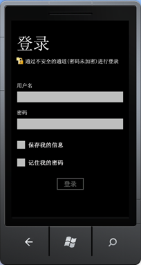

# SharePoint 2013 移动客户端身份验证对象模型概述
获得使用 Silverlight 的 SharePoint 2013 客户端对象模型的身份验证 API 进行开发概述。
## Windows Phone 上的身份验证和客户端上下文
<a name="SP15Mobileclientauth_auth"> </a>

在 Windows Phone 7.5 上对 SharePoint 用户进行身份验证的过程与在客户端计算机上的验证过程稍有不同。Windows Phone 7.5 上的客户端代码首先创建一个 **Authenticator** 类或 **ODataAuthenticator** 类的对象，它被添加到 Windows Phone 的 Microsoft Silverlight 的 SharePoint 2013 客户端对象模型。然后，它将此对象用作用户凭据。
  
    
    

> **注释**
> 有关在本节中讨论的 API 的详细信息，请参阅  [SharePoint 2013 移动对象模型概述](overview-of-the-sharepoint-2013-mobile-object-model.md)。有关 Silverlight 的 SharePoint 客户端对象模型的详细信息，请参阅  [托管客户端对象模型](http://msdn.microsoft.com/zh-cn/library/ee537247.aspx)和 [使用 Silverlight 对象模型](http://msdn.microsoft.com/zh-cn/library/ee538971.aspx)。 
  
    
    


## 在 Silverlight 的 SharePoint 客户端对象模型中对用户进行身份验证
<a name="SP15Mobileclientauth_user"> </a>

获取已通过身份验证的客户端上下文对象需要下列步骤：
  
    
    

1. 获取  [ClientContext](http://msdn.microsoft.com/zh-cn/library/microsoft.sharepoint.client.clientcontext.aspx)(http://msdn.microsoft.com/zh-cn/library/microsoft.sharepoint.client.clientcontext.aspx)对象。
    
  
2. 构造一个新的 **Authenticator** 对象并初始化其属性。
    
    > **注释**
      > 一个 **Authenticator** 对象只能与一个 **ClientContext** 对象一起使用。不能在具有不同 URL 的多个 **ClientContext** 对象之间共享一个 **Authenticator** 对象。
3. **Authenticator** 类实现了 [ICredentials 接口](http://msdn.microsoft.com/zh-cn/library/system.net.icredentials.aspx)，因此您要将该对象分配给 **ClientContext** 对象的 [Credentials](http://msdn.microsoft.com/zh-cn/library/microsoft.sharepoint.client.clientruntimecontext.credentials.aspx)(http://msdn.microsoft.com/zh-cn/library/microsoft.sharepoint.client.clientruntimecontext.credentials.aspx) 属性。
    
  
然后，您可以添加客户端对象模型代码的其余部分并调用 **ExecuteQueryAsync**。
  
    
    
以下代码显示了这些步骤。
  
    
    


```cs

ClientContext context = new ClientContext(ListUrl);

// Create an instance of Authenticator object.
Authenticator at = new Authenticator();

// Replace <username> and <password> with valid values. 
at.UserName = "<username>";
at.Password = "<password>";
at.AuthenticationMode = ClientAuthenticationMode.FormsAuthentication;

at.CookieCachingEnabled = true;

// Assign the instance of Authenticator object to the ClientContext.Credential property.
// ClientContext is the object that is central to the client object model for making calls to the server running SharePoint 
// for fetching and updating data.
context.Credentials = at;

ListItemCollection items = context.Web.Lists.GetByTitle(ListName).GetItems(CamlQuery.CreateAllItemsQuery());

// Load the query and execute the request to fetch data.
context.Load(items);
context.ExecuteQueryAsync(
    (object obj, ClientRequestSucceededEventArgs args) =>
    {
// Success logic
    },

    (object obj, ClientRequestFailedEventArgs args) =>
    {
// Failure logic
    });


```

（可选）您可以通过设置 **Authenticator.UagServerUrl** 属性指定一个统一访问网关 (UAG) 服务器。
  
    
    
如果 SharePoint URL 具有基本的或基于表单的身份验证支持，则 **ExecuteQueryAsync** 调用会提示用户输入登录信息，如图 1 所示。否则，调用将失败。在 SharePoint 网站上启用基本的或基于表单的身份验证授权以避免身份验证错误。
  
    
    

**图 1. SharePoint 客户端身份验证**

  
    
    

  
    
    

  
    
    
用户输入用户名和密码并选择"登录"，如图 1 所示。用户可以选择"记住我"来记住其用户名，也可以选择"记住我"来记住自己的密码，如图 1 所示。当用户名或密码被记住以后，用户下一次启动应用程序时就无需再输入凭据。然后， **ExecuteQueryAsync** 使用已登录的凭据向运行 SharePoint 的服务器发出 Web 请求来获取数据。
  
    
    

## 在 SharePoint OData 对象模型中对用户进行身份验证
<a name="SP15Mobileclientauth_OData"> </a>

以下是获取已通过身份验证的 OData 上下文对象所需的步骤。
  
    
    

1. 构造一个新的 **ODataAuthenticator** 对象并初始化其属性。
    
  
2. 为 **AuthenticationCompleted** 事件注册一个处理程序。
    
  
3. 调用 **ODataAuthenticator.Authenticate** 方法，它将引发 **AuthenticationCompleted** 事件。
    
  
4. 获取 **OnAuthenticationCompleted** 处理程序内的一个 OData 上下文对象。
    
  
然后，您可以在 **OnAuthenticationCompleted** 处理程序中添加其余的 OData 调用。
  
    
    
以下代码显示了这些步骤。
  
    
    


```cs

ODataAuthenticator oat = new ODataAuthenticator();

// Replace <username> and <password> with valid values. 
oat.UserName = "<username>";
oat.Password = "<password>";

oat.AuthenticationMode = ClientAuthenticationMode.FormsAuthentication;


oat.AuthenticationCompleted += 
           new EventHandler<SendingRequestEventArgs>(OnAuthenticationCompleted);

// The Authenticate method will raise the AuthenticationCompleted event.
oat.Authenticate("My_service_URL");  

```

您的代码还必须实现两个事件处理程序，如下一节中所述。
  
    
    

### 实现 OnAuthenticationCompleted 和 OnSendingRequest 处理程序并获取 ClientContext 对象

 **OnAuthenticationCompleted** 处理程序的一个实现应首先检查身份验证中是否有错误。如果有的话，应适当地进行处理，如向用户显示一条错误消息，然后退出。
  
    
    
如果没有任何错误，该处理程序应创建一个 **DataServiceContext** 对象的新实例，然后为 **SendingRequest** 事件注册一个处理程序。然后，与在计算机上编程一样，针对 **DataServiceContext** 对象对您的 OData 调用代码进行编程。
  
    
    
以下是 **OnAuthenticationCompleted** 处理程序实现的一个示例。
  
    
    


```cs

void OnAuthenticationCompleted(object sender, AuthenticationCompletedEventArgs e)
{
    if (e.Error != null)
    {
        MessageBox.Show(error);
        return;
    }
    ODataAuthenticator oat = sender as ODataAuthenticator;

    // Construct an OData context object.
    contextObj = new DataServiceContext(oat.ResolvedUrl);

    // Register the SendingRequest event handler.
    contextObj.SendingRequest += 
        new EventHandler<SendingRequestEventArgs>(OnSendingRequest);  
    
    // Your data retrieval logic goes here. 
    // For example, if there is a GetData method: 
    // contextObj.GetData();   
}


```

 **OnSendingRequest** 处理程序只需将 **Request** 对象的 Cookie 容器设置为 **ODataAuthenticator** 对象的 Cookie 容器即可。示例如下。
  
    
    


```cs

void OnSendingRequest(object sender, SendingRequestEventArgs e)
{ 
    ODataAuthenticator oat = sender as ODataAuthenticator;
    ((HttpWebRequest)e.Request).CookieContainer = oat.CookieContainer;
}

```


## 高级用法
<a name="SP15Mobileclientauth_advance"> </a>


1. 您可以选择使用硬编码的用户名/密码选项构造一个 **Authenticator** 对象。不会提示该应用程序的用户提供用户名和密码，硬编码的凭据将用于对用户进行身份验证。
    
     `public Authenticator(string userName, string password)`
    
     `public Authenticator(string userName, string password, string domain)`
    
    同一构造函数可用于创建自定义登录页。通过从代码隐藏文件传递凭据，您可以编写自定义登录页。
    


  ```cs
  
Authenticator at = new Authenticator();
at.AuthenticationMode = ClientAuthenticationMode.MicrosoftOnline;                          

  ```

2. 也可以相应地设置身份验证类型。默认情况下，使用基本身份验证。
    
  

### 针对 SharePoint Online 进行身份验证

要针对一个 SharePoint Online URL 进行身份验证，请将 **Authenticator** 对象的 **AuthenticationMode** 属性设置为 **MicrosoftOnline** 模式。过程的其他步骤与对本地 SharePoint URL 进行身份验证的步骤相同。
  
    
    

> **注释**
> 对于 SharePoint Online，无法对用户名和密码进行硬编码。系统会提示输入登录凭据。 
  
    
    


#### 联合身份验证

 **FederationAuthURI** 属性用于传递 **ADFS** 身份验证方案首选项，其中将 **ADFS** 配置为使用多个身份验证处理程序。当 SharePoint Online 身份验证和联合身份验证结合使用时， **FederationAuthURI** 指定身份验证请求需要的身份验证类型。此参数可以覆盖按身份验证处理程序的配置顺序确定的优先级。若要了解关于身份验证处理程序的更多信息，请参阅 [身份验证处理程序概述](http://msdn.microsoft.com/zh-cn/library/ee895365.aspx)。
  
    
    

```cs

 Authenticator auth = new Authenticator("domain\\\\name", "xyz"); 
 auth.FederationPassiveAuthUri = "urn:oasis:names:tc:SAML:2.0:ac:classes:Password"; 
//Replace <SiteUrl> with valid value 
ClientContext ctx = new ClientContext("SiteUrl"); 
               ctx.Credentials = auth; 
               ctx.ExecuteQueryAsync( 
 (object sender, ClientRequestSucceededEventArgs args) => 
   { 
    /* successful callback code */ 
   }, 
 (object sender, ClientRequestFailedEventArgs args) => 
   { 
   /* failure callback code */ 
  });

```

 **ADFS** 是一个仅在与 Microsoft SharePoint Online 结合使用时才有效的可选属性。将 **ADFS** 身份验证与其他任何身份验证方案结合使用将不会产生任何作用。在使用 Microsoft SharePoint Online 时，如果未设置 **ADFS**，将使用默认方案，即服务器首选方案。
  
    
    

## Cookie 缓存
<a name="SP15Mobileclientauth_cookie"> </a>

 **Authenticator** 类还包括可用于启用和管理 Cookie 或凭据（或两者）缓存的成员。有关 **Authenticator** 类的这些成员及其用法的更多信息，请参阅 [SharePoint 2013 移动对象模型概述](overview-of-the-sharepoint-2013-mobile-object-model.md)。
  
    
    

## 其他资源
<a name="SP15Mobileclientauth_addlresources"> </a>


-  [构建访问 SharePoint 2013 的 Windows Phone 应用程序](build-windows-phone-apps-that-access-sharepoint-2013.md)
    
  
-  [SharePoint 2013 移动对象模型概述](overview-of-the-sharepoint-2013-mobile-object-model.md)
    
  

