# SharePoint 2013 页面模型概述
了解为 SharePoint 2013 重新设计的修订页面模型，包括母版页和页面布局。
## 页面模型简介

设计 SharePoint 网站或打造其品牌之前，您需要对 SharePoint 网站的部件以及 SharePoint 页面如何组合在一起有基本的了解。本文为您提供计划如何为网站打造品牌时要考虑的各个方面的直观概述。本文特别适用于 SharePoint 2013 中的发布网站。
  
    
    

## 母版页、页面布局和页面

SharePoint 使用模板定义和呈现网站显示的页面。SharePoint 页面的结构包括三个主元素：
  
    
    

- 母版页定义网站中所有页面的共享帧元素（部件版式）。
    
  
- 页面布局定义页面的特定类的布局。
    
  
- 页面由向页面字段添加内容的作者基于页面布局创建。
    
  

**图 1. 母版页、页面布局和页面**

  
    
    

  
    
    
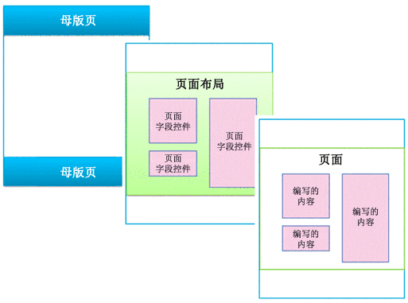
  
    
    

### 母版页

母版页定义网站的部件版式（共享的帧元素）。这些元素可能包括页眉和页脚、顶部导航、痕迹导航、搜索框、网站徽标和其他品牌元素。在访问者浏览网站时，母版页始终保持一致。
  
    
    

**图 2. 母版页**

  
    
    

  
    
    
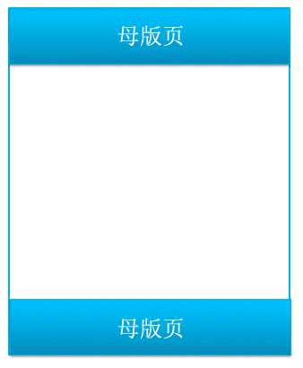
  
    
    
母版页还定义称为内容占位符的区域，该区域由页面布局上匹配区域中的内容填充。最常见的情况是，母版页的主体值包含单个内容占位符（名为 **PlaceHolderMain**，自动创建），而页面布局中的所有内容均在这一个内容占位符中显示（ **PlaceHolderMain** 内容占位符在图 3 中添加了红色边框）。
  
    
    

**图 3. 为页面布局添加了边框的母版页**

  
    
    

  
    
    
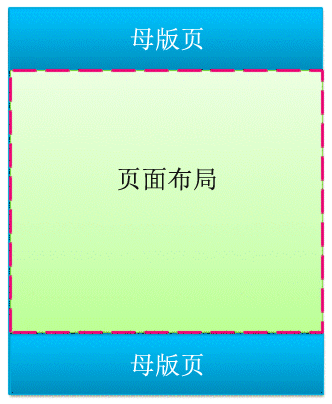
  
    
    
当您在设计管理器中预览某个母版页时，您会看到以下消息。此 **
** 位于主内容占位符内。简言之，母版页定义页面版式，而页面布局定义主内容占位符所包含的主体。
  
    
    

**图 4. 母版页预览消息**

  
    
    

  
    
    
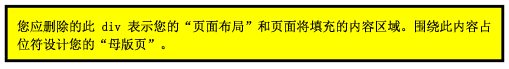
  
    
    

  
    
    

  
    
    

### 页面布局

页面布局是用于网站中特定类型的页面（如文章页面或产品详细信息页面）的模板。顾名思义，可将页面布局视为定义页面主体的布局或结构。
  
    
    

**图 5. 页面布局**

  
    
    

  
    
    
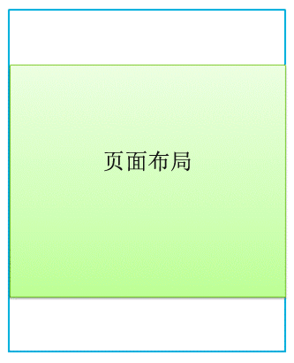
  
    
    
页面布局定义映射到母版页上的内容占位符（在图 6 中添加了红色边框）的区域或内容区域。此外，最常见的情形是页面布局定义映射到母版页上自动创建的单个内容占位符的单个内容区域。
  
    
    

**图 6. 内容区域和内容占位符**

  
    
    

  
    
    
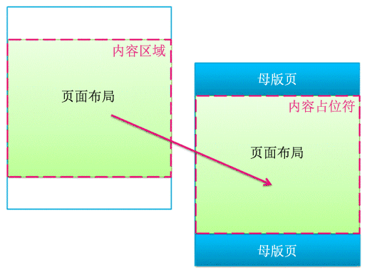
  
    
    

  
    
    

  
    
    

### 页面字段控件

页面布局的主要目的是布置页面字段。设计页面布局时，插入、放置和设计成为页面字段控件的元素。这些控件最终将在作者基于页面布局创建页面时包含内容。除了页面字段之外，页面布局还可包含 Web 部件区域，作者可向该区域添加 Web 部件。（母版页不可包含 Web 部件区域）。
  
    
    
使用页字段控件，可定义内容使用的样式。作者可向页面添加内容，但设计者对内容如何通过应用到这些控件的 CSS 进行呈现具有最终控制权。
  
    
    

**图 7. 包含页面字段控件的页面布局**

  
    
    

  
    
    
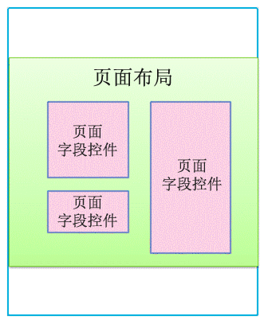
  
    
    
每个页面布局均与网站的页面库中的内容类型关联。内容类型是列和数据类型的架构。对于任何页面布局，可用于该布局的页面字段直接与页面布局的内容类型定义的列对应。
  
    
    

### 母版页和页面布局的关系

母版页和页面布局共同创建内容页面。
  
    
    

**图 8. 包含页面布局的母版页**

  
    
    

  
    
    
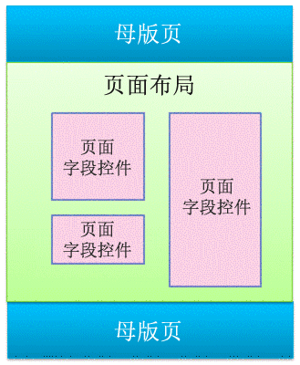
  
    
    
母版页定义网站中所有页面的部件版式，因此，许多页面布局（以及基于这些页面布局创建的许多页面）通常与一个母版页关联。
  
    
    

**图 9. 绑定到三个页面布局的一个母版页**

  
    
    

  
    
    
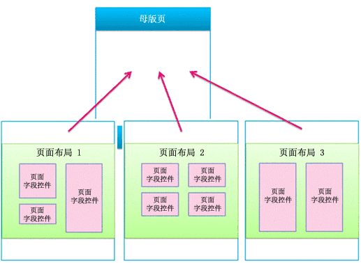
  
    
    
但是，网站可能使用多个母版页。例如，除了默认母版页外，可能具有一个或多个针对特定设备（如智能电话或平板电脑）的母版页。在此情况下，一个页面布局也可由多个母版页使用（请参阅有关设备通道的部分）。
  
    
    
可对每个 SharePoint 网站的每个通道使用一个母版页。
  
    
    

### 页面

作者可创建页面和向页字段添加内容，并且可向任何 Web 部件区域或 RTF 编辑器添加 Web 部件。构建页面是为了使内容作者无法在页字段外进行更改。
  
    
    

**图 10. 包含创作的内容的页面**

  
    
    

  
    
    
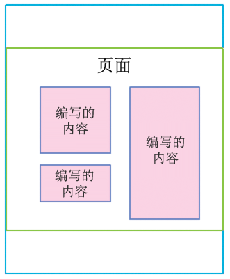
  
    
    
呈现的页面是网站的访问者看到的页面。浏览器请求页面时，母版页与页面布局合并，以创建内容页面，并且该页面的内容在页面库中合并到该页面的页面字段。
  
    
    

**图 11. 浏览器中呈现的页面**

  
    
    

  
    
    
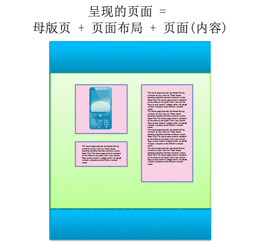
  
    
    

**图 12. 母版页、页面布局和页面**

  
    
    

  
    
    
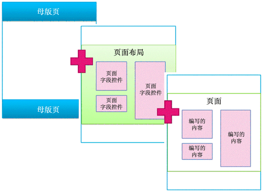
  
    
    

  
    
    

  
    
    

## 搜索驱动 Web 部件和显示模板

前面的部分根据母版页、页面布局（包含页字段）和页面介绍 SharePoint 页面模型。这些元素是作者定期创建和发布新内容的发布网站中最常见的元素。但是当涉及在网站上呈现该内容时，会有更多的元素开始起作用。无论您已经连接到某个外部目录还是只希望显示一组特定搜索结果，搜索驱动 Web 部件均可帮助您实现目标。
  
    
    
在搜索驱动页面方案中，SharePoint 页面包含以下主元素：
  
    
    

- 母版页
    
  
- 页面布局：
    
  - 您按照上文中所述的方式为特定内容类型创建的常规页面布局
    
  
  - 通过目录的跨网站发布创建的类别和项目详细信息页面布局
    
  
- 页面
    
  
- 搜索驱动 Web 部件，如内容搜索 Web 部件
    
  
- 可控制哪些托管属性在搜索驱动 Web 部件的搜索结果中显示以及控制这些搜索结果的样式和行为的显示模板：
    
  - 控件显示模板，可控制搜索结果以及所有结果的任何共用元素（例如分页、排序和其他链接）的布局
    
  
  - 项目显示模板，可控制每个搜索结果的显示方式和对每个结果的重复方式
    
  

**图 13. 包含 Web 部件的母版页、页面布局和页面**

  
    
    

  
    
    
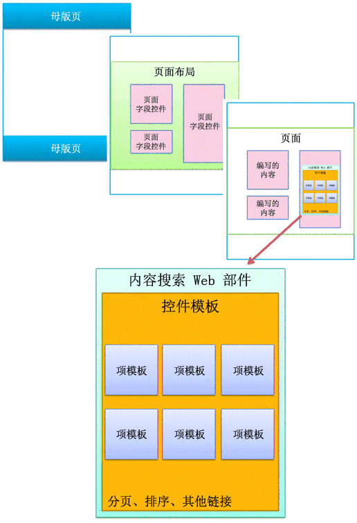
  
    
    

### 搜索驱动 Web 部件

使用搜索驱动 Web 部件，可动态重复搜索索引中存储的内容。内容搜索 Web 部件中的数据演示由显示模板控制，该模板与母版页和页面布局一起存在于母版页样式库中。
  
    
    
SharePoint Server 2013 为内容搜索 Web 部件包括多个随时可用的显示模板（如列表和幻灯片）。在浏览器中配置内容搜索 Web 部件时，选择要使用的显示模板。
  
    
    

**图 14. 内容搜索 Web 部件的工具窗格**

  
    
    

  
    
    
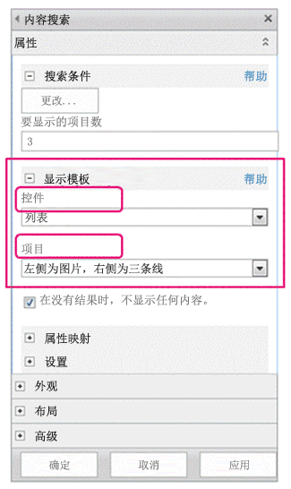
  
    
    
内容搜索 Web 部件使用两类显示模板（控件和项目）。作为设计网站或打造其品牌的一部分，可使用您定义的布局、样式和行为创建自定义显示模板。
  
    
    

**图 15. 内容搜索 Web 部件的两个图表。**

  
    
    

  
    
    
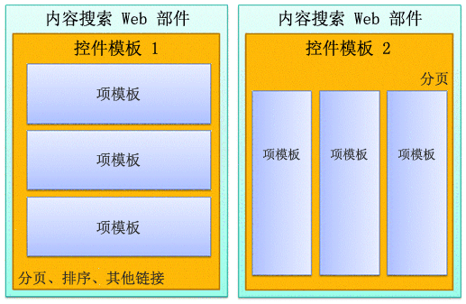
  
    
    

  
    
    

  
    
    

### 控件显示模板

控件模板确定想要呈现搜索结果的方式（如包含分页或幻灯片的列表）的整体结构和布局。每个内容搜索 Web 部件均使用一个控件模板。
  
    
    
控件模板还包括所有搜索结果共用的功能，包括分页、排序、视图选项和分隔符。
  
    
    

**图 16. Web 部件和网页上带有轮廓的控件模板**

  
    
    

  
    
    
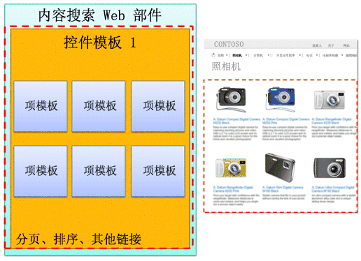
  
    
    

  
    
    

  
    
    

### 项目显示模板

项目模板确定结果集中每个结果的显示方式以及模板对每个结果的重复方式。项目模板可显示图像、包含文本的图像、视频和其他内容。
  
    
    
项目显示模板还确定内容搜索 Web 部件显示哪些托管属性和值。在此示例中，项目模板显示三个托管属性：小型图像、超链接形式的产品名称和简要文本描述。
  
    
    

**图 17. Web 部件和网页上带有轮廓的项目模板**

  
    
    

  
    
    
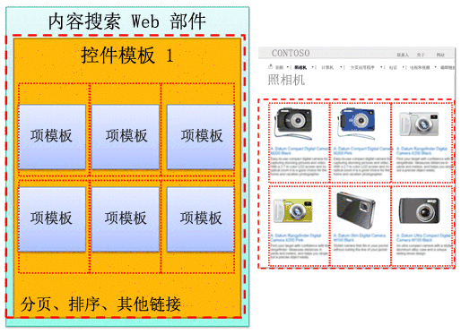
  
    
    

  
    
    

  
    
    

## 设备频道和设备频道模板

在 SharePoint 2013 中，可通过使用针对不同设备的不同设计，以多种方式使用设备频道呈现单个发布网站。创建单个网站并在其中一次性创作内容。然后，可映射该网站和内容，以使用不同的母版页和样式表，从而以特定的设备或设备组为目标。
  
    
    
针对多个设备进行设计时，考虑以下元素：
  
    
    

- 设备频道：
    
  - 通过按通道使用不同的母版页和 CSS，可为特定设备（例如，Windows Phone）或设备组（所有智能电话）以不同的方式演示相同的页面内容。
    
  
- 页面布局：
    
  - 如果内容没有改变，则可对所有设备通道使用相同的页面布局，但可基于每个通道的不同母版页的 CSS 对这些页面布局设置不同的样式。
    
  
  - 如果只想对特定设备包括某个内容，则使用设备频道面板。
    
  
- 页面
    
  

### 设备频道

创建设备频道时，为希望频道针对的设备指定用户代理子字符串。这可让您对每个频道捕获那些设备（或浏览器）进行微调控制。然后，向频道分配母版页；而每个母版页又链接到其自己的样式表，样式表中的布局和样式已针对设备类型进行了优化。
  
    
    

**图 18. 两个包含单独的母版页的设备频道**

  
    
    

  
    
    
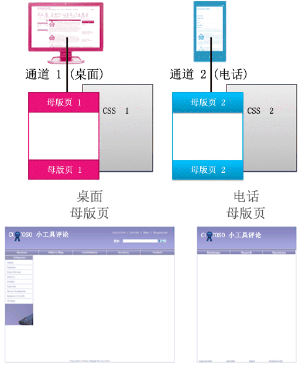
  
    
    
您可仅使用 CSS 实现大量功能。两种不同频道（如桌面和电话）的母版页可能相同，只是链接到不同的样式表。CSS 文件仅对相同的页面元素使用不同的样。
  
    
    

### 母版页和页面布局的关系

与母版页不同，没有为不同设备通道指定不同的页面布局。所有页面布局均可用于您创建的所有通道。因此，一个页面布局可用于多个设备通道和母版页。
  
    
    
这是设备频道的主要优势之一：设计（母版页和 CSS）更改，但内容（页面布局和页面）保持相同。但是，您可使用设备频道面板改变不同频道中显示的页面布局中的内容（请参阅下一部分）。
  
    
    

**图 19. 用于两个母版页的一个页面布局**

  
    
    

  
    
    
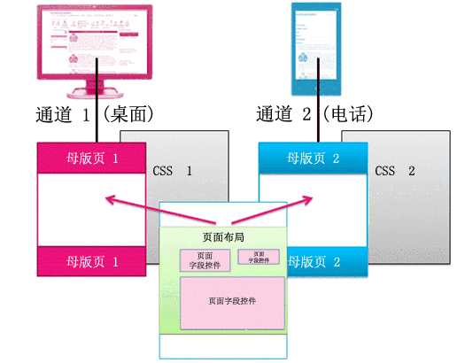
  
    
    

  
    
    

  
    
    

### 设备频道面板

设备通道面板是可添加到母版页、页面布局或显示模板中的控件，用来控制每个通道中呈现的内容。通道面板基本上是指定一个或多个通道的容器；如果呈现页面时，一个或多个这些通道处于活动状态，则还将呈现该通道面板的所有内容。通道面板可包括任何类型的内容（包括到 CSS 文件或 .js 文件的链接），并且是一种包括特定通道的特定内容的简单方法。
  
    
    
使用通道面板的最常用的方案也许是选择性地包括特定通道的一部分页面布局。例如，您可使页面布局包含用于长问候语和短问候语的单独的文本字段。通过将页字段置于通道面板内，可仅对电话显示短问候语和仅对桌面显示长问候语。设备通道面板的内容不会显示在已排除的通道中，该设备通道面板内的内容根本不会呈现，这样避免了内容通过网络传送。
  
    
    

**图 20. 包含频道面板的页面布局**

  
    
    

  
    
    
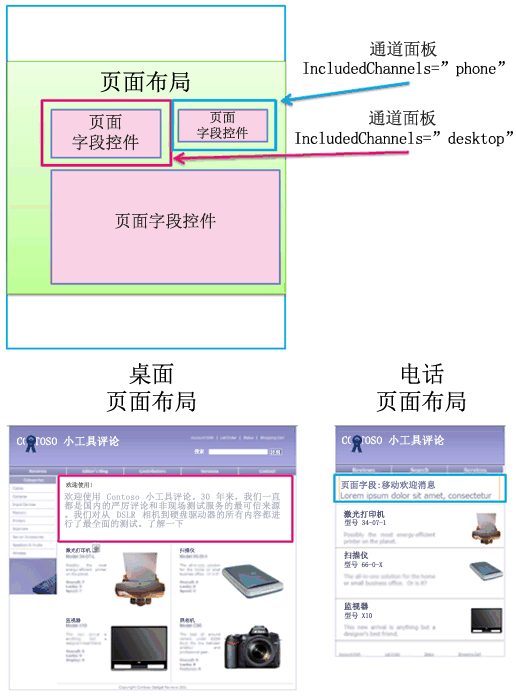
  
    
    
还可在母版页上使用通道面板。例如，如果具有可容纳两种不同设备（或两个不同的浏览器） 而几乎不需要进行更改的母版页，则可使用通道面板保留特定于其中每个设备的母版页上的内容。
  
    
    
或者，可使用内容搜索 Web 部件的项目显示模板内的频道面板，从目录中仅对桌面而不对电话显示该项的附加管理属性。
  
    
    

**图 21. 包含频道面板的页面布局和项目模板**

  
    
    

  
    
    
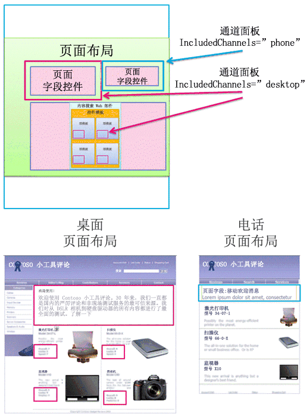
  
    
    

  
    
    

  
    
    

## 其他资源

-  [SharePoint 2013 中的设计管理器概述](overview-of-design-manager-in-sharepoint-2013.md)
    
  
-  [为 SharePoint 构建网站](build-sites-for-sharepoint.md)
    
  
-  [SharePoint 2013 Design Manager 显示模板](sharepoint-2013-design-manager-display-templates.md)
    
  
-  [SharePoint 2013 设计管理器设备通道](sharepoint-2013-design-manager-device-channels.md)
    
  

