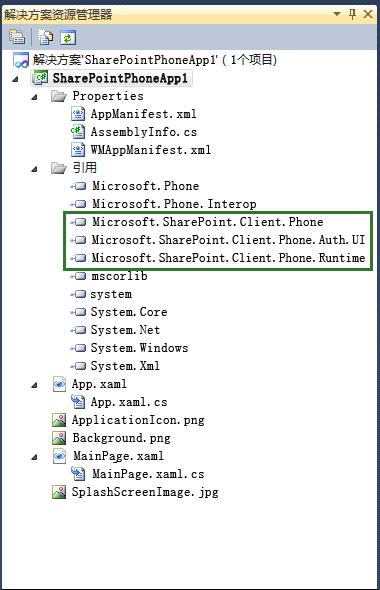
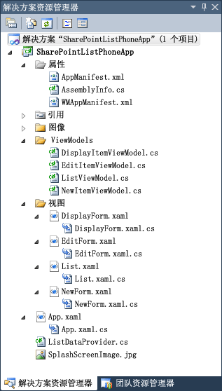

# Visual Studio 中的 Windows Phone SharePoint 2013 应用程序模板概述
了解由针对移动应用程序开发的 Windows Phone SharePoint 软件开发工具包安装的 Visual Studio 模板。
## 由 Windows Phone SharePoint 软件开发工具包安装的模板
<a name="BKMK_TemplatesInstalled"> </a>

设置开发环境并安装 Windows Phone SharePoint 软件开发工具包 (SDK) 之后，可对项目使用两个额外的 Silverlight for Windows Phone 模板：
  
    
    

- Windows Phone Empty SharePoint 应用程序模板
    
  
- Windows Phone SharePoint 列表应用程序模板
    
  
目前，这些模板设计为仅用于 C# 项目中。它们对 Visual Basic 项目不可用。但是这些模板可用于 Visual Studio 2008 和 Visual Studio Express 2012 for Windows Phone 8 以及 Visual Studio 2010 和 Visual Studio 2010 Express for Windows Phone 7。
  
    
    

> **注释**
> Windows Phone SharePoint 模板不出现在 Expression Blend 的"新建项目"菜单中。但是，您可以通过从Visual Studio 的快捷菜单中选择"在 Expression Blend 中打开"在 Expression Blend 中编辑项目。 
  
    
    

如果您基于上述任一模板创建项目，您将无法选择目标 Windows Phone 平台。对于使用这些模板创建的 Visual Studio Express 2012 项目，目标 Windows Phone 8 应用程序对应 SharePoint 2013；对于使用这些模板创建的 Visual Studio 2010 Express 项目，默认为目标 Windows Phone OS 版本 7.1。即，WMAppManifest.xml 文件中 **Deployment** 元素的 **AppPlatformVersion** 属性的值为 7.1。
  
    
    


```XML

<Deployment xmlns="http://schemas.microsoft.com/windowsphone/2009/deployment" AppPlatformVersion="7.1">
```


> **注释**
> 有关 WMAppManifest.xml 文件中的设置的详细信息，请参阅  [Windows Phone 的应用程序清单文件](http://msdn.microsoft.com/zh-cn/library/ff769509%28VS.92%29.aspx)。 
  
    
    


## 启动基于 Windows Phone Empty SharePoint 应用程序模板的项目
<a name="BKMK_EmptySPAppTemplate"> </a>

如果您创建一个基于 Windows Phone Empty SharePoint 应用程序模板的 Visual Studio 项目，启动项目类似于使用基本 Windows Phone 应用程序模板（由 Windows Phone SDK 7.1 安装）创建的项目，只不过增加了对由 Windows Phone SharePoint SDK 安装的 DLL（Microsoft.SharePoint.Client.Phone.dll、Microsoft.SharePoint.Client.Phone.Auth.UI 和 Microsoft.SharePoint.Client.Phone.Runtime.dll，如图 1 所示）的引用并进行了一些其他的重新配置。
  
    
    

> **注释**
> 对于 Visual Studio Express 2012 中的 Windows Phone 8，可以使用相同的模板。 
  
    
    


**图 1. Windows Phone Empty SharePoint 应用程序项目中的文件**

  
    
    

  
    
    

  
    
    
基于 Windows Phone Empty SharePoint 应用程序模板的项目中的文件是 Silverlight Windows Phone 应用程序的标准文件。MainPage.xaml 文件包含构成应用程序的用户界面 (UI) 的 XAML 声明。与项目中的其他代码隐藏文件一样，代码隐藏文件 MainPage.xaml.cs 通过分部类机制与 MainPage.xaml 文件相关联。（请参阅 [代码隐藏和分部类](http://msdn.microsoft.com/zh-cn/library/cc221357%28VS.96%29.aspx)。）MainPage.xaml.cs 文件包含用以实现逻辑的过程代码以支持 UI 中的操作和事件。App.xaml 文件代表整个 Windows 应用程序。相关联的代码隐藏文件 App.xaml.cs 包括用以处理应用程序的生命周期事件的过程代码。
  
    
    

## 启动基于 Windows Phone SharePoint 列表应用程序模板的项目
<a name="BKMK_SPListAppTemplate"> </a>

Windows Phone SharePoint 列表应用程序模板远比 Windows Phone Empty SharePoint 应用程序模板功能强大。此模板旨在帮助您创建 Windows Phone 应用程序来处理 SharePoint 的移动应用程序开发中的一种可能情况：从 Windows Phone 中访问和操作存储在 SharePoint 列表中的数据。当您基于此模板创建 Visual Studio 项目时，向导会指导您完成必要的配置步骤，并生成能够处理 SharePoint 列表数据的功能性 Windows Phone 应用程序的解决方案文件。您对生成的文件稍做修改甚至无需修改即可构建并部署应用程序。
  
    
    

> **注释**
> 对于 Visual Studio Express 2012 中的 Windows Phone 8，可以使用相同的模板。 
  
    
    


### 了解 Windows Phone SharePoint 列表应用程序项目中的解决方案文件

为使用 Windows Phone SharePoint 列表应用程序模板的 Visual Studio 项目生成的文件如图 2 所示。（对 System.Runtime.Serialization.dll 和 Microsoft.Phone.Controls.dll 等在图 2 中未显示的另外一些程序集的引用，会附加到 Windows Phone Empty SharePoint 应用程序模板包含的引用中。）这些附加程序集支持 SharePoint 列表数据和代表该数据的可视控件的管理。）
  
    
    

**图 2. Windows Phone SharePoint 列表应用程序项目中的文件**

  
    
    

  
    
    

  
    
    
表 1 中描述了项目文件。
  
    
    

**表 1. Windows Phone SharePoint 列表应用程序项目文件**


|**文件**|**说明**|
|:-----|:-----|
|App.xaml  <br/> |代表整个 Windows Phone 应用程序。包括与应用程序（而不是应用程序中的单个页面）相关的元素的声明，例如应用程序生命周期事件 **Application_Deactivated** 和 **Application_Closing**。  <br/> |
|App.xaml.cs  <br/> |与 App.xaml 相关联的代码隐藏文件（使用分部类机制，与项目中的其他代码隐藏文件一样）。包括过程代码以处理生命周期事件（如 **Application_Deactivated** 和 **Application_Closing**）中的操作。您在此文件中写入代码以管理数据的脱机（本地）存储。  <br/> |
|ListDataProvider.cs  <br/> |包括访问 SharePoint Server 上数据的代码并提供对查询语法的访问，各种应用程序列表视图都基于此查询语法。  <br/> |
|List.xaml  <br/> |定义手机应用程序中默认视图窗体的用户界面元素，类似于在 SharePoint 中所有的项（或所有任务、所有联系人或类似）视图。List.xaml 文件包含构成应用程序中可视元素的主容器的 **Pivot** 控件，包括开发人员在 Windows Phone 应用程序中选择的用于呈现列表视图的 **PivotItem** 控件。 <br/> |
|List.xaml.cs  <br/> |代码隐藏文件与 List.xaml 相关联。包括在窗体上实现方法和按钮处理程序的代码，如"新建"和"刷新"。  <br/> |
|DisplayForm.xaml  <br/> |定义在应用程序中"显示项目"窗体（或页面）的 UI 元素，类似于在 SharePoint 中的"查看项目"窗体。在 Windows Phone 应用程序中，通过使用包含在 Silverlight **Pivot** 控件中的 **StackPanel** 控件，字段产生于垂直的"堆栈"中。 <br/> |
|DisplayForm.xaml.cs  <br/> |代码隐藏文件与 DisplayForm.xaml 相关联。包括在窗体上实现方法和按钮处理程序的代码，如"编辑"和"删除"。  <br/> |
|EditForm.xaml  <br/> |定义在手机应用程序中"编辑项目"窗体的 UI 元素，类似于在 SharePoint 中的"编辑项目"窗体。与"显示项目"窗体一样，字段产生于 **StackPanel** 控制中。 <br/> |
|EditForm.xaml.cs  <br/> |代码隐藏文件与 EditForm.xaml 相关联。包括在窗体上实现方法和按钮处理程序的代码，如"提交"和"取消"。  <br/> |
|NewForm.xaml  <br/> |定义在手机应用程序中的"新建项"窗体的 UI 元素，类似于在 SharePoint 中的"新建项"窗体。字段产生于 **StackPanel** 控件中。 <br/> |
|NewForm.xaml.cs  <br/> |代码隐藏文件与 NewForm.xaml 相关联。包括如在窗体上执行方法与这些按钮处理程序的代码，如"提交"和"取消"。  <br/> |
|DisplayItemViewModel.cs  <br/> |作为 DisplayForm.xaml 文件的数据源。  <br/> |
|EditItemViewModel.cs  <br/> |作为 EditForm.xaml 文件的数据源。您在此文件中编写代码，以在编辑列表项目时验证用户输入的数据。  <br/> |
|ListViewModel.cs  <br/> |作为 List.xaml 文件的数据源。  <br/> |
|NewItemViewModel.cs  <br/> |作为 NewForm.xaml 文件的数据源。您在此文件中编写代码，以在添加新列表项目时验证用户输入的数据。  <br/> |
   
有关使用 Windows Phone SharePoint 列表应用程序模板创建 Windows Phone 应用程序所涉及的步骤的详细信息，请参阅 [如何：创建 Windows Phone SharePoint 2013 列表应用程序](how-to-create-a-windows-phone-sharepoint-2013-list-app.md)。
  
    
    

## 其他资源
<a name="SP15winphoneover_addlresources"> </a>


-  [构建访问 SharePoint 2013 的 Windows Phone 应用程序](build-windows-phone-apps-that-access-sharepoint-2013.md)
    
  
-  [如何：设置用于为 SharePoint 开发移动应用程序的环境](how-to-set-up-an-environment-for-developing-mobile-apps-for-sharepoint.md)
    
  
-  [Windows Phone SDK 8.0](http://www.microsoft.com/zh-cn/download/details.aspx?id=35471)
    
  
-  [适用于 Windows Phone 8 的 Microsoft SharePoint SDK](http://www.microsoft.com/zh-cn/download/details.aspx?id=36818)
    
  
-  [Windows Phone 软件开发工具包 (SDK) 7.1](http://www.microsoft.com/zh-cn/download/details.aspx?id=27570)
    
  
-  [Microsoft SharePoint SDK for Windows Phone 7.1](http://www.microsoft.com/en-us/download/details.aspx?id=30476)（http://www.microsoft.com/en-us/download/details.aspx?id=30476）
    
  
-  [Windows Phone 开发](http://msdn.microsoft.com/zh-cn/library/ff402535%28VS.92%29.aspx)
    
  

