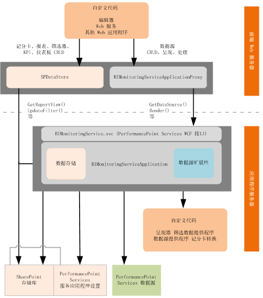

# SharePoint 2013 中的 PerformancePoint Services
了解 SharePoint Server 2013 中的 PerformancePoint Services 的支持的开发方案和扩展性体系结构。
PerformancePoint Services 是一个 SharePoint Server 2013 服务应用程序。它使用户能够创建针对组织业绩提供洞察力的商业智能 (BI)。您可以创建自定义报告、筛选器、表格数据源和记分卡转换以扩展 PerformancePoint Services 的本机功能。 例如，您可以创建为医疗工业而优化的自定义报告可视化，然后将它集成到可重新使用的垂直解决方案。
  
    
    

## SharePoint Server 2013 中的自定义 PerformancePoint Services 报告、筛选器和表格数据源

您可以通过定义其属性的自定义值来扩展本机 PerformancePoint Services  [ReportView](https://msdn.microsoft.com/library/Microsoft.PerformancePoint.Scorecards.ReportView.aspx) 、 [Filter](https://msdn.microsoft.com/library/Microsoft.PerformancePoint.Scorecards.Filter.aspx) 和 表格 [DataSource](https://msdn.microsoft.com/library/Microsoft.PerformancePoint.Scorecards.DataSource.aspx) 对象。自定义报告、筛选器和表格数据源扩展通常包括三个组件： 呈现器或提供程序、编辑器应用程序和扩展元数据。
  
    
    

### PerformancePoint Services 扩展的呈现器和提供程序

您正在扩展的对象的类型确定了它使用呈现器还是使用提供程序。报告和筛选扩展使用呈现器，而筛选和数据源扩展使用提供程序。
  
    
    

- 报告扩展需要呈现器以达到报告可视化。 
    
  
- 筛选扩展需要呈现器以获得选择控件。该呈现器可以是自定义呈现器，也可以是本机 PerformancePoint Services 呈现器。如果您正在使用 PerformancePoint Services 呈现器，您只需在您的扩展中注册它。如果您正在使用自定义呈现器，您的扩展中也必须包括它。
    
  
- 筛选扩展需要数据提供程序以连接到基础数据源。
    
  
- 数据源扩展需要提供程序以连接到基本数据源。
    
  
有关详细信息，请参阅有关创建呈现器和提供程序的以下主题：
  
    
    

-  [如何：为 SharePoint 2013 中的 PerformancePoint Services 创建报告呈现器](how-to-create-report-renderers-for-performancepoint-services-in-sharepoint-2013.md)
    
  
-  [如何：为 SharePoint 2013 中的 PerformancePoint Services 创建筛选器数据提供程序](how-to-create-filter-data-providers-for-performancepoint-services-in-sharepoint.md)
    
  
-  [如何：为 SharePoint 2013 中的 PerformancePoint Services 创建表格数据源提供程序](how-to-create-tabular-data-source-providers-for-performancepoint-services-in-sha.md)
    
  

### SharePoint Server 2013 中的 PerformancePoint Services 扩展的编辑器应用程序。

自定义编辑器使用户可以定义自定义对象的属性，可以与存储库中的对象相交互，还可以初始化自定义报告和筛选器的端点。您的编辑器应该公开您要让用户查看和修改的属性。 编辑器可以从 PerformancePoint 仪表板设计器 的对象中打开，或者从 PerformancePoint 内容列表和 PerformancePoint 数据连接库的项中打开。若要集成到 仪表板设计器 创作经验，您的编辑器必须能够打开统一资源标识符 (URI)，而且必须为 PerformancePoint Servicesweb.config 文件中的自定义对象注册该 URI。
  
    
    
有关创建编辑器的详细信息，请参阅以下主题：
  
    
    

-  [如何：为 SharePoint 2013 中的 PerformancePoint Services 创建报表编辑器](how-to-create-report-editors-for-performancepoint-services-in-sharepoint-2013.md)
    
  
-  [如何：为 SharePoint 2013 中的 PerformancePoint Services 创建筛选器编辑器](how-to-create-filter-editors-for-performancepoint-services-in-sharepoint-2013.md)
    
  
-  [如何：为 SharePoint 2013 中的 PerformancePoint Services 创建表格数据源编辑器](how-to-create-tabular-data-source-editors-for-performancepoint-services-in-share.md)
    
  

> **注释**
> PerformancePoint 仪表板设计器 可以创建和删除自定义对象，因此，您的编辑器不必为创建或删除对象提供逻辑。 
  
    
    

### SharePoint Server 2013 中的 PerformancePoint Services 扩展的配置元数据

在安装期间，您必须指定 PerformancePoint Servicesweb.config 文件中的扩展的元数据。该元数据包括 **type**、 **subType**、 **RendererClass**、 **EditorURI** 和 **Resources** 特性。
  
    
    
为了创建自定义对象，仪表板设计器 要检索该对象的来自 PerformancePoint Services web.config 文件的元数据，然后将该对象创建为 仪表板设计器 存储库中的内容类型。创建了自定义对象后，仪表板设计器 将显示到该编辑器的链接。
  
    
    
有关扩展元数据的详细信息，请参阅 [如何：手动注册 PerformancePoint Services 扩展](http://msdn.microsoft.com/library/3aa6d340-4b05-46b3-9648-2b6e18e04e09%28Office.15%29.aspx)。
  
    
    

## SharePoint Server 2013 中的 PerformancePoint Services 记分卡的自定义转换

转换会更改查询数据源之前的记分卡、查询数据源之后的记分卡，或呈现 Web 部件中的记分卡之前的记分卡的外观、内容和功能。例如，在呈现记分卡视图之前，PerformancePoint Services 使用转换执行了许多操作，如扩展已命名集、计算汇总和计算合并。在运行时应用这些更改，它们不会修改记分卡对象的定义。
  
    
    
有关记分卡转换的详细信息，请参阅 [如何：为 SharePoint 2013 中的 PerformancePoint Services 创建记分卡转换](how-to-create-scorecard-transforms-for-performancepoint-services-in-sharepoint-2.md)。
  
    
    

> **注释**
> 如果转换修改了记分卡中的数据值，那么这些更改将直接传播到将该记分卡用作数据源的"战略地图"报告中。此外，对记分卡进行的更改可能影响 KPI 详细信息报表。 
  
    
    

## SharePoint Server 2013 中的 PerformancePoint Services 的扩展体系结构

所支持的扩展在 PerformancePoint Services 应用程序实例内运行（在端前 Web 服务器或应用程序服务器上），如下表所示。
  
    
    

**图 1.PerformancePoint 服务扩展体系结构**

  
    
    

  
    
    

  
    
    

### 在 SharePoint Server 2013 后端 Web 服务器上运行的 PerformancePoint Services 扩展

自定义编辑器（和其他支持的自定义应用程序）在 PerformancePoint Services 应用程序实例内的后端 Web 服务器上运行。 通常将编辑器部署为 .aspx 页，并在路径  `%ProgramFiles%\\Common Files\\Microsoft Shared\\web server extensions\\15\\TEMPLATE\\LAYOUTS` 中安装它。编辑器针对作者或进程内容调用 [BIMonitoringServiceApplicationProxy](https://msdn.microsoft.com/library/Microsoft.PerformancePoint.Scorecards.BIMonitoringServiceApplicationProxy.aspx) 对象或 [SPDataStore](https://msdn.microsoft.com/library/Microsoft.PerformancePoint.Scorecards.Store.SPDataStore.aspx) 对象，如下所示：
  
    
    

- 报告和筛选器对象应该使用所有存储库任务的  [SPDataStore](https://msdn.microsoft.com/library/Microsoft.PerformancePoint.Scorecards.Store.SPDataStore.aspx) 。
    
  
- 数据源对象应该使用  [BIMonitoringServiceApplicationProxy](https://msdn.microsoft.com/library/Microsoft.PerformancePoint.Scorecards.BIMonitoringServiceApplicationProxy.aspx) 以执行 **Create** 和 **Update** 任务，以便可以在 PerformancePoint Services 服务应用程序的上下文内执行这些任务。可以通过使用 [BIMonitoringServiceApplicationProxy](https://msdn.microsoft.com/library/Microsoft.PerformancePoint.Scorecards.BIMonitoringServiceApplicationProxy.aspx) 和 [SPDataStore](https://msdn.microsoft.com/library/Microsoft.PerformancePoint.Scorecards.Store.SPDataStore.aspx) 执行 **Read**（获取）和 **Delete** 任务。（但是，在应用程序服务器上运行的自定义数据源应用程序可以直接调用 [SPDataStore](https://msdn.microsoft.com/library/Microsoft.PerformancePoint.Scorecards.Store.SPDataStore.aspx) 。）
    
  

### 在 SharePoint Server 2013 应用程序服务器上运行的 PerformancePoint Services 扩展

自定义呈现器、提供程序和记分卡转换在应用程序服务器上运行。该应用程序服务器寄宿在 PerformancePoint Services 的中间层业务逻辑。
  
    
    

## 其他资源

-  [PerformancePoint 服务开发的基础](http://msdn.microsoft.com/library/5d2c183b-95f8-4930-b6d0-f3ffe1ee166e%28Office.15%29.aspx)
    
  
-  [ SharePoint Server 2010 中的 PerformancePoint 服务的代码示例](http://msdn.microsoft.com/library/97f0cbd4-03ef-44f8-9869-699df9d9c97f%28Office.15%29.aspx)
    
  
-  [PerformancePoint 服务开发的疑难解答和 FAQ](http://msdn.microsoft.com/library/a90156e2-0522-46a1-9fc9-b6c8d2fffad7%28Office.15%29.aspx)
    
  

