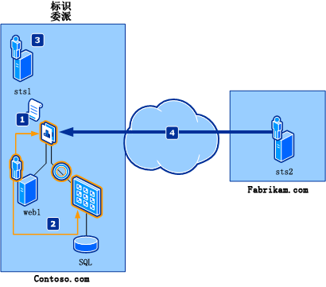
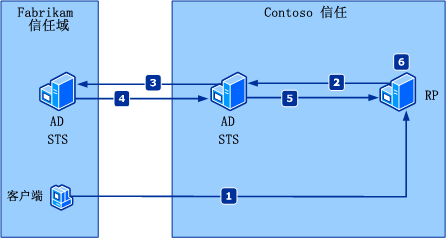
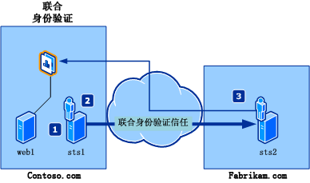

# SharePoint 2013 中的示例委派、联合和身份验证方案
本文提供标识委派和联合身份验证的方案示例。
## 方案示例

本文介绍的方案示例中将使用以下虚构的公司及其既定业务需要：
  
    
    

- **Contoso Hybrid** 是一家国际汽车发动机供应公司，该公司专门为美国及美国以外地区的汽车制造商制造使用电子和燃料电池的混合发动机。在满足客户的部件订购需求的战略部署工作中，Contoso 的 IT 部门接到一项任务：即开发和部署可通过其主机名 Contoso.com 在 Internet 访问的、安全的部件订购应用程序。此应用程序还必须为各个内部用户（Contoso 员工）和外部用户（汽车制造商员工）提供多种访问级别。为尽可能降低与维护部件订购应用程序关联的成本，IT 部门还必须避免应用程序为了供内部和外部用户访问而使用和维护其他帐户存储。
    
  
- **Fabrikam Motors** 是瑞典的一家小型节能汽车制造商，该公司因其混合动力车的低廉价格而闻名。尽管 Fabrikam 的销售额逐年增加，但其第一年销售给客户的汽车的混合发动机故障率也显著增加。为使 Fabrikam Motors 持续提供高水平的服务，必须实施更有效的方法，即通过 Contoso Hybrid 订购混合发动机部件。
    
  
下面是相关概念：
  
    
    

- **联合身份验证** 。是指在 Contoso Hybrid 与 Fabrikam Motors 之间建立联盟，以使 Fabrikam 用户在访问 Contoso Hybrid 资源时可以获得单一登录体验。
    
  
- **标识委派** 。是指能够从需要 ActAs 令牌的 Contoso Hybrid Web 服务访问资源；也就是说，该服务需要中间调用方的标识（通常是服务标识）和启动请求的原始用户的标识（通常是交互用户的标识）。
    
  

## 标识委派

本方案说明需要访问后端资源的应用程序，后端资源需要身份验证委托链来执行访问控制检查。简单的身份验证委托链通常包括初始调用者以及直接调用者的身份信息。 
  
    
    
凭借今天 Windows 平台的 Kerberos 委托模型，后端资源仅包含直接调用者而不包含初始调用者的身份验证。此模型通常被称为受信任的子系统模型。Windows Identity Foundation (WIF) 通过使用  [Delegate()](https://msdn.microsoft.com/library/Microsoft.IdentityModel.Claims.IClaimsIdentity.Delegate.aspx) 属性在委托链中保留初始调用者和直接调用者的身份验证。
  
    
    
图 1 显示了一个典型的标识委派方案，在其中 Fabrikam 员工访问在 Contoso.com 应用程序中公开的资源。
**图 1. 声明联合验证**

  
    
    

  
    
    

  
    
    
参与此方案的虚构用户包括：
- Frank：要访问 Contoso 资源的 Fabrikam 员工。
    
  
- Daniel：Contoso 应用程序开发人员，他在应用程序中实现必要的更改。
    
  
- Adam：Contoso IT 管理员。
    
  
此方案中涉及的组件包括：
- web1：具有指向后端资源的链接的 Web 应用程序，这些资源需要初始调用方的委派标识。此应用程序使用 ASP.NET 构建。
    
  
- 访问运行 Microsoft SQL Server 的计算机的 Web 服务，该服务需要初始调用方的委派标识以及直接调用方的委派标识。此服务使用 Windows Communication Foundation (WCF) 构建。
    
  
- sts1：具有联合提供程序角色并且发出应用程序 (web1) 所需声明的安全令牌服务 (STS)。它已经与 Fabrikam.com 和应用程序建立信任关系。
    
  
- sts2：具有 Fabrikam.com 的标识提供程序角色并且提供 Fabrikam 员工用于身份验证的端点的 STS。它已经与 Contoso.com 建立信任关系，以便允许 Fabrikam 员工访问 Contoso.com 上的资源。
    
  
请注意，术语"ActAs 令牌"指由 STS 颁发并且包含用户标识的令牌。 [Delegate()](https://msdn.microsoft.com/library/Microsoft.IdentityModel.Claims.IClaimsIdentity.Delegate.aspx) 属性包含 STS 的标识。如图 1 所示，在此方案中的流程为：
  
    
    

1. Contoso 应用程序配置为获取包含  [Delegate()](https://msdn.microsoft.com/library/Microsoft.IdentityModel.Claims.IClaimsIdentity.Delegate.aspx) 属性中的 Fabrikam 员工标识和直接调用方标识的 ActAs 令牌。Daniel 对应用程序实现这些更改。
    
  
2. Contoso 应用程序配置为将 ActAs 令牌传递给后端服务。Daniel 对应用程序实现这些更改。
    
  
3. Contoso Web 服务配置为通过调用 sts1 验证 ActAs 令牌。Adam 使 sts1 处理委派请求。
    
  
4. Fabrikam 用户 Frank 访问 Contoso 应用程序并获得后端资源的访问权限。
    
  

## 联合身份验证

当两个域之间存在信任关系时，联合身份验证允许其中一个受信任域中的安全令牌服务 (STS) 向另一个受信任域中的 STS 提供身份验证信息。图 2 说明了这一情况的示例。
  
    
    

**图 2. 声明联合方案**

  
    
    

  
    
    

  
    
    

  
    
    

1. Fabrikam 受信任域中的一个客户端向 Contoso 受信任域中的某个信赖方应用程序发送一个请求。
    
  
2. 此信赖方将该客户端重新定向到 Contoso 受信任域中的某个 STS，而此 STS 对该客户端一无所知。
    
  
3. Contoso STS 将该客户端重新定向到 Fabrikam 受信任域中的某个 STS，而 Contoso 受信任域与 Fabrikam 受信任域存在信任关系。
    
  
4. Fabrikam STS 将验证该客户端的标识，并向 Contoso STS 颁发一个安全令牌。
    
  
5. Contoso STS 使用 Fabrikam 令牌来创建其自己的令牌，并将其发送到信赖方。
    
  
6. 信赖方从安全令牌中提取客户端的声明，并做出身份验证的决策。
    
  
此方案描述了某个合作伙伴雇员尝试访问另一个合作伙伴的域中的资源时的单一登录体验。她只需登录一次。联合方案中存在三个主要的参与者，即，标识提供程序、联合提供程序以及信赖方。WIF 提供生成这三个参与者的 API。 图 3 显示典型的联合方案，在典型的联合方案中，Fabrikam 员工希望在不重新登录的情况下访问 Contoso.com 资源；即，Fabrikam 员工希望使用单点登录。
**图 3. 声明标识委派方案**

  
    
    

  
    
    

  
    
    
参与此方案的虚构用户包括：
- Frank：要访问 Contoso 资源的 Fabrikam 员工。
    
  
- Daniel：Contoso 应用程序开发人员，他在应用程序中实现必要的更改。
    
  
- Adam：Contoso IT 管理员。
    
  
此方案中涉及的组件包括：
- web1：一个使用 ASP.NET 生成的部件订购 Web 应用程序，可用于控制对相关部件的访问。
    
  
- sts1：一个 STS，它用作 Contoso.com 中的联合提供程序，并发出应用程序（即 web1）所期待的声明。它已经与 Fabrikam.com 建立了信任关系，并且已被配置为允许访问 Fabrikam 雇员。
    
  
- sts2：一个 STS，它用作 Fabrikam.com 中的标识提供程序，并为执行身份验证的 Fabrikam 雇员提供一个端点。它已经与 Contoso.com 建立了信任关系，以便允许 Fabrikam 雇员访问 Contoso.com 资源。
    
  
如图 3 所示，在此方案中的流程为：
  
    
    

1. Contoso 管理员 Adam 配置应用程序（信赖方）和 sts1 之间的信任关系。
    
  
2. Contoso 管理员Adam 将 sts2 作为一个标识提供程序来配置信任关系。
    
  
3. Fabrikam 管理员 Frank 将 sts1 作为一个联合提供程序来配置信任关系，然后对应用程序进行访问。
    
  

## 其他资源

-  [SharePoint 2013 中的基于声明的标识和概念](claims-based-identity-and-concepts-in-sharepoint-2013.md)
    
  
-  [基于声明的标识术语定义](claims-based-identity-term-definitions.md)
    
  

