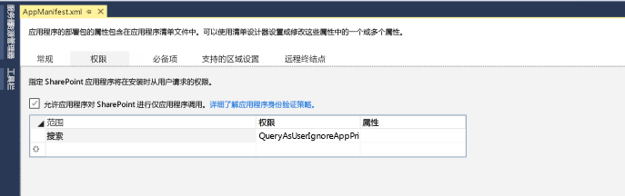

# SharePoint 2013 中的搜索外接程序
了解搜索 SharePoint 外接程序以及如何创建您自己的搜索外接程序。可以将您创建的外接程序添加到 SharePoint 外接程序目录，以便它们可以同时在本地部署和 Office 365 中使用。搜索外接程序仅处理存储在搜索索引中的数据，而不处理原始源文档。
SharePoint 外接程序是功能的自包含部分，该功能可扩展 SharePoint 网站的功能。这些外接程序通过集成 Web 和 SharePoint 的最佳优势来解决特定业务和最终用户需求。外接程序可以包含以下各种 SharePoint 元素：列表、远程事件接收器、内容类型、工作流、工作流自定义活动、网站栏、模块、菜单项自定义操作、客户端 Web 部件和搜索配置。有关详细信息，请参阅  [SharePoint 外接程序](http://msdn.microsoft.com/library/cd1eda9e-8e54-4223-93a9-a6ea0d18df70%28Office.15%29.aspx)。
  
    
    

搜索外接程序是使用搜索功能的 SharePoint 外接程序。在搜索外接程序中，您可以使用 SharePoint 2013 搜索 API 来查找内容。根据在 [外接程序清单](http://msdn.microsoft.com/library/7cd5850f-cbf3-48d2-bcb7-59b8f4ed0e63%28Office.15%29.aspx)中设置的权限类型，您可以在外接程序内容的内部或外部进行搜索。此外，您还可以使用搜索外接程序将搜索配置从一个 SharePoint 安装分发到另一个安装。
搜索外接程序的核心设计取决于您所选的部署方法。下节概括了可用选项及其优势。有关详细信息，请参阅 [为开发和托管 SharePoint 外接程序选择模式](http://msdn.microsoft.com/library/05ce5435-0a03-4ddc-976b-c33b08d03457%28Office.15%29.aspx)
  
    
    


## 部署您的搜索外接程序
<a name="SP15_Deploy_search_apps"> </a>

有两种方法可用来部署您的搜索外接程序：
  
    
    

1. SharePoint 托管 - 本地部署。搜索外接程序托管在公司服务器上的公司网络内。公司的管理员可以管理外接程序。此方案在部署和支持方面提供了灵活性，因为管理员可以本地保留硬件和软件。
    
  
2. 提供程序托管 - 任何 Web 服务器托管。搜索外接程序由任何提供程序在客户的 SharePoint 服务器外部托管。
    
  

## 搜索外接程序开发环境
<a name="SP15_Search_app_dev_environment"> </a>

若要创建搜索外接程序，请使用以下两个环境之一：
  
    
    

- Microsoft Visual Studio 2012 或 Microsoft Visual Studio 2013 或 Visual Studio 2015
    
  
- Napa Office 365 开发工具
    
  
使用 Visual Studio 2013，稍后您可以同时将搜索外接程序发布到本地和 Office 365 环境中。使用 Napa，则可以在您的浏览器中构建和发布搜索外接程序。以后可以将这些外接程序导出到 中并为本地客户重新打包这些外接程序。有关这两种开发环境以及如何使用它们创建搜索外接程序的详细信息，请参阅 [设置 SharePoint 2013 的常规开发环境](set-up-a-general-development-environment-for-sharepoint-2013.md)和 [使用 Napa Office 365 开发工具创建 Office 和 SharePoint 相关应用程序](http://msdn.microsoft.com/library/82a3645c-0911-4926-9176-236ac8d28bdd%28Office.15%29.aspx)。
  
    
    

## 适用于搜索外接程序的 API
<a name="SP15_APIs_search_apps"> </a>

您可以将 SharePoint 提供的大量与搜索相关的 API 用于搜索外接程序。下表列出了这些 API 及其类库的位置。
  
    
    

**适用于搜索外接程序的 SharePoint API**


|**API 名称**|**类库**|
|:-----|:-----|
|.NET 客户端对象模型 (CSOM)  <br/> |Microsoft.SharePoint.Client.Search.dll  <br/> |
|Silverlight CSOM  <br/> |Microsoft.SharePoint.Client.Search.Silverlight.dll  <br/> |
|ECMAScript (JavaScript, JScript) 对象模型 (JSOM)  <br/> |SP.search.js  <br/> |
|搜索 REST API  <br/> |http://server/_api/search/query  <br/> |
   

### 代码示例

下面是使用不同 API 的一些代码示例。每个代码示例都将向 Search service 应用程序 (SSA) 发送一个包含了关键字"SharePoint"的简单 搜索 查询。
  
    
    
 **Client-side Object Model (CSOM)**
  
    
    

  
    
    


```cs

using (ClientContext clientContext = new ClientContext("http://localhost"))
{
    KeywordQuery keywordQuery = new KeywordQuery(clientContext);
    keywordQuery.QueryText = "*";
    SearchExecutor searchExecutor = new SearchExecutor(clientContext);
    ClientResult<ResultTableCollection> results = 
        searchExecutor.ExecuteQuery(keywordQuery);
    clientContext.ExecuteQuery();
}
```

 **JavaScript Object Model (JSOM)**
  
    
    

  
    
    


```

var keywordQuery = new
Microsoft.SharePoint.Client.Search.Query.KeywordQuery(context);
keywordQuery.set_queryText('SharePoint');
var searchExecutor = new Microsoft.SharePoint.Client.Search.Query.SearchExecutor(context);
results = searchExecutor.executeQuery(keywordQuery);
context.executeQueryAsync(onQuerySuccess, onQueryFail);
```

 **REST**
  
    
    

  
    
    
HTTP GET 请求
  
    
    


```HTML

http://mylocalhost/_api/search/query?querytext='SharePoint'
```

HTTP POST 请求
  
    
    


```HTML
{
'__metadata' : {'type' : 'Microsoft.Office.Server.Search.REST.SearchRequest'},
'Querytext' : 'SharePoint'
}
```


## 搜索外接程序权限
<a name="SP15_Search_app_permissions"> </a>

搜索外接程序向 Search service 应用程序 (SSA) 发送查询请求，并且外接程序需要不同类型的权限才能正常运行。您可以通过外接程序清单文件配置这些权限，该文件是每个 SharePoint 外接程序的一部分。您可以使用文本编辑器直接修改外接程序清单文件，也可以使用 Visual Studio 或 Napa 进行修改，如下图所示。
  
    
    

**图 1：在 Visual Studio 2015 中为搜索外接程序设置权限**

  
    
    

  
    
    

  
    
    

  
    
    

  
    
    

**图 2：在"Napa"Office 365 开发工具中为搜索外接程序设置权限**

  
    
    

  
    
    

  
    
    
SharePoint 外接程序具有其自己的标识并且与称为外接程序主体的安全主体关联。与用户和组一样，外接程序主体拥有某些特定的权限和权利。外接程序主体具有对外接程序 Web 的完全控制权限，因此它只需要对位于主机 Web 或外接程序 Web 之外的其他位置的 SharePoint 资源（例如网站集）的请求权限。与其他 SharePoint 外接程序不同，搜索外接程序仅需要用户级别权限，我们称之为 **QueryAsUserIgnoreAppPrincipal**。此权限允许您基于用户的权限查询搜索外接程序。这意味着将基于用户的 ACL 返回搜索结果。
  
    
    

### 请求外接程序清单文件中的权限

外接程序清单文件采用 XML 格式并可以直接进行编辑。若要获取权限，您可以编写一个请求，如以下示例所示：
  
    
    

```XML

<AppPermissionRequests>
  <AppPermissionRequest Scope="http://sharepoint/search" Right="QueryAsUserIgnoreAppPrincipal" />
</AppPermissionRequests>
```


## 其他资源
<a name="SP15_Search_app_addresources"> </a>


-  [SharePoint 外接程序](http://msdn.microsoft.com/library/cd1eda9e-8e54-4223-93a9-a6ea0d18df70%28Office.15%29.aspx)
    
  
-  [为开发和托管 SharePoint 外接程序选择模式](http://msdn.microsoft.com/library/05ce5435-0a03-4ddc-976b-c33b08d03457%28Office.15%29.aspx)
    
  
-  [SharePoint 2013 中的外接程序权限](http://msdn.microsoft.com/library/5f7a8440-3c09-4cf8-83ec-c236bfa2d6c4%28Office.15%29.aspx)
    
  
-  [SharePoint 2013 中的外接程序授权策略类型](http://msdn.microsoft.com/library/124879c7-a746-4c10-96a7-da76ad5327f0%28Office.15%29.aspx)
    
  
-  [SharePoint 外接程序体系结构的重要方面和开发前景](http://msdn.microsoft.com/library/ae96572b-8f06-4fd3-854f-fc312f7f2d88%28Office.15%29.aspx)
    
  
-  [了解 SharePoint 外接程序的应用程序清单结构和包](http://msdn.microsoft.com/library/7cd5850f-cbf3-48d2-bcb7-59b8f4ed0e63%28Office.15%29.aspx)
    
  
-  [将搜索功能添加到适用于 SharePoint 的外接程序](http://blogs.msdn.com/b/officeapps/archive/2013/05/30/add-search-capabilities-to-your-apps-for-sharepoint.aspx)
    
  
-  [在 SharePoint 2013 中导出和导入搜索配置设置](exporting-and-importing-search-configuration-settings-in-sharepoint-2013.md)
    
  
-  [在 SharePoint Server 2013 (TechNet) 中导出和导入自定义搜索配置设置](http://technet.microsoft.com/zh-cn/library/jj871675.aspx)
    
  

