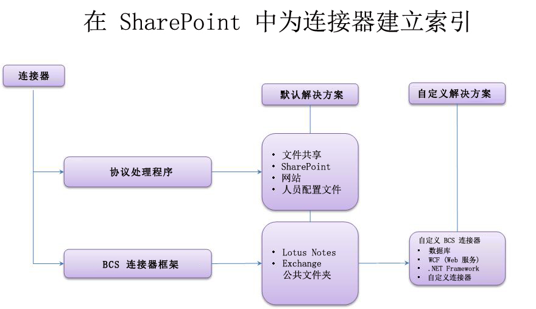
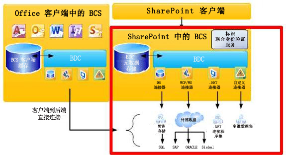
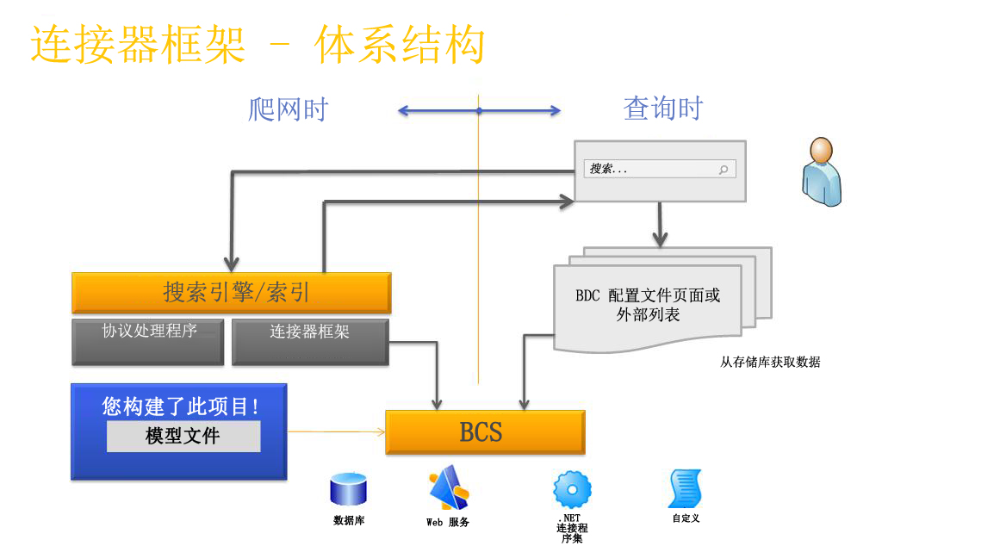

# SharePoint 2013 中的搜索连接器框架
了解 SharePoint 2013 索引连接器、连接器框架和如何创建自定义 BCS 索引连接器以搜索外部系统。
## 使内容在 SharePoint 2013 中可供搜索

SharePoint 2013 中的搜索功能提供两种处理查询以返回搜索结果的方法--—联合搜索和内容爬网。
  
    
    
 **联合搜索** 在此方法中，将为搜索服务器未进行爬网的内容返回搜索结果。查询将转发到一个外部内容存储库，该存储库的搜索引擎将处理此查询。随后，存储库的搜索引擎会将结果返回到搜索服务器。搜索服务器将格式化和呈现要显示在搜索结果页上的外部存储库中的结果。此方法提供了以下好处：
  
    
    

- 对于内容索引，无需额外的容量要求，因为内容不被 SharePoint 2013 中的搜索功能爬网。
    
  
- 可以利用存储库的现有搜索引擎。例如，可以联合 Internet 搜索引擎以搜索 Web。
    
  
- 您可以为存储库的特定内容集优化内容存储库的搜索引擎，这样可为内容集提供更好的搜索效果。
    
  
- 您可以访问由爬网提供保障的存储库，但是那样就可以通过搜索查询访问了。
    
  
 **内容爬网** 以此种方法，根据用户的查询，结果将从 Search Service 应用程序的内容索引返回。内容索引包含 Search Service 应用程序进行爬网的内容，并包括每个内容项的文本内容和元数据。利用此方法，您可以：
  
    
    

- 按相关性对结果进行排序
    
  
- 控制内容索引的更新频率。
    
  
- 指定对哪些元数据进行爬网。
    
  
- 对爬网内容执行一个备份操作。
    
  

## 在 SharePoint 2013 中用索引连接器对内容进行爬网

爬网程序使用索引连接器访问要爬网的内容。索引连接器是知道如何连接内容源、对什么进行爬网以及如何爬网的组件。在早期版本的 SharePoint 中，它们是基于运行未受管 C++ 代码的自定义界面的协议处理程序、组件。 
  
    
    
SharePoint 2013 中的搜索功能 包括连接器框架（在 SharePoint Server 2010 中有介绍，并且在 Microsoft Business Connectivity Services (BCS) 上构造），该框架提供开发索引连接器的更简便的方法。有了连接器框架，爬网程序可使用基于 BCS 的索引连接器对外部内容进行爬网。SharePoint 2013 使用基于协议处理程序的索引连接器和 BCS 索引连接器对内容进行爬网。
  
    
    
图 1 提供有关 SharePoint 2013 索引连接器示例的高级概述。
  
    
    

  
    
    

  
    
    

  
    
    

  
    
    

## 有关 SharePoint 2013 中的搜索功能的 BCS 概览

BCS 是可让您从 SharePoint 连接到外部系统的工具和基础架构的伞。图 2 展示了 BCS 体系结构的高级视图，并重点突显了相关搜索领域。
  
    
    

  
    
    

**图 2. 包括搜索的 BCS 体系结构**

  
    
    

  
    
    

  
    
    

  
    
    
BCS 基于元数据库中的外部内容类型定义连接到外部数据。元数据库包含外部内容类型的以下信息：
  
    
    

- **连接性信息** 描述如何连接到外部系统。
    
  
- **实体信息** 描述外部数据的结构。
    
  
- **操作** 描述用于访问外部数据的方法。在数据库和 Web 服务的情况下，这些是受到外部系统支持的方法：数据库连接器的 SQL 语句和 Web 服务的 Web 方法。对于 .NET 和自定义 BCS 索引连接器，这些是在连接器程序集中实现的方法，连接器程序集是您为索引连接器创建的组件 DLL。
    
  
此信息在外部内容类型的 BDC 模型文件中指定。有关 BDC 模型的详细信息，请参阅  [BDC 模型基础架构](http://msdn.microsoft.com/library/2818ebdd-6cda-4d8f-82b2-7fde9fbf2633%28Office.15%29.aspx)。
  
    
    
有关 BCS 体系结构和功能的详细信息，请参阅 [业务连接性服务概览](http://msdn.microsoft.com/library/91dd7b01-ead2-4f87-804b-b59ef2245c87%28Office.15%29.aspx)和 [使用业务连接性服务的基本原理](http://msdn.microsoft.com/library/ff3e312b-0fbc-48ed-a752-76c50d286533%28Office.15%29.aspx)。
  
    
    

### 使用连接器框架

若要对外部数据进行爬网，您必须添加一个支持连接到外部数据的内容源类型。表 1 列出了这些内容源类型。
  
    
    

**表 1. 支持 BCS 索引连接器的内容源类型**

|**内容源类型**|**说明**|
|:-----|:-----|
|业务数据行    |将此内容源用于数据库和 Web 服务 BCS 索引连接器。    |
|自定义存储库    |将此内容源用于 .NET 和自定义 BCS 索引连接器。    |
   
连接器框架可让您创建 BCS 索引连接器以连接到您要爬网的外部内容，并包括在内容索引中。可由 BCS 索引连接器使用爬网程序以便与外部数据源通信。在爬网时间，爬网程序调用 BCS 索引连接器以便从外部系统捕获数据，并将其传递回该爬网程序。爬网过程中当它们传递于 BCS 和搜索之间时，BCS 索引连接器还解析由搜索理解的访问 URL 和 BCS 理解的标识符。
  
    
    
BCS 索引连接器组成如下：
  
    
    

  
    
    
> **BDC 模型文件** 提供数据结构以及对外部系统的连接信息的文件。
    
  

  
    
    
> **连接器** 包含连接到外部系统并解析访问 URL 和 BCS 标识符的代码的组件。
    
  
对于基于业务数据行内容源类型的 BCS 索引连接器，搜索包括内置连接器，因此您必须只创建一个 BDC 模型文件。 
  
    
    
对于基于自定义存储库内容源类型的 BCS 索引连接器，除了 BDC 模型文件，您还必须开发自定义组件以连接到外部数据。
  
    
    
图 3 显示了搜索连接器框架体系结构的高级视图。
  
    
    

**图 3. 搜索连接器框架体系结构**

  
    
    

  
    
    

  
    
    

  
    
    

  
    
    

### BCS 索引连接器

SharePoint 2013 支持以下类型的 BCS 索引连接器：
  
    
    

- **数据库连接器** SharePoint 2013 包括支持连接到数据库的预定义 BCS 连接器，因此您无需编写任何代码便可创建 BCS 索引连接器—只需为连接器创建 BDC 模型文件。
    
  
- **WCF（Web 服务）连接器** SharePoint 2013 包括支持连接到 Web 服务的预定义 BCS 连接器，因此您无需编写任何代码便可创建 Web 服务 BCS 索引连接器—只需为连接器创建 BDC 模型文件。
    
    > **注释**
      > 尽管您不必编写代码即可创建 Web 服务连接器，Web 服务必须包括提供与 .NET BCS 连接器所提供功能相同的功能的方法，以便将外部业务数据传递到 BCS。有关创建 Web 服务的信息，请参阅  [创建 .NET 连续性程序集和 Web 服务](http://msdn.microsoft.com/library/9a6c6712-868a-4a9c-9645-3aa448ad5092%28Office.15%29.aspx)。有关代码示例，请参阅  [示例命令 ASP.NET Web 服务命令](http://msdn.microsoft.com/library/10e46860-788f-4ed0-a4d8-1e17ada58e83%28Office.15%29.aspx)和 [示例命令 WCF 服务示例](http://msdn.microsoft.com/library/535277c8-9d5c-41eb-ab23-0ae141d726c5%28Office.15%29.aspx)。 
- **.NET BCS 连接器** SharePoint 2013 不包括 .NET 连接器的预定义 BCS 连接器。因此除了创建 BDC 模型文件，您还必须为 BCS 索引连接器创建 .NET 组件。您必须实施要求的构造型操作以支持对数据的爬网，以及实施用于解析访问 URL 和 BDC 标识符的方法
    
  
- **自定义 BCS 连接器** SharePoint 2013 不包括自定义 .NET 连接器的预定义 BCS 连接器，因此除了创建 BDC 模型文件，您还必须为 BCS 索引连接器创建 .NET 组件（就像 .NET BCS 连接器一样）。您必须实施要求的构造型操作以支持对数据的爬网，以及实施用于解析访问 URL 和 BDC 标识符的方法。您还必须实施 **ISystemUtility** 接口。
    
  

## 构造 BCS 索引连接器

开发 BCS 索引连接器时（无论是仅为数据库和 Web 服务索引连接器创建 BDC 模型文件，还是为 .NET 和自定义索引连接器创建 BDC 模型文件和编写 BCS 连接器组件的代码），您都需要考虑以下方面：
  
    
    

- **连接性** 如何连接到外部数据库，如服务器地址、IP 地址或数据库示例名称。还包括用于连接到外部数据库的身份验证信息。
    
  
- **存储库的结构** 要读取数据，连接器必须了解存储库的组织方式。存储库是层次结构的、数字的，还是必须遍历链接？
    
  
- **增量爬网** 若要降低外部数据库上的性能负载，请给予连接器除完全爬网之外的能够进行增量爬网的功能。为此，连接器必须识别自最近一次爬网以来更改了什么数据以及能够仅对该数据进行爬网。
    
  
- **确保数据安全** 大多数情况下，不是所有数据都能供所有用户访问的。这对搜索也适用这是非常重要的，因此当用户使用搜索 UI 搜索时，用户只能看到他或她有权访问的结果。这意味着连接器必须了解如何读取外部系统的安全性，并在爬网期间将安全相关信息返回到索引中。例如，您可以实现 Windows NT 访问控制列表 (ACL) 的爬网时间存储。
    
  
表 2 描述了您为 SharePoint 2013 创建 BCS 索引连接器时适用的构造型操作。
  
    
    

**表 2. 受 SharePoint 2013 中的搜索功能 支持的 BCS 构造型操作**

|**操作**|**说明**|
|:-----|:-----|
|Finder    |创建 BCS 连接器时所需的核心操作。此操作将检索外部内容源的项列表。请参阅  [实现 Finder](http://msdn.microsoft.com/library/a0cb7cfe-8758-4057-aa85-03071536745e%28Office.15%29.aspx)。    |
|SpecificFinder    |创建 BCS 连接器时所需的核心操作。此操作将检索来自外部内容源的当个项。请参阅 [实现 SpecificFinder](http://msdn.microsoft.com/library/9b6effa5-20ce-4ce7-a8dc-0fd601eb0f23%28Office.15%29.aspx)。    |
|ChangedIdEnumerator    |需要实现基于更改日志的增量爬网，请参阅 [实现 ChangedIdEnumerator](http://msdn.microsoft.com/library/19d3c942-f6d7-49e7-853f-4d9b61b10422%28Office.15%29.aspx)。    |
|DeletedIdEnumerator    |需要实现基于更改日志的增量爬网，请参阅 [实现 DeletedIdEnumerator](http://msdn.microsoft.com/library/aa1c521a-0c9b-4dc0-a32f-fb9e54c52bed%28Office.15%29.aspx)。    |
|BinarySecurityDescriptorAccessor    |需要实现项级别的安全性。从外部内容源返回项的安全性描述符。请参阅 [实现 BinarySecurityDescriptorAccessor](http://msdn.microsoft.com/library/6cf70490-dd3c-49cd-bb13-ed33e938435d%28Office.15%29.aspx)。    |
|StreamAccessor    |需要启用从外部内容源对附件进行爬网。作为数据流返回附件。请参阅  [实现 StreamAccessor](http://msdn.microsoft.com/library/e3d8053b-90c0-4207-98e3-91e42db13cf1%28Office.15%29.aspx)。    |
   

  
    
    

### 开发 BCS 索引连接器的工具支持

BCS 为 SharePoint Designer 和 Visual Studio 中的 BCS 连接器提供工具支持。
  
    
    

#### 针对 BCS 连接器的 SharePoint Designer 工具支持

SharePoint Designer 提供一组有限的功能；您可以用它来为现有 BCS 连接器类型（如 数据库、Web 服务和 .NET BCS 连接器）创建 BDC 模型文件。您还可以用它来将 BDC 模型文件从一个 BCS 服务应用程序导出到另一个 BCS 服务应用程序。
  
    
    

#### 针对 BCS 连接器的 Visual Studio 工具支持

您可以使用 Visual Studio 来为 .NET BCS 连接器和自定义 BCS 连接器创建组件。对于 .NET BCS 连接器，Visual Studio 提供业务数据连接性模型项目模板，其中包括一组可视化设计器和代码管理功能，可让您更轻松地创建、调试和部署 .NET BCS 连接器的 .NET 组件和相关 BDC 模型文件。没有自定义 BCS 连接器的项目模板。
  
    
    

## SharePoint 2013 中的连接器框架增强

在 SharePoint 2013 中，连接器框架支持 BCS 连接器检索存储在自定义外部数据库中的内容的声明信息。
  
    
    
连接器框架还提供改善的异常捕获和日志记录功能，帮助您对在使用 BCS 连接器对内容源进行爬网时遇到的错误进行疑难解答。
  
    
    

## 其他资源

-  [增强 SharePoint 2013 中的搜索功能的 BDC 模型文件](enhancing-the-bdc-model-file-for-search-in-sharepoint-2013.md)
    
  
-  [SharePoint 2013：MyFileConnector 自定义 BCS 索引连接器示例](http://code.msdn.microsoft.com/SharePoint-2013-MyFileConne-79d2ea26)
    
  
-  [如何：在 SharePoint 2013 中对关联的外部内容类型进行爬网](how-to-crawl-associated-external-content-types-in-sharepoint-2013.md)
    
  
-  [如何：在 SharePoint 2013 中对二进制大型对象 (BLOB) 进行爬网](how-to-crawl-binary-large-objects-blobs-in-sharepoint-2013.md)
    
  
-  [如何：在 SharePoint 2013 中对关联的外部内容类型进行爬网](how-to-crawl-associated-external-content-types-in-sharepoint-2013.md)
    
  
-  [如何：在 SharePoint 2013 中配置项目级安全性](how-to-configure-item-level-security-in-sharepoint-2013.md)
    
  

