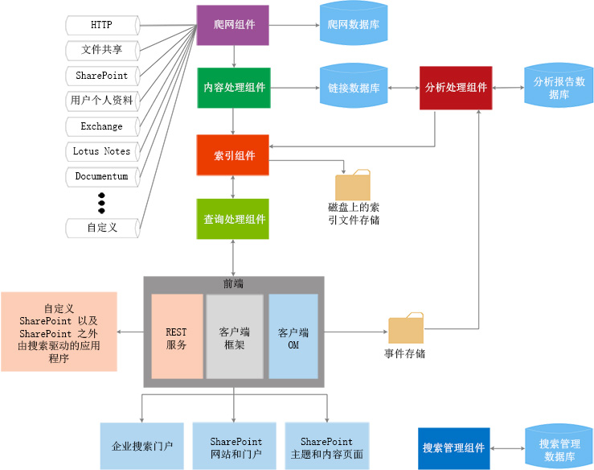

# SharePoint 2013 中的搜索
了解 SharePoint 2013 中的搜索功能 中的可扩展性构建基块以及如何使用这些构建基块来符合你的使用案例。
SharePoint 2013 中的搜索功能 使用户能够比以往更快和更容易地找到相关信息，同时便于搜索管理员自定义搜索体验。它还提供多个 API 集用于更高级的自定义和解决方案。
  
    
    

请参阅以下文章，以获取对一般 SharePoint 2013 开发概念的详细介绍；你会发现在继续操作之前查看以下内容十分有益：
-  [设置 SharePoint 2013 的常规开发环境](set-up-a-general-development-environment-for-sharepoint-2013.md)
    
  
-  [在 SharePoint 2013 中选择正确的 API 集](choose-the-right-api-set-in-sharepoint-2013.md)
    
  
-  [SharePoint 加载项与 SharePoint 解决方案比较](sharepoint-add-ins-compared-with-sharepoint-solutions.md)
    
  
-  [在 SharePoint 加载项和 SharePoint 解决方案之间做出决定](deciding-between-sharepoint-add-ins-and-sharepoint-solutions.md)
    
  

## 搜索体系结构概述

SharePoint 2013 中的搜索功能 包括各种改进和新功能。使用此版本，SharePoint 2013 中的搜索功能 可以重新构建到单个企业搜索平台。搜索体系结构由以下方面组成：
  
    
    

-  [爬网和内容处理](#bk_crawl)
    
  
-  [索引](#bk_index)
    
  
-  [查询处理](#bk_query)
    
  
-  [搜索管理](#bk_searchadmin)
    
  
-  [分析](#bk_analytics)
    
  
这些方面由紧密工作以执行搜索操作的组件和数据库组成。图 1 提供了搜索体系结构的不同方面的概述，以及在其中紧密工作以执行搜索操作的组件和数据库。
  
    
    

**图 1. 搜索组件交互**

  
    
    

  
    
    

  
    
    
有关更详细的视图，请参阅 [技术图表 -- 搜索](http://technet.microsoft.com/zh-cn/library/cc263199.aspx#search)和  [SharePoint Server 2013 中的搜索概述](http://technet.microsoft.com/zh-cn/library/jj219738.aspx)。
  
    
    

### 爬网和内容处理

爬网和内容处理体系结构由以下内容组成：
  
    
    
 **爬网组件**
  
    
    
爬网内容源以从爬网的项中收集爬网的属性和元数据，并将此信息发送到内容处理组件。
  
    
    
 **爬网数据库**
  
    
    
包含有关爬网的项的信息，例如上次爬网时间、上次爬网 ID 和上次爬网期间的更新类型。
  
    
    
 **内容处理组件**
  
    
    
爬网内容源以从爬网的项中收集爬网的属性和元数据，并将此信息发送到索引组件。
  
    
    

### 索引

索引组件接收来自内容处理组件的处理的项并将其写入搜索索引。此组件还处理传入的查询、检索来自搜索索引的信息并将结果集发送回查询处理组件。
  
    
    

### 查询处理

查询处理组件分析并处理搜索查询和结果。然后将处理的查询提交到索引组件，该组件将返回一组有关该查询的搜索结果。
  
    
    

### 搜索管理

搜索管理由搜索管理组件及其相应的数据库组成。
  
    
    
 **搜索管理组件**
  
    
    
运行系统处理以供搜索，并添加和初始化搜索组件的新实例。
  
    
    
 **搜索管理数据库**
  
    
    
存储搜索配置数据。
  
    
    

### 分析

分析体系结构由分析处理组件、分析报告数据库和链接数据库组成。
  
    
    
 **分析处理组件**
  
    
    
执行搜索分析和使用情况分析。
  
    
    
 **链接数据库**
  
    
    
存储通过内容处理组件提取的信息和搜索点击信息。
  
    
    
 **分析报告数据库**
  
    
    
存储使用情况分析的结果。
  
    
    
 **事件存储**
  
    
    
存储在前端捕获的使用情况事件。
  
    
    

## 搜索扩展点

SharePoint 2013 中的搜索功能 体系结构提供了几个扩展点以支持自定义方案。在本节中，我们将介绍这些点并显示你可以找到有关开发这些方案的详细信息的位置。
  
    
    

### 连接器框架

爬网组件通过调用与内容源交互的连接器或协议处理程序爬网内容以检索数据。SharePoint 2013 中的搜索功能 包括你可以用来自定义和构建连接器以爬网新内容源的连接器框架。有关连接器框架体系结构以及如何扩展它的详细信息，请参阅 [SharePoint 2013 中的搜索连接器框架](search-connector-framework-in-sharepoint-2013.md)。
  
    
    

### 自定义内容处理

在内容处理组件中，你可以使用内容扩充 Web 服务标注修改爬网的项的托管属性，然后再将其添加到搜索索引。此 Web 服务标注将标注你创建的任何外部内容扩充 Web 服务。有关详细信息，请参阅 [使用内容扩充 Web 服务标注进行自定义内容处理](custom-content-processing-with-the-content-enrichment-web-service-callout.md)。有关内容扩充 Web 服务的分步实现，请参阅 [如何：对 SharePoint Server 使用内容扩充 Web 服务标注](how-to-use-the-content-enrichment-web-service-callout-for-sharepoint-server.md)。博客文章 [使用内容扩充 Web 服务自定义 SharePoint 2013 搜索体验](http://blogs.msdn.com/b/sharepointdev/archive/2012/11/13/customize-the-sharepoint-2013-search-experience-with-a-content-enrichment-web-service.aspx) 也是一个不错的资源
  
    
    

### 查询 API

SharePoint 2013 中的搜索功能 提供了几个查询 API，这些 API 向你提供了许多用来访问搜索结果的方法，以便你可以在各种类型的自定义解决方案中返回搜索结果。
  
    
    
表 1 显示了可以用来对 SharePoint 2013 中的搜索功能 编程的 API 以及它们所在的位置。
  
    
    

**表 1. 搜索 API**

|**API 名称**|**类库或架构和路径**|
|:-----|:-----|
|.NET 客户端对象模型 (CSOM)    |Microsoft.SharePoint.Client.Search.dll          %ProgramFiles%\\Common Files\\Microsoft Shared\\web server extensions\\15\\ISAPI    |
|Silverlight CSOM    |Microsoft.SharePoint.Client.Search.Silverlight.dll          %ProgramFiles%\\Common Files\\Microsoft Shared\\web server extensions\\15\\TEMPLATE\\LAYOUTS\\ClientBin    |
|JavaScript CSOM    |SP.search.js          %ProgramFiles%\\Common Files\\Microsoft Shared\\web server extensions\\15\\TEMPLATE\\LAYOUTS    |
|代表性状态传输 (REST) 服务终结点    |http://server/_api/search/query          http://server/_api/search/suggest    |
|服务器对象模型    |Microsoft.Office.Server.Search.dll          %ProgramFiles%\\Common Files\\Microsoft Shared\\web server extensions\\15\\ISAPI    |
   
有关详细信息，请参阅 [使用 SharePoint 2013 搜索查询 API](using-the-sharepoint-2013-search-query-apis.md)。
  
    
    

### 分析

若要帮助标识和显示用户认为最有用且最相关的内容，分析处理组件将分析这两个内容以及用户与之交互的方式。按照负责执行分析生命周期任务（例如开始、停止、暂停和在需要时恢复分析作业）的计时器作业完成这些分析。你可以通过  [Microsoft.Office.Server.Search.Analytics](https://msdn.microsoft.com/library/Microsoft.Office.Server.Search.Analytics.aspx) 命名空间操作这些计时器作业。有关 SharePoint Server 2013 中分析的深入信息，请参阅 [SharePoint Server 2013 中的分析处理概述](http://technet.microsoft.com/zh-cn/library/jj219554.aspx)。
  
    
    

### 自定义排名模型

可以采用多种方法排序搜索结果，其中的一种方法是按排名分数排序。排名分数通过使用排名模型的搜索引擎计算。SharePoint Server 2013 在默认情况下提供十四个排名模型。但是，如果你对搜索结果的排序方式感到不满意，你可以使用自定义排名模型。若要了解有关创建自定义排名模型和对其进行调整的详细信息，请参阅 [在 SharePoint 2013 中自定义排名模型以提高相关性](customizing-ranking-models-to-improve-relevance-in-sharepoint-2013.md)。
  
    
    

### 自定义安全修整

SharePoint Server 2013 中的搜索执行搜索结果的安全修整，这些结果基于用户在查询时，通过使用从爬网组件中获取的安全信息提交查询的标识。但是，在某些情况下，你可能需要实现自定义安全修整。SharePoint Server 2013 提供了两个接口来完成此任务： [ISecurityTrimmerPre](https://msdn.microsoft.com/library/Microsoft.Office.Server.Search.Query.ISecurityTrimmerPre.aspx) 和 [ISecurityTrimmerPost](https://msdn.microsoft.com/library/Microsoft.Office.Server.Search.Query.ISecurityTrimmerPost.aspx) 。
  
    
    
预修整接口 ( **ISecurityTrimmerPre**) 执行预查询评估，在搜索查询与搜索索引匹配之前重新编写搜索查询以添加安全信息。相反，预修整接口 ( **ISecurityTrimmerPost**) 执行后查询评估，在将搜索结果返回给用户之前对搜索结果进行修整。有关这两个接口的详细信息，请参阅 [SharePoint Server 2013 中的搜索的自定义安全修整](custom-security-trimming-for-search-in-sharepoint-server-2013.md)。有关如何实现安全修整接口的分步信息，请参阅 [如何：对 SharePoint Server 搜索结果使用自定义安全修整程序](how-to-use-a-custom-security-trimmer-for-sharepoint-server-search-results.md)。
  
    
    

### 内容搜索 Web 部件

内容搜索 Web 部件是可以显示之前爬网并添加到搜索索引的动态内容的 Web 部件。Web 部件的每个实例均与搜索查询相关联并显示有关该特定搜索查询的结果。当用户浏览到包含内容搜索 Web 部件的页面时，将自动发布搜索查询，并从搜索索引中返回相应的搜索结果。你可以在想要显示由自动生成的搜索查询填充的内容时使用内容搜索 Web 部件。在某些情况下，你可能想要展开内容搜索 Web 部件（通过  [Microsoft.Office.Server.Search.WebControls](https://msdn.microsoft.com/library/Microsoft.Office.Server.Search.WebControls.aspx) 命名空间公开为 [ContentBySearchWebPart](https://msdn.microsoft.com/library/Microsoft.Office.Server.Search.WebControls.ContentBySearchWebPart.aspx) ）。若要了解如何扩展 [ContentBySearchWebPart](https://msdn.microsoft.com/library/Microsoft.Office.Server.Search.WebControls.ContentBySearchWebPart.aspx) ，以便 Web 部件可以理解自定义属性，请参阅 [SharePoint 2013 中的用户划分](user-segmentation-in-sharepoint-2013.md)。
  
    
    

### 使用导航和事件日志记录 REST 接口的搜索驱动的移动应用程序

SharePoint Server 2013 提供了两个新的 REST 接口：导航和事件日志记录。你可以使用它们为在操作系统上而不是 Windows 上运行的移动设备（例如手机和平板电脑）创建搜索驱动的移动应用程序。此功能使你可以采用移动通道之外的其他替代方式在移动设备上显示产品目录。有关如何创建此类应用程序的详细示例，请参阅 [如何：使用导航和事件日志记录 REST 界面构建搜索驱动移动应用程序](how-to-build-search-driven-mobile-apps-with-the-navigation-and-event-logging-res.md)。
  
    
    

## 本节内容

-  [SharePoint 2013 搜索功能中面向开发人员的新增内容](what-s-new-in-sharepoint-2013-search-for-developers.md)
    
  
-  [使用 SharePoint Search 搜索新内容](searching-new-content-with-sharepoint-search.md)
    
  
-  [配置 SharePoint 2013 中的搜索功能](configure-search-in-sharepoint-2013.md)
    
  
-  [在 SharePoint 2013 中生成搜索查询](building-search-queries-in-sharepoint-2013.md)
    
  
-  [SharePoint Search REST API 概述](sharepoint-search-rest-api-overview.md)
    
  
-  [自定义 SharePoint 2013 中的搜索结果](customizing-search-results-in-sharepoint-2013.md)
    
  
-  [在 SharePoint 2013 中对搜索结果进行排序](sorting-search-results-in-sharepoint-2013.md)
    
  
-  [在 SharePoint 2013 中自定义排名模型以提高相关性](customizing-ranking-models-to-improve-relevance-in-sharepoint-2013.md)
    
  
-  [SharePoint Server 2013 中的搜索的自定义安全修整](custom-security-trimming-for-search-in-sharepoint-server-2013.md)
    
  
-  [在 SharePoint 2013 中导出和导入搜索配置设置](exporting-and-importing-search-configuration-settings-in-sharepoint-2013.md)
    
  

## 其他资源

-  [从 SharePoint 2010 更改到 SharePoint 2013](http://technet.microsoft.com/zh-cn/library/ff607742.aspx)
    
  
-  [技术图表 - 搜索](http://technet.microsoft.com/zh-cn/library/cc263199.aspx#search)
    
  
-  [添加 SharePoint 2013 功能](add-sharepoint-2013-capabilities.md)
    
  
