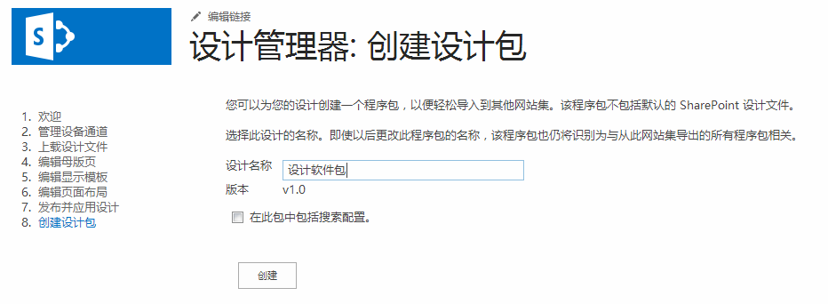

# SharePoint 2013 设计管理器设计包
了解如何构建 SharePoint 网站集的可视化设计并将其导出成包。
## 设计包概述

在 SharePoint 2013 中，设计管理器可帮助 Web 开发人员和设计人员构建 SharePoint 网站集的可视化设计并将其导出成包。此包可轻松地分发给客户或其他指定组，以供他们在其网站集中进行安装。此新增功能降低了传输设计的复杂性，便于客户外包其网站的可视化设计。例如，一些使用方案可能包含下列内容：
  
    
    

- **新设计** —Web 设计能力有限的公司可能会与供应商代理签订合同来用更现代的形式更新他们当前的 SharePoint 网站。代理可以创建网站并轻松将内容打包，以供重新导入公司的 SharePoint 场。
    
  
- **跨网站发布** —在 SharePoint 2013 中使用跨网站发布的企业 IT 部门可能必须跨多个网站集共享某个可视化设计。他们在内部创建网站，希望有一种简单的方式在多个 SharePoint 网站之间传输设计。使用通过设备管理器实现的设计包功能进行导出和导入，可减少管理支持和复杂性。
    
  
本文通过概述包创建来帮助您了解 SharePoint 2013 中的设计包，并且提供关于包导出和导入的工作流指导。本文还讨论了特定操作所需的权限和设计包体系结构。
  
    
    

## 创建设计包

用户通过"网站设置"中的设计管理器创建的设计包在其 SharePoint 网站上称作 SharePoint 解决方案包（.wsp 文件）。创建包的步骤紧跟在打造 SharePoint 网站品牌并发布该网站的其他设计管理器步骤（包括上载设计文件、创建母版页和编辑页面布局）后面。网站发布后，创建 .wsp 文件以供导出是一个相对简单的过程。
  
    
    
图 1 显示设计管理器中用于命名和创建设计包的选项。
  
    
    

**图 1. 导出设计包**

  
    
    

  
    
    

  
    
    
或者，您可以通过欢迎页面上的设计管理器或通过选择"网站设置"中的"导入设计包"来从另一个 SharePoint 2013 网站集中导入一个设计包。
  
    
    

    
> **注释**
> 有关设计管理器和发布过程的详细信息，请参阅 [SharePoint 2013 中的设计管理器概述](overview-of-design-manager-in-sharepoint-2013.md)。 
  
    
    

有一个复选框可供在设计包中包含搜索配置时使用。如果您要设计网站并创建条件搜索结果，或控制搜索体验，则可以选中此选项。此配置包含诸如查询规则、结果来源、结果类型以及任何架构和排名模型的资产。为确保搜索配置的导入不会失败，搜索配置的任何元素的名称都不得重复。例如，如果您在名为 **SampleQueryRule** 的网站集中有一条查询规则，而您将该规则导入另一个已经含有名为 **SampleQueryRule** 的规则的网站集中，则导入该搜索配置将失败。为防止该情况发生，您可以重命名或删除源或目标的查询规则。结果源和架构也必须具有唯一名称。如果您想在设计包中包含搜索配置，则必须在导出设计包之前，在"管理网站功能"下的网站级激活以下功能：
  
    
    

- 搜索配置数据内容类型
    
  
- 搜索配置数据网站栏
    
  
- 搜索配置列表实例功能
    
  
- 搜索配置模板功能
    
  
如果您希望您的设计发布在导入目标上，则应当发布所有设计资产或禁用导出源上设计相关库中的主版本。设计管理器仅从源中导出每个资产的最新版本。例如，如果您在源上的母版页的版本为 1.1，则该版本将作为草稿被复制到目标。但不会复制版本 1.0。而且也不会导出已签出的文件。
  
    
    

## 导出和导入设计包

您可以采用多种方式来实现端到端打包工作流，其中大部分方法取决于您的目标和可用的设计资源。您可以决定外包给供应商代理，或者在内部完成该工作（如果您有内部资源）。表 1 提供了一个示例工作流以及在客户与供应商代理之间进行的有关设计包的设计、导出和导入方面的切换。该表还提供设计相关操作和打包操作所需的权限。
  
    
    

**表 1. 示例设计包工作流**

|**步骤**|**操作**|**说明**|
|:-----|:-----|:-----|
|1    |客户与供应商代理签订合同以创建可视化设计。    | 供应商设计人员根据公司的要求创建网站。   > **注释**>  供应商设计人员必须具有 **Designers** 权限级别才能使用设计管理器以及创建和导出包。更具体地说，就是要具有允许查看、添加、更新、删除、批准和自定义可视化设计的 **Design** 权限。          |
|2    |供应商设计人员将可视化设计导出到某个设计包中。    | 供应商设计人员在完成其他所需的打造品牌和发布步骤后导出 SharePoint 解决方案包（.wsp 文件）。    设计包通过安全通道交付给客户。   |
|3    |客户将可视化设计导入到其指定 SharePoint 2013 网站集。    | 客户通过安全通道接收设计包。    通过欢迎页面的设计管理器或通过选择"网站设置"中的"导入设计包"，客户可导入 .wsp 文件并将该设计包应用到指定的网站集。   > **注释**>  客户必须具有 **Designers** 权限级别才能使用设计管理器和导入设计包。          |
   

## 了解设计包内容

当通过设计管理器创建设计包 .wsp 文件时，该 .wsp 文件将包含几个文件。该过程从各种列表和库中导出文件以构成整个包。在导入到某个网站集时，这些文件会根据文件类型分发到不同的位置。表 2 详细说明在汇编过程中导出的文件位置和类型。
  
    
    

**表 2. 设计包内容和文件导出位置摘要**

|**导出位置**|**导出的资产**|
|:-----|:-----|
|文档库    | 母版页样式库    主题库    样式库    网站资产库   |
|内容类型，字段    | 从页面内容类型继承的内容类型   |
|列表    | 设计库    复合外观    设备通道   |
   

> **注释**
> 在 SharePoint 2013 中，设计包中仅包含自定义文件。打包过程将不会导出大多数默认的非自定义的系统文件。 
  
    
    

在 SharePoint 2013 中，您无法卸载已导入的设计包，您永远不应尝试通过解决方案集使设计包无效。如果这样做，页面布局内容类型将被移除，用户可能将无法创建子网站。要从该状态中恢复，您应执行以下步骤，其中网站 A 为原始网站集，网站 B 为含有无效设计包的网站集（错误状态），网站 C 为您创建的新的空白网站集：
  
    
    

1. 从网站 A 导出设计包
    
  
2. 将设计包导入到网站 C
    
  
3. 从网站 B 导出设计包
    
  
4. 将设计包导入到网站 C
    
  
5. 从网站 C 导出设计包
    
  
6. 将设计包导入到网站 B
    
  
设计包卸载后还会导入任何创建的设备通道及其配置。但是，您必须将母版页与指定的设备通道重新关联，因为这些映射不会进行配置。
  
    
    
在导入设计包时，不会设置备用 CSS URL，即使导出源上配置了该 URL 也是如此。CSS 类应当存储在母版页样式库中的外部文件中，而不是在母版页文件本身中。
  
    
    

## 其他资源

-  [在 SharePoint 2013 中开发网站设计](develop-the-site-design-in-sharepoint-2013.md)
    
  
-  [SharePoint 2013 中的设计管理器概述](overview-of-design-manager-in-sharepoint-2013.md)
    
  
-  [SharePoint 2013 网站开发的新增内容](what-s-new-with-sharepoint-2013-site-development.md)
    
  
