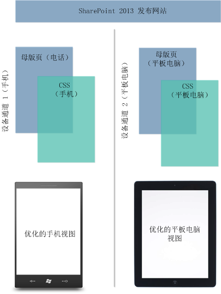
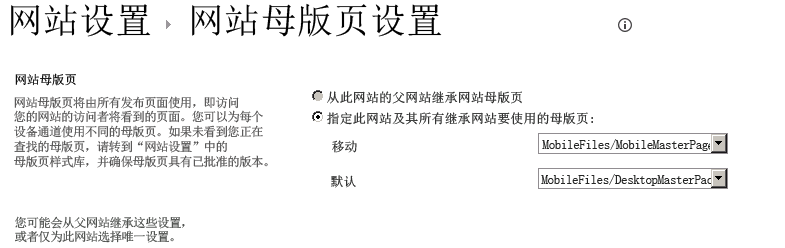

# SharePoint 2013 设计管理器设备通道
了解、规划并配置 SharePoint 2013 网站上的设备通道体验。
## 设备通道简介
<a name="Int"> </a>

在移动设备上浏览 Web 现在很常见，因此必须对 SharePoint 网站进行优化以确保智能手机和其他移动设备（如平板电脑）的可读性和易用性。SharePoint 2013 中有了设备通道后，您可以使用针对不同设备的不同设计以多种方式呈现单个发布网站。本文可帮助您计划使用 SharePoint 2013 中的设备通道功能。它提供了功能本身的详细概览，并提供了创建设备通道所需的信息。另外，阅读完本文后，您将了解您需要实现哪些设备通道以及如何实现这些通道。
  
    
    
设备通道仅可用于 SharePoint 2013 发布网站。实现设备通道之前，您应当已经对 SharePoint 网站的各个部分、如何将 SharePoint 页面放在一起以及设计管理器有一定的了解。有关 SharePoint 页面模型（包括母版页和页面布局）的详细信息，请参阅  [SharePoint 2013 页面模型概述](overview-of-the-sharepoint-2013-page-model.md)。有关设计管理器的详细信息，请参阅 [SharePoint 2013 中的设计管理器概述](overview-of-design-manager-in-sharepoint-2013.md)。
  
    
    

## 什么是设备通道？
<a name="WhatDev"> </a>

设备通道是 SharePoint 2013 发布基础架构的一部分，可使您呈现特定的网站内容、设置内容的样式，甚至更改图像—同时在不同的设备池之间维护同一 URL。与桌面版本的 SharePoint 网站相比，移动呈现方式的宽度更小，更广泛的触摸目标使导航性能更佳，并且显示较少的信息量以提供更好的可用性。您可以一次创建一个网站并创作和编辑内容以供您所有不同的移动设备使用。当用户从智能手机或平板电脑之类的移动设备浏览 SharePoint 网站时，该移动浏览器会向网站提交包含用户代理字符串的 HTTP GET 请求。此字符串包含有关尝试访问网站的设备类型的信息。根据该设备的子字符串，设备浏览器可以重定向到特定母版页视图。例如，如果您有一些 Windows Phone 和 iPad 设备，您可以使用设备通道为每个池提供独特呈现的 SharePoint 发布网站。这些设备通道中的每个都可以获得不同的母版页和 CSS 文件，从而为用户带来更好的视觉体验。图 1 显示了使用两个设备通道为手机和平板电脑设备提供两个独特的网站呈现。
  
    
    
图 1. 跨不同设备平台使用设备通道
  
    
    

  
    
    

  
    
    
您可以从"外观"部分下的"网站设置"菜单，或者通过同一部分中的"设计管理器"选项来创建和配置设备通道。创建设备通道项目时，有 5 个必需和可选的域要应用到该过程中。表 1 列出了这些域并介绍了必须提供的信息类型。
  
    
    

**表 1. 创建设备通道所必需和可选的域**


|**字段**|**所需值**|**值**|
|:-----|:-----|:-----|
|名称  <br/> |是  <br/> |这是设计通道的名称。可以是能够标识通道的友好名称。  <br/> |
|别名  <br/> |是  <br/> |利用别名，您可以用代码、设备通道面板（在下文中讨论）、预览和其他上下文标识您的设备通道。  <br/> > **重要信息**> 如果您后来更改了通道别名，则您必须手动更新母版页映射、设备通道面板及任何自定义代码或标记。           |
|说明  <br/> |否  <br/> |提供有关设备通道的一般描述的域。  <br/> |
|设备包含规则  <br/> |是  <br/> |提供用户代理子字符串（如 Windows Phone OS）的域。设备重定向到特定母版页的情况取决于为此值输入的内容。有关要在此域应用哪些值的详细信息，请参阅本文中的 [用户代理子字符串和设备通道分级](#PlanDeviceChannels_UserAgentSubstrings)一节。  <br/> |
|激活  <br/> |否  <br/> |选中此复选框可激活您的设备通道。如果您在实时网站上工作，则您在设计完通道后才能激活该通道。若要进行测试，您可以在浏览器内使用查询字符串  `?DeviceChannel=alias` 来预览特定通道呈现的网站。 <br/> |
   

  
    
    

    
> **注释**
> 有关创建设备通道的详细信息和步骤，请参阅本文中的 [创建设备通道](sharepoint-2013-design-manager-device-channels.md#create)一节。 
  
    
    

创建和激活设备通道后，设备可能会重定向到特定母版页，如移动版本。下一步是指定在网站级别应为移动设备显示的母版页，方法是通过"网站母版页设置"或使用设计管理器中的"发布和应用"选项。
  
    
    

**图 2. 为移动设备视图和默认桌面视图设置母版页**

  
    
    

  
    
    

  
    
    
如图 2 所示，您可以为网站的常规桌面视图分配特定的母版页，而为设备重定向分配移动母版页。是呈现移动母版页还是呈现默认母版页取决于配置的活动设备通道。具体来说，是取决于在设备通道创建过程中提供的设备包含规则子字符串。
  
    
    

### 用户代理子字符串和设备通道分级
<a name="PlanDeviceChannels_UserAgentSubstrings"> </a>

在创建设备通道时，系统将要求您提供一个负责设备重定向到特定母版页的用户代理子字符串。如果您没有在"设备包含规则"域中提供此值，则无法进行设备重定向且无法创建该通道。表 2 提供了一些可在您创建设备通道时使用的示例用户代理子字符串值。
  
    
    

**表 2. 示例用户代理子字符串值**


|**设备**|**用户代理子字符串**|
|:-----|:-----|
|Windows Phone  <br/> | Windows Phone OS 7.5（特定于 Windows Phone 7.5 电话。） <br/>  Windows Phone OS（适用于所有 Windows Phone 版本的通用子字符串。） <br/> |
|iPhone  <br/> |iPhone  <br/> |
|iPad  <br/> |iPad  <br/> |
|Android  <br/> |Android  <br/> |
   
在"设备包含规则"域中，您仅添加子字符串值或您要包含的设备的值。
  
    
    

> **重要信息**
> 用户代理子字符串值会因设备制造商的不同而有所不同，类似品牌设备之间也可能不同，如上述的 Windows Phone。若要将流量成功重定向到特定池，您必须为用户代理子字符串提供唯一标识符。有关如何跨不同设备隔离子字符串的详细信息，请参阅本文中的 [规划设备通道体验](sharepoint-2013-design-manager-device-channels.md#plan)一节。 
  
    
    

设备通道在创建后将存储在列表中并在其中进行排序。SharePoint 2013 中的每个网站最多支持 10 个设备通道，因此有必要对您的通道进行分级以便实现正确的流量路由。您应当将最具体的规则安排在顶部位置以获得更高的优先级。例如，您的组织中可能拥有 Windows Phone 设备的多个操作系统版本，您希望为 Windows Phone 7.5 设备呈现唯一母版页。所有其他 Windows Phone 设备将接收另一个移动母版页视图。表 3 显示了可应用的两种排序方案，以及对路由决策的影响。
  
    
    

> **注释**
> 有关如何对设备通道重新排序的详细信息，请参阅本文中的 [创建设备通道](sharepoint-2013-design-manager-device-channels.md#create)一节。 
  
    
    


**表 3. 设备通道的排序示例**


|**顺序 1（设备通道）**|**顺序 2（设备通道）**|
|:-----|:-----|
|设备通道 1—Windows Phone OS 7.5  <br/> |设备通道 1—Windows Phone OS  <br/> |
|设备通道 2—Windows Phone OS  <br/> |设备通道 2—Windows Phone OS 7.5  <br/> |
|设备通道 3—默认  <br/> |设备通道 3—默认  <br/> |
   
如果您选择顺序 1（其中设备包含规则子字符串设置为 **Windows Phone OS 7.5**），则使用 Windows Phone 7.5 设备浏览到您网站的用户将被重定向到设备通道 1。使用任何其他 Windows Phone 版本的用户将被重定向到设备通道 2，任何非 Windows Phone 用户将接收通道 3。但是，如果您选择顺序 2（对 Windows Phone OS 泛型子字符串排定了优先级），则所有 Windows Phone 流量均会重定向到设备通道 1。由于设备通道 1 的优先顺序和泛型特征，不会为 Windows Phone 7.5 设备调用设备通道 2。如果您创建多个设备通道，了解排序方法和分级对设备池流量重定向的影响很重要。
  
    
    

> **注释**
> 有关对设备通道进行排序的详细信息和步骤，请参阅本文中的 [更改设备通道的顺序](sharepoint-2013-design-manager-device-channels.md#reorder) 一节。
  
    
    


### 设备通道面板
<a name="PlanDeviceChannels_UserAgentSubstrings"> </a>

设备通道面板是当您希望根据给定设备通道的别名或通道集显示特定内容时可用在母版页或页面布局上的容器。例如，您可能有只希望在网站的桌面视图上显示而不希望在任何移动设备上显示的 Web 部件或控件。利用设备通道面板，您可以用代码封装此 Web 部件，并仅通过指定的设备通道来呈现它。与在 CSS 类中使用  `Display:None` 相比，设备通道面板的主要好处在于，设备通道面板内的内容根本不会在非指定的通道上呈现。另外，设备通道面板还可通过排除庞大的内容来减小设备页面的呈现大小。这提供了一种提高带宽有限的设备上网站响应能力的方法。
  
    
    
在您预览母版页或页面布局时，可从代码段库中生成设备通道面板代码段。下面的 HTML 示例演示如何创建设备通道面板。在此方案中，有一段仅为特定设备通道呈现的插入文本。属性 **IncludedChannels** 是您指定所配置设备通道别名的位置。此外，别名是在设备通道创建过程中分配的名称，可在您的代码中进行引用。
  
    
    

  
    
    


```HTML

<div data-name="DeviceChannelPanel">
 <!--CS: Start device channel panel snippet.-->
<!--SPM:<%@Register Tagprefix="Publishing" Namespace="Microsoft.SharePoint.Publishing.WebControls" Assembly="Microsoft.SharePoint.Publishing, Version=15.0.0.0, Culture=neutral, PublicKeyToken=62TDCXXXXXXXXXX
<!--MS:<Publishing:MobilePanel runat="server" IncludedChannels="DEFAULT">-->
<p>
This paragraph of content shows up only in the default channel, which means that you can use the same page layout for all your different devices. You can put HTML content, page fields, web parts, or CSS/JavaScript links within a device channel panel so that the content loads only on your specified channels.
</p>
<!--ME:</Publishing:MobilePanel>-->
<!--CE: End Device Channel Panel Snippet-->
</div>
```

如果您希望内容显示在多个通道上，引号内的别名应当用逗号隔开： `IncludedChannels="alias1, alias2"` 有关设备通道面板容器的详细信息，请参阅 [SharePoint 2013 页面模型概述](overview-of-the-sharepoint-2013-page-model.md)。有关使用设计管理器代码段的详细信息，请参阅 [SharePoint 2013 设计管理器代码段](sharepoint-2013-design-manager-snippets.md)。
  
    
    

## 规划设备通道体验
<a name="plan"> </a>

在您的组织中实现设备通道之前，必须回答和收集一些问题和信息。本节将通过询问有关您设备和可用性需要的相关问题以及提供功能方法的指导来帮助您规划如何使用设备通道。本节中的问题需要按顺序阅读而不是分别单独阅读。
  
    
    

### 我要在桌面和设备上尝试获得什么样的网站体验？

和大部分组织一样，根据您组织的需要将会有独特的可用性要求。理想的目标是确保此体验能够最好地转化成任何类型的外形规格，无论是桌面还是设备。但是，尽管看似天马行空，这仍然是一个复杂过程，尤其是在您处理不同的分辨率和更少的触控互动屏幕区域的情况下。此外，或许您库存中有些电话要求其他人无法或不应具有的唯一性 UI 自定义。在这些情形下，Web 开发十分困难，并且如果您没有闲暇时光跨多个设备品牌分配单个母版页，更是如此。
  
    
    
第一个任务应当将为创建跨设备成功的用户体验而必须实现的功能写下来。用户群期望在其桌面、电话或平板电脑上使用 SharePoint 2013 发布网站能够做些什么？您可能会发现各种问题，包括可能存在的局限以及必须考虑到的个人设备注意事项。用任意形式记录此类所有信息；这将有助于您了解使用设备通道功能实现的具体目标，并有助于您回答下面列出的连续问题，比如您愿意支持哪些设备和您应当实现多少设备通道。
  
    
    
此外，记住设备通道功能提供的可解决各种规划问题的一些关键功能也非常重要。比如多个设备通道支持将唯一母版页映射到多个设备。以及，使用设备通道面板可跨不同设备池有选择性地显示各种内容元素。
  
    
    

### 您需要多少设备通道？

您最多可拥有 10 个设备通道，包括在特定网站上为本地安装配置的默认值，以及使用 SharePoint Online 时的总共两个设备通道。对于您所在的组织，这就像创建一个设备通道、应用代表所有设备的几个设备包含规则和重定向到特定母版页那样简单。理想情况下，最好尽可能减少设备通道的数量。但是，根据设备差异或唯一 HTML/CSS 自定义，仅有一个通道可能不是一个好的选择，您可能需要额外的设备通道。
  
    
    
若要确定设备通道的个数，您应当参考您从上述问题中收集到的有关您跨设备的网站目标、计划要支持的设备和所需自定义级别的信息。利用此信息，创建一个您要实现的通道列表。一个移动母版页附属于一个设备通道能否解决所有需求？或者您是否需要单独的母版页关联以用于平板电脑，因此有多个通道？这也是为您的通道命名的适当时间，为每个通道构想一个合适的别名，以便可以在代码中引用该别名。如果您后来更改了该通道别名，则您必须更新对其的全部引用。
  
    
    

### 我可以使用的所有设备子字符串的列表在哪里？

可将一些泛型制造商用户代理子字符串用于设备重定向，如 Windows Phone OS 或 iPhone，如表 2 所示。"设备包含规则"域中所需的子字符串通常是在设备连接到网站时提供的更大用户代理字符串的一部分。建议您查找特定于设备的字符串，方法是在制造商或软件提供商网站上或通过一般的基于 Web 的搜索找到它。有些时候鉴于用户代理字符串构造很类似，因此已进行版本控制的特定子字符串可能很难隔离。表 4 提供了两个示例用户代理字符串，分别针对 Windows 8 桌面和平板电脑设备。
  
    
    

> **注释**
> 以下字符串只是示例，不是涵盖的 Windows 设备的真正字符串。提供它们是为了演示根据需要隔离子字符串的要点。 
  
    
    


**表 4. 区分用户代理字符串**


|**设备**|**用户代理字符串**|
|:-----|:-----|
|Windows 8 桌面  <br/> |(compatible; MSIE 10.0; Windows NT 6.2; WOW64; Trident/6.0)  <br/> |
|Windows 8 平板电脑（示例）  <br/> |(compatible; MSIE 10.0; Windows NT 6.2; WOW64; Trident/6.0; touch)  <br/> |
   
这些字符串的格式十分相似；唯一的差异就是 Windows 8 平板电脑示例包括  `touch`。对于此特殊情形，如果您希望对平板电脑设备呈现特定母版页，则在您创建设备包含规则时应将  `touch` 作为子字符串提供。当您处理此类情况时，关键在于找到相似字符串之间的不同点。如果您要创建一个具有使用诸如 **MSIE 10.0** 的共同值的设备包含规则的设备通道，则将没有办法区分桌面和平板电脑。
  
    
    

### 我是否需要使用设备通道面板？

否。在您希望跨不同设备体验允许、调整或阻止呈现部分基于 UI 的元素时，设备通道面板将非常有用。例如，您可能希望有些文本或控件显示在 iPhone 上而不希望它们显示在 Android 设备上。原因可能是外形规格具有较小的屏幕大小以及可用性会受到影响。无论条件如何，设备通道面板都可分配给所创建的设备通道的别名并能提供此差异水平所需的灵活性。要问的一个不错问题是，是否有理由不将单一母版页应用于我组织中的一组不同设备？如果是，设备通道面板可能是获得满足特定设备需求的更精细的开发体验的最佳选择。另外，您也可以使用设备通道面板向页面布局添加特定于通道的 CSS。
  
    
    

### 我能否使用 Cookis 来选择设备通道？

是，您可以通过使用 Cookie 来强制或覆盖设备通道选择。为此，您必须创建一个名为 deviceChannel 的浏览器 Cookie，并为它提供指定设备通道的别名。此外，设备通道可设置一个称为 **effectiveDeviceChannel** 的 JavaScript 变量（包含当前通道别名）。此变量可用于显示当前所用的通道。若要使您的网站发出 JavaScript 变量，请将此属性添加到根网站属性包：
  
    
    

```

key = PublishingInformationControlIncludeEffectiveDeviceChannel, value = true
```

此变量还可以用来影响页面上呈现的内容和 Web 部件。
  
    
    

## 创建设备通道
<a name="create"> </a>

可使用以下过程创建新设备通道。
  
    
    

### 创建设备通道


1. 启动设计管理器。（例如，在"设置"菜单上，选择"设计管理器"。）
    
  
2. 在编号列表中，选择"管理设备通道"。
    
  
3. 在"设计管理器: 管理设备通道"页上，选择"创建通道"。
    
  
4. 在"设备通道 - 新建项"页上的"名称"文本框中，为设备通道输入名称。
    
  
5. 在"别名"文本框中，为设备通道输入别名。别名必须是字母数字字符，不能包含空格。您将使用别名在代码中和其他上下文中引用设备通道。
    
  
6. 在"说明"文本框中，输入通道将捕获的设备或浏览器的简要说明。
    
  
7. 在"设备包含规则"文本框中，为通道输入用户代理子字符串。如果您提供的任何字符串与网页请求的用户代理字符串匹配，则该请求将使用此通道。
    
  
8. 如果您已准备好使此通道可用来呈现页面，请选中"活动"复选框。
    
  
9. 选择"保存"。
    
  

## 更改设备通道
<a name="modify"> </a>

可使用以下过程更改现有的设备通道。
  
    
    

> **注释**
> 您无法修改默认通道。 
  
    
    


### 更改设备通道


1. 启动设计管理器。（例如，在"设置"菜单上，选择"设计管理器"。）
    
  
2. 在编号列表中，选择"管理设备通道"。
    
  
3. 在"设计管理器: 管理设备通道"页上，选择"编辑或重新排序现有通道"。
    
  
4. 在"设备通道"列表中，选择要更改的设备通道，然后在"项"选项卡上，选择"编辑项"。
    
  
5. 若要更改设备通道的名称，请在"名称"文本框中输入新名称。
    
  
6. 若要更改设备通道的别名，请在"别名"文本框中输入新别名。
    
    > **注释**
      > 如果您更改了设备通道的别名，则必须在您使用该别名的其他位置手动更改它。例如，您必须在自定义代码或标记中手动更改别名，并且您必须手动更改设备通道和母版页之间的映射。 
7. 若要更改设备通道的说明，请在"说明"文本框中输入新说明。
    
  
8. 若要更改设备包含规则，请在"设备包含规则"文本框中编辑字符串。
    
  
9. 若要使设备通道成为活动的，请选中"活动"复选框。若要使通道成为非活动的，请清除"活动"复选框。
    
  
10. 选择"保存"。
    
  

## 删除设备通道
<a name="delete"> </a>

可使用以下过程删除现有的设备通道。
  
    
    

> **注释**
> 您无法删除默认通道。 
  
    
    


### 删除设备通道


1. 启动设计管理器。（例如，在"设置"菜单上，选择"设计管理器"。）
    
  
2. 在编号列表中，选择"管理设备通道"。
    
  
3. 在"设计管理器: 管理设备通道"页上，选择"编辑或重新排序现有通道"。
    
  
4. 在"设备通道"列表中，选择要删除的设备通道。
    
  
5. 在"项"选项卡上，选择"删除项"。
    
  
6. 选择"确定"。
    
  

## 更改设备通道的顺序
<a name="reorder"> </a>

可使用以下过程更改设备通道的顺序。
  
    
    

### 对设备通道重新排序的步骤


1. 启动设计管理器。（例如，在"设置"菜单上，选择"设计管理器"。）
    
  
2. 在编号列表中，选择"管理设备通道"。
    
  
3. 在"设计管理器: 管理设备通道"页上，选择"编辑或重新排序现有通道"。
    
  
4. 在"项"选项卡上，选择"对通道重新排序"。
    
  
5. 在"设备通道重新排序"页上，选择要更改其顺序的通道，然后选择"上移"或"下移"。
    
  
6. 在通道按照您希望的方式排序后，选择"确定"。
    
  

## 其他资源
<a name="PlanDeviceChannels_addresources"> </a>


-  [在 SharePoint 2013 中开发网站设计](develop-the-site-design-in-sharepoint-2013.md)
    
  
-  [SharePoint 2013 页面模型概述](overview-of-the-sharepoint-2013-page-model.md)
    
  
-  [SharePoint 2013 中的设计管理器概述](overview-of-design-manager-in-sharepoint-2013.md)
    
  
