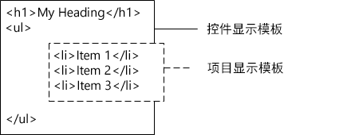

# SharePoint 2013 Design Manager 显示模板
了解显示模板，包括：模板如何关联到搜索 Web 部件、如何构建模板、如何映射属性并使用变量和 jQuery，以及如何在 SharePoint Server 2013 中创建自定义显示模板。
## 显示模板简介
<a name="bk_introduction"> </a>

SharePoint Server 2013 中的显示模板用于 Web 部件中，使用搜索技术（本文中指搜索 Web 部件）显示对搜索索引的查询结果。显示模板控制显示在搜索结果中的托管属性，以及在 Web 部件中显示的方式。每个显示模板都由两个文件组成：一个是可以在 HTML 编辑器中进行编辑的 HTML 版显示模板，另一个是 SharePoint 使用的 .js 文件。
  
    
    

> **注释**
> 只有搜索 Web 部件可以使用显示模板。内容查询 Web 部件不是搜索驱动部件，因此不使用显示模板。 
  
    
    

可以在设计管理器中查看现有显示模板，但并不是按照创建母版页和页面布局的方式来创建显示模板，而是：
  
    
    

- 打开 [母版页样式库的映射网络驱动器](how-to-map-a-network-drive-to-the-sharepoint-2013-master-page-gallery.md)。
    
  
- 打开 **显示模板**文件夹内四个文件夹中的一个。
    
    > **注释**
      > 您选择的文件夹取决于您希望使用的显示模板类型。例如，如果您的网站使用跨网站发布，则从 **内容 Web 部件**文件夹复制一个显示模板。有关详细信息，请参阅  [SharePoint Server 2013 中的显示模板引用](http://technet.microsoft.com/zh-cn/library/jj944947.aspx)。 
- 复制与您想要的模板类似的现有显示模板的 HTML 文件。放置副本的确切位置并不重要，只要是在 **母版页样式库**中就可以。
    
  
- 在 HTML 编辑器中打开并修改副本。
    
  
通过使用现有显示模板作为新的显示模板的起点，让您可以从默认显示模板注释中的自定义过程的有用信息中获益，并且您将具有基本任务（如映射输入字段）的框架。它还保证了模板使用的是正确的基本页面结构。
  
    
    
在通过复制 **母版页样式库**内 **显示模板**文件夹中的现有显示模板的 HTML 文件创建显示模板时：
  
    
    

- 具有相同名称的 .js 文件在您复制了 HTML 文件的位置创建。
    
  
- SharePoint Server 2013 所需的所有标记都将添加到 .js 文件中，以使显示模板正确显示。
    
  
- HTML 文件和 .js 文件相关联，因此在保存 HTML 文件后，对 HTML 文件做出的任何后续编辑都会同步到 .js 文件中。
    
  

> **注释**
> 仅单向进行同步。对 HTML 显示模板所做的更改将同步到关联的 .js 文件。与母版页和页面布局不同，在使用显示模板时，您无法通过破坏文件之间的关联选择仅使用 .js 文件。必须在 HTML 文件中输入所有 HTML 和 JavaScript。 
  
    
    


## 了解显示模板和搜索 Web 部件之间的关系
<a name="bk_DTandSWP"> </a>

显示模板有两种主要类型：
  
    
    

- **控件模板**决定结果显示方式的整体架构。包括列表、分页列表和幻灯片放映。
    
  
- **项模板**决定集中的每个结果的显示方式。包括图像、文本、视频以及其他项目。
    
  
有关这些模板和其他显示模板的详细信息，请参阅  [SharePoint Server 2013 中的显示模板引用](http://technet.microsoft.com/zh-cn/library/jj944947.aspx)。
  
    
    
将搜索 Web 部件（如内容搜索 Web 部件）添加到页面后，若要配置 Web 部件，请选择控件显示模板和项显示模板，如图 1 中所示。
  
    
    

**图 1. 内容搜索 Web 部件的工具窗格**

  
    
    

  
    
    

  
    
    
控件显示模板提供了 HTML，以构建希望的搜索结果显示方式的整体布局。例如，控件显示模板可能会提供列表标头及开头和结尾的 HTML。控件显示模板仅在 Web 部件中呈现一次。
  
    
    
项显示模板提供的 HTML 决定每个项目在结果集中的显示方式。例如，项显示模板可能会提供列表项的 HTML，其中包含的图片和三行文本映射到与项目关联的不同托管属性。每个项目的项显示模板在结果集中呈现一次。因此，如果结果集包含十个项目，则项显示模板会创建 HTML 部分十次。
  
    
    
以此种方式一起使用时，控件显示模板和项显示模板相结合，创建呈现在 Web 部件中的 HTML 统一块，如图 2 中所示。
  
    
    

**图 2. 控件显示模板与项显示模板的结合 HTML 输出**

  
    
    

  
    
    

  
    
    
有关显示模板的详细信息，请参阅  [SharePoint 2013 页面模型概述](overview-of-the-sharepoint-2013-page-model.md)中的"搜索驱动 Web 部件和显示模板"一节。
  
    
    

## 了解显示模板结构
<a name="bk_DTstructure"> </a>

用于显示模板的 HTML 文件是全形 HTML 文档，但不显示完整的 HTML 网页。SharePoint 将显示模板 HTML 文件片段转换为 JavaScript。本节将说明显示模板的四个主要部分。
  
    
    

### Title 标记

搜索 Web 部件处于编辑模式时，显示模板文件的 **<title>** 标记中的文本用作 Web 部件编辑窗格"显示模板"部分的显示名称。以下示例是名称为"Item_Picture3Lines.html" 的项显示模板：
  
    
    

```HTML

<title>Picture on left, 3 lines on right</title>
```


### 标头属性

紧接着 **<title>** 标记的是以下标记绑定的自定义元素集：
  
    
    

```HTML
<!--[if gte mso 9]><xml>
<mso:CustomDocumentProperties>
…
</mso:CustomDocumentProperties>
</xml><![endif]-->

```

这些元素及其属性为 SharePoint 环境提供了有关显示模板的重要信息。表 1 说明了用于显示模板的自定义属性。
  
    
    

> **注释**
> 并非所有的自定义属性都用于每个显示模板，并且一些属性可通过在设计管理器中编辑显示模板文件属性进行更改。 
  
    
    


**表 1. CustomDocumentProperties 条目列表**


|**属性**|**说明**|
|:-----|:-----|
|**TemplateHidden** <br/> |指示是否在 Web 部件的可用模板列表中隐藏显示模板的布尔值。此值可在显示模板文件属性中进行更改。  <br/> |
|**ManagedPropertyMapping** <br/> |将搜索结果项目公开的字段映射到 JavaScript 可用的属性中。仅用于项目模板中。  <br/> |
|**MasterPageDescription** <br/> |提供显示模板简单易懂的描述。此属性在 SharePoint 编辑环境中显示。此值可在显示模板文件属性中进行更改。  <br/> |
|**ContentTypeId** <br/> |与显示模板关联的内容类型的 ID。  <br/> |
|**TargetControlType** <br/> |指示显示模板所使用的上下文。此值可在显示模板文件属性中进行更改。  <br/> |
|**HtmlDesignAssociated** <br/> |指示显示模板 HTML 文件是否具有与其相关联的 .js 文件的布尔值。  <br/> |
|**HtmlDesignConversionSucceeded** <br/> |指示转换过程是否成功。此值由 SharePoint 自动添加到文件中，且仅用于自定义显示模板中。  <br/> |
|**HtmlDesignStatusAndPreview** <br/> |包含 HTML 文件的 URL 和 **状态**列（"转换成功"或"警告和错误"）的文本。此值由 SharePoint 自动添加到文件，且仅用于自定义显示模板中。  <br/> |
   

### 脚本块
<a name="bk_scriptblock"> </a>

在 **<body>** 标记内，可以看到以下 **<script>** 标记：
  
    
    

```HTML

<script>
     $includeLanguageScript(this.url, "~sitecollection/_catalogs/masterpage/Display Templates/Language Files/{Locale}/CustomStrings.js");
</script>
```

默认情况下，此行包括在所有显示模板中。可以将 **<script>** 标记中的更多代码行添加到引用 CSS 文件或主显示模板 HTML 文件外部的其他 JavaScript 文件。表 2 显示了如何包括其他资源的示例。
  
    
    

**表 2. 在 <script> 标记中包括外部资源的示例**


|**如果您想要包括以下外部资源：**|**使用以下代码：**|
|:-----|:-----|
|作为当前网站集的一部分的 JavaScript 文件  <br/> | `$includeScript(this.url, "~sitecollection/_catalogs/masterpage/Display Templates/Content Web Parts/MyScripts.js");` <br/> |
|外部 JavaScript 文件  <br/> | `$includeScript(this.url, "http://www.contoso.com/ExternalScript.js");` <br/> |
|作为当前网站集的一部分的 CSS 文件  <br/> | `$includeCSS(this.url, "~sitecollection/_catalogs/masterpage/Display Templates/Content Web Parts/MyCSS.css");` <br/> |
|与当前显示模板相对的位置中的 CSS 文件  <br/> | `$includeCSS(this.url,"../../MyStyles/MyCSS.css");` <br/> |
   

> **注释**
> 如果母版页样式库中的项目需要 **内容审批**，所有资源文件（包括 CSS 和 .js 文件）必须在母版页和页面布局可用之前发布。有关详细信息，请参阅 [要求审批网站列表或库中的项目](http://office.microsoft.com/zh-cn/sharepoint-help/require-approval-of-items-in-a-site-list-or-library-HA102853936.aspx?CTT=1)。 
  
    
    


### DIV 块
<a name="bk_scriptblock"> </a>

 **<script>** 标记后是具有 ID 的 **<div>** 标记。默认情况下，此 **<div>** 标记的 ID 与 HTML 文件的名称匹配。您希望显示模板提供的任何 HTML 或代码必须包括在此 **<div>** 标记内。但标记本身不包括在运行时呈现于网页上的标记内。
  
    
    

> **注释**
> 如果您希望为运行时呈现于页面上的 HTML 块分配 CSS 样式或 ID，可以添加一个新的标记到第一个 **<div>** 标记内。还可以为控件模板中包围变量 `_#= ctx.RenderGroups(ctx) =#_` 的 HTML 分配 CSS 样式或 ID。变量 `_#= ctx.RenderGroups(ctx) =#_` 用于呈现包围项目模板呈现的查询结果的 HTML。
  
    
    

您在第一个 **<div>** 标记中可以看到以 **<!--#_** 开头、以 **_#-->** 结尾的注释块中的代码。可以使用这些块中的 JavaScript 代码，以及块之外的 HTML。还可以使用这些块控制带有条件语句的 HTML。为此，使用带有条件语句和左方括号的注释块，然后是 HTML，然后是另一个带有右方括号的注释块。以下示例中的定位标记仅在 **linkURL** 对象的值不为空时呈现在页面上。
  
    
    


```HTML

<!--#_
if(!linkURL.isEmpty)
{
_#-->
     <a class="cbs-pictureImgLink" href="_#= linkURL =#_" title="_#= $htmlEncode(line1.defaultValueRenderer(line1)) =#_" id="_#= pictureLinkId =#_">
<!--#_
}
_#-->

```


## 映射输入属性并获取其值
<a name="bk_mapproperties"> </a>

项显示模板的标头部分具有一个名称为 **ManagedPropertyMapping** 的自定义文档属性。此属性采用搜索使用的托管属性，并将它们映射到可由显示模板使用的值。此属性是以逗号分隔的值的列表，使用以下格式：' _属性显示名称_'{ _属性名称_}:' _托管属性_'。例如， `'Picture URL'{Picture URL}:'PublishingImage;PictureURL;PictureThumbnailURL'`。
  
    
    
我们来看看详细的格式：
  
    
    

-  _属性显示名称_是在选定显示模板后，显示于 Web 部件编辑窗格中的属性名称。
    
  
-  _属性名称_是使用本地化字符串资源查找托管属性的名称的标识符。也是显示在 Web 部件设置菜单"属性映射"部分的值。编辑 Web 部件的设置时，可以更改此值，以更改关联到 Web 部件中显示的字段的托管属性。
    
  
-  _托管属性_是一个或多个托管属性的字符串，用分号隔开。在运行时，对列表从左至右求值，与当前搜索项目的托管属性名称匹配的第一个值将映射到此槽。这让您可以对可以使用多个项目类型，以及可以在存在兼容属性时使用一致呈现的显示模板进行写入。
    
  
映射属性之后，可以通过使用以下代码获取脚本中的值： `var pictureURL = $getItemValue(ctx, "Picture URL");`
  
    
    
传递给 **$getItemValue()** 的第二个参数必须与用于 **ManagedPropertyMapping** 元素中单引号中的属性显示名称匹配。本示例中， **Picture URL** 是传递给 **$getItemValue()** 的属性名称。
  
    
    
此代码返回值信息对象 ( **valueInfoObj**)。此对象包含输入值的原始表示形式，以及使用适用默认编码的值。
  
    
    
可以像往常那样使用 JavaScript 部分中的变量，对变量进行操作并创建 HTML 字符串以在运行时呈现在页面上。但是，若要引用 HTML 的脚本中直接声明的变量，必须使用以下格式：_#=  _variableName_ =#_。例如，若要使用变量 **pictureURL** 作为图像的值，请使用以下 HTML： ``
  
    
    

## 通过显示模板使用 jQuery
<a name="bk_jQuery"> </a>

可以通过显示模板使用 jQuery。但是请注意两个重要因素：
  
    
    

- 若要在显示模板中包括 jQuery 库，请按照本文之前所述的 [脚本块](#bk_scriptblock)一节中的说明执行操作。
    
  
- 如果使用 jQuery 中的 ID 选择器，请使用以下代码创建 ID 的变量： `var containerQueryId = '#' + '_#= containerId =#_';`
    
    使用以下代码引用 jQuery 中的选择器： `$('_#= containerQueryId =#_')`
    
  

## 创建显示模板
<a name="bk_createDT"> </a>

在可以通过使用以下过程创建显示模板之前，必须具有一个指向 **母版页样式库**的映射网络驱动器。有关详细信息，请参阅 [如何：将网络驱动器映射到 SharePoint 2013 母版页样式库](how-to-map-a-network-drive-to-the-sharepoint-2013-master-page-gallery.md)。
  
    
    

### 创建显示模板


1. 使用 Windows Explorer 打开指向 **母版页样式库**的映射网络驱动器。
    
  
2. 打开 **显示模板**文件夹，然后打开 **内容 Web 部件**文件夹。
    
  
3. 复制类似于您想要创建的显示模板的 HTML 文件。有关默认显示模板的列表及其说明，请参阅  [SharePoint Server 2013 中的显示模板引用](http://technet.microsoft.com/zh-cn/library/jj944947.aspx)。
    
    此时，SharePoint Server 2013 会将 HTML 文件复制到具有相同名称的 .js 文件中。例如，如果复制的 HTML 文件的名称为 Item_Picture3Line_copy.html，则也会创建名称为 Item_Picture3Lines_copy.js 的相应 .js 文件。如果选择重命名文件，则相应的 .js 文件名称也将更改。
    
  
4. 若要自定义显示模板，请使用 HTML 编辑器打开并编辑映射驱动器中的 HTML 文件，以编辑驻留在服务器上的 HTML 文件。每次保存 HTML 文件时，所有更改都会同步到关联的 .js 文件。
    
  
5. 浏览到您的发布网站。
    
  
6. 在页面右上角，选择"设置"，然后选择"设计管理器"。
    
  
7. 在设计管理器的左侧导航窗格中选择"编辑显示模板"。此时将显示带有"状态"列（显示两种状态中的一种）的 HTML 文件：
    
  - **警告和错误**
    
  
  - **转换成功**
    
  

    > **注释**
      > 与母版页和页面布局不同，您无法使用预览页面查看显示模板的实时服务器端预览。若要预览显示模板，必须将内容搜索 Web 部件添加到页面，然后在内容搜索 Web 部件编辑窗格中应用显示模板。如果显示模板中出现任何错误，内容搜索 Web 部件会显示一条错误消息。必须先修复错误，才能正确显示显示模板。 
8. 若要修复任何错误，请使用 HTML 编辑器打开并编辑映射驱动器上的 HTML 文件，以编辑驻留在服务器上的 HTML 文件。保存显示模板，然后重新加载包含使用该显示模板的内容搜索 Web 部件的页面。
    
  

## 其他资源
<a name="bk_addresources"> </a>


-  [SharePoint 2013 中的设计管理器概述](overview-of-design-manager-in-sharepoint-2013.md)
    
  
-  [在 SharePoint 2013 中开发网站设计](develop-the-site-design-in-sharepoint-2013.md)
    
  
-  [如何：在 SharePoint 2013 中将 HTML 文件转换为母版页](how-to-convert-an-html-file-into-a-master-page-in-sharepoint-2013.md)
    
  
-  [如何：在 SharePoint 2013 中创建页面布局](how-to-create-a-page-layout-in-sharepoint-2013.md)
    
  
-  [SharePoint 2013 Design Manager 品牌和设计功能](sharepoint-2013-design-manager-branding-and-design-capabilities.md)
    
  

