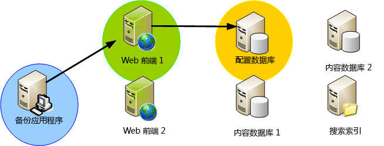
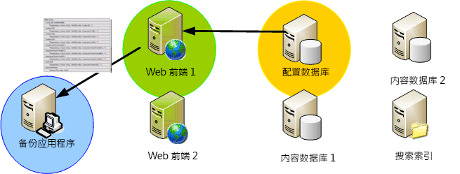
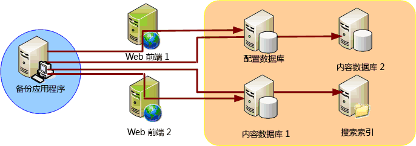

# SharePoint 2013 VSS 编写器
 **摘要：** 了解 Microsoft SharePoint 2013 的卷影复制服务 (VSS) 编写器的特点和功能。
Windows Server 包含的 VSS 是提供内置卷影复制功能的基础结构。VSS 创建的卷影副本扩展了存储管理员的磁带备份存档解决方案，提供可轻松、有效创建和还原的高保真时间点副本，从而帮助简化存储和数据管理的各个方面。Microsoft SharePoint Foundation 使用 VSS 来简化备份和还原操作。 
  
    
    

## 系统的特点

下面介绍了 SharePoint Foundation VSS 解决方案的功能和特点：
  
    
    

- **单个 VSS 引用编写器。**应用程序要向备份应用程序描述数据并非易事。为了成功地备份各种 Windows 平台应用程序，备份应用程序需为大量 API 编写特定代码。SharePoint Foundation VSS 编写器（以下称为"SPF-VSS 编写器"）使备份应用程序能够利用单个编写器来备份 SharePoint Foundation。
    
  
- **完整服务器场备份和灾难恢复。**SPF-VSS 编写器使备份应用程序（请求程序）能够访问 VSS API，以请求对整个 SharePoint Foundation 服务器场执行备份或还原操作，包括单盒安装或服务器场配置。（不包括 IIS 配置存储，该存储主要是  `applicationhost.config` 文件，必须单独备份和还原。）
    
  
- **数据库级别精确度**。SPF-VSS 编写器使请求程序能够选择所有数据库、部分数据库（多选）或单个数据库（单选）来执行备份和还原操作。所有数据库均可通过编写器进行选择，配置数据库和管理中心内容数据库除外。配置数据库和管理中心内容数据库只能作为整个服务器场的一部分进行备份和还原。（不包括 IIS 配置存储，它必须单独备份和还原）。
    
  
- **数据库的库存。**在备份之前，SPF-VSS 编写器将生成选择用于服务器场内备份的数据库的简单列表。该列表会返回到请求程序，以便在数据库实际所处的位置运行备份。 
    
  
- **服务器场支持。**编写器理解并提供支持，在某种程度上同步 SharePoint Foundation 服务器场的备份和恢复。编写器向请求程序提供服务器、数据库以及与服务器场相关的文件的列表。请求程序负责分别与每台服务器建立连接，调用该服务器上的 SPF-VSS 编写器以生成备份或运行还原操作。
    
  
- **不中断地备份内容。**如果应用程序在备份时修改了文件，文件可能会被破坏。VSS 会启用文件的快照以进行卷影复制，此时应用程序将不中断地继续在原位置运行。
    
  
- **第三方可插入数据库备份和恢复。**SPF-VSS 编写器为基于 SharePoint Foundation 而构建的第三方解决方案提供可插入/可扩展备份。但是，只有在配置数据库中注册的数据库才会包含在编写器中。不包含任何其他文件和未注册的数据库。
    
  
- **搜索索引文件备份和恢复。**搜索索引文件存储在文件系统中，因此需要使用单独的文件编写器来备份这些文件。为解决此问题，SharePoint Foundation 包含了一个单独的搜索编写器来处理搜索索引文件。为了简化备份应用程序编写器的过程，SharePoint Foundation 声明了跨编写器依赖关系，以便在备份服务器场中的注册数据库时同时也备份或还原搜索索引文件。 
    
  
- **完全回滚。**SPF-VSS 编写器处理 SharePoint Foundation 部署中的所有组件，包括配置数据库和内容数据库以及搜索数据库和索引。如前所述，该编写器还与搜索编写器存在依赖关系，后者处理用于备份和恢复的所有搜索索引文件。在恢复时，编写器可以通过还原之前的服务器场备份，回滚完整的 SharePoint Foundation 部署。（IIS 配置存储不包括在内，必须单独备份和还原）。
    
    > **注释**
      > 请参阅  [VSS 请求程序和 SharePoint 2013](vss-requestors-and-sharepoint-2013.md) 中的"还原"，获取有关还原的重要信息。
- **数据库还原后同步。**为了确保所有数据库在还原操作完成后均可与服务器场同步，每个数据库都会在恢复后自动断开然后重新连接到服务器场。管理员无需运行额外的步骤来重新同步还原的数据库。
    
  

> **重要信息**
> 如果您使用 SharePoint Foundation 服务器场中的 SQL 别名来连接到 SQL Server，则必须在场服务器上安装 SQL 客户端连接组件，以便使用 SPF-VSS 编写器进行备份/还原。这些组件包括用于配置管理的 SQL WMI 提供程序，SPF-VSS 编写器需要该提供程序来将 SQL 别名解析到正确的 SQL Server。无需安装任何管理工具，如 SQL Management Studio。您必须使用相同的安装源（如数据 DVD）来安装完整的 SQL Server 产品。（请勿使用单独的独立版客户端组件。该版本不包括 SQL WMI 提供程序。）选择进行自定义安装并仅选择要安装的客户端组件。 
  
    
    

## 由 SPF-VSS Writer 编写器执行的功能

SPF-VSS 编写器执行以下功能：
  
    
    

1. 构建 SharePoint Foundation 组件。
    
  - 生成 SharePoint Foundation 服务器场中所有组件的完整列表。
    
  
  - 与备份或还原过程没有必然联系。
    
  

  

  

  
2. 备份服务器场或数据库。
    
  - 通过 VSS 请求 SharePoint Foundation （服务器场/数据库）备份。
    
  

  

  

  
3. 还原服务器场或数据库。
    
  - 通过 VSS 请求 SharePoint Foundation （服务器场/数据库）恢复。
    
  
  - 实现 **postRestore()** 以同步站点表。
    
  

  

  

  

## 后续步骤

了解如何创建并使用适用于 SharePoint 2013 的 VSS 请求程序：
  
    
    

-  [VSS 请求程序和 SharePoint 2013](vss-requestors-and-sharepoint-2013.md)
    
  

## 其他资源

-  [SharePoint 2013 和卷影复制服务概述](overview-of-sharepoint-2013-and-the-volume-shadow-copy-service.md)
    
  

