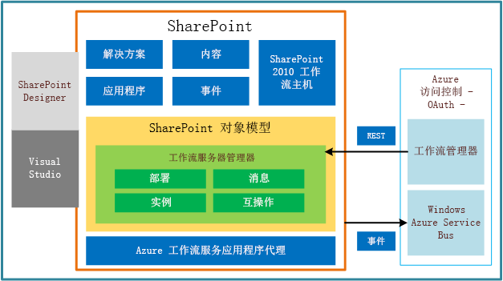

# SharePoint 2013 工作流基础
提供了 SharePoint 2013 中的工作流基础结构的高级概述，包括平台体系结构和工作流互操作性桥的视图。
## SharePoint 2013 中的工作流的概述

SharePoint 2013 工作流由 Windows Workflow Foundation 4 提供支持，它实际上是基于早期版本重新设计的版本。反过来说，Windows Workflow Foundation (WF) 是基于由  [Windows Communication Foundation (WCF)](http://msdn.microsoft.com/zh-CN/library/vstudio/ms735119%28v=vs.90%29.aspx) 提供的消息功能构建的。
  
    
    
从概念上说，工作流模型构成了业务流程。因此，Windows Workflow Foundation 4 工作流是工作流"活动"的结构化集合，其中每个工作流活动均表示业务流程的一个功能性组件。
  
    
    
SharePoint 2013 中的工作流平台使用 Windows Workflow Foundation 4 活动模型表示基于 SharePoint 的业务流程。此外，SharePoint 2013 引入了一个在其中创建工作流的更高级的阶段-关卡流程模型。
  
    
    
记下工作流 活动 与 SharePoint操作 之间的关系很重要。工作流活动表示其方法将推动工作流行为的基础托管对象。另一方面，工作流操作是一些包装，可封装基础活动并在 SharePoint Designer 中的用户友好表单中呈现它们。工作流作者与工作流操作进行交互，而工作流执行引擎将执行相应的活动。
  
    
    
作为活动类的实现的活动将通过使用 XAML 以声明方式实现。
  
    
    
使用松散耦合的 Web 服务调用工作流活动，这些服务将使用消息 API 与 SharePoint 进行通信。这些 API 是基于由  [Windows Communication Foundation (WCF)](http://msdn.microsoft.com/zh-CN/library/vstudio/ms735119%28v=vs.90%29.aspx) 提供的消息功能构建的。
  
    
    
消息框架非常灵活且支持您需要的几乎所有消息模式。请注意，在 SharePoint 2013 场中，Windows Workflow Foundation 和 WCF 承载于 Workflow Manager Client 1.0 中。
  
    
    
Workflow Manager Client 1.0、SharePoint 2013 和 SharePoint Designer 2013 均提供了新的基础结构的重要部分：
  
    
    

- **Workflow Manager Client 1.0** 提供了工作流定义的管理。它还承载了工作流实例的执行过程。
    
  
- **SharePoint 2013** 提供了针对 SharePoint 工作流的框架，该框架将为涉及 SharePoint 文档、列表、用户和任务的基于 SharePoint 的业务流程建模。此外，将在 SharePoint 2013 中存储和管理 SharePoint 工作流、关联、活动和其他工作流元数据。
    
  
- **SharePoint Designer 2013** 是用于创建并发布工作流定义的主业务用户工具，与早期版本一样。它还可用于打包带有或不带有关联的 SharePoint 组件的工作流定义。
    
  

## 平台体系结构

图 1 描述了 SharePoint 2013 工作流框架的高级视图。首先，请注意新的工作流基础结构如何将 Workflow Manager Client 1.0 作为新的工作流执行主机引入。然而，在 SharePoint 自身承载的早期版本的工作流执行中，此情况已在 SharePoint 2013 中发生改变。Workflow Manager Client 1.0 位于 SharePoint 外部并使用常见协议通过 Microsoft Azure 服务总线（由 OAuth 进行协调）进行通信。另外，SharePoint 包含您期望看到的功能：内容项、事件、应用程序等。但请注意，还会实现 SharePoint 2010 工作流主机（即 Windows Workflow Foundation 3 引擎）以实现向后兼容。可以在 [使用 SharePoint 2013 的工作流互操作](use-workflow-interop-for-sharepoint-2013.md)中了解有关这一点的更多信息。
  
    
    

**图 1. 工作流基础结构的高级体系结构**

  
    
    

  
    
    

  
    
    
Workflow Manager Client 1.0在 SharePoint 2013 中以 Workflow Manager Client 1.0服务应用程序代理的形式表示。此组件允许 SharePoint 与 Workflow Manager Client 1.0服务器进行通信和交互。同使用 OAuth 提供服务器间的身份验证。
  
    
    
为其侦听工作流的 SharePoint 事件（如 **itemCreated**、 **itemUpdated** 等）将通过使用 Microsoft Azure 服务总线传送到 Workflow Manager Client 1.0。对于回程，平台将使用 SharePoint 代表性状态传输 (REST) API 回调到 SharePoint。
  
    
    
此外，还为 SharePoint 工作流对象模型增加了功能，这些功能统称为"工作流服务管理器"，可使用该管理器管理和控制工作流及其执行。服务管理器的交互的主区域为部署、消息传送、实例控件和（用于向后兼容）与 SharePoint 2010 工作流的互操作性。
  
    
    
最后，提供了一个工作流创作组件。SharePoint Designer 现在可以创建和部署 SharePoint 2010 和 SharePoint 2013 工作流。Visual Studio 2008 不仅可以提供用于创建声明性工作流的设计器图面，还可以创建与 Workflow Manager Client 1.0 功能完全集成的 SharePoint 外接程序 和解决方案。
  
    
    

## 工作流订阅和关联

由于对 SharePoint 2013 工作流所做的最明显的更改是，将工作流处理移至诸如 Microsoft Azure 这样的外部工作流主机上，这对于将 SharePoint 消息和事件连接到 Microsoft Azure 中的工作流基础结构是至关重要的。此外，将基础结构连接到客户数据对于 Microsoft Azure 也是非常重要的。工作流关联（基于订阅的 WF 概念构建）是支持这些要求的 SharePoint 基础结构部分。
  
    
    

### Microsoft Azure 发布/订阅服务

您必须先查看 Microsoft Azure 发布/订阅服务（该服务有时称作"pub/sub"或简称为"PubSub"，然后才能讨论工作流关联和订阅。PubSub 是一个异步消息框架。消息发送者（发布者）不会直接将消息发送给消息接收者（订阅者）。相反，发布者会将消息呈现为不知道消息订阅者的类。随后，订阅者通过根据其已创建的订阅标识感兴趣的消息来使用已发布的消息，而不管发布者的身份如何。
  
    
    
通过将消息创建与消息使用分离可以实现可伸缩性和灵活性。它支持发布者端的多播消息，以及订阅者端的混杂消息使用。
  
    
    

> **注释**
> PubSub 功能是 Microsoft Azure 服务总线的一部分，它为 WCF 和其他服务终结点提供了连接选项。这包括 REST 终结点，可将其定位到网络地址转换 (NAT) 边界后面或绑定到经常变化的、动态分配的 IP 地址，或二者。有关 Azure 服务总线的详细信息，请参阅 [服务总线](http://msdn.microsoft.com/zh-cn/library/ee732537.aspx)。 
  
    
    

### 工作流关联和关联范围

工作流关联使用特定的默认值将工作流定义绑定到特定的 SharePoint 范围。关联本身表示一组存储在 Azure 发布/订阅服务中的订阅规则，这些规则将处理传入消息以确保它们由适当的（即订阅的）工作流实例使用。
  
    
    
默认情况下，消息基础结构支持以下范围的工作流：
  
    
    

-  [SPList](https://msdn.microsoft.com/library/Microsoft.SharePoint.SPList.aspx) （针对列表工作流）
    
  
-  [SPWeb](https://msdn.microsoft.com/library/Microsoft.SharePoint.SPWeb.aspx) （针对网站工作流）
    
  
与早期版本不同，SharePoint 2013 不支持范围限定为某个内容类型 ( [SPContentType](https://msdn.microsoft.com/library/Microsoft.SharePoint.SPContentType.aspx) ) 的工作流。但由于消息基础结构是可扩展的，因此，它可以支持任意范围。作为一名开发人员，您可以将给定 [WorkflowSubscription](https://msdn.microsoft.com/library/Microsoft.SharePoint.WorkflowServices.WorkflowSubscription.aspx) 实例的 [EventSourceId](https://msdn.microsoft.com/library/Microsoft.SharePoint.WorkflowServices.WorkflowSubscription.EventSourceId.aspx) 属性设置为任何 **guid**。随后，您可以使用该 **EventSourceId** 值调用 **PublishEvent(Guid, String, IDictionary<String, Object>)**，这将触发指定的 **WorkflowSubscription** 的新工作流实例。
  
    
    

### Microsoft Azure 中的工作流服务

SharePoint 工作流的关联由其在 Microsoft Azure 中的工作流服务表示。当一个应用程序必须获取工作流关联及其数据时，它必须先对给定范围内可用的所有工作流服务进行查询。
  
    
    
同样地，工作流实例会将指针返回其各自的工作流服务。这就是确定其正确的关联的方式。
  
    
    

### 启动工作流

可以手动或自动启动工作流。
  
    
    
 **手动工作流**
  
    
    
当 PubSub 服务接收 **StartWorkflow** 消息时，将手动启动工作流。该消息包含以下说明性信息：
  
    
    

- 关联标识符（即 **WorkflowSubscription** 实例）。
    
  
- 原始项上下文的 ID。它将与 **PublishEvent** 方法调用的 _ItemId_ 参数和 **EventSource** 属性一起传入。
    
  
- 手动启动的事件类型 ( **WorkflowStart**)。
    
  
- 来自订阅或 **Init** 表单（如果适当）的附加工作流初始参数。这将是 **CorrelationId**（对于订阅）和 **WFInstanceId**（对于 **Init** 表单）。
    
  
 **自动启动工作流**
  
    
    
通过对 PubSub 服务使用 **Add** 消息启动自动启动工作流。该消息包含以下说明性信息：
  
    
    

- 原始项上下文的 ID。
    
  
- 此事件本身是一个常规 SharePoint **Add** 事件。
    
  
- 工作流初始参数。
    
  

> **注释**
> 如果工作流自动对一个可重复事件（例如， **OnItemChanged** 事件）启动，则该事件不能启动给定关联的另一个工作流，直至已完成运行关联的工作流的现有运行实例。
  
    
    

### 工作流订阅

订阅是对关联的自然补充，它允许工作流与关联进行交互。工作流必须使用 **create** 方法和 **delete** 方法在 Azure 服务总线上创建订阅。
  
    
    
创建订阅并实例化工作流的方法的签名指定了可选和必需参数。由于参数列表是由工作流作者确定的，因此它们在一个工作流定义与另一个工作流定义之间可能是不同的。订阅参数的列表将指定为工作流定义的元数据。在创建订阅时将提供订阅参数。初始参数的列表在 XAML 中指定为工作流定义的一部分。在实例化工作流时将提供初始参数。
  
    
    
订阅将绑定到特定的 SharePoint 对象 - **SPList** 实例或 **SPWeb** 实例。在创建订阅时，订阅对象类型将作为必需参数的值传入。对象类型定义了订阅范围，这样一来，订阅只能响应在它们订阅到的对象上发生的事件。
  
    
    

## SharePoint 工作流互操作性

利用 SharePoint 工作流互操作性，可从 SharePoint 2013 工作流（基于 Windows Workflow Foundation 4）中调用 SharePoint 2010 工作流（基于 Windows Workflow Foundation 3 构建）。从而实现在 2013 工作流内执行 2010 工作流。
  
    
    
这一点非常重要，因为您可能会将您要使用的 SharePoint 2010 与 SharePoint 2013 工作流一起重复使用。此外，您可能希望使用 SharePoint 2010 中的活动或功能，而 SharePoint 2013 中尚未实施这些活动或功能。
  
    
    
有关 SharePoint 工作流互操作性的详细讨论，请参阅 [使用 SharePoint 2013 的工作流互操作](use-workflow-interop-for-sharepoint-2013.md)。
  
    
    

## 其他资源

-  [SharePoint 2013 中的工作流入门](get-started-with-workflows-in-sharepoint-2013.md)
    
  
-  [SharePoint 2013 的工作流操作和活动引用](workflow-actions-and-activities-reference-for-sharepoint-2013.md)
    
  
-  [使用 Visual Studio 开发 SharePoint 2013 工作流](develop-sharepoint-2013-workflows-using-visual-studio.md)
    
  
-  [SharePoint Designer 和 Visio 中的工作流开发](workflow-development-in-sharepoint-designer-and-visio.md)
    
  
-  [SharePoint 2013 中的工作流](workflows-in-sharepoint-2013.md)
    
  
-  [使用 SharePoint 2013 的工作流互操作](use-workflow-interop-for-sharepoint-2013.md)
    
  

