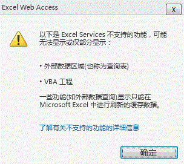
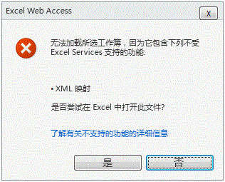

# 受支持和不受支持的功能

  
    
    

Microsoft Excel 的功能非常丰富。在每次发布中，Excel 和 Excel Services 之间的功能差距越来越小，不受支持的功能数量减少。但在 Microsoft SharePoint Server 2010 中，无法支持 Excel Services 第二版中的所有 Excel 功能。
决定要支持的功能时，应优先考虑在关键 Excel Services 方案中需要的功能，并确保 Excel Services 是一种满足客户的可靠性、可伸缩性和安全性预期的服务器级别服务。
  
    
    

> **注释**
> 本主题假定您熟悉 Microsoft Office SharePoint Server 2007 中受支持和不受支持的功能。您可以在  [Excel Services 中不支持的功能](http://msdn.microsoft.com/zh-cn/library/ms496823.aspx)中查看有关 Office SharePoint Server 2007 中不受支持的功能的详细信息。 
  
    
    

## 支持新的 Excel 功能

Microsoft Excel 2010 中的大部分新功能可以某种方式在 Excel Services 中运行。有些功能的显示方式与在 Excel 中一样。其他功能可以显示，并且也是交互式的。
  
    
    
 **下面是可以查看的新功能：**
  
    
    

- 迷你图
    
  
-  [图标集](http://blogs.msdn.com/excel/archive/2009/08/05/icon-set-improvements-in-excel-2010.aspx)和 [数据栏的改进](http://blogs.msdn.com/excel/archive/2009/08/07/data-bar-improvements-in-excel-2010.aspx)
    
  
-  [数据透视表命名集](http://blogs.msdn.com/excel/archive/2009/10/05/pivottable-named-sets-in-excel-2010.aspx)
    
  
-  [数据透视表的改进](http://blogs.msdn.com/excel/archive/2009/10/15/a-few-more-pivottable-improvements-in-excel-2010.aspx)
    
  
 **下面是可以查看并与其交互的新功能：**
  
    
    

- 切片器
    
  
- 数据透视表文件
    
  
同样支持 Excel 中的新函数。嵌入式图像一直是 Excel 的一项重要功能，现在 Excel Services 中受支持并可查看。
  
    
    

## 之前阻止 Excel 文件加载的功能

在 Office SharePoint Server 2007 中，包含不受支持的功能（如 VBA 宏、表单控件等）的 Excel 工作簿不会加载到 Excel Services 中。
  
    
    
在 SharePoint Server 2010 中，为帮助用户应对此限制，Excel Services 将忽略某些不受支持的功能。换句话说，Excel Services 不会阻止整个文件的加载，它会加载文件，但您看不到 Excel Services 不支持的功能。
  
    
    
下面是不阻止 Excel Services 加载文件的功能：
  
    
    

- 单元格注释。
    
  
- 对外部工作簿的公式引用。
    
  
- 查询表（也称为外部数据范围）。
    
  
- Microsoft Visual Basic for Applications (VBA)。
    
  
- 任何 OfficeArt 技术。例如，形状、艺术字、SmartArt、组织结构图、图表、签名行、墨迹注释，等等。
    
  
请注意，这些功能仍然不受支持。这意味着它们不会以与在客户端上一样的任何方式呈现、执行或工作。列表中的大部分功能都不会呈现在 Excel Services 中。例如，如果在客户端中查看时，单元格 A1 附近存在形状，则在服务器上查看时看不到形状。公式引用和查询表等其他功能显示上次在客户端上刷新的值。换句话说，单元格中的值仍然存在，但不能对它们进行更新。
  
    
    
最后，VBA 代码不在服务器上执行。在 Office SharePoint Server 2007 中，Excel Services 不支持加载 *.xlsm 文件。在 SharePoint Server 2010 中，Excel Services 将忽略 VBA 宏。因此，*.xlsm 文件现在可以加载到 Excel Services 中。
  
    
    

## 查看包含被忽略功能的文件

如果 Excel Services 可以加载文件但无法呈现某些不受支持的功能，您如何知道您查看的文件是否缺少某些功能？您知道您查看的文件中缺少某些功能，因为 Excel Services 在工作表上方显示通知，向您发出警报。以下屏幕截图显示通知。
  
    
    

**工作簿顶部"不受支持的功能"通知**

  
    
    
此通知是文件以与在 Excel 客户端中不同的方式呈现文件的第一次提示。
  
    
    
在下图中，单击"了解有关不受支持的功能的详细信息"将提供有关文件中不受支持的功能的信息。
  
    
    

**VBA 的功能不受支持的错误消息**

  
    
    

  
    
    

  
    
    
不显示裁剪的图像（即缺少的功能）。
  
    
    

    
> **注释**
> 对于包含忽略或缺少的不受支持的功能（这些功能使用通知栏加载在查看模式中），尝试保存工作簿副本时需删除不受支持的功能。此时将显示一个对话框提醒用户。 
  
    
    

## 其他不受支持的功能

所有其他不受支持的功能仍像在适用于 Excel Services 的 Office SharePoint Server 2007 中一样运行。即，如果 Excel Services 检测到存在一个或多个不受支持的功能，将阻止加载文件。用户将收到文件无法加载的通知，如以下屏幕截图中所示。
  
    
    

> **注释**
>  [Excel Services 中不支持的功能](http://msdn.microsoft.com/zh-cn/library/ms496823.aspx)主题包含有关这些不受支持的功能的更多详细信息。 
  
    
    

> **警告**
> 如果从 Web 部件加载文件，则不会显示信息栏以及不受支持的功能列表。 
  
    
    

**XML 地图的功能不受支持的错误消息**

  
    
    

  
    
    

  
    
    
与带有外部链接的工作簿不同，带有外部链接的图表会被阻止加载。
  
    
    

## 另请参阅

#### 概念

  
    
    
 [Excel Services 概述](excel-services-overview.md)
  
    
    
 [Excel Services 体系结构](excel-services-architecture.md)
  
    
    
 [Excel Services 博客、论坛和资源](excel-services-blogs-forums-and-resources.md)
#### 其他资源

  
    
    
 [演练：使用 Excel Web Services 开发自定义应用程序](walkthrough-developing-a-custom-application-using-excel-web-services.md)
