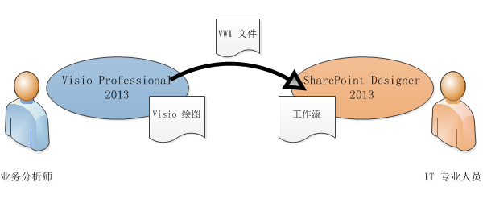
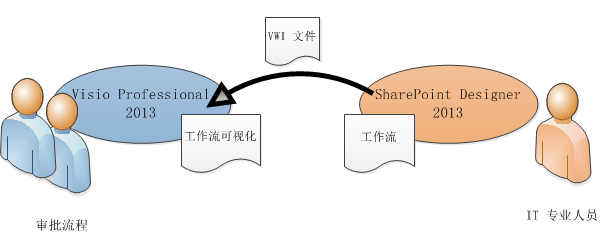
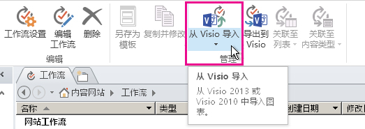
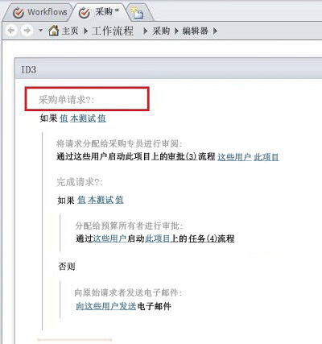

# 在 SharePoint Designer 2013 和 Visio Professional 2013 之间转换工作流（SharePoint 2010 工作流平台）
使用 SharePoint Designer 可从 Visio 导入工作流，或将工作流导出到 Visio。
## 在 SharePoint Designer 2013 和 Visio Professional 2013 之间传输工作流

已经熟悉使用 Visio 制作流程图的业务分析师和流程分析师可以使用 Visio 设计 SharePoint 工作流。Visio 中的工作流用于表示业务逻辑。在设计完业务逻辑后，可将工作流导出到 SharePoint Designer。在将工作流导入 SharePoint Designer 后，IT 专业人员可以将其写入 SharePoint 网站。
  
    
    

  
    
    

  
    
    
在 Microsoft SharePoint Designer 2013 中，可以导入在 Microsoft Visio Professional 2013 中创建的工作流，或将工作流导出到 Visio 以便查看。 
  
    
    
本文介绍使用 SharePoint Designer 2013 中的 SharePoint 2010 工作流平台传输工作流。
  
    
    
创建工作流时选择 SharePoint 2010 工作流平台：
  
    
    

  
    
    

1. 在"导航"窗格中，单击"工作流"。
    
  
2. 在"工作流"选项卡上的"新建"部分，单击"列表工作流"、"可重用工作流"或"网站工作流"。
    
  
3. 在"创建工作流"对话框的"平台类型"框中，单击"SharePoint 2010 工作流"。
    
  
您可以使用两种方式在 SharePoint Designer 中可视化工作流：
  
    
    

- 如果 Visio Services 安装在运行 SharePoint 2013 的服务器上，则可在工作流状态页上创建工作流可视化，用于显示进度和工作分配。
    
  
- 您可以将工作流导出到 Visio，以便创建可用于反馈和审批的工作流绘图。
    
  

  
    
    

  
    
    

  
    
    

  
    
    

## 从 Visio 导入工作流

若要导入 SharePoint 工作流，请执行下列操作：
  
    
    

1. 在 SharePoint Designer 2013 中的"导航"窗格中，单击"工作流"。
    
  
2. 在"工作流"选项卡的"管理"组中，单击"从 Visio 导入"。
    

  

  

  
3. 在"从 Visio 绘图导入工作流"对话框中，浏览到要使用的 Visio 工作流交换 (.vwi) 文件，并选择它，然后单击"下一步"。
    
  
4. 为此工作流键入名称，然后选择您希望导入此工作流后使用的工作流类型。选项包括：
    
  - **列表工作流** 附加到特定列表的工作流。如果选择此选项，则必须选择在其中附加工作流的列表。
    
  
  - **可重用工作流** 附加到内容类型，因此便携的工作流。SharePoint 网站上的不同列表均可使用它。如果选择此选项，则必须选择工作流运行使用的内容类型。
    
  
5. 单击"完成"。
    
  
导入的工作流显示在 SharePoint Designer 全屏工作流编辑器中。Visio 自定义形状中的所有文本已作为活动标签（下图中的灰色文本）导入 SharePoint Designer，用以明确说明工作流的含义：
  
    
    

  
    
    

  
    
    
在工作流导入 SharePoint Designer 后，它是可编辑的，并可以进行修改，以便添加必需条件、操作、步骤和设置。 
  
    
    

## 将工作流导出到 Visio

在 SharePoint Designer 2013 中创建或编辑工作流后，可以将此工作流导出为可在 Visio Professional 2013 中打开的 Visio 绘图。在 SharePoint Designer 中编辑工作流后可以将其导出回 Visio 的功能（也称作"来回转换"）能够增强业务用户和工作流设计器之间的协作。在以此方式循环访问工作流设计时，可以使用 Visio 定义业务要求，然后通过来回转换调整并审批更改。
  
    
    

> **注释**
> Visio Professional 2013 不支持这些步骤。在 Visio 中查看工作流后，将其重新导入 SharePoint Designer 时，在 SharePoint Designer 中已添加的步骤信息可能会丢失。 
  
    
    

若要导出工作流，请执行下列操作：
  
    
    

1. 在 SharePoint Designer 2013 的"导航"窗格中，单击"工作流"。
    
  
2. 在"工作流"选项卡的"管理"组中，单击"导出到 Visio"。
    
  
3. 在"导出 Visio 绘图的工作流"对话框中，命名该文件，选择一个位置，然后单击"保存"。导出的文件即另存为 .vwi 文件，可以直接在 Visio Professional 2013 中打开。
    
  

## 其他资源

-  [SharePoint 2013 工作流的新增功能](what-s-new-in-workflows-for-sharepoint-2013.md)
    
  
-  [SharePoint 2013 中的工作流入门](get-started-with-workflows-in-sharepoint-2013.md)
    
  
-  [SharePoint Designer 和 Visio 中的工作流开发](workflow-development-in-sharepoint-designer-and-visio.md)
    
  

  
    
    

