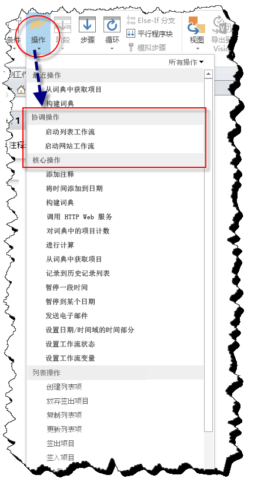
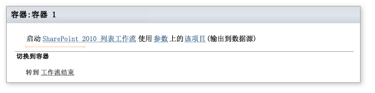
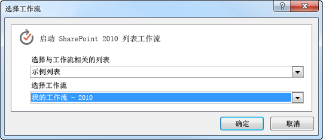
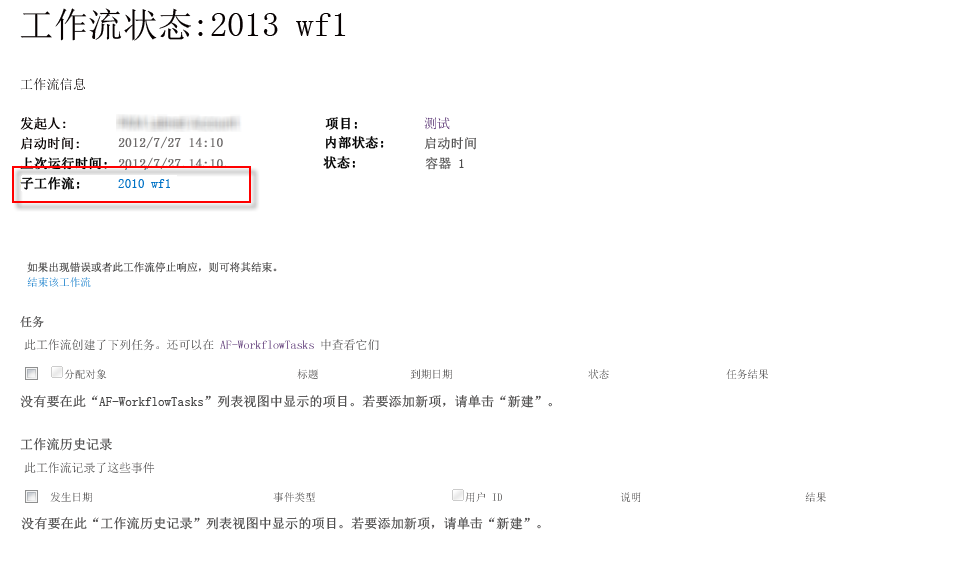

# 了解 SharePoint Designer 2013 中的协调操作
SharePoint Designer 2013 中的协调操作 被设计用来从"SharePoint 2013 工作流"平台上生成的工作流内启动"SharePoint 2010 工作流"平台上生成的工作流。
||
|:-----|
||
   

## SharePoint Designer 2013 中的"协调操作"

有两种"协调操作"可用于 SharePoint Designer 2013 中。两种操作都只可用于"SharePoint 2013 工作流"平台，它们是：
  
    
    

- 启动"列表工作流"：启动为特定列表开发的工作流。
    
  
- 启动"网站工作流"：启动为特定网站开发的工作流。
    
  
当您基于"SharePoint 2013 工作流"平台生成工作流时，"协调操作"将出现在"操作"下拉菜单中（如图所示）。
  
    
    

**图：SharePoint Designer 中的"协调操作"**

  
    
    

  
    
    

  
    
    
两种操作都被设计用来从"SharePoint 2013 工作流"平台上生成的工作流中启动"SharePoint 2010 工作流"平台上生成的工作流。
  
    
    

    
> **重要信息**
> 协调操作只支持从基于"SharePoint 2013 工作流"平台的工作流中启动基于"SharePoint 2010 工作流"平台的工作流。不支持从"SharePoint 2013 工作流"平台上生成的工作流内启动相同平台上生成的工作流。 
  
    
    

## "使用协调操作"

在"SharePoint 2013 工作流"平台中，有很多被否决了的操作。若要调节旧工作流，您可以使用"协调操作"。该操作可用于启动使用"SharePoint 2010 工作流"平台生成的"列表工作流"或"网站工作流"。
  
    
    
一个"协调操作"包括三个可编辑区域（如图所示）。
  
    
    

**图：启动"列表工作流"协调操作**

  
    
    

  
    
    

  
    
    
这三个可编辑区域为： 
  
    
    

- **SharePoint 2010 列表工作流** 选择要启动的 2010 工作流。
    
  
- **参数** 要发送到 2010 工作流的参数。
    
  
- **此项** 应在 2010 工作流上运行的项。
    
  
单击一个可编辑链接以输入信息。例如，若要选择启动 2010 工作流，则单击链接 **"SharePoint 2010 列表工作流"**。将出现一个可用于选择该工作流的对话框（如图所示）。
  
    
    

**图：基于 2010 平台选择工作流**

  
    
    

  
    
    

  
    
    

  
    
    

  
    
    

  
    
    
在"子工作流"区中工作流状态页上列出来自 SharePoint 2013 工作流内的已协调的"SharePoint 2010 工作流"平台的工作流示例（如图所示）。
  
    
    

**图：该工作流状态页列出了子工作流**

  
    
    

  
    
    

  
    
    

  
    
    

  
    
    

## 其他资源

-  [What's new in workflow in SharePoint Server 2013](http://msdn.microsoft.com/library/6ab8a28b-fa2f-4530-8b55-a7f663bf15ea.aspx)
    
  
-  [Getting started with SharePoint Server 2013 workflow](http://msdn.microsoft.com/library/cc73be76-a329-449f-90ab-86822b1c2ee8.aspx)
    
  
-  [了解 SharePoint Designer 2013 中的词典操作](understanding-dictionary-actions-in-sharepoint-designer-2013.md)
    
  

  
    
    

