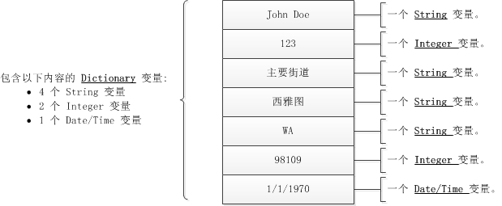
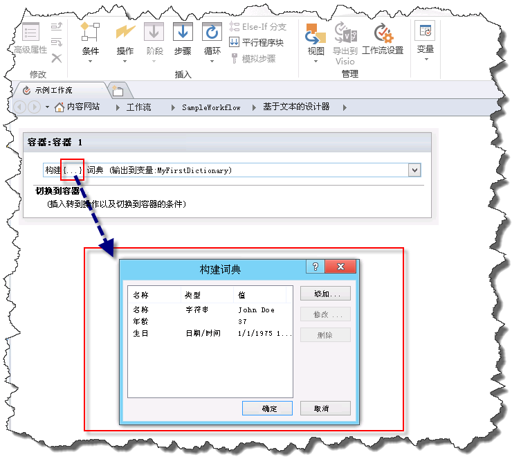
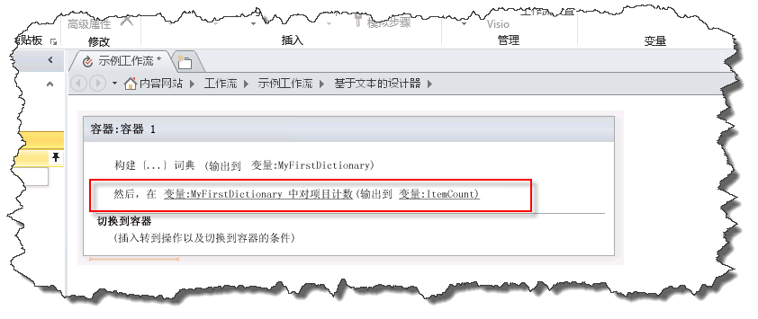
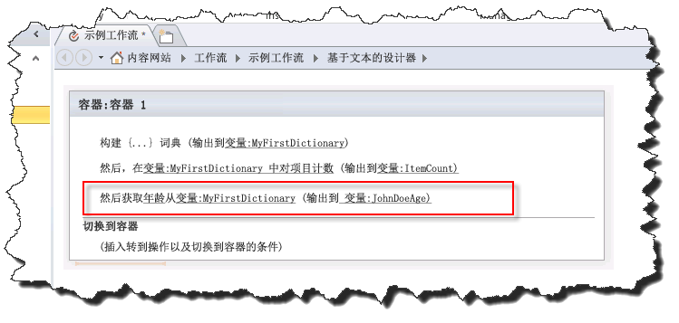

# 了解 SharePoint Designer 2013 中的词典操作
字典变量类型是 SharePoint 2013 工作流平台中可与 SharePoint Designer 2013 一起使用的新变量。 
||
|:-----|
||
   

## 了解字典变量类型

工作流时执行所需结果的一些列操作。生成工作流时，经常需要在变量（存储容器）中保存将在工作流的其他部分使用的值。
  
    
    
创建变量时，您将需要告诉工作流引擎变量中将包含的数据的类型。例如，您可能想要在变量中保存员工的姓名。员工的姓名是一串字符，因此将创建 **String** 类型的变量。然后，工作流可在变量中存储员工的姓名，如"John Doe"。
  
    
    

**图：字符串变量**

  
    
    

  
    
    

  
    
    
SharePoint Designer 2013 具有名为"字典"的新变量类型。"字典"变量类型是专用于保留其他变量的集合的容器。例如，您的工作流可能需要不只是存储员工的姓名。还可能需要存储其地址和生日，如果未使用"字典"变量，则将必须创建多个单独的变量。这可能很快变得在工作流的逻辑中难以组织和难以使用。利用"字典"变量，可以在单个变量中存储多个数据点。
  
    
    
下图说明了该概念。
  
    
    

**图：字母变量**

  
    
    

  
    
    

  
    
    

  
    
    

  
    
    

## 使用字典变量类型的工作流操作

工作流包含在处理工作流时执行的多个操作。SharePoint Designer 2013 包含许多不同的操作、例如，存在发送电子邮件消息、创建列表项和将消息记录到工作流历史记录的操作。
  
    
    
以下是专为"字典" 变量类型设计的三种操作。 
  
    
    

- "生成字典"
    
  
- "对字典中的项计数"
    
  
- "从字典中获取项"
    
  
对于 字典 变量类型的工作流操作，可在"操作"下拉列表中找到，如图所示。
  
    
    

**图：字典操作**

  
    
    

  
    
    

  
    
    

### 使用"生成字典"操作创建变量

使用"生成字典"操作创建"字典"类型的变量。输入字典的内容，然后，在变量列表中指定字典的名称。
  
    
    
下图显示"生成字典"对话框。请注意，三个变量已添加到字典：字符串、整数和日期/时间。
  
    
    

**图："生成字典"对话框**

  
    
    

  
    
    

  
    
    
"字典"可包含 SharePoint 2013 工作流平台中提供的任何类型的变量。下面的列表定义可用的变量：
  
    
    

- "布尔值"：Yes 或 No 值
    
  
- "日期/时间"日期和时间
    
  
- "字典"：变量的集合
    
  
- "Guid"：全局唯一标识符 (GUID)
    
  
- "整数"：无小数的整数
    
  
- "数字"：可包含小数的数字
    
  
- "字符串"：一串字符
    
  

    
> **重要信息**
> "字典"变量类型在您使用"调用 HTTP Web 服务"操作时非常重要。 
  
    
    

    
> **警告**
> 仅在您设置字典中的值时才支持将"名称"字段用作查找。在您创建字典时不支持将"名称"字段用作查找。 
  
    
    

    
> **注释**
> "字典"变量可包含"字典"类型的变量。在"字典"内存储"字典"变量的能力提供多种优势。例如，可创建"字典"以存储有关员工的信息。在"字典"内，可为每位员工创建另一个"字典"条目。生成工作流时，可使用"字典"变量，而不用不断为有关员工的每条信息创建单独的新变量。如此示例所示，"字典"可用于组织工作流内的复杂信息。 
  
    
    

### 使用"对字典中的项计数"操作对变量计数和存储变量

使用"对字典中的项计数"操作对"字典"中包含的变量计数，然后在整数变量中存储该数目。然后，可使用该项计数循环访问"字典"。
  
    
    
下图显示"对字典中的项计数"工作流操作。 
  
    
    

**图：对字典中的项计数**

  
    
    

  
    
    

  
    
    

  
    
    

  
    
    

### 使用"从字典中获取项" 操作检索变量

使用"从字典中获取项" 操作检索"字典"中存储的变量，并将其置于变量中。这在您需要存储在单独的变量中的字典中的变量时非常有用。可通过输入变量的名称来检索值。
  
    
    
下图显示"从字典中获取项" 工作流操作。请注意，"年龄"是"字典"中的变量的名称，并且使新"整数"变量的输出。
  
    
    

**图：从字典中获取项"**

  
    
    

  
    
    

  
    
    

  
    
    

  
    
    

## 其他资源

-  [SharePoint 2013 中的工作流](http://technet.microsoft.com/zh-cn/sharepoint/jj556245.aspx)
    
  
-  [What's new in workflow in SharePoint Server 2013](http://msdn.microsoft.com/library/6ab8a28b-fa2f-4530-8b55-a7f663bf15ea.aspx)
    
  
-  [Getting started with SharePoint Server 2013 workflow](http://msdn.microsoft.com/library/cc73be76-a329-449f-90ab-86822b1c2ee8.aspx)
    
  

  
    
    

