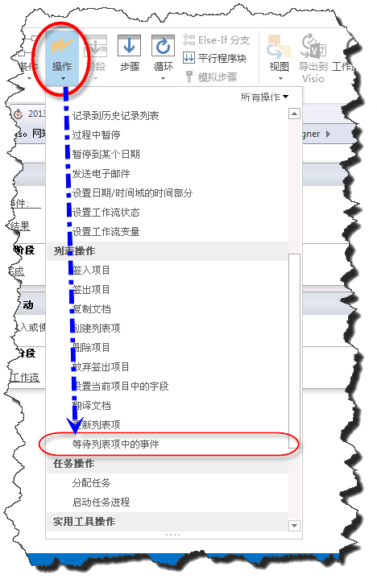
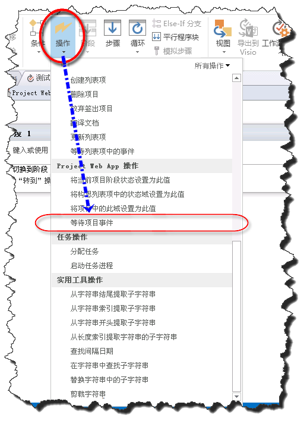
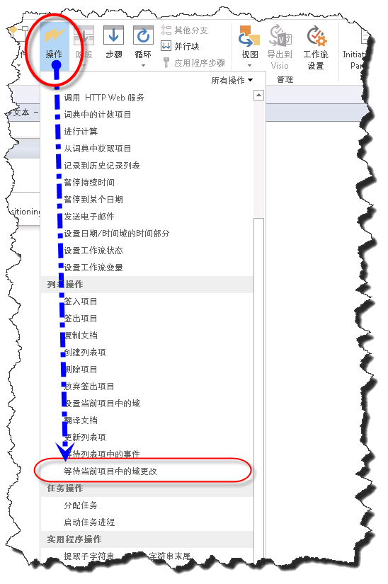
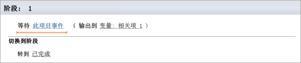
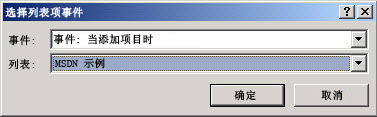
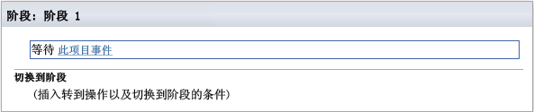
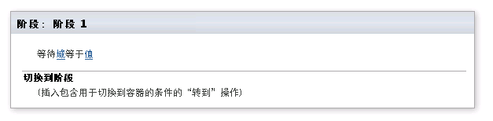

# 了解 SharePoint Designer 2013 中的事件操作
学习使用 SharePoint Designer 2013 中的事件操作。
## SharePoint Designer 2013 中的事件操作概述

SharePoint 工作流可以进行订阅，以便在添加或更改某项时收到通知。添加某项或更改某项时，称为事件。工作流可等待这些事件发生后再继续工作流。SharePoint Designer 2013 中的事件操作有：
  
    
    

- **等待列表项中的事件：**用于等待创建新项或对项进行更改。
    
  
- **等待项目事件：**用于等待项目完成签入、确认或提交。
    
  
- **等待当前项目中的域更改：**用于等待域在当前项目中更改。
    
  
可在 SharePoint Designer 2013 功能区的"操作"下拉菜单中访问事件操作，如图所示。
  
    
    

> **注释**
> 仅在使用 Project Web App 网站时"Project Web App 操作"才可用。 
  
    
    

**SharePoint Designer 2013 中的事件操作**

  
    
    

  
    
    

  
    
    

**SharePoint Designer 2013 中的 Project Web App 事件操作**

  
    
    

  
    
    

  
    
    

**在 SharePoint Designer 2013 中等待当前项目中的域更改事件**

  
    
    

  
    
    

  
    
    

  
    
    

  
    
    

## 使用 SharePoint 2013 中的事件操作

工作流安排业务流程。在业务流程中，等待 SharePoint 列表中的项目完成添加或更新往往非常重要。使用事件操作，您可以等待一个事件发生，然后再执行工作流操作。
  
    
    
事件操作位于 SharePoint Designer 2013 功能区的"操作"下拉菜单上。您可以向工作流添加操作并针对您的特殊环境自定义该操作。
  
    
    

### 等待列表项中的事件

"等待列表项中的事件"操作包含两个可编辑区域，如图所示。
  
    
    

**等待列表项中的事件**

  
    
    

  
    
    

  
    
    

  
    
    

  
    
    
这两个可编辑区域是：
  
    
    

- **此项目事件：** 将被监视的列表和事件。
    
  
- **输出变量：** 用于保存事件源自其的项的 GUID 的变量。项具有 ID 和 GUID 两个字段。每个列表的 ID 是唯一的，GUID 是全局唯一的。例如，列表中第一项的 ID 为 1，第二项的 ID 为 2。GUID 是全局唯一的，其格式为 128 位值，由 8 位十六进制数组成，每位数后跟三组 4 位十六进制数，再跟一组 12 位十六进制数。GUID 的示例为：6B29FC40-CA47-1067-B31D-00DD010662DA。"等待列表项中的事件"操作将检索 GUID。
    
  
单击"此项目事件"链接将打开"选择列表项事件"对话框，如图所示。
  
    
    

**"选择列表项事件"对话框**

  
    
    

  
    
    

  
    
    

  
    
    

  
    
    
"事件"下拉列表对应于事件的类型。这些选项用于等待完成向列表添加项或等待对列表中的项进行更改。"列表"下拉菜单对应于将被监视的列表。
  
    
    

### 等待项目事件

"等待项目事件"操作包含一个可编辑区域，如图所示。
  
    
    

**等待项目事件**

  
    
    

  
    
    

  
    
    

  
    
    

  
    
    
该可编辑区域是：
  
    
    

- **此项目事件：** 工作流应当等待的项目事件。
    
  
"此项目事件"下拉菜单包括可从中选择的三个项目事件。这些事件包括等待项目完成签入、确认或提交。
  
    
    
在发生一个事件后，工作流将继续进行。
  
    
    

### 等待当前项目中的域更改

"等待当前项目中的域更改"操作包含两个可编辑区域，如图所示。
  
    
    

**等待当前项目中的域更改**

  
    
    

  
    
    

  
    
    

  
    
    

  
    
    
可编辑区域为：
  
    
    

- **域：** 应监视项目中域的更改。
    
  
- **值：** 域应等于的值，以使工作流继续。
    
  
更改域之后，工作流将继续。
  
    
    

## 其他资源

-  [SharePoint 2013 中的工作流](http://technet.microsoft.com/zh-cn/sharepoint/jj556245.aspx)
    
  
-  [What's new in workflow in SharePoint Server 2013](http://msdn.microsoft.com/library/6ab8a28b-fa2f-4530-8b55-a7f663bf15ea.aspx)
    
  
-  [Getting started with SharePoint Server 2013 workflow](http://msdn.microsoft.com/library/cc73be76-a329-449f-90ab-86822b1c2ee8.aspx)
    
  
-  [SharePoint Designer 和 Visio 中的工作流开发](workflow-development-in-sharepoint-designer-and-visio.md)
    
  
-  [工作流操作快速参考（SharePoint 2013 工作流平台）](workflow-actions-quick-reference-sharepoint-2013-workflow-platform.md)
    
  

  
    
    

