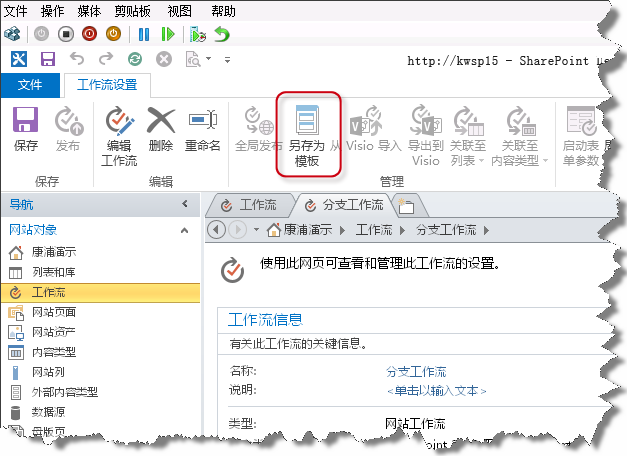
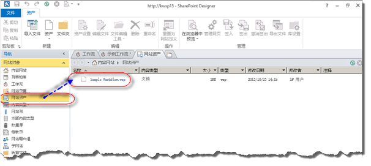
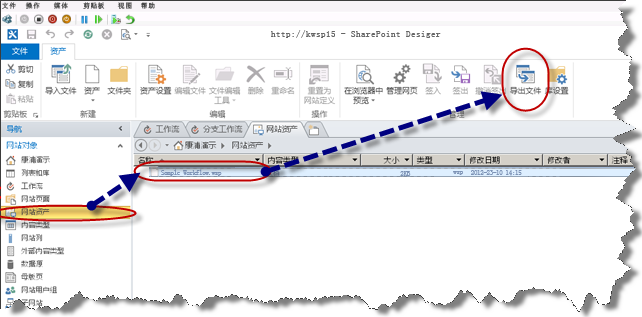
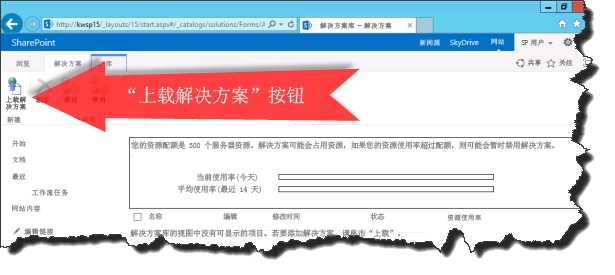
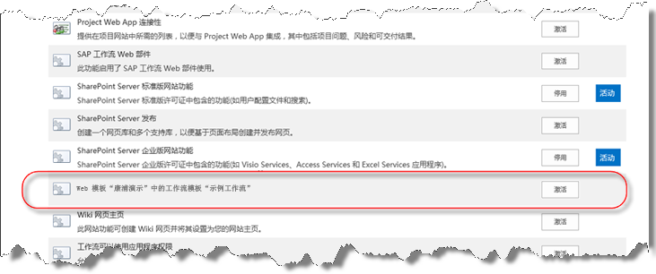

# 了解如何在 SharePoint 2013 中打包和部署工作流
了解如何在 SharePoint Server 2013 使用 SharePoint Designer 2013 封装和部署工作流。
## SharePoint Designer 2013 的工作流封装功能概述

SharePoint Designer 2013 提供将工作流另存为模板的功能。将工作流另存为模板也称为封装工作流。将工作流另存为模板后，可将其导入其他 SharePoint Server 2013 环境中使用，而无需重新开发工作流。并非所有工作流类型都可另存为模板。下面的列表显示可另存为模板的工作流类型。 
  
    
    

**对将工作流另存为模板的支持（按平台划分）**

|**工作流类型**|**SharePoint 2010 工作流平台**|**SharePoint 2013 工作流平台**|
|:-----|:-----|:-----|
|列表工作流    |不支持    |支持    |
|网站工作流    |不支持    |支持    |
|可重用工作流    |支持    |支持    |
   

  
    
    

  
    
    

> **注释**
> SharePoint Server 2013 包含两个不同的工作流平台：SharePoint 2010 工作流平台和 SharePoint 2013 工作流平台。这两个平台都可在 SharePoint Server 2013 中使用。有关这两个工作流的详细信息，请参阅  [Getting started with SharePoint Server 2013 workflow.](http://msdn.microsoft.com/library/cc73be76-a329-449f-90ab-86822b1c2ee8.aspx)
  
    
    

## 使用 SharePoint Designer 2013 封装工作流

封装工作流的过程涉及使用 SharePoint Designer 2013 将工作流另存为模板文件。工作流包采用 Web 解决方案包 (WSP) 文件的形式，其扩展名为 .wsp。若要封装工作流，请按照下面的步骤操作。 
  
    
    

### 封装工作流

1. 在 SharePoint Designer 2013 中打开现有工作流或开发新工作流。
    
  
2. 在功能区中的"工作流设置"选项卡上，单击"管理"部分的"另存为模板"，如图所示。
    
   **图：将工作流另存为模板**

  

  

  

  
3. 将显示一个信息性对话框，让您知道该模板已保存到"网站资产"库。
    
  
4. 单击"网站资产"库，查看该工作流模板，如图所示。
    
   **图：网站资产中的工作流模板**

  

  

  

  

  
    
    

> **提示**
> 工作流模板会自动保存到工作流所在的网站集的"网站资产"库。 
  
    
    

## 将工作流包部署到 SharePoint 2013

可将工作流包部署到在其中开发它的 SharePoint 场或网站以外的其他服务器场或网站。若要成功部署工作流，必须满足以下两项要求：
  
    
    

- 所有工作流依赖项（如列表、库、列和内容类型）必须已位于新网站上。
    
  
- 每个依赖项必须具有与源依赖项完全相同的名称。
    
  
如果部署了工作流，但相关依赖项不存在，则结果将是个错误。
  
    
    
在部署工作流前，必须先从源 SharePoint Server 2013 服务器场导出工作流模板。若要导出工作流模板，请按照下面的过程操作：
  
    
    

### 导出工作流模板

1. 打开 SharePoint Designer 2013 并导航到包含该模板的网站资产库。
    
  
2. 单击以选择要导出的工作流模板。
    
  
3. 单击"导出文件"按钮，将模板文件保存到您的本地计算机或网络驱动器上，如图所示。
    
   **图：从 SharePoint Designer 2013 导出工作流模板**

  

  

  

  
若要部署工作流包，请按照下面的过程操作。
  
    
    

### 部署工作流解决方案

1. 打开 Internet Explorer 并导航到要在其中部署工作流的 SharePoint Server 2013 网站集。
    
  
2. 单击"网站操作"并选择"网站设置"。
    
  
3. 在"Web 设计库"部分，单击"解决方案"。
    
    > **注释**
      > 您必须位于网站集的"网站设置"页上才能看到"解决方案"库。如果您位于子网站的"网站设置"页上，则看不到"解决方案"库。 
4. 单击"上载解决方案"按钮上载该解决方案，如图所示。
    
   **图："上载解决方案"按钮**

  

  

  

  
5. 单击"激活"按钮激活解决方案，如图所示。
    
   **图："激活解决方案"对话框和按钮**

  

  

  

  
为网站集激活工作流解决方案后，它可作为一项功能供所有子网站使用。若要为子网站激活该工作流功能，请按照下面的过程操作。
  
    
    

### 激活工作流功能

1. 在要激活工作流功能的网站上打开"网站设置"。
    
  
2. 在"网站操作"组中，单击"管理网站功能"。
    
  
3. 单击工作流功能旁边的"激活"，如图所示。
    
  

**图：激活网站的工作流功能**

  
    
    

  
    
    

  
    
    

  
    
    

  
    
    

## 其他资源

-  [SharePoint 2013 中的工作流](http://technet.microsoft.com/zh-cn/sharepoint/jj556245.aspx)
    
  
-  [What's new in workflow in SharePoint Server 2013](http://msdn.microsoft.com/library/6ab8a28b-fa2f-4530-8b55-a7f663bf15ea.aspx)
    
  
-  [Getting started with SharePoint Server 2013 workflow](http://msdn.microsoft.com/library/cc73be76-a329-449f-90ab-86822b1c2ee8.aspx)
    
  
-  [SharePoint Designer 和 Visio 中的工作流开发](workflow-development-in-sharepoint-designer-and-visio.md)
    
  
-  [工作流操作快速参考（SharePoint 2013 工作流平台）](workflow-actions-quick-reference-sharepoint-2013-workflow-platform.md)
    
  
-  [来自 SharePoint Designer 团队的博客文章：工作流封装和部署方案](http://blogs.msdn.com/b/sharepointdesigner/archive/2012/08/30/packaging-list-site-and-reusable-workflow-and-how-to-deploy-the-package.aspx)
    
  

