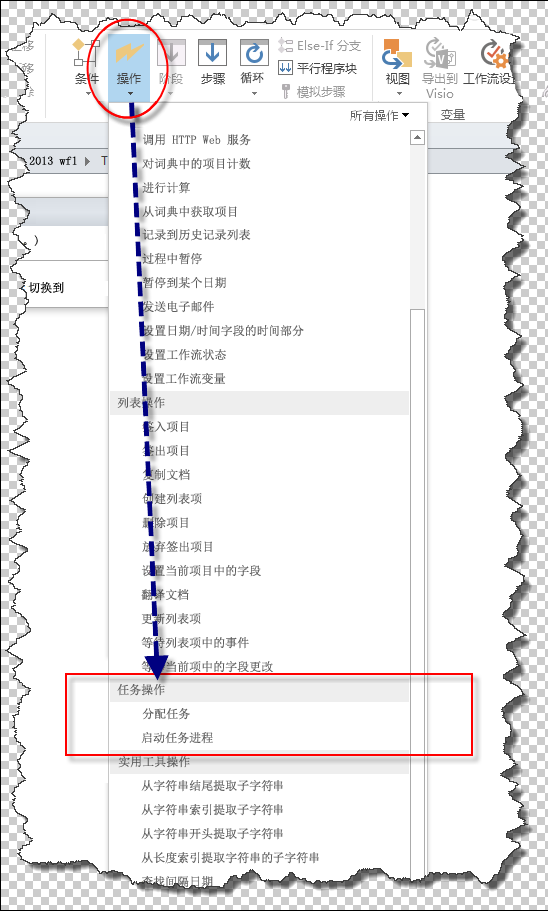
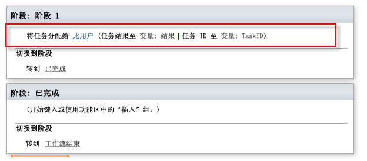
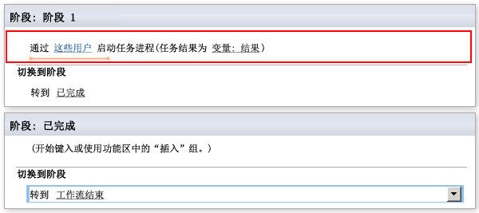
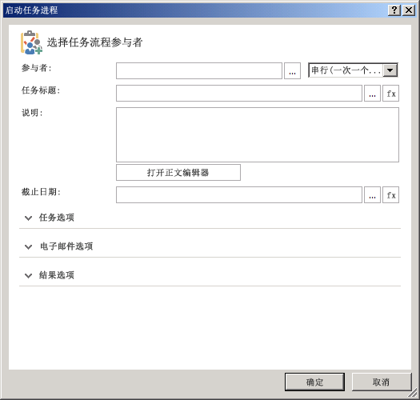

# 了解 SharePoint Designer 2013 中的任务操作
学习使用 SharePoint Designer 2013 中的任务操作。
||
|:-----|
||
   

## SharePoint Designer 2013 中的任务操作概述

SharePoint Server 2013 中的任务 可用于向人员或组分配工作并随着时间的推移跟踪该工作的进度。在 SharePoint Designer 2013 中，为处理任务而设计了两种工作流操作。
  
    
    
这两种操作是：
  
    
    

- "分配任务"，用于创建一个 SharePoint 2013 任务并将该任务分配给单个参与者。
    
  
- "启动任务流程"，用于将一个任务分配给多个参与者。
    
  
可在 SharePoint Designer 2013 功能区的"操作"下拉菜单中访问任务操作，如图所示。
  
    
    

**图：SharePoint Designer 2013 中的"任务操作"**

  
    
    

  
    
    

  
    
    

  
    
    

  
    
    

## 使用 SharePoint 2013 中的任务操作

业务流程通常包括必须由人员执行的任务。工作流安排流程的步骤。工作流使用任务操作 向人员分配任务。例如，当聘用了一位新员工时，就需要执行一些任务。其中一个任务可能是新员工培训。该任务可能需要由人力资源部门的一位成员来执行。
  
    
    
"分配任务"和"启动任务流程"操作位于 SharePoint Designer 2013 功能区的"操作"下拉菜单上。您可以向工作流添加操作并针对您的特殊环境自定义这些操作。"分配任务"操作用于将一个任务分配给单个参与者。"启动任务流程"操作用于将一个任务分配给多个参与者。
  
    
    

### 分配任务

下图显示了"分配任务"操作。
  
    
    

**图：SharePoint Designer 2013 中的"分配任务"操作**

  
    
    

  
    
    

  
    
    

  
    
    

  
    
    
"分配任务"操作需要输入三个内容：分配任务的用户、结果变量和任务 ID 变量。
  
    
    

- **此用户**：如图所示打开"分配任务"对话框。使用该对话框设置参与者、任务标题、描述、截止日期、任务选项、电子邮件选项和结果选项。
    
  
- **变量: 结果**：分配将保留任务结果的变量。
    
  
- **变量: TaskID**：分配将保留任务 ID 的变量。
    
  

**图："分配任务"对话框**

  
    
    

  
    
    

  
    
    

  
    
    

  
    
    

### 启动任务流程

下图演示了"启动任务流程"操作。
  
    
    

**图："启动任务流程"操作。**

  
    
    

  
    
    

  
    
    

  
    
    

  
    
    
"启动任务流程"操作需要输入两个内容：将参与任务的用户和结果变量。
  
    
    

- **这些用户**：如图所示打开"启动任务流程"对话框。使用该对话框设置参与者、任务标题、描述、截止日期、任务选项、电子邮件选项和结果选项。
    
  
- **变量: 结果**：分配将保留任务流程结果的变量。
    
  

**图："启动任务流程"对话框**

  
    
    

  
    
    

  
    
    

  
    
    

  
    
    

## 其他资源

-  [What's new in workflow in SharePoint Server 2013](http://msdn.microsoft.com/library/6ab8a28b-fa2f-4530-8b55-a7f663bf15ea.aspx)
    
  
-  [Getting started with SharePoint Server 2013 workflow](http://msdn.microsoft.com/library/cc73be76-a329-449f-90ab-86822b1c2ee8.aspx)
    
  
-  [SharePoint Designer 和 Visio 中的工作流开发](workflow-development-in-sharepoint-designer-and-visio.md)
    
  
-  [工作流操作快速参考（SharePoint 2013 工作流平台）](workflow-actions-quick-reference-sharepoint-2013-workflow-platform.md)
    
  

  
    
    

