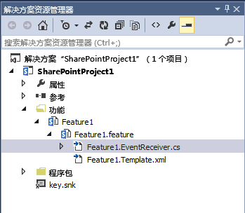

# 从 SharePoint 2010 升级时，使用功能升级来应用新的 SharePoint 2013 母版页
了解在将 SharePoint 2013 网站从 2010 升级到 2013 兼容模式时，如何在  `FeatureUpgrading` 事件中重置自定义母版页。
当您将 SharePoint 2010 自定义项升级到 SharePoint 2013 时，您创建的对自定义母版页的任何引用都将切换回对 default.master 页的引用。如果您已经将包含一个或多个自定义母版页的功能部署到在 SharePoint 2010 兼容模式下运行的升级后的 SharePoint 2013 网站集中，则需要在升级到 2013 兼容模式时重置您的 SharePoint 2013 母版页。本主题说明如何使用功能接收器，以确保从 SharePoint 2010 升级时 SharePoint 2013 自定义主页得以重置。 
  
    
    


## 使用自定义升级代码重置母版页

如 [在 SharePoint Server 2013 中将自定义功能部署到升级后的网站集](http://technet.microsoft.com/zh-cn/library/dn673579%28v=office.15%29.aspx)的指南所介绍，当从 SharePoint 2010 升级到 SharePoint 2013 时，默认情况下服务器场中的网站集在 SharePoint 2010 兼容模式下运行。根据您采用的升级自定义功能的方法，您需要通过使用一个或两个解决方案包部署任何给定的功能：
  
    
    

- 可以部署到"14"和"15"两种兼容级别的单个解决方案包，要么是因为自定义逻辑适合"15"兼容级别，要么是因为该功能可在"14"和"15"兼容级别下正常工作而不出现任何问题。
    
  
- 包含相同功能的不同版本的两个解决方案包。这种方法称为"功能屏蔽"。
    
  
任一种情况下，在升级过程中，任何已创建的自定义母版页都将还原到 default.master 页。如果不重置这些使用功能中逻辑的页面，则需要激活该功能（或该功能的"15"版本）将母版页重置为您的自定义版本。您可以通过使用绑定到  `FeatureUpgrading` 事件的功能接收器重置您的 2013 自定义母版页。
  
    
    

### 使用功能接收器重置 2013 自定义母版页


1. 在 Visual Studio 中打开您的解决方案。在解决方案资源管理器的"功能"节点下方找到您的功能，然后打开您功能的 feature.xml 文件。
    
  
2. 将  `<UpgradeActions>` 部分添加到 feature.xml 文件中，并确保该操作仅适用于当前应用于"14"兼容级别的功能版本。此部分指定要在升级功能时执行的操作名称。以下示例指定使用 1.0.0.0 功能版本的升级操作。在这个示例中， `UpgradeFeature` 操作被传递用来实施 **FeatureUpgrading(SPFeatureReceiverProperties, String, IDictionary<String, String>)** 方法，这种方法在您添加了功能接收器之后定义对象。
    
  ```XML
  
<UpgradeActions
    ReceiverAssembly="MyFeatureReceiver, Version=2.0.0.0, Culture=neutral, PublicKeyToken=<token>"
    ReceiverClass="MyFeature.MyFeatureEventReceiver">
  <VersionRange BeginVersion="1.0.0.0" EndVersion="1.0.0.0">
   <CustomUpgradeAction Name="UpgradeFeature"/>
<ApplyElementManifests>
<ElementManifest Location="MasterPages\\UpgradeElements.xml" />
</ApplyElementManifests>
  </VersionRange>
</UpgradeActions>

  ```


    您将母版页放置在项目的 **MasterPages** 文件夹中，并将与母版页有关的所有元数据放置在 **UpgradeElements.xml** 文件中。
    
  
3. 将  `<Properties>` 部分添加到 feature.xml 文件中。本部分包含升级网站时指定要设置的 2013 自定义母版页的键 - 值对。以下示例指定您将在功能接收器中使用的 `My15MasterPage` 键的值。
    
  ```
  
<Properties>
  <Property Key="My15MasterPage" Value="_catalogs/masterpage/My15MasterPage.master" />
</Properties>

  ```

4. 在解决方案资源管理器的"功能"节点中，右键单击您功能的名称，然后选择"添加事件接收器"将事件接收器添加到该功能中。
    
    这会将一个代码文件添加到解决方案资源管理器中的功能下方。图 1 显示了 Feature1.EventReceiver.cs 示例文件在"功能"文件夹的功能下方出现的位置。
    

   **图 1. 功能中的事件接收器的代码文件**

  


  

    此文件包含一个注释和空的  `FeatureUpgrading` 方法。您将在下面的步骤中使用此方法。
    
  
5. 打开代码文件，取消对 FeatureUpgrading 方法的注释，因为它会覆盖 **FeatureUpgrading(SPFeatureReceiverProperties, String, IDictionary<String, String>)** 方法。以下示例适用于之前在 feature.xml 文件中指定的 `My15MasterPage` 文件。
    
  ```cs
  
public override void FeatureUpgrading(SPFeatureReceiverProperties properties, string upgradeActionName, System.Collections.Generic.IDictionary<string, string> parameters)
        {
 
            try
            {
            if (upgradeActionName != "UpgradeFeature")
                return;
                //Set the master page to a value stored as a property in the feature.xml file
                string masterPage = properties.Definition.Properties[My15MasterPage].Value;
                string baseURL;
                var currentWeb = properties.Feature.Parent as SPWeb;
 
                //Checks to see that the API returns a string that ends in a "/" and if not adds it.
                if (currentWeb.ServerRelativeUrl.Substring(currentWeb.ServerRelativeUrl.Length - 1) == "/")
                {
                    baseURL = currentWeb.ServerRelativeUrl;
                }
                else
                {
                    baseURL = currentWeb.ServerRelativeUrl + "/";
                }
 
                masterPage = baseURL + masterPage;
                currentWeb.CustomMasterUrl = masterPage;
 
                currentWeb.Properties.Update();
                currentWeb.Update();
            }
            }
 
            catch (Exception ex)
            {
             //Handle exception
            }
        }

  ```

完成升级后，您需要考虑对您未来的长期功能维护。请参阅  [SharePoint 2010 中的应用程序生命周期管理](http://msdn.microsoft.com/zh-cn/library/office/gg604045%28v=office.14%29.aspx)来获得对维护完全信任代码的指导。虽然本文特别提到 SharePoint 2010，但它同样适用于 SharePoint 2013 中的完全信任代码。如果您不熟悉功能版本和升级操作，请参考本文的 [解决方案生命周期管理模型](http://msdn.microsoft.com/zh-cn/library/office/gg604045%28v=office.14%29.aspx#sectionSection7)部分。您还应查看 [使用功能版本的最佳实践](http://msdn.microsoft.com/zh-cn/library/office/ee535064%28v=office.14%29.aspx)。
  
    
    

## 其他资源
<a name="bk_addresources"> </a>


-  [在 SharePoint Server 2013 中将自定义功能部署到升级后的网站集](http://technet.microsoft.com/zh-cn/library/dn673579%28v=office.15%29.aspx)
    
  
-  [升级 SharePoint 2013 的网站自定义](upgrade-site-customizations-for-sharepoint-2013.md)
    
  
-  [升级到 SharePoint 2013](http://technet.microsoft.com/zh-cn/library/cc303420%28v=office.15%29.aspx)
    
  
-  [用于品牌和网站配置的 SharePoint 2013 和 SharePoint Online 解决方案包](http://www.microsoft.com/en-us/download/details.aspx?id=42030)
    
  
-  [为 SharePoint 2013 安装和管理解决方案](http://technet.microsoft.com/zh-cn/library/cc263205%28v=office.15%29.aspx)
    
  

