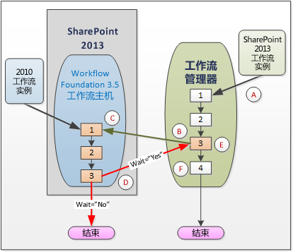
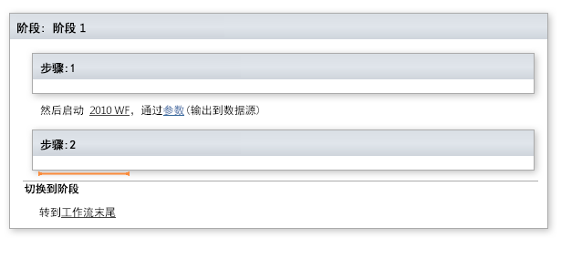
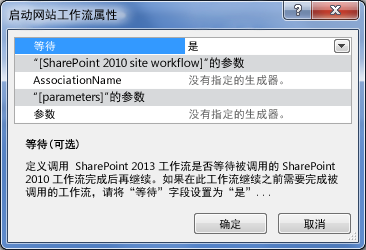
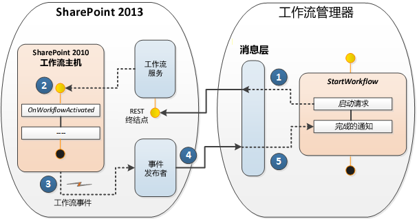

# 使用 SharePoint 2013 的工作流互操作
提供了对在 Visual Studio 2008 工作流设计器中使用 SharePoint 工作流互操作的讨论。工作流互操作可让您调用 SharePoint 2013 工作流中的 SharePoint 2010 工作流。这是一项重要功能，它使您能够重新使用现有工作流功能，并调用未集成到 SharePoint 2013 中的工作流活动。

  
    
    

> **重要信息**
> 若要了解有关在 SharePoint Designer 2013 中使用 SharePoint 工作流互操作功能的信息，请参阅 [了解 SharePoint Designer 2013 中的协调操作](understanding-coordination-actions-in-sharepoint-designer-2013.md)。 
  
    
    

## SharePoint 工作流互操作

这里有一个问题。您想将旧的 SharePoint 2010 工作流在您的 SharePoint 2013 平台上重复使用。或者，更糟糕的是，您正在创建新的 SharePoint 2013 工作流，需要调用仅在 SharePoint 2010 平台中可用的活动。您不知道要如何执行操作。实际上，解决方案非常简单：使用 SharePoint 工作流互操作。
  
    
    
SharePoint 工作流互操作使（基于 Windows Workflow Foundation 3 构建的）SharePoint 2010 工作流可平稳地与 SharePoint 2013 工作流引擎（基于 Windows Workflow Foundation 4）协同工作。虽然新的 Windows Workflow Foundation 4 执行引擎托管在以外部服务形式运行的 工作流管理器 中，但 SharePoint 2013 中仍然包含用于处理 SharePoint 2010 工作流的旧的 SharePoint 工作流主机。SharePoint 工作流互操作在两种执行环境之间进行权衡，如图 1 所示。
  
    
    

**图 1. 操作中的 SharePoint 工作流互操作**

  
    
    

  
    
    

  
    
    
我们来看一下图 1 中描述的过程。使用字母来列出图示中强调的要点：
  
    
    

  
    
    
> ( **A** ) SharePoint 2013 工作流的一个实例开始在基于 Windows Workflow Foundation 4 的工作流管理器中运行。请注意，该工作流管理器不在 SharePoint 中，而是作为一个外部服务在运行。
    
  

  
    
    
> ( **B** ) 您进行到了 SharePoint 2013 工作流中的一个要点（工作流管理器中的第 3 步），此处您想要调用 SharePoint 2010 工作流。在 Visual Studio 2008 工作流设计器中，您通过实现 **Start 2010 WF** 活动来实现这一目的，如图 2 所示。
    
   **图 2. 启动 SharePoint 2010 工作流的各阶段图块。**

  

  

    
    
    从 SharePoint 对象模型的角度来看，这是使用  [WorkflowInteropService](https://msdn.microsoft.com/library/Microsoft.SharePoint.WorkflowServices.WorkflowInteropService.aspx) 类的 [StartWorkflow](https://msdn.microsoft.com/library/Microsoft.SharePoint.WorkflowServices.WorkflowInteropService.StartWorkflow.aspx) 方法完成的。
    
  

  
    
    
> ( **C** ) 在这种情况下，SharePoint 2010 工作流在 SharePoint 内部的 Windows Workflow Foundation 3.5 工作流主机中开始执行。但需要考虑一个重要事项。在某些情况下，您可能需要让 2013 工作流等待 2010 工作流完成运行（还可能是返回一些数据），然后再继续执行 2013 工作流。在其他情况下，这可能不是必要的，因为这两个工作流可以以并行方式独立运行。
    
    若要控制此行为，控制 Windows Workflow Foundation 3.5 工作流主机中的工作流执行的  [WorkflowInterop](https://msdn.microsoft.com/library/Microsoft.SharePoint.WorkflowServices.Activities.WorkflowInterop.aspx) 类提供了 [Wait](https://msdn.microsoft.com/library/Microsoft.SharePoint.WorkflowServices.Activities.WorkflowInterop.Wait.aspx) 属性。（在设计器对话框中）将此布尔属性设置为"Yes"或在 **Wait** 属性中将其设置为 **true**，这会导致 2013 工作流暂停，直到 2010 完成执行过程并返回 **completed** 消息。
    
    
    

   **图 3. 启动"工作流属性"对话框。**

  

  

  

  

  
    
    
> ( **D** ) 此处描述对 **Wait** 属性选择 **true** 或 **false**（或在属性对话框中选择"是"或"否"）的实际效果 。如果 **Wait** 为 **true**，那么 2010 工作流将传递  [WorkflowCompleted](https://msdn.microsoft.com/library/Microsoft.SharePoint.WorkflowServices.WorkflowInteropEventReceiver.WorkflowCompleted.aspx) 事件（或者，返回作为 [DynamicValue](http://msdn.microsoft.com/library/2af7983b-8357-4e0f-9ba9-dfdeed05a8a7.aspx) 属性的数据）。有关动态值的详细信息，请参阅 [Understanding Dynamic Value](http://msdn.microsoft.com/library/c5702628-9625-4d19-95c5-13923e91fea1.aspx)。
    
    当然，如果将 **Wait** 设置为 **false**，2010 工作流将执行，然后正常终止。
    
  

  
    
    
> ( **E** ) 只有当您对 2010 工作流的调用指定了 **Wait=true** 时，此步骤才有意义。在这种情况下，您的 2013 工作流接收 **WorkflowCompleted** 事件并在停止点重新启动 2013 工作流的执行。
    
  

  
    
    
> ( **F** ) 然后，您的 2013 工作流会正常完成执行并终止。如果是 **Wait=false**，则您的 2013 工作流将独立于 2010 工作流来执行并终止。 
    
  

## 工作流互操作设计

SharePoint 工作流互操作是在 WF 3 和 WF 4 工作流活动之间支持一对一实例映射的消息框架。WF 3 和 WF 4 通过互发一些由  [WorkflowInteropService](https://msdn.microsoft.com/library/Microsoft.SharePoint.WorkflowServices.WorkflowInteropService.aspx) 上的一组 WF 4 活动打包的消息进行互操作。
  
    
    
为了支持工作流互操作，SharePoint Designer 中的工作流设计图面对新的工作流活动"启动 2010 WF"（这是  [StartWorkflow](https://msdn.microsoft.com/library/Microsoft.SharePoint.WorkflowServices.WorkflowInteropService.StartWorkflow.aspx) 方法上的一个包装器）提供访问权限。此活动允许您启动列表工作流或网站工作流。
  
    
    
活动实际上是在工作流管理器和运行在 SharePoint 2013 中的 SharePoint 2010 工作流主机之间执行的消息顺序。这两者都经过消息处理层的协调，如图 4 所示。该顺序从在 SharePoint 2013 工作流管理器中调用 **StartWorkflow** 方法时开始。"开始"消息将转到 SharePoint 中的工作流服务，反过来，将启动 SharePoint 2010 工作流主机中的工作流。2010 工作流执行完成后，将触发一个事件，该事件通过事件发布程序将"已完成"消息发送回 2013 工作流管理器。
  
    
    

**图 4. SharePoint 工作流互操作消息协议**

  
    
    

  
    
    

  
    
    

  
    
    

  
    
    

## 其他资源

-  [SharePoint 2013 中的工作流入门](get-started-with-workflows-in-sharepoint-2013.md)
    
  
-  [SharePoint 2013 工作流基础](sharepoint-2013-workflow-fundamentals.md)
    
  
-  [了解 SharePoint Designer 2013 中的协调操作](understanding-coordination-actions-in-sharepoint-designer-2013.md)
    
  
-  [WorkflowInteropService](https://msdn.microsoft.com/library/Microsoft.SharePoint.WorkflowServices.WorkflowInteropService.aspx)
    
  
-  [WorkflowInteropEventReceiver](https://msdn.microsoft.com/library/Microsoft.SharePoint.WorkflowServices.WorkflowInteropEventReceiver.aspx)
    
  

  
    
    

