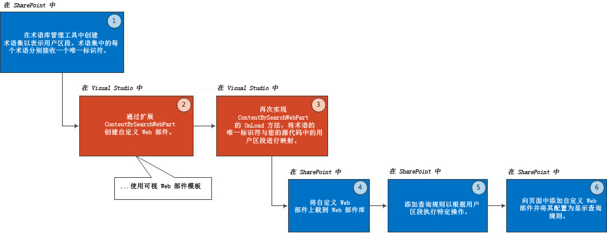

# SharePoint 2013 中的用户划分
通过在 SharePoint Server 2013 中使用术语集、内容搜索 Web 部件和查询规则的组合，显示您为您定义（如根据区域设置、兴趣、性别或引荐链接）的用户区段定制的内容。
SharePoint Server 2013 提供构建基块以定制您在 SharePoint 2013 网站上显示的内容，这取决于最终用户的某些属性，例如用户的性别、所在地区、他们的兴趣或引荐链接。这些用户属性的分组称为用户区段。 
  
    
    

在 SharePoint 2013 中，此用户区段功能在很多情况下都是有益的，例如：
- 根据最终用户的性别在页面上显示不同的横幅 
    
  
- 根据最终用户所在地区显示不同的折扣优惠 
    
  
- 根据最终用户的引荐链接（将最终用户带到您页面的网站）在页面上显示不同的文章。 
    
  
若要在 SharePoint 中实现用户区段，您需要做三件事情：为每个用户区段创建一个术语集，扩展内容搜索 Web 部件让其了解您的用户区段，然后使用查询规则执行每个用户区段特定的操作。
## 先决条件
<a name="SP15_Prerequisites"> </a>

开始在 SharePoint 中实现用户区段之前，请确保您的开发环境中安装有下列内容：
  
    
    

- SharePoint Server 2013
    
  
- Visual Studio 2008
    
  
本文假定您具有在 SharePoint 中开发 Web 部件的经验。有关开发 Web 部件的详细信息，请参阅 [构建基块：Web 部件](http://msdn.microsoft.com/zh-cn/library/ee535520%28v=office.14%29.aspx)
  
    
    

## 向 ShaerPoint 网站添加用户区段功能的概述
<a name="SP15_Overview_User_Segmentation"> </a>

图 1 显示向 ShaerPoint 网站添加用户区段功能的基本步骤。
  
    
    

**图 1. 向 ShaerPoint 网站添加用户区段功能的步骤**

  
    
    

  
    
    

  
    
    

  
    
    

  
    
    

## 创建术语集
<a name="SP15_Create_a_term_set"> </a>

术语 是一个可与 SharePoint 2013 中的某个项目相关联的词或短语。术语集 是一个相关术语的集合。有关详细信息，请参阅 [SharePoint Server 2013 中的托管元数据概述](http://technet.microsoft.com/zh-cn/library/ee424402.aspx)。您可以通过 SharePoint 术语库管理工具或通过编程方式来创建术语集。 
  
    
    

> **注释**
>  有关如何使用术语库管理工具创建术语集的详细说明，请参阅以下主题：>  [设置新术语集](http://office.microsoft.com/zh-cn/sharepoint-help/set-up-a-new-term-set-ha102922634.aspx)>  [在术语集中创建和管理术语](http://office.microsoft.com/zh-cn/sharepoint-help/HA102771989.aspx?CTT=1)
  
    
    

您可以通过使用  [Microsoft.SharePoint.Taxonomy](https://msdn.microsoft.com/library/Microsoft.SharePoint.Taxonomy.aspx) 公开的类型以编程方式创建术语集。下面的代码示例演示如何创建 **TermSet** 对象和获取 **NavigationTermSet**。然后，在 **TermSet** 内创建 **Term** 对象。最后，将这些更改提交到 **TermStore** 并加载 **TermSet** 以用于导航。
  
    
    
您添加到术语集的每个术语均会收到一个唯一标识符。此标识符是让  [ContentBySearchWebPart](https://msdn.microsoft.com/library/Microsoft.Office.Server.Search.WebControls.ContentBySearchWebPart.aspx) 了解用户区段的关键。
  
    
    


```cs

static void CreateNavigationTermSet(string siteUrl)
{
    using (SPSite site = new SPSite(siteUrl))
    {
        using (SPWeb web = site.OpenWeb())
        {
            TaxonomySession taxonomySession = new TaxonomySession(site);
            taxonomySession.UpdateCache();
            TermStore termStore = taxonomySession.DefaultSiteCollectionTermStore;

            // Create a TermSet object in a default site collection term group.
            Group siteCollectionGroup = termStore.GetSiteCollectionGroup(site, createIfMissing: true);
            TermSet termSet = siteCollectionGroup.CreateTermSet("Navigation Demo", Guid.NewGuid(), lcid: 1033);

            // Obtain navigation term set.
            NavigationTermSet navigationTermSet = NavigationTermSet.GetAsResolvedByWeb(termSet, web, "GlobalNavigationTaxonomyProvider");

            // Create a term that points to a SharePoint page set at the term set level of hierarchy.
            NavigationTerm term1 = navigationTermSet.CreateTerm("Term 1", NavigationLinkType.FriendlyUrl, Guid.NewGuid());

            // Create a term that points to an already existing URL outside of SharePoint.
            NavigationTerm term2 = navigationTermSet.CreateTerm("Term 2", NavigationLinkType.SimpleLink, Guid.NewGuid());
            term2.SimpleLinkUrl = "http://www.bing.com/";

            // Create a term that points to an existing SharePoint page.
            NavigationTerm term3 = navigationTermSet.CreateTerm("Term 3", NavigationLinkType.FriendlyUrl, Guid.NewGuid());

            // Save all changes to the term store.
            termStore.CommitAll();
        }
    }
}
```


## 为用户区段创建自定义 Web 部件
<a name="SP15_Create_a_custom_web_part_user_segmentation"> </a>

在 Visual Studio 2008 中，通过使用来自 SharePoint Server 2013 类别的 Visual Web 部件模板创建自定义 Web 部件。您的自定义 Web 部件必须继承自  [ContentBySearchWebPart](https://msdn.microsoft.com/library/Microsoft.Office.Server.Search.WebControls.ContentBySearchWebPart.aspx) 对象。
  
    
    

> **注释**
> 本文假定您具有在 SharePoint 中开发 Web 部件的经验。有关开发 Web 部件的详细信息，请参阅 [构建基块：Web 部件](http://msdn.microsoft.com/zh-cn/library/ee535520%28v=office.14%29.aspx)
  
    
    


## 采用用户区段逻辑配置自定义 Web 部件
<a name="SP15_Configure_custom_web_part_user_segmentation_logic"> </a>

在您的自定义 Web 部件中，您可以重新实现  [OnLoad()](https://msdn.microsoft.com/library/Microsoft.Office.Server.Search.WebControls.ContentBySearchWebPart.OnLoad.aspx) 方法或 [OnInit()](https://msdn.microsoft.com/library/Microsoft.Office.Server.Search.WebControls.ContentBySearchWebPart.OnInit.aspx) 方法来执行您的自定义逻辑。这两种方法对于设置或自定义 [ContentBySearchWebPart](https://msdn.microsoft.com/library/Microsoft.Office.Server.Search.WebConrols.ContentBySearchWebPart.aspx) 对象的属性都很有用。
  
    
    

### 示例 1：向您的 SharePoint Server 2013 网站添加男性和女性用户区段

若要添加 **Male** 和 **Female** 用户区段，您可以重新实现 [OnLoad()](https://msdn.microsoft.com/library/Microsoft.Office.Server.Search.WebControls.ContentBySearchWebPart.OnLoad.aspx) 方法，如下面的代码所示。
  
    
    

```cs

protected override void OnLoad(EventArgs e)
{
    if (this.AppManager != null)
    {
        if (this.AppManager.QueryGroups.ContainsKey(this.QueryGroupName) &amp;&amp; this.AppManager.QueryGroups[this.QueryGroupName].DataProvider != null)
        {
            this.AppManager.QueryGroups[this.QueryGroupName].DataProvider.BeforeSerializeToClient += new
                BeforeSerializeToClientEventHandler(AddMycustomProperties);
        }
    }
    base.OnLoad(e);
}
```

相应的 **AddMycustomProperties** 方法应类似下面的代码。
  
    
    


```cs

private void AddMycustomProperties(object sender, BeforeSerializeToClientEventArgs e)
{
    DataProviderScriptWebPart dp = sender as DataProviderScriptWebPart;
    string gender = (string)Page.Session["DataProvider.Gender"];
    // Depends on what your DataProvider is: Facebook, LinkedIn, etc.

    if (dp != null &amp;&amp; gender != null)
    {   try
        {
            // Set property to male or female GUID.
            if (gender.CompareTo("female") == 0)
            {
                dp.Properties["TermSetName"] = new String[] { "TermUniqueIdentifier" };
                // E.g. 47ba9139-a4c5-4ff0-8f9a-2864be32da92
            }
            else if(gender.CompareTo("male") == 0)
            {
                dp.Properties["UserSegmentTerms"] = new String[] { "TermUniqueIdentifier" };
                // E.g. f5bf2195-2170-4b11-a018-a688a285e579
            }
        }
        catch (ArgumentException exp)
        {
             // Do something with the exception.
        }
   }
}
```


### 示例 2：根据最终用户所使用的 Web 浏览器类型创建用户区段

若要根据最终用户查看您的 SharePoint Server 2013 网站所使用的 Web 浏览器类型创建用户区段，请重新实现 **OnLoad** 方法，如下面的代码所示。
  
    
    

```cs

protected override void OnLoad(EventArgs e)
{
    if (this.AppManager != null)
    {
        if (this.AppManager.QueryGroups.ContainsKey(this.QueryGroupName) &amp;&amp; this.AppManager.QueryGroups[this.QueryGroupName].DataProvider != null)
        {
             this.AppManager.QueryGroups[this.QueryGroupName].DataProvider.BeforeSerializeToClient += new 
                 BeforeSerializeToClientEventHandler(AddMycustomProperties);
        }
    }
    base.OnLoad(e);
}
```

 **AddMycustomProperties** 方法的代码应类似下面的示例。
  
    
    


```cs

private void AddMycustomProperties(object sender, BeforeSerializeToClientEventArgs e)
{
    DataProviderScriptWebPart dataProvider = sender as DataProviderScriptWebPart;
    SPSite site = SPContext.Current.Site;
  
    TaxonomySession session = new TaxonomySession(site);
    TermStore defaultSiteCollectionStore = session.DefaultSiteCollectionTermStore;
    List<string> userSegmentTerms = new List<string>();

    var userAgentparts = Page.Request.UserAgent.Split(new char[] { ';', '(', ')' });

    foreach (var part in userAgentparts)
    {
        var entry = part.Trim();
        var terms = termStore.GetTermsWithCustomProperty("UserAgent", entry, false);

            if (terms.Count > 0)
            {
                userSegmentTerms.Add(terms[0].Id.ToString());
            }
    }
    dataProvider.Properties["UserSegmentTerms"] = userSegmentTerms.ToArray();
}
```


## 将自定义 Web 部件上载到 SharePoint Web 部件库
<a name="SP15_Upload_custom_web_part"> </a>

若要在页面中使用您的自定义 Web 部件，您需要将 Web 部件上载到 **SharePoint Web Part Gallery**。
  
    
    
在 **SharePoint Web Part Gallery** 中，选择"网站设置"，然后选择"Web 设计器库"下的"Web 部件"。在"文件"选项卡上，选择"上载文档"。
  
    
    

## 添加查询规则以执行取决于用户区段的特定操作
<a name="SP15_Add_query_rules_to_carry_out_actions"> </a>

查询规则通过智能反应用户可能尝试查找的内容来转换查询以提高搜索结果的相关性。在查询规则中，您指定条件和相关操作。当查询符合查询规则中的条件时，搜索系统会执行该规则中所指定的操作，从而提高搜索结果的相关性，例如缩小结果范围或更改结果显示的顺序。
  
    
    
在实现用户区段时，您使用查询规则来为已确定的用户区段定义条件和操作。当某个最终用户属于某特定用户区段时，查询规则将处于激活状态且  [ContentBySearchWebPart](https://msdn.microsoft.com/library/Microsoft.Office.Server.Search.WebConrols.ContentBySearchWebPart.aspx) 将显示为该特定用户区段定制的内容。
  
    
    

### 创建可为特定用户区段激活的查询规则


1. 在"网站设置"的发布网站集中，选择"网站集管理"，然后选择"搜索查询规则"。 
    
  
2. 选择一个结果源，然后选择"新建查询规则"。
    
  
3. 在"规则名称"字段中键入规则名称。然后，单击以展开"上下文"。
    
  
4. 在"查询由这些用户区段执行"部分下，选择"这些用户区段之一"，然后单击"添加用户区段"。
    
  
5. 在"标题"字段中，为此用户区段查询规则键入一个名称。选择"添加用户区段术语"。
    
  
6. 在"从术语库中导入"对话框中，展开"Managed Metadata Service"。在"网站集"下，找到保留您之前在 [创建术语集](#SP15_Create_a_term_set)中定义的用户区段术语的术语集。选择您要对其应用此查询规则的用户区段。然后，单击"保存"。
    
  
7. 在"添加用户区段"对话框中为您的用户区段命名。 
    
    现在，您已将查询规则映射到用户区段，后者又映射到用户区段术语。
    
  
8. 在"查询条件"下，选择"删除条件"。 
    
    这指定在  [ContentBySearchWebPart](https://msdn.microsoft.com/library/Microsoft.Office.Server.Search.WebConrols.ContentBySearchWebPart.aspx) 中配置的查询将充当查询条件。
    
  
9. 设置查询规则将执行的相应操作。在"操作"部分下，选择您要将其作为查询规则结果的相应操作。您可以选择"添加已升级的结果"或"添加结果块"。
    
  
10. 保存查询规则。
    
  
11. 根据您要执行的操作，对其他用户区段重复步骤 1 到 10。
    
  

## 向 SharePoint 页面添加自定义 Web 部件并将该部件配置为显示查询规则
<a name="SP15_Add_custom_web_part_to_SharePoint"> </a>

您需要向 SharePoint 页面添加自定义 Web 部件。
  
    
    

### 添加自定义 Web 部件


1. 导航到类别页面，选择"编辑页面"，然后选择"编辑页面模板"。
    
  
2. 在页面顶部选择"添加 Web 部件"。然后，从 Web 部件的右上角的下拉菜单中选择自定义 Web 部件。 
    
  
3. 单击"编辑 Web 部件"。
    
  
4. 展开"设置"部分，并在"结果表"字段中，选择"SpecialTermResults"。 
    
  
5. 保存配置。
    
  

## 其他资源
<a name="bk_addresources"> </a>


-  [为 SharePoint 构建网站](build-sites-for-sharepoint.md)
    
  
-  [设置用户区段以改善有关 SharePoint 2013 中产品目录的自适应体验](http://blogs.msdn.com/b/adaptive_experiences_in_sharepoint_2013/archive/2012/11/14/set-up-user-segmentation-to-drive-adaptive-experiences-in-a-product-catalog-in-sharepoint-2013.aspx)
    
  

  
    
    

