# Visio 中的验证问题（SharePoint 2010 工作流平台）
使用此参考可帮助解决将 SharePoint 工作流从 Visio Professional 2013 导出到 SharePoint Designer 2013 时的验证问题。 
本文介绍在 SharePoint Designer 2013 中使用 SharePoint 2010 工作流平台时可能出现的验证问题。
  
    
    

## 简介

在将 SharePoint 工作流从 Microsoft Visio Professional 2013 导出到 Microsoft SharePoint Designer 2013 时，必须先验证工作流程图。如果工作流程图无效，将显示"问题"窗口，其中包括在导出工作流之前必须修复的问题的列表。
  
    
    
本文包括您可在 Visio Professional 2013 中遇到的各个工作流验证问题的描述、示例和建议操作。如果您在验证期间收到问题通知，请在下面的列表中查找问题名称，使用示例帮助确定问题所在位置，然后按建议操作解决问题。
  
    
    

## 无法将自定义操作添加到工作流程图

消息：
  
    
    
无法将自定义操作添加到工作流程图。自定义操作只能在从 SharePoint Designer 导入工作流时生成。
  
    
    
 示例：
  
    
    

  
    
    
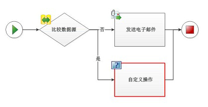
  
    
    
建议操作：
  
    
    
如果要将某操作添加到工作流，并且其主控形状不存在于模具中，则不要创建自己的形状，或从其他模具导入形状。改用现有形状，然后使用此形状的"添加注释"功能指定预期行为。
  
    
    

## 无法将自定义条件添加到工作流程图

消息：
  
    
    
不能将自定义条件添加至工作流图表。只有当从 SharePoint Designer 导入工作流时，才可以生成自定义条件。
  
    
    
 示例：
  
    
    

  
    
    

  
    
    
建议操作：
  
    
    
如果要将某条件添加到工作流，并且其主控形状不存在于模具中，则不要创建自己的形状，或从其他模具导入形状。改用现有形状，然后使用此形状的"添加注释"功能指定预期行为。
  
    
    

## 无法将复合条件手动添加到工作流程图

消息：
  
    
    
无法将复合条件手动添加到工作流程图。复合条件只能在从 SharePoint Designer 导入工作流时生成。
  
    
    
 示例：
  
    
    

  
    
    
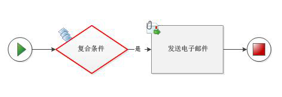
  
    
    
建议操作：
  
    
    
如果要将某条件添加到工作流，并且其主控形状不存在于模具中，则不要创建自己的形状，或从其他模具导入形状。改用现有形状，然后使用此形状的"添加注释"功能指定预期行为。
  
    
    

## 工作流形状之间存在重复的连接

消息：
  
    
    
工作流形状之间存在重复连接。
  
    
    
 示例：
  
    
    

  
    
    
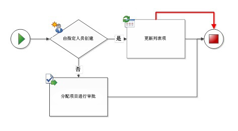
  
    
    
建议操作：
  
    
    
通过选择并删除来删除多余的连接器。
  
    
    

## 不允许循环回父形状

消息：
  
    
    
不允许循环回父形状。
  
    
    
 示例：
  
    
    

  
    
    
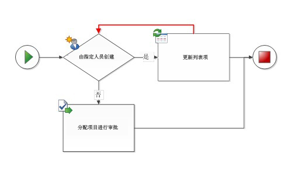
  
    
    
建议操作：
  
    
    
Visio Professional 2013 和 SharePoint Designer 2013 都不支持具有循环的工作流。请检查您的工作流循环并删除循环连接。如果要创建包含一组循环步骤的 SharePoint 工作流，则必须在 Visual Studio 中创建此工作流。
  
    
    

## 不允许连续的并行活动

消息：
  
    
    
不允许连续的并行活动。
  
    
    
 示例：
  
    
    

  
    
    
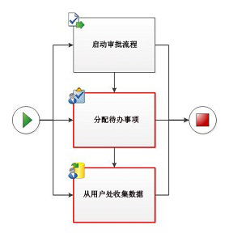
  
    
    
建议操作：
  
    
    
活动可以并行或连续进行，但不能并行且连续。对于并行活动，删除连续连接器。对于连续的活动，删除并行连接器。有时，很难识别并行且连续的活动。以下示例演示的是并行和连续排列的其他常见实例，并且提供可选排列。
  
    
    
 示例：
  
    
    

  
    
    
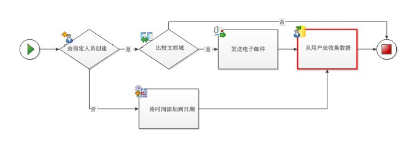
  
    
    
建议操作：
  
    
    
若要避免连接器从多个路径指向同一个活动，请尝试重复该活动：
  
    
    

  
    
    
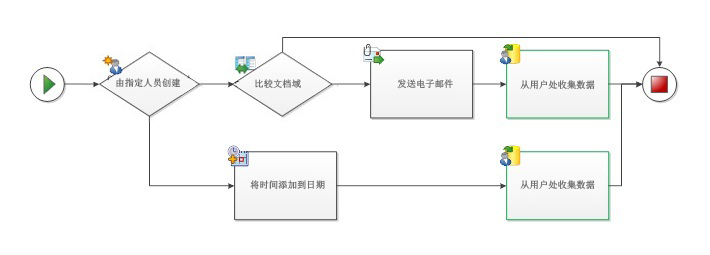
  
    
    
 示例：
  
    
    

  
    
    
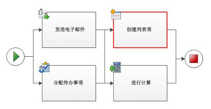
  
    
    
建议操作：
  
    
    
如果在连续步骤中处理并行块（常见于使用 SharePoint Designer 构造的工作流），则在两个并行块之间尝试使用"添加注释"形状，以使这些步骤完全分开。
  
    
    

  
    
    
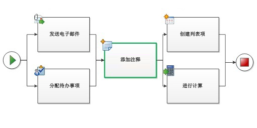
  
    
    

  
    
    

  
    
    

## 条件形状没有标有"是"或"否"的连接

消息：
  
    
    
条件形状没有标明"是"或"否"的连接。
  
    
    
 示例：
  
    
    

  
    
    
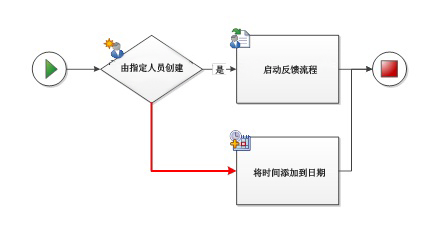
  
    
    
建议操作：
  
    
    
右键单击连接器，分配"是"或"否"标签。
  
    
    

## 条件形状必须至少有一个标有"是"或"否"的传出连接

消息：
  
    
    
条件形状必须至少有一个标有"是"或"否"的传出连接。
  
    
    
 示例：
  
    
    

  
    
    
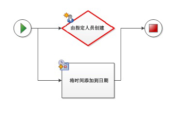
  
    
    
建议操作：
  
    
    
确保条件形状至少有一个附加到其他工作流形状的传出连接器。
  
    
    

## 此连接器不是 SharePoint 工作流连接器

消息：
  
    
    
此连接器不是 SharePoint 工作流连接器。确保通过连接器工具或自动连接使用正确的连接器。
  
    
    
 示例：
  
    
    

  
    
    
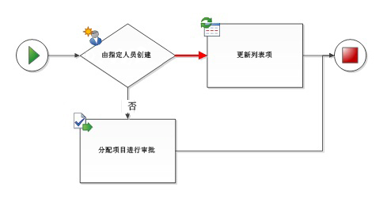
  
    
    
建议操作：
  
    
    
由于其他图的连接器不一定设计为与 SharePoint 工作流一起使用，因此避免对其进行重用。删除所选连接器，并使用连接器工具或自动连接将其替换为新连接器。
  
    
    

## 此连接器必须连接到两个工作流形状

消息：
  
    
    
必须将接器连接到两个工作流形状。
  
    
    
 示例：
  
    
    

  
    
    
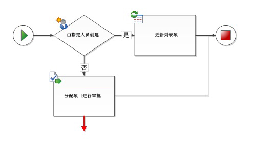
  
    
    
建议操作：
  
    
    
删除闭端连接器，或将它们连接至第二个形状。
  
    
    

## 此图表只能有一个工作流和一个开始形状

消息：
  
    
    
图必须只有一个工作流和一个开始形状。
  
    
    
 示例：
  
    
    

  
    
    
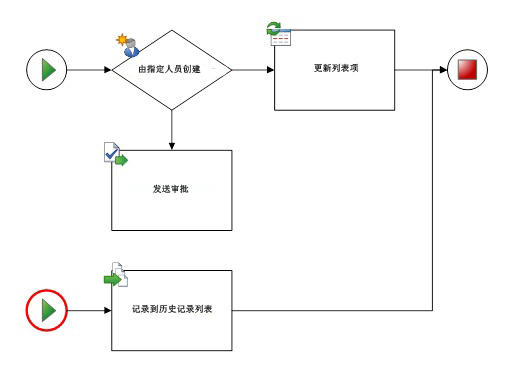
  
    
    
建议操作：
  
    
    
所有的路径必须来自同一"开始"形状。删除额外的"开始"形状，排列连接器，以便路径从同一个地方开始。
  
    
    

## 此形状不是 SharePoint 工作流形状。工作流中只能连接 SharePoint 工作流形状

消息：
  
    
    
该形状不是 SharePoint 工作流形状。工作流中只能连接 SharePoint 工作流形状。
  
    
    
 示例：
  
    
    

  
    
    
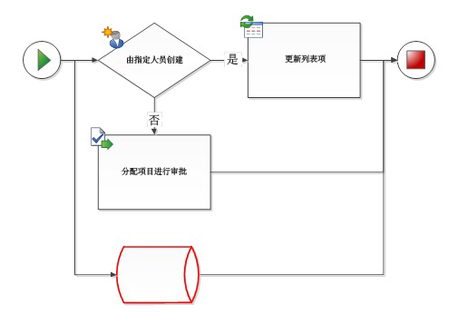
  
    
    
建议操作：
  
    
    
只有来自 SharePoint 工作流模具的工作流形状才可在 Microsoft SharePoint 工作流模板中使用。无法识别其他流程图形状，它们会阻止工作流导出到 SharePoint Designer 2013。
  
    
    

## 开始形状不能有传入连接

消息：
  
    
    
开始形状不得具备传入连接。
  
    
    
 示例：
  
    
    

  
    
    
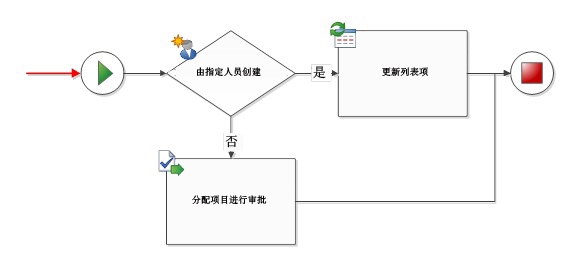
  
    
    
建议操作：
  
    
    
删除"开始"形状的传入连接器。
  
    
    

## 终止形状不能有传出连接

消息：
  
    
    
终止形状不能有传出连接。
  
    
    
 示例：
  
    
    

  
    
    
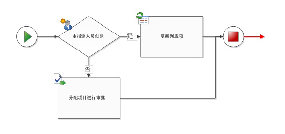
  
    
    
建议操作：
  
    
    
删除"终止"形状中的传出连接器。
  
    
    

## 此工作流必须有一个开始形状

消息：
  
    
    
工作流必须有一个开始形状。
  
    
    
 示例：
  
    
    

  
    
    
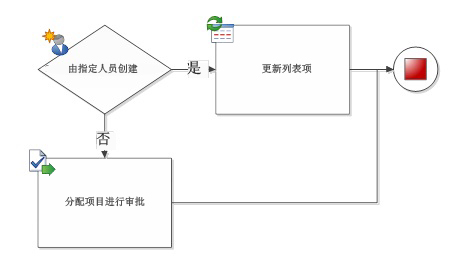
  
    
    
建议操作：
  
    
    
在工作流的开头添加一个"开始"形状，并将其连接到第一个活动。
  
    
    

## 工作流形状未连接到终止形状

消息：
  
    
    
工作流形状未连接到终止形状。
  
    
    
 示例：
  
    
    

  
    
    
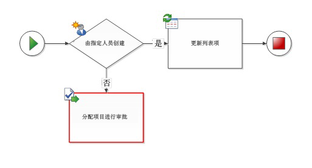
  
    
    
建议操作：
  
    
    
如果此工作流没有"终止"形状，则添加一个终止形状，并将其连接到工作流结尾。如果某工作流形状没有连接到其他工作流形状（请参阅示例），则可以删除它，或者将其连接到其他工作流形状。
  
    
    

## 工作流形状未连接到工作流

消息：
  
    
    
工作流形状未连接到工作流。
  
    
    
 示例：
  
    
    

  
    
    
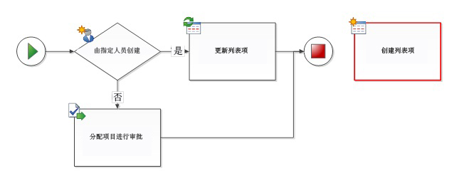
  
    
    
建议操作：
  
    
    
如果工作流形状是必要的，添加连接器以便将工作流形状连接到工作流路径。否则请删除该形状。
  
    
    

## 工作流嵌套层数不能超过最大值 10

消息：
  
    
    
工作流嵌套级别不可超过最大值 10。
  
    
    
建议操作：
  
    
    
Visio Professional 2013 最多可以识别 10 级嵌套工作流活动。重新排列工作流，通过删除活动或将工作流路径分成多个分支来降低复杂性。
  
    
    

## 其他资源

-  [SharePoint 2013 工作流的新增功能](what-s-new-in-workflows-for-sharepoint-2013.md)
    
  
-  [SharePoint 2013 中的工作流入门](get-started-with-workflows-in-sharepoint-2013.md)
    
  
-  [SharePoint Designer 和 Visio 中的工作流开发](workflow-development-in-sharepoint-designer-and-visio.md)
    
  

  
    
    

