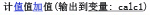
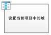
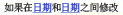

# SharePoint Designer 2013 中的 Visio 形状：快速参考指南（SharePoint 2010 工作流平台）
您可在 Microsoft Visio Professional 2013 中创建工作流，然后将其导出到 Microsoft SharePoint Designer 2013。本指南标识用于创建工作流的 Visio 形状。仅当您要在 SharePoint Designer 2013 中工作但希望继续使用 SharePoint 2010 工作流平台时使用此参考文章。SharePoint 2010 工作流平台的形状自带了三个模具： **操作 - SharePoint 2010 工作流**、 **条件 - SharePoint 2010 工作流**和 **终止符 - SharePoint 2010 工作流**。
## 工作流操作

工作流操作是工作流执行的特定操作。每个工作流必须至少包含一个操作。
  
    
    
此列表中的操作基于其在工作流中的应用领域来分类组织。例如，影响列表项行为的操作归类为"列表操作"，与文档集相关的操作归类为"文档集操作"。操作的类别包括：
  
    
    

-  [核心操作](visio-shapes-in-sharepoint-designer-2013-a-quick-reference-guide-sharepoint-2010.md#section1a) 它们是工作流中最常使用的操作。
    
  
-  [文档集操作](visio-shapes-in-sharepoint-designer-2013-a-quick-reference-guide-sharepoint-2010.md#section1e) 通常情况下，这些操作在与文档库或文档内容类型关联的工作流中使用。
    
  
-  [列表操作](visio-shapes-in-sharepoint-designer-2013-a-quick-reference-guide-sharepoint-2010.md#section1b) 这些操作对列表项执行操作。
    
  
-  [关系操作](visio-shapes-in-sharepoint-designer-2013-a-quick-reference-guide-sharepoint-2010.md#section1d) 此类别中的单个操作可查阅用户的管理器，并将该信息存储在变量中。
    
  
-  [任务操作](visio-shapes-in-sharepoint-designer-2013-a-quick-reference-guide-sharepoint-2010.md#section1c) 这些操作与审批、反馈和表单操作相关联。
    
  

> **重要信息**
> 在将 Visio 中的 SharePoint 工作流导入 SharePoint Designer 后，可插入到该工作流中的多数操作形状都需要其他配置。在 Visio 中，记得使用每个操作形状的注释功能来指定此操作的设置或配置。 
  
    
    

### 核心操作

它们是最常使用的操作，可用于任何类型的工作流或步骤。
  
    
    

****

|**Visio 操作形状**|**SharePoint Designer 中的相应操作**|**操作描述**|
|:-----|:-----|:-----|
||此 Visio 操作与 SharePoint Designer 2013 中的"添加注释"操作相同，显示为：       > **注释**> 将工作流导出到 Visio 后，注释仍可见。           |**添加注释**   使用此操作可在工作流设计器中留下信息性注释以供参考。当有其他用户协同创作工作流时，这非常有用。例如，如果当前工作流中的变量没有用户友好的名称，则可使用此操作添加注释，以指示该变量在工作流中的作用。    |
||此 Visio 操作与 SharePoint Designer 2013 中的"将时间添加到日期"操作相同，显示为：   |**将时间添加到日期**   使用此操作可将以分钟、小时、天、月或年表示的特定时间添加到日期，并将输出值存储为变量。该日期可以是当前日期、特定日期或查找。    |
||此 Visio 操作与 SharePoint Designer 2013 中的"进行计算"操作相同，显示为：   |**进行计算**   使用此操作可执行计算（如对两个值进行加、减、乘或除计算），并将输出值存储在变量中。    |
||此 Visio 操作与 SharePoint Designer 2013 中的"记录到历史记录列表"操作相同，显示为：   |**记录到历史记录列表**   使用此操作可将与工作流有关的消息记录到其历史记录列表中。消息可以是工作流事件的摘要，或与工作流有关的任何重要内容。工作流历史记录列表可能对排查工作流问题很有用。    |
||此 Visio 操作与 SharePoint Designer 2013 中的"过程中暂停"操作相同，显示为：   |**过程中暂停**   使用此操作可将工作流暂停特定时间（单位为天、小时或分钟）。    > **注释**> 延迟时间受计时器作业间隔影响，默认值为五分钟。           |
||此 Visio 操作与 SharePoint Designer 2013 中的"暂停到某个日期"操作相同，显示为：   |**暂停到某个日期**   使用此操作可将工作流暂停到特定日期。可添加当前日期、特定日期或查找。    |
||此 Visio 操作与 SharePoint Designer 2013 中的"设置日期/时间域的时间部分"操作相同，显示为：   |**设置日期/时间域的时间部分**   使用此操作可创建一个时间戳，并将输出值存储在变量中。您可以小时和分钟设置时间，并添加当前日期、特定日期或查找。    |
|| 此 Visio 操作与 SharePoint Designer 2013 中的"设置工作流状态"操作相同，显示为：   创建完状态值后，便无法对其重命名或将其删除。但您无需使用它。    自定义状态仅适用于当前工作流，无法在其他工作流中使用    如果操作用在模拟步骤中，则工作流无法使用在操作中定义的自定义状态值。   |**设置工作流状态**   使用此操作可设置工作流的状态。默认选项是"已取消"、"已批准"和"已拒绝"。    可在操作中的下拉列表中输入新的状态值。输入状态值后，该条目会自动添加到下拉列表中。    如果"设置工作流状态"操作是您在其中还使用了自定义值的工作流中的最后一步，则可在工作流暂停或完成后在列表中的"状态"列中看到您的自定义值。    |
||此 Visio 操作与 SharePoint Designer 2013 中的"设置工作流变量"操作相同，显示为：   |**设置工作流变量**   使用此操作可将工作流变量设置为某个值。如果希望工作流为变量分配数据，请使用此操作。    |
||此 Visio 操作与 SharePoint Designer 2013 中的"停止工作流"操作相同，显示为：   |**停止工作流**   使用此操作可停止工作流的当前实例，并向"工作流历史记录"列表记录一条消息。工作流完成后，在操作中指定的消息会显示在"工作流历史记录"中的"描述"列中。    |
   

### 列表操作

这些操作用在列表项上。
  
    
    

****

|**VISIO 操作形状**|**SHAREPOINT DESIGNER 中的相应操作**|**操作描述**|
|:-----|:-----|:-----|
||此 Visio 操作与 SharePoint Designer 2013 中的"添加列表项权限"操作相同，显示为：       > **注释**> 此操作仅在模拟步骤中可用。           |**添加列表项权限**   此操作可向特定用户授予对某项的特定权限级别。    |
||此 Visio 操作与 SharePoint Designer 2013 中的"签入项目"操作相同，显示为：   |**签入项目**   此操作可签入已签出的项目。    > **注释**> 只能从文档库中签入项目。           |
||此 Visio 操作与 SharePoint Designer 2013 中的"签出项目"操作相同，显示为：   |**签出项目**   使用此操作可签出项目。工作流会在签出文档前，验证该项目是否已签入。    > **注释**> 只能从自己的网站的库中签出项目。           |
||此 Visio 操作与 SharePoint Designer 2013 中的"复制列表项"操作相同，显示为：   |**复制列表项**   使用此操作可将列表项复制到其他列表。如果列表项中存在文档，则工作流还会将该文档复制到目标列表。    > **重要信息**> 源和目标列表中必须至少有一个相似的列。           |
||此 Visio 操作与 SharePoint Designer 2013 中的"创建列表项"操作相同，显示为：   |**创建列表项**   使用此操作可在您指定的列表中创建一个新列表项。您可在新项目中提供字段和值。    每当要用特定的信息创建新项目时，您都可以使用此操作。    > **注释**> 输出变量是在列表中创建的项目的 ID。           |
||此 Visio 操作与 SharePoint Designer 2013 中的"删除项目"操作相同，显示为：   |**删除项目**   使用此操作可删除项目。    |
||此 Visio 操作与 SharePoint Designer 2013 中的"放弃签出项目"操作相同，显示为：   |**放弃签出项目**   如果某项目已签出，您已对其进行更改，并且希望放弃这些更改并将该项目重新签入时，请使用此操作。    |
||此 Visio 操作与 SharePoint Designer 2013 中的"继承列表项父权限"操作相同，显示为：       > **注释**> 此操作仅在模拟步骤中可用。           |**继承列表项权限**   如果您的项目具有唯一权限，则可使用此操作来让该项目从列表继承父权限。    |
||此 Visio 操作与 SharePoint Designer 2013 中的"删除列表项权限"操作相同，显示为：       > **注释**> 此操作仅在模拟步骤中可用。           |**删除列表项权限**   此操作可从特定用户的项目删除权限。    |
||此 Visio 操作与 SharePoint Designer 2013 中的"替换列表项权限"操作相同，显示为：       > **注释**> 此操作仅在模拟步骤中可用。           |**替换列表项权限**   它会将项目的当前权限替换为您的操作中指定的新权限。    |
||此 Visio 操作与 SharePoint Designer 2013 中的"设置内容审批状态"操作相同，显示为：       > **注释**> 必须在列表中启用内容审批才能使用此操作。           
|**设置内容审批状态**   如果在列表中启用了内容审批，则可使用此操作将内容审批状态字段设置为诸如"已批准"、"已拒绝"或"待定"的值。可在操作中键入自定义状态。    > **注释**> "设置内容审批状态"操作适用于工作流正在对其操作的当前项目，因此此操作在网站工作流中不可用。           |
||此 Visio 操作与 SharePoint Designer 2013 中的"设置当前项目中的域"操作相同，显示为：   |**设置当前项目中的域**   使用此操作可将当前项目中的域设置为某个值。    > **注释**> 如果想要暂停工作流，直到它更改了域的值，请改用"等待当前项目中的域更改"操作。           不应在网站工作流中使用"设置当前项目中的域"操作。    |
||此 Visio 操作与 SharePoint Designer 2013 中的"更新列表项"操作相同，显示为：   |**更新列表项**   使用此操作可更新列表项。您可以指定域以及这些域中的新值。    |
||此 Visio 操作与 SharePoint Designer 2013 中的"等待当前项目中的域更改"操作相同，显示为：   |**等待当前项目中的域更改**   此操作可暂停工作流，直到当前项目中的域更改为新值。    > **注释**> 如果希望工作流更改域的值，而不是让工作流等待域更改，请改用"设置当前项目中的域"操作。           |
   

### 任务操作

此类别中的操作属于任务项目。这些操作仅适用于运行 SharePoint Server 2013 的 SharePoint 网站。
  
    
    

****

|**VISIO 操作形状**|**SHAREPOINT DESIGNER 中的相应操作**|**操作描述**|
|:-----|:-----|:-----|
||此 Visio 操作与 SharePoint Designer 2013 中的"将表单分配给组"操作相同，显示为：   |**将表单分配给组**   您可使用此操作创建具有自定义域的自定义任务表单。    可使用此操作来将任务分配给一个或多个参与者或组，提示他们执行其任务。参与者在自定义任务表单的域中提供其响应，并在任务完成后，单击表单上的"完成任务"。    |
||此 Visio 操作与 SharePoint Designer 2013 中的"分配待办事项"操作相同，显示为：   |**分配待办事项**   使用此操作可向每个参与者分配任务，提示他们执行其任务，并任务完成后单击其任务表单上的"完成任务"按钮。    |
||此 Visio 操作与 SharePoint Designer 2013 中的"从用户处收集数据"操作相同，显示为：   |**从用户处收集数据**   使用此操作可向参与者分配任务，提示他们在自定义任务表单中提供所需信息，然后单击任务表单上的"完成任务"按钮。    此操作具有 output 子句 - 意味着工作流会将操作返回的信息存储在相应的变量中。操作中已完成任务项目的列表项 ID 存储在收集变量中。.    |
||此 Visio 操作与 SharePoint Designer 2013 中的"启动审批流程"操作相同，显示为：   |**启动审批流程**   使用此操作可路由待审批的文档。审批者可批准或拒绝文档、重新分配审批任务或请求更改。    可将任务分配给操作中的内部和外部参与者。外部参与者可以是贵组织中并非网站集中的用户的员工，也可以是贵组织外的任何人员。    |
||此 Visio 操作与 SharePoint Designer 2013 中的"启动反馈流程"操作相同，显示为：   |**启动反馈流程**   使用此操作可将反馈的任务项按特定顺序（串行或并行）分配给用户。默认为并行。用户或任务参与者还可将任务重新分配给其他用户。用户完成后，可单击"提交反馈"按钮指示任务完成。    您可将任务分配给操作中的内部和外部参与者。外部参与者可以是贵组织中并非网站集中的用户的员工，也可以是贵组织外的任何人员。    |
||此 Visio 操作与 SharePoint Designer 2013 中的"启动自定义任务流程"操作相同，显示为：   |**启动自定义任务流程**   "启动自定义任务流程"操作是一个审批流程模板，您可在其他审批操作无法满足您的需求时使用它。    |
   

### 关系操作

此类别中的单个操作可查阅用户的管理器，并将该信息存储在变量中。此操作仅适用于运行 SharePoint Server 2013 的 SharePoint 网站。
  
    
    

****

|**VISIO 操作形状**|**SHAREPOINT DESIGNER 中的相应操作**|**操作描述**|
|:-----|:-----|:-----|
||此 Visio 操作与 SharePoint Designer 2013 中的"用户的查阅管理器"操作相同，显示为：   |**用户的查阅管理器**   使用此操作可查阅用户的管理器。输出值稍后会存储在变量中。    > **注释**> 为使此操作正常运行，必须在 SharePoint 中运行 User Profile Service。           |
   

### 文档集操作

一些工作流操作仅在工作流与文档库（如共享文档）或文档内容类型关联时才可用。
  
    
    

****

|**VISIO 操作形状**|**SHAREPOINT DESIGNER 中的相应操作**|**操作描述**|
|:-----|:-----|:-----|
||此 Visio 操作与 SharePoint Designer 2013 中的"启动文档集审批流程"操作相同，显示为：   |**发送文档集的审批请求**   使用此操作可开始文档集的审批流程。    |
||此 Visio 操作与 SharePoint Designer 2013 中的"将文档集发送至存储库"操作相同，显示为：   |**将文档集发送至存储库**   凭借此操作，您可将文档集移动或复制到文档存储库。文档存储库可以是您的 SharePoint 网站中的库，也可以是可根据您定义的规则将记录路由到特定目标的独立网站（如文档中心）。    |
||此 Visio 操作与 SharePoint Designer 2013 中的"将文档库发送至存储库"操作相同，显示为：   |**将文档发送至存储库**   凭借此操作，您可将文档移动或复制到文档存储库。文档存储库可以是您的 SharePoint 网站中的库，也可以是可根据您定义的规则将记录路由到特定目标的独立网站（如文档中心）。    |
||此 Visio 操作与 SharePoint Designer 2013 中的"设置文档集的内容审批状态"操作相同，显示为：   |**设置文档集的内容审批状态**   使用此操作可将文档集的内容审批设置为"已批准"、"已拒绝"或"待定"。    |
   

## 工作流条件

工作流条件是工作流中的分支点。工作流条件可将输入与指定值相比较。如果它们匹配，则工作流会遵从一个分支；否则，它会遵从另一分支。
  
    
    

> **重要信息**
> 将 Visio 中的 SharePoint 工作流导入 SharePoint Designer 后，可在该工作流中插入的多数条件形状都需要其他配置。在 Visio 中，记得使用每个条件形状的注释功能指定条件的决策标准。 
  
    
    

### 一般要求

本节介绍 SharePoint Designer 2013 中适用于列表和可重用列表工作流的条件，而不管与该工作流关联的列表或内容类型为何。
  
    
    

****

|**VISIO 条件形状**|**SHAREPOINT DESIGNER 中的相应条件**|**条件描述**|
|:-----|:-----|:-----|
||此 Visio 条件与 SharePoint Designer 2013 中的"如果任何值等于值"条件相同，显示为：   |**比较数据源**   此条件可比较两个值。您可以指定这两个值是否应相等。    |
||此 Visio 条件与 SharePoint Designer 2013 中的"如果当前项目域等于值"条件相同，显示为：   |**比较文档域**   此条件会根据您指定的值检查域。您可指定这些值是否应相等。    |
||此 Visio 条件与 SharePoint Designer 2013 中的"由特定人员创建"条件相同，显示为：   |**由指定人员创建**   此条件会检查某项目是否由特定用户创建。可将该用户指定为电子邮件地址（如 olivier@contoso.com），也可从 SharePoint、Exchange 或 Active Directory 用户中选择该用户。    > **注释**> 用户名和电子邮件地址是区分大小写的。建议您选择一个用户名或电子邮件地址来帮助确保您使用了正确的大小写。如果键入用户名或电子邮件地址，则必须匹配帐户的大小写。例如，如果用户帐户是 Contoso\\Molly，则是否由 contoso\\molly 创建的计算结果不为 true。           |
||此 Visio 条件与 SharePoint Designer 2013 中的"在特定日期范围内创建"条件相同，显示为：   |**在特定日期范围内创建**   此条件可检查项目是否是在指定的日期之间创建的。可使用当前日期、特定日期或查找。    |
||此 Visio 条件与 SharePoint Designer 2013 中的"由特定人员修改"条件相同，显示为：   |**由特定人员修改**   使用此条件可检查某项目是否由指定用户修改。可将该用户指定为电子邮件地址（如 olivier@contoso.com），也可从 SharePoint、Exchange 或 Active Directory 用户中选择该用户。    > **注释**> 用户名和电子邮件地址是区分大小写的。建议您选择一个用户名或电子邮件地址来帮助确保您使用正确的大小写。如果键入用户名或电子邮件地址，则必须匹配帐户的大小写。例如，如果用户帐户是 Contoso\\Molly，则是否由 contoso\\molly 修改的计算结果不为 true。           |
||此 Visio 条件与 SharePoint Designer 2013 中的"在特定日期范围内修改"条件相同，显示为：   |**在特定日期范围内修改**   此条件可检查某项目是否是在指定的日期之间修改的。您可使用当前日期、特定日期或查找。    |
||此 Visio 条件与 SharePoint Designer 2013 中的"标题域包含关键字"条件相同，显示为：   |**标题域包含关键字**   此条件可检查某项目的"标题"域是否包含特定字词。您可在字符串生成器中指定关键字（该关键字可以是静态值，也可以是动态字符串，或者是两者的组合），或向域或变量插入查询。    > **注释**> 不能在"标题域包含关键字"条件中搜索多个关键字。但可使用诸如**||**（或）或 **&amp;&amp;**（与）的逻辑运算符。           |
   

### 文档集条件

一些工作流条件仅在工作流与文档库（如共享文档）或文档内容类型关联时可用。
  
    
    

|**VISIO 条件形状**|**SHAREPOINT DESIGNER 中的相应条件**|**条件描述**|
|:-----|:-----|:-----|
||此 Visio 条件与 SharePoint Designer 2013 中的"特定的文件大小范围(KB)"条件相同，显示为：   |**文件大小在特定范围内**   此条件可检查文档的文件大小是否介于指定大小 (KB) 之间。此条件不会在计算中包含指定大小。您可以输入数字或使用查找作为条件中的第一个或第二个大小。    |
||此 Visio 条件与 SharePoint Designer 2013 中的"文件类型为特定类型"条件相同，显示为：   |**文件属特定类型**   此条件可检查当前项目的文件类型是否为指定类型（如 docx）。可以输入字符串形式的文件类型或使用查找。    |
   

### 列表条件

  
    
    

****

|**VISIO 条件形状**|**SHAREPOINT DESIGNER 中的相应条件**|**条件描述**|
|:-----|:-----|:-----|
||此 Visio 条件与 SharePoint Designer 2013 中的"检查列表项权限级别"条件相同，显示为：   |**检查确切的用户权限**   此条件可检查指定用户是否具有所需的最低权限级别。    |
||此 Visio 条件与 SharePoint Designer 2013 中的"检查列表项权限"条件相同，显示为：   |**检查用户权限**   此条件可检查指定用户是否具有所需的最低权限。    |
   

## 工作流终止符

在 Visio 中，每个工作流必须以开始终止符 (
  
    
    

  
    
    
) 开始，以停止终止符 (
  
    
    

  
    
    
) 结束。在给定工作流中只能使用每种类型的终止符中的一个。在 Visio 中创建 SharePoint 工作流时需要终止符，这样工作流才能通过验证和进行导出。工作流终止符不用在 SharePoint Designer 中。
  
    
    

## 其他资源

-  [SharePoint 2013 工作流的新增功能](what-s-new-in-workflows-for-sharepoint-2013.md)
    
  
-  [SharePoint 2013 中的工作流入门](get-started-with-workflows-in-sharepoint-2013.md)
    
  
-  [SharePoint Designer 和 Visio 中的工作流开发](workflow-development-in-sharepoint-designer-and-visio.md)
    
  

  
    
    
